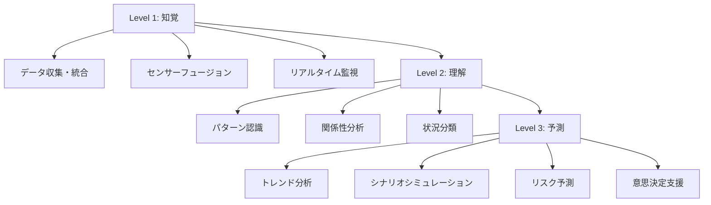
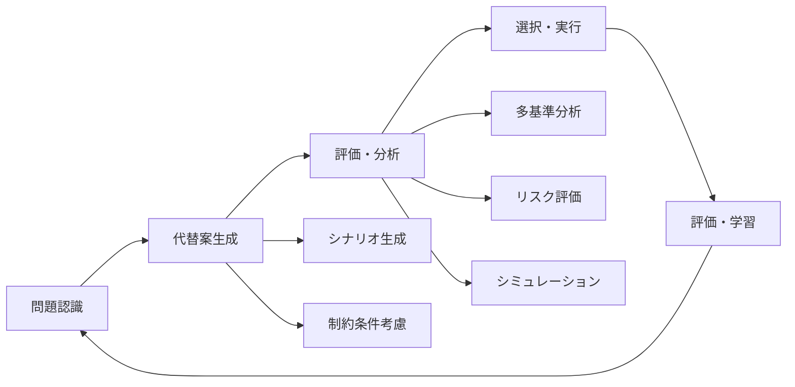
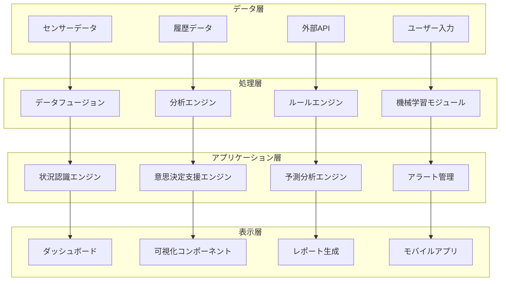
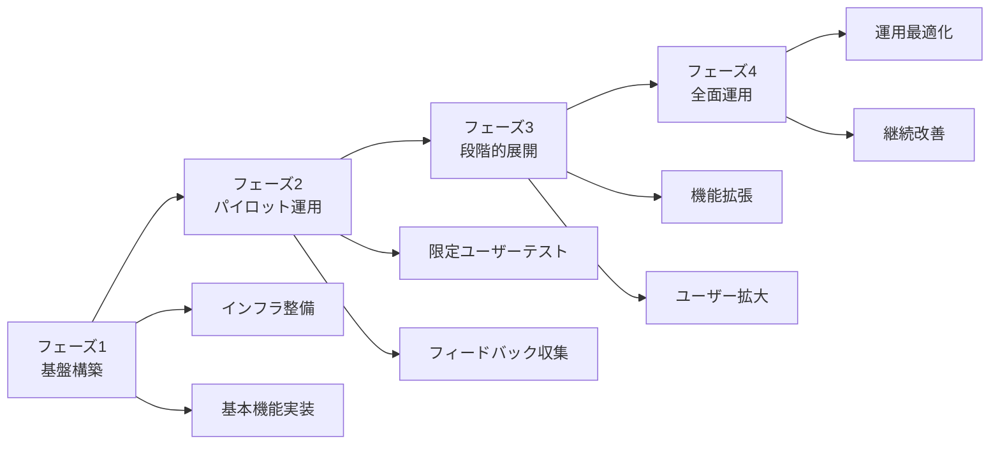

# 状況認識・意思決定支援ソフトウェア

!!! info "このセクションについて"
    このセクションでは、状況認識（Situational Awareness）と意思決定（Decision Making）を支援する様々なソフトウェアアプリケーションやシステムについて解説します。実際に利用できるツールから企業向けシステムまで、幅広いソフトウェアソリューションを分野別に紹介します。

## ソフトウェアの重要性

現代の複雑な環境において、状況認識と意思決定は人間の認知能力だけでは限界があります。適切なソフトウェアツールの活用により、これらの能力を大幅に強化し、より効果的で正確な判断を支援することができます。

### 状況認識支援ソフトウェアの役割

状況認識支援ソフトウェアは、Endsleyの3レベルモデルに対応した機能を提供します：



### 意思決定支援ソフトウェアの役割

意思決定支援システム（DSS: Decision Support System）は、構造化された意思決定プロセスを通じて最適な選択を支援します：



## システム統合アーキテクチャ

### 統合プラットフォーム設計



## 分野別ソフトウェア分類

### 状況認識支援システム

<div class="grid cards" markdown>

- ### [航空関連](./aviation-sa-software)
    ---
    **飛行安全と効率性を支援**
    - フライトレーダー・追跡システム
    - 航空管制支援ツール
    - 気象情報システム
    - フライトシミュレーター

- ### [船舶関連](./maritime-sa-software)
    ---
    **海上航行の安全と効率化**
    - 船舶追跡システム（AIS）
    - 電子海図（ECDIS）
    - 気象・海象情報
    - 港湾管理システム

- ### [気象関連](./weather-software)
    ---
    **気象予測と災害対策**
    - 天気予報アプリケーション
    - 災害警報システム
    - 農業・エネルギー向け気象データ
    - レーダー・衛星画像解析

- ### [医療関連](./medical-sa-software)
    ---
    **医療現場の状況認識**
    - 患者監視システム
    - 電子カルテ・HIS
    - 医療機器統合プラットフォーム
    - 遠隔医療システム

- ### [緊急対応・危機管理](./emergency-sa-software)
    ---
    **緊急事態対応と危機管理**
    - 災害対策支援システム
    - 緊急通報・指令システム
    - 避難誘導・安否確認
    - 消防・救急システム

- ### [軍事・防衛](./military-sa-software)
    ---
    **国防と安全保障**
    - C4ISRシステム
    - 脅威検知・分析ツール
    - 戦術状況認識
    - サイバーセキュリティ

</div>

### 意思決定支援システム

<div class="grid cards" markdown>

<!-- - ### [航空関連](./aviation-dm-software) -->
- ### 航空関連
    ---
    **運航・管制の意思決定支援**
    - フライト計画最適化
    - 航空管制意思決定支援
    - リスクベース運航管理
    - 緊急時対応システム

<!-- - ### [船舶関連](./maritime-dm-software) -->
- ### 船舶関連
    ---
    **海上運航の意思決定支援**
    - 航路計画・最適化
    - 燃料効率化システム
    - 港湾運営最適化
    - 海上交通管理

<!-- - ### [医療関連](./medical-dm-software) -->
- ### 医療関連
    ---
    **医療意思決定支援**
    - 臨床意思決定支援システム
    - 診断支援AI
    - 治療計画支援
    - 医療資源配分最適化

<!-- - ### [緊急対応・軍事](./emergency-military-dm-software) -->
- ### 緊急対応・軍事
    ---
    **緊急時・軍事意思決定支援**
    - 災害対応計画策定
    - 軍事作戦計画支援
    - 資源配分最適化
    - 戦術意思決定支援

<!-- - ### [産業・ビジネス](./business-dm-software) -->
- ### 産業・ビジネス
    ---
    **ビジネス意思決定支援**
    - ビジネスインテリジェンス
    - 戦略計画支援
    - リスク管理システム
    - サプライチェーン最適化

</div>

## 技術アーキテクチャ分類

### リアルタイム処理システム

| 特徴 | 適用分野 | 主要技術 | TypeScript実装例 |
|------|----------|----------|------------------|
| 低遅延データ処理 | 航空管制、医療監視 | WebSocket、Server-Sent Events | `Observable<Data>` パターン |
| イベント駆動アーキテクチャ | 緊急対応、軍事 | Apache Kafka、RabbitMQ | RxJS `Subject` 活用 |
| ストリーム処理 | 金融取引、IoT | Apache Storm、Flink | `pipe()` による処理チェーン |

### 分析・予測システム

| 特徴 | 適用分野 | 主要技術 | TypeScript実装例 |
|------|----------|----------|------------------|
| 機械学習統合 | 医療診断、気象予測 | TensorFlow.js、Python API | `tf.loadLayersModel()` |
| ビッグデータ解析 | 船舶運航、産業監視 | Hadoop、Spark | 非同期データ処理 |
| 統計分析 | 品質管理、リスク評価 | R、Python、Julia | 統計ライブラリ連携 |

## 実装技術スタック

### フロントエンド技術

??? TypeScript実装例

    ```typescript
    // 状況認識ダッシュボードの基本構成
    interface SituationalAwarenessDashboard {
      // リアルタイムデータストリーム
      dataStream$: Observable<SensorData[]>;
      
      // 状態管理
      state: {
        currentSituation: SituationState;
        alerts: Alert[];
        userPreferences: UserSettings;
        decisionContext: DecisionContext;
      };
      
      // コンポーネント構成
      components: {
        mapVisualization: MapComponent;
        dataCharts: ChartComponent[];
        alertPanel: AlertComponent;
        decisionPanel: DecisionSupportComponent;
        controlPanel: ControlComponent;
      };
      
      // 機能メソッド
      updateSituation(data: SensorData): void;
      triggerAlert(alert: Alert): void;
      supportDecision(context: DecisionContext): DecisionRecommendation;
      executeAction(action: UserAction): void;
    }

    // 意思決定支援インターフェース
    interface DecisionSupportSystem {
      // 意思決定プロセス
      identifyProblem(context: ProblemContext): Problem;
      generateAlternatives(problem: Problem): Alternative[];
      evaluateAlternatives(alternatives: Alternative[]): EvaluationResult[];
      recommendSolution(evaluations: EvaluationResult[]): Recommendation;
      
      // 学習・改善
      collectFeedback(decision: Decision, outcome: Outcome): void;
      updateModel(feedback: Feedback[]): void;
    }
    ```

### API設計パターン

??? TypeScript実装例
    ```typescript
    // 統合API設計
    interface IntegratedSADMAPI {
      // 状況認識エンドポイント
      situationalAwareness: {
        GET: '/api/v1/situation/current';
        GET: '/api/v1/situation/history?from={timestamp}&to={timestamp}';
        POST: '/api/v1/situation/update';
        WebSocket: '/ws/situation-stream';
      };
      
      // 意思決定支援エンドポイント
      decisionSupport: {
        POST: '/api/v1/decisions/analyze';
        GET: '/api/v1/decisions/alternatives/{problemId}';
        POST: '/api/v1/decisions/evaluate';
        GET: '/api/v1/decisions/recommendations/{contextId}';
        POST: '/api/v1/decisions/execute';
      };
      
      // 統合分析エンドポイント
      analytics: {
        GET: '/api/v1/analytics/performance';
        POST: '/api/v1/analytics/simulate';
        GET: '/api/v1/analytics/insights/{domainId}';
      };
    }
    ```

## データモデル標準化

### 共通データ構造

??? TypeScript実装例
    ```typescript
    // 状況認識データモデル
    interface SituationData {
      id: string;
      timestamp: Date;
      domain: 'aviation' | 'maritime' | 'medical' | 'emergency' | 'military';
      source: DataSource;
      coordinates?: GeographicCoordinates;
      metrics: Record<string, number | string | boolean>;
      confidence: number; // 0-1の信頼度
      priority: Priority;
      context: SituationContext;
    }

    // 意思決定データモデル
    interface DecisionData {
      id: string;
      problemId: string;
      timestamp: Date;
      context: DecisionContext;
      alternatives: Alternative[];
      criteria: EvaluationCriteria[];
      recommendation: Recommendation;
      rationale: string;
      confidence: number;
      stakeholders: Stakeholder[];
    }

    // アラート・通知モデル
    interface Alert {
      id: string;
      type: AlertType;
      severity: SeverityLevel;
      message: string;
      source: string;
      timestamp: Date;
      actionRequired: boolean;
      decisionSupport?: DecisionSupport;
      expiresAt?: Date;
      metadata: Record<string, any>;
    }
    ```

## セキュリティ・コンプライアンス

### セキュリティ要件

| レベル | 要件 | 実装方法 | 対象分野 |
|--------|------|----------|----------|
| **最高機密** | 軍事級セキュリティ | エンドツーエンド暗号化、ゼロトラスト | 軍事・防衛 |
| **機密** | 業界標準準拠 | OAuth 2.0、RBAC、監査ログ | 医療・航空 |
| **制限** | 基本セキュリティ | HTTPS、基本認証、アクセス制御 | 一般産業 |

### コンプライアンス対応

??? TypeScript実装例
    ```typescript
    // コンプライアンス管理インターフェース
    interface ComplianceManager {
      // 規制対応
      validateGDPR(dataProcessing: DataProcessing): ComplianceResult;
      ensureHIPAA(medicalData: MedicalData): ComplianceResult;
      checkSOX(financialDecision: FinancialDecision): ComplianceResult;
      
      // 監査機能
      generateAuditTrail(actions: UserAction[]): AuditTrail;
      reportCompliance(period: TimePeriod): ComplianceReport;
      
      // データ保護
      anonymizeData(sensitiveData: SensitiveData): AnonymizedData;
      enforceRetentionPolicy(data: Data[]): void;
    }
    ```

## パフォーマンス最適化

### スケーラビリティ設計

??? TypeScript実装例
    ```typescript
    // 大規模システム対応
    @Injectable()
    export class ScalableDataProcessingService {
      // 分散処理
      async processLargeDataset(dataset: LargeDataset): Promise<ProcessingResult> {
        const chunks = this.partitionData(dataset);
        const results = await Promise.all(
          chunks.map(chunk => this.processChunk(chunk))
        );
        return this.mergeResults(results);
      }
      
      // キャッシュ戦略
      private cache = new Map<string, any>();
      
      async getCachedData(key: string): Promise<any> {
        if (this.cache.has(key)) {
          return this.cache.get(key);
        }
        
        const data = await this.fetchData(key);
        this.cache.set(key, data);
        return data;
      }
      
      // リアルタイム最適化
      optimizeRealTimeProcessing(): Observable<OptimizedData> {
        return this.dataStream$.pipe(
          // バッファリング
          bufferTime(100),
          // 重複除去
          map(data => this.deduplicateData(data)),
          // 優先度順ソート
          map(data => this.prioritizeData(data)),
          // 並列処理
          mergeMap(data => this.processInParallel(data), 4)
        );
      }
    }
    ```

## 導入・運用ガイド

### 段階的導入戦略



### ROI測定指標

| 指標カテゴリ | 測定項目 | 計算方法 | 目標値 |
|-------------|----------|----------|--------|
| **効率性** | 意思決定時間短縮 | (導入前時間 - 導入後時間) / 導入前時間 | 30%以上短縮 |
| **精度** | 判断精度向上 | 正確な判断数 / 総判断数 | 95%以上 |
| **コスト** | 運用コスト削減 | 削減コスト / 投資コスト | 150%以上 |
| **満足度** | ユーザー満足度 | アンケート評価平均 | 4.0/5.0以上 |

## 新技術動向と将来展望

### AI・機械学習統合

??? TypeScript実装例
    ```typescript
    // AIによる自動化支援
    interface AIEnhancedSADM {
      // 自動状況認識
      autoDetectSituation(sensorData: SensorData[]): Promise<SituationAnalysis>;
      
      // 予測分析
      predictFutureState(currentState: State, timeHorizon: number): Promise<Prediction>;
      
      // 最適化支援
      optimizeDecision(context: DecisionContext): Promise<OptimizedSolution>;
      
      // 学習・適応
      learnFromOutcome(decision: Decision, outcome: Outcome): Promise<void>;
    }
    ```

### エマージング技術

=== "量子コンピューティング"
    **複雑な最適化問題の解決**
    - 組み合わせ最適化
    - シミュレーション高速化
    - 暗号化強化

=== "デジタルツイン"
    **仮想環境での検証**
    - リアルタイム同期
    - シナリオシミュレーション
    - 予測保全

=== "6G通信"
    **超高速・低遅延通信**
    - リアルタイムデータ伝送
    - エッジコンピューティング
    - AR/VR統合

## まとめ

状況認識と意思決定支援ソフトウェアは、各分野の特性に応じて多様な形で発展してきました。技術の進歩により、より高度で統合的なソリューションが実現されており、人間の認知能力と判断力を大幅に拡張しています。

### 成功の鍵

1. **統合的アプローチ**: 状況認識と意思決定の連携
2. **分野特化**: 各分野の要件に応じたカスタマイズ
3. **技術革新**: AI・機械学習の効果的活用
4. **ユーザー中心**: 使いやすさと学習コストの配慮
5. **継続改善**: フィードバックに基づく継続的な最適化

各分野の詳細情報については、下記のセクションからご確認ください。技術的な実装方法や具体的な製品情報を通じて、より効果的なシステム構築に役立てていただければ幸いです。

## 関連リンク

- [基本概念：状況認識とは](../basics/what-is-sa)
- [意思決定の理論と実践](../decision-making-guide/)
- [応用分野：各分野での利用](../applications/)
- [AIと将来展望：技術的進化](../ai-and-future/)