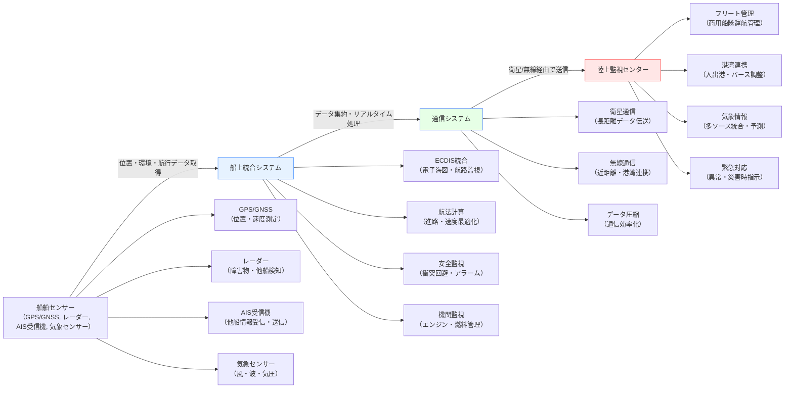

# 船舶関連ソフトウェア

!!! info "このページについて"
    このページでは、海事・船舶分野で使用される状況認識支援ソフトウェアについて詳しく解説します。船舶追跡システム（AIS）から電子海図（ECDIS）、港湾管理システム、気象・海象情報まで、海上航行の安全と効率化を支える様々なソフトウェアソリューションを紹介します。

## 海事ソフトウェアの特徴

海事・船舶分野のソフトウェアは、航空分野とは異なる特殊な環境要件を満たす必要があります。

### 重要な要件

| 要件 | 説明 | 技術的実装 | 具体例・メリット |
|------|------|----------|----------------|
| **長期間運用** | 数週間から数ヶ月の連続航海に対応 | オフライン機能、<br>データ同期、<br>堅牢なアーキテクチャ | 太平洋横断など長距離航行中でも安定動作<br>衛星通信途絶時のローカルデータ処理 |
| **気象・海象対応** | 波浪、強風、<br>低visibility環境での運用 | 防水・耐震設計、<br>輝度調整、<br>タッチレス操作 | 嵐の中でも視認性良好<br>船体動揺時の誤操作防止 |
| **国際規則準拠** | IMO（国際海事機関）、<br>SOLAS条約への対応 | ECDIS標準、<br>AIS標準、<br>GMDSS統合 | 国際航路での法的要件クリア<br>世界各国の港湾入港許可 |
| **低帯域通信** | 衛星通信の制約を考慮した設計 | データ圧縮、<br>差分同期、<br>優先度制御 | 通信コスト削減<br>重要情報の優先送信 |

### システムアーキテクチャ

以下のMermaid図は、船舶関連ソフトウェアにおける主要な情報の流れと各システムの役割を示しています。
各要素の目的と、AIS・ECDIS・気象・港湾管理システム間のデータ連携について説明します。



#### 各システム間のデータ連携・処理の目的
- **AIS**:  
船舶位置・航行情報を他船や陸上へ送信し、航行の安全性を向上。AISデータはECDISやフリート管理システム、港湾管理システムと連携されます。
- **ECDIS**:  
AISや気象データを受け取り、航路上の危険区域や浅瀬を自動監視します。航路逸脱や衝突リスク時にアラームを発報
- **気象データ**:  
船上センサー・外部気象プロバイダから取得し、航路計画・運航判断・港湾入出港調整に反映されます。
- **港湾管理システム**:  
AIS/ECDIS/気象データを統合し、入港・出港のタイミング、バース割当、JIT到着調整を行い、混雑緩和や物流効率化を実現します。

## 船舶追跡・監視システム

### AIS（Automatic Identification System）

AISは船舶の自動識別システムで、海上交通の安全性向上に不可欠です。AISは船舶間および陸上局間で、位置・進路・船舶情報などを自動送信・受信し、衝突回避や運航監視に活用されます。

#### AISメッセージタイプと内容・活用シーン

| メッセージタイプ | 送信間隔 | 主な情報 | 用途 |
|----------------|----------|----------|------|
| **Position Report (1,2,3)** | 2-10秒 | 位置、針路、速度、回頭率 | リアルタイム追跡、<br>衝突回避、<br>港湾接近時の自動通知 |
| **Base Station Report (4)** | 10分 | 基地局位置、時刻同期 | システム基準、<br>港湾監視の基準点 |
| **Static Data (5)** | 6分 | 船名、コールサイン、IMO番号、寸法 | 船舶識別、<br>港湾入出港時の自動登録 |
| **Binary Message (6,8)** | 要求時 | アプリケーション固有データ | 気象情報伝送、<br>危険物情報通知など特殊用途 |
| **SAR Position Report (9)** | 要求時 | 捜索救助航空機位置 | 緊急対応、<br>海難救助時の位置共有 |


??? TypeScript実装例
    この TypeScript 実装では、AISメッセージをデコード・解析し、船舶ごとの位置・針路・速度履歴を管理します。
    Position Reportでリアルタイム追跡や衝突リスク評価、Static Dataで船舶識別や港湾接近時の自動通知・登録処理を行います。
    例えば、港湾エリア接近時に自動で入港予定を港湾システムへ通知し、衝突リスクが高まった場合にECDISやブリッジへ警告アラームを発報します。

    ```typescript
    // AISメッセージのデコード・処理システム
    interface AISMessage {
      messageType: number;
      mmsi: number;
      timestamp: Date;
      repeatIndicator?: number;
    }

    interface PositionReport extends AISMessage {
      messageType: 1 | 2 | 3;
      navigationStatus: NavigationStatus;
      rateOfTurn?: number;
      speedOverGround: number;
      positionAccuracy: boolean;
      longitude: number;
      latitude: number;
      courseOverGround: number;
      trueHeading?: number;
      timeStamp: number;
      specialManoeuvre?: number;
      raim: boolean;
    }

    interface StaticData extends AISMessage {
      messageType: 5;
      aisVersion: number;
      imoNumber: number;
      callSign: string;
      vesselName: string;
      shipType: number;
      dimensions: {
        toBow: number;
        toStern: number;
        toPort: number;
        toStarboard: number;
      };
      typeOfEPFD: number;
      eta: {
        month: number;
        day: number;
        hour: number;
        minute: number;
      };
      maximumStaticDraught: number;
      destination: string;
      dte: boolean;
    }

    enum NavigationStatus {
      UnderWayUsingEngine = 0,
      AtAnchor = 1,
      NotUnderCommand = 2,
      RestrictedManeuverability = 3,
      ConstrainedByDraught = 4,
      Moored = 5,
      Aground = 6,
      EngagedInFishing = 7,
      UnderWaySailing = 8,
      NotDefined = 15
    }

    class AISProcessor {
      private vessels = new Map<number, VesselInfo>();
      private messageHandlers = new Map<number, Function>();
      
      constructor() {
        this.setupMessageHandlers();
      }
      
      private setupMessageHandlers(): void {
        this.messageHandlers.set(1, this.handlePositionReport.bind(this));
        this.messageHandlers.set(2, this.handlePositionReport.bind(this));
        this.messageHandlers.set(3, this.handlePositionReport.bind(this));
        this.messageHandlers.set(5, this.handleStaticData.bind(this));
      }
      
      // AISメッセージの処理
      processMessage(rawMessage: string): void {
        try {
          const decoded = this.decodeAISMessage(rawMessage);
          const handler = this.messageHandlers.get(decoded.messageType);
          
          if (handler) {
            handler(decoded);
          }
          
          this.updateVesselInfo(decoded);
        } catch (error) {
          console.error('AIS message processing error:', error);
        }
      }
      
      private handlePositionReport(message: PositionReport): void {
        const vessel = this.vessels.get(message.mmsi) || this.createNewVessel(message.mmsi);
        
        // 位置履歴の管理
        vessel.positionHistory.push({
          position: { latitude: message.latitude, longitude: message.longitude },
          timestamp: message.timestamp,
          sog: message.speedOverGround,
          cog: message.courseOverGround
        });
        
        // 最新100件のみ保持
        if (vessel.positionHistory.length > 100) {
          vessel.positionHistory.shift();
        }
        
        // 衝突リスクの評価
        this.assessCollisionRisk(vessel);
        
        // 異常行動の検知
        this.detectAbnormalBehavior(vessel, message);
      }
      
      private handleStaticData(message: StaticData): void {
        const vessel = this.vessels.get(message.mmsi) || this.createNewVessel(message.mmsi);
        
        vessel.staticInfo = {
          name: message.vesselName,
          callSign: message.callSign,
          imoNumber: message.imoNumber,
          shipType: message.shipType,
          dimensions: message.dimensions,
          destination: message.destination
        };
        
        this.vessels.set(message.mmsi, vessel);
      }
      
      // 衝突リスクアセスメント
      private assessCollisionRisk(targetVessel: VesselInfo): CollisionRisk[] {
        const risks: CollisionRisk[] = [];
        const currentPosition = targetVessel.positionHistory[targetVessel.positionHistory.length - 1];
        
        for (const [mmsi, vessel] of this.vessels) {
          if (mmsi === targetVessel.mmsi) continue;
          
          const otherPosition = vessel.positionHistory[vessel.positionHistory.length - 1];
          if (!otherPosition) continue;
          
          const cpa = this.calculateCPA(currentPosition, otherPosition);
          const tcpa = this.calculateTCPA(currentPosition, otherPosition);
          
          if (cpa.distance < 2.0 && tcpa > 0 && tcpa < 20) { // 2nm以内、20分以内
            risks.push({
              targetMMSI: mmsi,
              cpaDistance: cpa.distance,
              cpaTime: tcpa,
              riskLevel: this.calculateRiskLevel(cpa.distance, tcpa),
              recommendedAction: this.getRecommendedAction(cpa, tcpa)
            });
          }
        }
        
        return risks;
      }
      
      // CPA（Closest Point of Approach）計算
      private calculateCPA(pos1: PositionHistory, pos2: PositionHistory): CPAResult {
        // 相対位置・速度ベクトルの計算
        const relativePosition = {
          lat: pos2.position.latitude - pos1.position.latitude,
          lng: pos2.position.longitude - pos1.position.longitude
        };
        
        const relativeVelocity = {
          lat: pos2.sog * Math.cos(pos2.cog * Math.PI / 180) - pos1.sog * Math.cos(pos1.cog * Math.PI / 180),
          lng: pos2.sog * Math.sin(pos2.cog * Math.PI / 180) - pos1.sog * Math.sin(pos1.cog * Math.PI / 180)
        };
        
        // CPAまでの時間計算
        const timeToTCPA = -(relativePosition.lat * relativeVelocity.lat + relativePosition.lng * relativeVelocity.lng) /
                          (relativeVelocity.lat * relativeVelocity.lat + relativeVelocity.lng * relativeVelocity.lng);
        
        // CPA距離計算
        const cpaPosition = {
          lat: relativePosition.lat + relativeVelocity.lat * timeToTCPA,
          lng: relativePosition.lng + relativeVelocity.lng * timeToTCPA
        };
        
        const cpaDistance = Math.sqrt(cpaPosition.lat * cpaPosition.lat + cpaPosition.lng * cpaPosition.lng) * 60; // nautical miles
        
        return {
          distance: cpaDistance,
          timeToTCPA: timeToTCPA,
          cpaLatitude: pos1.position.latitude + cpaPosition.lat,
          cpaLongitude: pos1.position.longitude + cpaPosition.lng
        };
      }
      
      // Observable パターンでリアルタイム更新
      getVesselUpdates(): Observable<VesselUpdate> {
        return new Observable(observer => {
          const intervalId = setInterval(() => {
            for (const [mmsi, vessel] of this.vessels) {
              const update: VesselUpdate = {
                mmsi,
                position: vessel.positionHistory[vessel.positionHistory.length - 1],
                collisionRisks: this.assessCollisionRisk(vessel),
                status: vessel.navigationStatus
              };
              observer.next(update);
            }
          }, 1000); // 1秒間隔
          
          return () => clearInterval(intervalId);
        });
      }
    }

    interface VesselInfo {
      mmsi: number;
      positionHistory: PositionHistory[];
      staticInfo?: {
        name: string;
        callSign: string;
        imoNumber: number;
        shipType: number;
        dimensions: any;
        destination: string;
      };
      navigationStatus?: NavigationStatus;
    }

    interface PositionHistory {
      position: { latitude: number; longitude: number };
      timestamp: Date;
      sog: number; // Speed Over Ground
      cog: number; // Course Over Ground
    }

    interface CollisionRisk {
      targetMMSI: number;
      cpaDistance: number;
      cpaTime: number;
      riskLevel: 'LOW' | 'MEDIUM' | 'HIGH' | 'CRITICAL';
      recommendedAction: string;
    }

    interface CPAResult {
      distance: number;
      timeToTCPA: number;
      cpaLatitude: number;
      cpaLongitude: number;
    }

    interface VesselUpdate {
      mmsi: number;
      position: PositionHistory;
      collisionRisks: CollisionRisk[];
      status?: NavigationStatus;
    }
    ```

#### 一般向け船舶追跡サービス

| サービス | 特徴 | API提供 | 主な用途 |
|---------|------|---------|---------|
| **MarineTraffic** | 世界最大の船舶追跡ネットワーク | ○ | 商用・個人利用 |
| **VesselFinder** | 詳細な船舶情報・履歴 | ○ | 海運業界・研究 |
| **FleetMon** | 商用特化・港湾分析 | ○ | 物流・港湾運営 |
| **ShipFinder** | オフライン機能・AR表示 | × | 一般ユーザー |

### 商用船舶管理システム

商用船舶管理システム（フリートマネジメント）は、複数の商船を一元的に管理し、運航計画・ルート最適化・燃料効率向上・予防保全などを実現します。背景には、燃料コストの削減・CO₂排出量低減・運航効率化（スケジュール遵守、遅延回避）・港湾混雑緩和などの経営的課題があります。

気象・航路混雑・港湾状況など多様なデータを統合し、AIによる最適化や異常検知も活用されています。

??? TypeScript実装例
    フリート管理システムの実装例です。燃料効率の最適化や、航路計画の作成、予防保全の管理を行います。
    特に、天候や航路の混雑状況を考慮したルート最適化を実施し、運用コストの削減と安全性の向上を目指しています。

    ```typescript
    // フリート管理システムの実装例
    class FleetManagementSystem {
      private vessels: Map<string, Vessel> = new Map();
      private routes: Map<string, Route> = new Map();
      private alerts: AlertManager;
      
      constructor() {
        this.alerts = new AlertManager();
        this.setupPerformanceMonitoring();
      }
      
      // 燃料効率最適化
      optimizeFuelEfficiency(vesselId: string, route: Route): OptimizationResult {
        const vessel = this.vessels.get(vesselId);
        if (!vessel) throw new Error('Vessel not found');
        
        const weatherData = this.getWeatherForecast(route);
        const currentConditions = this.getCurrentConditions(vessel);
        
        // 速度最適化の計算
        const optimalSpeeds = this.calculateOptimalSpeeds(
          vessel.specifications,
          route,
          weatherData,
          currentConditions
        );
        
        // 燃料消費予測
        const fuelConsumption = this.calculateFuelConsumption(
          vessel.specifications,
          optimalSpeeds,
          weatherData
        );
        
        return {
          recommendedSpeeds: optimalSpeeds,
          estimatedFuelConsumption: fuelConsumption,
          estimatedSavings: currentConditions.currentConsumption - fuelConsumption,
          eta: this.calculateETA(route, optimalSpeeds, weatherData)
        };
      }
      
      // 航路計画システム
      planRoute(
        origin: Port,
        destination: Port,
        departureTime: Date,
        constraints: RouteConstraints
      ): RoutePlan {
        // 複数の候補ルートを生成
        const candidates = this.generateRouteCandidates(origin, destination);
        
        // 各ルートを評価
        const evaluatedRoutes = candidates.map(route => {
          const evaluation = this.evaluateRoute(route, departureTime, constraints);
          return { route, evaluation };
        });
        
        // 最適ルートの選択
        const optimal = evaluatedRoutes.reduce((best, current) => 
          current.evaluation.totalScore > best.evaluation.totalScore ? current : best
        );
        
        return {
          selectedRoute: optimal.route,
          alternatives: evaluatedRoutes.slice(0, 3),
          weatherRisks: this.assessWeatherRisks(optimal.route, departureTime),
          portConstraints: this.checkPortConstraints(destination, optimal.route)
        };
      }
      
      private evaluateRoute(route: Route, departureTime: Date, constraints: RouteConstraints): RouteEvaluation {
        const weatherScore = this.calculateWeatherScore(route, departureTime);
        const fuelScore = this.calculateFuelScore(route);
        const safetyScore = this.calculateSafetyScore(route);
        const timeScore = this.calculateTimeScore(route, constraints.maxTransitTime);
        
        return {
          weatherScore,
          fuelScore,
          safetyScore,
          timeScore,
          totalScore: (weatherScore * 0.3 + fuelScore * 0.3 + safetyScore * 0.3 + timeScore * 0.1)
        };
      }
      
      // 予防保全システム
      predictiveMaintenanceAnalysis(vesselId: string): MaintenanceRecommendation[] {
        const vessel = this.vessels.get(vesselId);
        if (!vessel) return [];
        
        const recommendations: MaintenanceRecommendation[] = [];
        
        // エンジン性能分析
        const engineData = vessel.telemetry.engineData;
        const engineHealth = this.analyzeEngineHealth(engineData);
        
        if (engineHealth.riskLevel > 0.7) {
          recommendations.push({
            component: 'Main Engine',
            priority: 'HIGH',
            suggestedAction: 'Schedule engine inspection',
            estimatedHours: engineHealth.estimatedHoursToFailure,
            costImpact: this.calculateMaintenanceCost('engine', engineHealth.riskLevel)
          });
        }
        
        // 機器別診断
        for (const [component, data] of Object.entries(vessel.telemetry)) {
          const health = this.analyzeComponentHealth(component, data);
          if (health.anomalyDetected) {
            recommendations.push({
              component,
              priority: health.priority,
              suggestedAction: health.recommendation,
              estimatedHours: health.estimatedLife,
              costImpact: health.cost
            });
          }
        }
        
        return recommendations.sort((a, b) => this.priorityWeight(b.priority) - this.priorityWeight(a.priority));
      }
      
      // RxJS を使用したリアルタイムモニタリング
      private setupPerformanceMonitoring(): void {
        // 燃料消費の監視
        this.monitorFuelConsumption().pipe(
          debounceTime(5000),
          distinctUntilChanged(),
          filter(data => data.abnormalConsumption)
        ).subscribe(data => {
          this.alerts.create({
            type: 'FUEL_ANOMALY',
            vesselId: data.vesselId,
            severity: 'MEDIUM',
            message: `Unusual fuel consumption detected: ${data.consumption}L/h`
          });
        });
        
        // 航行警告の監視
        this.monitorNavigationWarnings().pipe(
          throttleTime(1000),
          filter(warning => warning.severity === 'HIGH')
        ).subscribe(warning => {
          this.alerts.create({
            type: 'NAVIGATION_WARNING',
            vesselId: warning.vesselId,
            severity: 'HIGH',
            message: warning.description,
            location: warning.position
          });
        });
      }
      
      private monitorFuelConsumption(): Observable<FuelConsumptionData> {
        return interval(5000).pipe(
          mergeMap(() => {
            const consumptionData: FuelConsumptionData[] = [];
            for (const [id, vessel] of this.vessels) {
              const consumption = this.calculateCurrentConsumption(vessel);
              const expected = this.getExpectedConsumption(vessel);
              
              consumptionData.push({
                vesselId: id,
                consumption,
                expected,
                abnormalConsumption: Math.abs(consumption - expected) > expected * 0.15
              });
            }
            return from(consumptionData);
          })
        );
      }
    }

    interface Vessel {
      id: string;
      name: string;
      specifications: VesselSpecifications;
      currentPosition: Position;
      telemetry: VesselTelemetry;
      maintenanceHistory: MaintenanceRecord[];
    }

    interface VesselSpecifications {
      length: number;
      beam: number;
      draft: number;
      deadweight: number;
      maxSpeed: number;
      fuelCapacity: number;
      enginePower: number;
    }

    interface OptimizationResult {
      recommendedSpeeds: number[];
      estimatedFuelConsumption: number;
      estimatedSavings: number;
      eta: Date;
    }

    interface MaintenanceRecommendation {
      component: string;
      priority: 'LOW' | 'MEDIUM' | 'HIGH' | 'CRITICAL';
      suggestedAction: string;
      estimatedHours: number;
      costImpact: number;
    }

    interface FuelConsumptionData {
      vesselId: string;
      consumption: number;
      expected: number;
      abnormalConsumption: boolean;
    }
    ```

## ECDIS（電子海図表示情報システム）

ECDISは紙海図に代わる電子海図システムで、SOLAS（海上人命安全条約）により国際航海に従事する大型船舶への搭載が義務付けられています（SOLAS第V章規則19）。ECDISは国際規格（IMO/IHO S-52, S-57, S-100等）に準拠し、航路自動監視・アラーム・海図自動更新などの機能を備えています。

### ECDIS機能と技術仕様・運用シナリオ

??? TypeScript実装例
    ECDIS のシステムでは、電子海図データを活用し、船舶の位置情報をリアルタイムで表示します。
    航路の自動監視（航路逸脱時のアラーム）、浅瀬や障害物・進入禁止区域の自動検知、SOLAS要件準拠の安全設定、海図の自動更新などを実現します。
    例：浅瀬や進入禁止区域への接近時には自動アラームを発報。AISや気象データと連携し、最適な航路や緊急回避ルートをECDIS上で提案します。

    ```typescript
    // ECDIS システムの実装例
    interface ElectronicChart {
      id: string;
      name: string;
      scale: number;
      compilationDate: Date;
      editionNumber: number;
      boundingBox: GeographicBounds;
      features: ChartFeature[];
      safetyContours: SafetyContour[];
    }

    interface ChartFeature {
      id: string;
      type: FeatureType;
      geometry: Geometry;
      attributes: Record<string, any>;
      symbolization: Symbolization;
    }

    enum FeatureType {
      COASTLINE = 'coastline',
      DEPTH_AREA = 'depth_area',
      OBSTRUCTION = 'obstruction',
      LIGHT = 'light',
      BUOY = 'buoy',
      TRAFFIC_SEPARATION = 'traffic_separation',
      RESTRICTED_AREA = 'restricted_area',
      ANCHORAGE = 'anchorage'
    }

    interface SafetyContour {
      depth: number;
      geometry: LineString;
      isSelected: boolean;
    }

    class ECDISSystem {
      private charts: Map<string, ElectronicChart> = new Map();
      private displayedCharts: ElectronicChart[] = [];
      private currentPosition: Position;
      private routePlan: RoutePlan;
      private alarms: ECDISAlarm[] = [];
      
      // 海図の自動選択と表示
      autoSelectCharts(position: Position, scale: number): void {
        // 現在位置に適した海図を選択
        const candidateCharts = Array.from(this.charts.values()).filter(chart => 
          this.isPositionInChart(position, chart) && 
          this.isScaleAppropriate(scale, chart.scale)
        );
        
        // 最適な海図を選択（最新版、最大縮尺）
        const selectedCharts = this.selectOptimalCharts(candidateCharts, position, scale);
        
        // 海図の読み込みと表示
        this.displayedCharts = selectedCharts;
        this.renderCharts();
        
        // 海図変更の記録（SOLAS要件）
        this.logChartChange(selectedCharts, position);
      }
      
      // 危険区域の監視
      monitorDangerAreas(): Observable<DangerAlert> {
        return interval(1000).pipe(
          map(() => this.currentPosition),
          distinctUntilChanged((prev, curr) => 
            this.calculateDistance(prev, curr) < 0.001 // 約100m
          ),
          mergeMap(position => this.checkDangerAreas(position)),
          filter(alerts => alerts.length > 0),
          mergeMap(alerts => from(alerts))
        );
      }
      
      private checkDangerAreas(position: Position): DangerAlert[] {
        const alerts: DangerAlert[] = [];
        
        for (const chart of this.displayedCharts) {
          for (const feature of chart.features) {
            // 浅海域のチェック
            if (feature.type === FeatureType.DEPTH_AREA) {
              const depth = feature.attributes.depth as number;
              if (depth < this.getMinSafeDepth() && this.isPositionInFeature(position, feature)) {
                alerts.push({
                  type: 'SHALLOW_WATER',
                  severity: 'HIGH',
                  message: `Entering shallow water: ${depth}m depth`,
                  position,
                  feature
                });
              }
            }
            
            // 障害物のチェック
            if (feature.type === FeatureType.OBSTRUCTION) {
              const distance = this.calculateDistanceToFeature(position, feature);
              if (distance < 0.5) { // 0.5nm以内
                alerts.push({
                  type: 'OBSTRUCTION',
                  severity: 'CRITICAL',
                  message: `Approaching obstruction: ${distance.toFixed(2)}nm`,
                  position,
                  feature
                });
              }
            }
            
            // 制限区域のチェック
            if (feature.type === FeatureType.RESTRICTED_AREA) {
              if (this.isPositionInFeature(position, feature)) {
                alerts.push({
                  type: 'RESTRICTED_AREA',
                  severity: 'MEDIUM',
                  message: `Entering restricted area: ${feature.attributes.name}`,
                  position,
                  feature
                });
              }
            }
          }
        }
        
        return alerts;
      }
      
      // 航路計画の安全性チェック
      validateRoutePlan(route: RoutePlan): RouteValidationResult {
        const violations: RouteViolation[] = [];
        const warnings: RouteWarning[] = [];
        
        // 各レグの安全性チェック
        for (let i = 0; i < route.waypoints.length - 1; i++) {
          const start = route.waypoints[i];
          const end = route.waypoints[i + 1];
          const leg = this.createRouteLeg(start, end);
          
          // 海図カバレッジのチェック
          if (!this.isRouteFullyCovered(leg)) {
            warnings.push({
              type: 'CHART_COVERAGE',
              message: 'Route partially outside chart coverage',
              legIndex: i
            });
          }
          
          // 浅海域の確認
          const shallowAreas = this.getShallowAreasOnRoute(leg);
          if (shallowAreas.length > 0) {
            violations.push({
              type: 'SHALLOW_WATER',
              message: `Route crosses shallow areas (min depth: ${Math.min(...shallowAreas.map(a => a.depth))}m)`,
              legIndex: i,
              severity: 'HIGH'
            });
          }
          
          // 制限区域の確認
          const restrictedAreas = this.getRestrictedAreasOnRoute(leg);
          if (restrictedAreas.length > 0) {
            violations.push({
              type: 'RESTRICTED_AREA',
              message: `Route crosses restricted areas`,
              legIndex: i,
              severity: 'MEDIUM'
            });
          }
        }
        
        return {
          isValid: violations.length === 0,
          violations,
          warnings,
          recommendations: this.generateRouteRecommendations(violations, warnings)
        };
      }
      
      // ECDIS設定管理
      configureDisplay(settings: ECDISDisplaySettings): void {
        // 安全設定（SOLAS A.232(82)要件準拠）
        this.setSafetyDepth(settings.safetyDepth);
        this.setSafetyContour(settings.safetyContour);
        this.setDeepContour(settings.deepContour);
        
        // 表示設定
        this.setDisplayMode(settings.displayMode);
        this.setColourScheme(settings.colourScheme);
        this.setSymbolSet(settings.symbolSet);
        
        // アラーム設定
        this.configureAlarms(settings.alarmSettings);
        
        // 設定変更のログ記録
        this.logSettingsChange(settings);
      }
      
      // 海図更新システム
      updateCharts(): Observable<ChartUpdateStatus> {
        return this.checkForUpdates().pipe(
          mergeMap(updates => {
            if (updates.length === 0) {
              return of({ status: 'UP_TO_DATE', updates: [] });
            }
            
            return this.downloadUpdates(updates).pipe(
              map(progress => ({
                status: 'UPDATING' as const,
                updates,
                progress
              }))
            );
          }),
          catchError(error => {
            return of({
              status: 'ERROR' as const,
              error: error.message,
              updates: []
            });
          })
        );
      }
      
      private downloadUpdates(updates: ChartUpdate[]): Observable<UpdateProgress> {
        return new Observable(observer => {
          let completedCount = 0;
          const totalCount = updates.length;
          
          updates.forEach((update, index) => {
            this.downloadSingleUpdate(update).subscribe({
              next: progress => {
                observer.next({
                  overall: (completedCount + progress.percentage / 100) / totalCount,
                  current: progress,
                  updateIndex: index
                });
              },
              complete: () => {
                completedCount++;
                if (completedCount === totalCount) {
                  observer.complete();
                }
              },
              error: error => observer.error(error)
            });
          });
        });
      }
    }

    interface Position {
      latitude: number;
      longitude: number;
    }

    interface GeographicBounds {
      north: number;
      south: number;
      east: number;
      west: number;
    }

    interface DangerAlert {
      type: 'SHALLOW_WATER' | 'OBSTRUCTION' | 'RESTRICTED_AREA';
      severity: 'LOW' | 'MEDIUM' | 'HIGH' | 'CRITICAL';
      message: string;
      position: Position;
      feature: ChartFeature;
    }

    interface RouteValidationResult {
      isValid: boolean;
      violations: RouteViolation[];
      warnings: RouteWarning[];
      recommendations: string[];
    }

    interface RouteViolation {
      type: string;
      message: string;
      legIndex: number;
      severity: 'LOW' | 'MEDIUM' | 'HIGH' | 'CRITICAL';
    }

    interface ECDISDisplaySettings {
      safetyDepth: number;
      safetyContour: number;
      deepContour: number;
      displayMode: 'DAY' | 'DUSK' | 'NIGHT';
      colourScheme: string;
      symbolSet: string;
      alarmSettings: AlarmSettings;
    }

    interface ChartUpdate {
      chartId: string;
      currentEdition: number;
      newEdition: number;
      updateType: 'NEW_EDITION' | 'WEEKLY_UPDATE' | 'NOTICE_TO_MARINERS';
      size: number;
      url: string;
    }

    interface UpdateProgress {
      overall: number;
      current: { percentage: number; chartId: string };
      updateIndex: number;
    }
    ```

## 気象・海象情報システム

### 海洋気象データの統合・リアルタイム予測

??? TypeScript実装例
    気象データの統合処理を行い、複数の気象ソース（衛星、気象庁、外洋ブイ、船上センサー等）から予測情報を取得します。
    ルート最適化時には風速・波高・視程・潮流などを考慮し、安全で効率的な航行を支援します。
    台風接近時や高波・強風などの異常気象をリアルタイムで監視し、アラート発報や港湾入出港計画の変更にも活用されます。

    ```typescript
    // 海洋気象統合システム
    interface MarineWeatherData {
      timestamp: Date;
      position: Position;
      windSpeed: number;        // knots
      windDirection: number;    // degrees
      waveHeight: number;       // meters
      wavePeriod: number;       // seconds
      waveDirection: number;    // degrees
      swellHeight?: number;     // meters
      swellPeriod?: number;     // seconds
      visibility: number;       // nautical miles
      airTemperature: number;   // Celsius
      waterTemperature: number; // Celsius
      barometricPressure: number; // hPa
      currentSpeed?: number;    // knots
      currentDirection?: number; // degrees
    }

    interface WeatherRoute {
      waypoints: Array<{
        position: Position;
        eta: Date;
        weather: MarineWeatherData;
        forecast: MarineWeatherData[];
      }>;
      totalDistance: number;
      estimatedDuration: number;
      weatherRisk: WeatherRiskAssessment;
    }

    class MarineWeatherSystem {
      private weatherProviders: WeatherProvider[] = [];
      private forecastModels: ForecastModel[] = [];
      
      constructor() {
        this.initializeProviders();
        this.setupForecastModels();
      }
      
      // 複数ソースからのデータ統合
      async getIntegratedForecast(
        position: Position,
        timeRange: { start: Date; end: Date }
      ): Promise<MarineWeatherData[]> {
        // 複数のデータソースから予報を取得
        const forecastPromises = this.weatherProviders.map(provider => 
          provider.getForecast(position, timeRange)
        );
        
        const forecasts = await Promise.allSettled(forecastPromises);
        const successfulForecasts = forecasts
          .filter((result): result is PromiseFulfilledResult<MarineWeatherData[]> => 
            result.status === 'fulfilled'
          )
          .map(result => result.value);
        
        // アンサンブル予測
        return this.generateEnsembleForecast(successfulForecasts);
      }
      
      private generateEnsembleForecast(forecasts: MarineWeatherData[][]): MarineWeatherData[] {
        if (forecasts.length === 0) return [];
        
        const timeStamps = this.getCommonTimeStamps(forecasts);
        const ensembleForecast: MarineWeatherData[] = [];
        
        for (const timestamp of timeStamps) {
          const dataPoints = forecasts.map(forecast => 
            forecast.find(point => point.timestamp.getTime() === timestamp.getTime())
          ).filter(point => point !== undefined) as MarineWeatherData[];
          
          if (dataPoints.length > 0) {
            ensembleForecast.push({
              timestamp,
              position: dataPoints[0].position,
              windSpeed: this.calculateWeightedAverage(dataPoints.map(d => d.windSpeed)),
              windDirection: this.calculateCircularAverage(dataPoints.map(d => d.windDirection)),
              waveHeight: this.calculateWeightedAverage(dataPoints.map(d => d.waveHeight)),
              wavePeriod: this.calculateWeightedAverage(dataPoints.map(d => d.wavePeriod)),
              waveDirection: this.calculateCircularAverage(dataPoints.map(d => d.waveDirection)),
              visibility: this.calculateWeightedAverage(dataPoints.map(d => d.visibility)),
              airTemperature: this.calculateWeightedAverage(dataPoints.map(d => d.airTemperature)),
              waterTemperature: this.calculateWeightedAverage(dataPoints.map(d => d.waterTemperature)),
              barometricPressure: this.calculateWeightedAverage(dataPoints.map(d => d.barometricPressure))
            });
          }
        }
        
        return ensembleForecast;
      }
      
      // ウェザールーティング
      async optimizeRoute(
        origin: Position,
        destination: Position,
        departureTime: Date,
        vesselSpecs: VesselSpecifications
      ): Promise<WeatherRoute[]> {
        // 複数の候補ルートを生成
        const candidates = this.generateRouteCandidates(origin, destination);
        
        // 各ルートの気象評価
        const evaluatedRoutes: WeatherRoute[] = [];
        
        for (const route of candidates) {
          const routeWeather = await this.getRouteWeather(route, departureTime);
          const riskAssessment = this.assessRouteRisk(routeWeather, vesselSpecs);
          const optimizedRoute = this.optimizeRouteSpeed(route, routeWeather, vesselSpecs);
          
          evaluatedRoutes.push({
            ...optimizedRoute,
            weatherRisk: riskAssessment
          });
        }
        
        // リスクスコアでソート
        return evaluatedRoutes.sort((a, b) => a.weatherRisk.totalScore - b.weatherRisk.totalScore);
      }
      
      private assessRouteRisk(
        routeWeather: MarineWeatherData[],
        vesselSpecs: VesselSpecifications
      ): WeatherRiskAssessment {
        let windRisk = 0;
        let waveRisk = 0;
        let visibilityRisk = 0;
        let overallRisk = 0;
        
        for (const weather of routeWeather) {
          // 風速リスク
          if (weather.windSpeed > vesselSpecs.maxSafeWindSpeed) {
            windRisk += (weather.windSpeed - vesselSpecs.maxSafeWindSpeed) / vesselSpecs.maxSafeWindSpeed;
          }
          
          // 波高リスク
          if (weather.waveHeight > vesselSpecs.maxSafeWaveHeight) {
            waveRisk += (weather.waveHeight - vesselSpecs.maxSafeWaveHeight) / vesselSpecs.maxSafeWaveHeight;
          }
          
          // 視程リスク
          if (weather.visibility < 2.0) { // 2海里未満
            visibilityRisk += (2.0 - weather.visibility) / 2.0;
          }
        }
        
        overallRisk = (windRisk + waveRisk + visibilityRisk) / routeWeather.length;
        
        return {
          totalScore: overallRisk,
          windRisk: windRisk / routeWeather.length,
          waveRisk: waveRisk / routeWeather.length,
          visibilityRisk: visibilityRisk / routeWeather.length,
          recommendations: this.generateRiskRecommendations(overallRisk, windRisk, waveRisk, visibilityRisk)
        };
      }
      
      // リアルタイム気象監視
      monitorWeatherConditions(): Observable<WeatherAlert> {
        return interval(300000).pipe( // 5分間隔
          mergeMap(() => this.getCurrentWeather()),
          map(weather => this.evaluateWeatherConditions(weather)),
          filter(evaluation => evaluation.alertLevel > 0),
          map(evaluation => this.createWeatherAlert(evaluation))
        );
      }
      
      private evaluateWeatherConditions(weather: MarineWeatherData): WeatherEvaluation {
        let alertLevel = 0;
        const issues: string[] = [];
        
        // 強風チェック
        if (weather.windSpeed > 40) {
          alertLevel = Math.max(alertLevel, 3); // HIGH
          issues.push(`Strong winds: ${weather.windSpeed} knots`);
        } else if (weather.windSpeed > 30) {
          alertLevel = Math.max(alertLevel, 2); // MEDIUM
          issues.push(`Moderate winds: ${weather.windSpeed} knots`);
        }
        
        // 高波チェック
        if (weather.waveHeight > 6) {
          alertLevel = Math.max(alertLevel, 3); // HIGH
          issues.push(`High waves: ${weather.waveHeight}m`);
        } else if (weather.waveHeight > 4) {
          alertLevel = Math.max(alertLevel, 2); // MEDIUM
          issues.push(`Moderate waves: ${weather.waveHeight}m`);
        }
        
        // 視程チェック
        if (weather.visibility < 0.5) {
          alertLevel = Math.max(alertLevel, 3); // HIGH
          issues.push(`Very poor visibility: ${weather.visibility}nm`);
        } else if (weather.visibility < 2) {
          alertLevel = Math.max(alertLevel, 2); // MEDIUM
          issues.push(`Poor visibility: ${weather.visibility}nm`);
        }
        
        return { alertLevel, issues, weather };
      }
    }

    interface WeatherProvider {
      name: string;
      getForecast(position: Position, timeRange: { start: Date; end: Date }): Promise<MarineWeatherData[]>;
      getCurrentWeather(position: Position): Promise<MarineWeatherData>;
    }

    interface ForecastModel {
      name: string;
      resolution: number; // km
      timeStep: number;   // hours
      forecastHours: number;
    }

    interface WeatherRiskAssessment {
      totalScore: number;
      windRisk: number;
      waveRisk: number;
      visibilityRisk: number;
      recommendations: string[];
    }

    interface WeatherAlert {
      type: 'WIND' | 'WAVE' | 'VISIBILITY' | 'STORM';
      severity: 'LOW' | 'MEDIUM' | 'HIGH' | 'CRITICAL';
      message: string;
      position: Position;
      affectedArea: Position[];
      validUntil: Date;
    }

    interface WeatherEvaluation {
      alertLevel: number;
      issues: string[];
      weather: MarineWeatherData;
    }
    ```

## 港湾管理システム

### Port Community System (PCS)

港湾管理システム（PCS）は、船舶の入港・出港計画の調整、バース割当、物流連携、税関手続きなどを一元管理します。Just-In-Time（JIT）到着管理を導入することで、無駄な待機・燃料消費を削減し、港湾混雑の緩和・物流の効率化に大きく貢献しています。


??? TypeScript実装例
    Port Community System の実装例では、入出港のスケジューリング、バース管理、物流連携を効率化しています。
    JIT（Just-In-Time）到着管理もサポートし、運行コストの最適化と港湾混雑の軽減を目指しています。
    例：AISや気象データと連携し、港湾の混雑状況をリアルタイムで把握。入港予定船舶に対し速度調整を推奨し、バースの空き状況に応じて最適な到着時刻を自動計算します。これにより港湾の待機時間短縮、物流の効率化、CO₂削減が実現します。

    ```typescript
    // 港湾コミュニティシステムの実装
    interface PortCall {
      id: string;
      vessel: VesselInfo;
      voyageNumber: string;
      eta: Date;
      etd: Date;
      berthRequest: BerthRequest;
      services: PortService[];
      status: PortCallStatus;
      stakeholders: Stakeholder[];
    }

    interface BerthRequest {
      preferredBerth?: string;
      berthType: BerthType;
      arrivalCondition: ArrivalCondition;
      departureCondition: DepartureCondition;
      specialRequirements: string[];
    }

    enum PortCallStatus {
      PLANNED = 'planned',
      CONFIRMED = 'confirmed',
      IN_PROGRESS = 'in_progress',
      COMPLETED = 'completed',
      CANCELLED = 'cancelled'
    }

    enum BerthType {
      CONTAINER = 'container',
      BULK = 'bulk',
      TANKER = 'tanker',
      PASSENGER = 'passenger',
      GENERAL_CARGO = 'general_cargo'
    }

    class PortCommunitySystem {
      private portCalls: Map<string, PortCall> = new Map();
      private berths: Map<string, Berth> = new Map();
      private resources: Map<string, PortResource> = new Map();
      private notifications: NotificationService;
      
      constructor() {
        this.notifications = new NotificationService();
        this.setupAutomatedProcesses();
      }
      
      // 入港計画の最適化
      optimizeBerthAllocation(timeWindow: { start: Date; end: Date }): BerthAllocationPlan {
        const scheduledCalls = Array.from(this.portCalls.values())
          .filter(call => 
            call.eta >= timeWindow.start && 
            call.eta <= timeWindow.end &&
            call.status !== PortCallStatus.CANCELLED
          );
        
        // 制約条件の設定
        const constraints = {
          berthCapacity: this.getBerthCapacities(),
          tideConstraints: this.getTideConstraints(timeWindow),
          pilotAvailability: this.getPilotAvailability(timeWindow),
          tugAvailability: this.getTugAvailability(timeWindow)
        };
        
        // 最適化アルゴリズム実行
        const allocation = this.runAllocationOptimization(scheduledCalls, constraints);
        
        return {
          allocations: allocation,
          efficiency: this.calculateEfficiency(allocation),
          conflicts: this.detectConflicts(allocation),
          recommendations: this.generateRecommendations(allocation)
        };
      }
      
      private runAllocationOptimization(
        calls: PortCall[],
        constraints: AllocationConstraints
      ): BerthAllocation[] {
        const allocations: BerthAllocation[] = [];
        
        // 優先度に基づいてソート（緊急度、船型、到着順）
        const sortedCalls = calls.sort((a, b) => {
          const priorityA = this.calculateCallPriority(a);
          const priorityB = this.calculateCallPriority(b);
          return priorityB - priorityA;
        });
        
        for (const call of sortedCalls) {
          const suitableBerths = this.findSuitableBerths(call, constraints);
          
          if (suitableBerths.length > 0) {
            // 最適なバースを選択
            const optimalBerth = this.selectOptimalBerth(call, suitableBerths, allocations);
            const timeSlot = this.calculateOptimalTimeSlot(call, optimalBerth, allocations);
            
            allocations.push({
              portCallId: call.id,
              berthId: optimalBerth.id,
              scheduledArrival: timeSlot.start,
              scheduledDeparture: timeSlot.end,
              pilotBoarding: this.calculatePilotBoarding(timeSlot.start),
              tugAssistance: this.calculateTugRequirement(call, optimalBerth)
            });
          }
        }
        
        return allocations;
      }
      
      // Just-In-Time Arrival システム
      implementJITArrival(portCallId: string): JITRecommendation {
        const portCall = this.portCalls.get(portCallId);
        if (!portCall) throw new Error('Port call not found');
        
        // 現在の港湾状況を分析
        const currentStatus = this.analyzePortStatus();
        const berthAvailability = this.getBerthAvailability(portCall.berthRequest);
        const serviceReadiness = this.checkServiceReadiness(portCall.services);
        
        // 最適到着時刻を計算
        const optimalArrival = this.calculateOptimalArrival(
          portCall,
          currentStatus,
          berthAvailability,
          serviceReadiness
        );
        
        // 速度調整による燃料節約効果を計算
        const currentETA = portCall.eta;
        const speedAdjustment = this.calculateSpeedAdjustment(currentETA, optimalArrival);
        const fuelSavings = this.calculateFuelSavings(speedAdjustment, portCall.vessel);
        
        return {
          recommendedArrival: optimalArrival,
          speedAdjustment,
          fuelSavings,
          delayReason: this.getDelayReason(currentETA, optimalArrival),
          estimatedWaitingTime: Math.max(0, optimalArrival.getTime() - currentETA.getTime())
        };
      }
      
      // 港湾統計とKPI管理
      generatePortStatistics(period: StatisticsPeriod): PortStatistics {
        const calls = this.getPortCallsInPeriod(period);
        
        const statistics: PortStatistics = {
          period,
          totalCalls: calls.length,
          vesselTypes: this.analyzeVesselTypes(calls),
          berthUtilization: this.calculateBerthUtilization(calls, period),
          averagePortStay: this.calculateAveragePortStay(calls),
          onTimePerformance: this.calculateOnTimePerformance(calls),
          turnaroundTimes: this.calculateTurnaroundTimes(calls),
          waitingTimes: this.calculateWaitingTimes(calls),
          serviceEfficiency: this.calculateServiceEfficiency(calls),
          revenueAnalysis: this.calculateRevenue(calls)
        };
        
        return statistics;
      }
      
      // リアルタイム港湾監視
      monitorPortOperations(): Observable<PortOperationAlert> {
        return merge(
          this.monitorBerthOccupancy(),
          this.monitorServiceDelay(),
          this.monitorWeatherImpact(),
          this.monitorCongestion()
        ).pipe(
          filter(alert => alert.severity !== 'INFO'),
          tap(alert => this.notifications.send(alert))
        );
      }
      
      private monitorCongestion(): Observable<PortOperationAlert> {
        return interval(300000).pipe( // 5分間隔
          map(() => {
            const currentCalls = Array.from(this.portCalls.values())
              .filter(call => call.status === PortCallStatus.IN_PROGRESS);
            
            const congestionLevel = currentCalls.length / this.getTotalBerthCapacity();
            
            if (congestionLevel > 0.9) {
              return {
                type: 'CONGESTION',
                severity: 'HIGH' as const,
                message: `Port congestion at ${(congestionLevel * 100).toFixed(1)}%`,
                affectedBerths: this.getOccupiedBerths().map(b => b.id),
                recommendations: [
                  'Consider delaying non-urgent arrivals',
                  'Expedite cargo operations',
                  'Review berth allocation efficiency'
                ]
              };
            } else if (congestionLevel > 0.8) {
              return {
                type: 'CONGESTION',
                severity: 'MEDIUM' as const,
                message: `Port utilization at ${(congestionLevel * 100).toFixed(1)}%`,
                affectedBerths: [],
                recommendations: ['Monitor upcoming arrivals closely']
              };
            }
            
            return null;
          }),
          filter(alert => alert !== null) as OperatorFunction<any, PortOperationAlert>
        );
      }
      
      // 自動化プロセスの設定
      private setupAutomatedProcesses(): void {
        // 入港24時間前の確認
        interval(3600000).pipe( // 1時間間隔
          mergeMap(() => {
            const upcomingCalls = this.getUpcomingCalls(24);
            return from(upcomingCalls);
          }),
          filter(call => !call.confirmed),
          tap(call => this.sendConfirmationRequest(call))
        ).subscribe();
        
        // ETAの自動更新
        interval(1800000).pipe( // 30分間隔
          mergeMap(() => {
            const activeCalls = this.getActiveCalls();
            return this.updateETAs(activeCalls);
          }),
          tap(updates => this.processETAUpdates(updates))
        ).subscribe();
        
        // サービス完了の自動検知
        this.monitorServiceCompletion().subscribe(completion => {
          this.updateServiceStatus(completion);
          this.checkDepartureReadiness(completion.portCallId);
        });
      }
    }

    interface Berth {
      id: string;
      name: string;
      type: BerthType;
      length: number;
      draft: number;
      capacity: number;
      facilities: string[];
      currentOccupant?: string;
    }

    interface BerthAllocation {
      portCallId: string;
      berthId: string;
      scheduledArrival: Date;
      scheduledDeparture: Date;
      pilotBoarding: Date;
      tugAssistance: TugRequirement[];
    }

    interface JITRecommendation {
      recommendedArrival: Date;
      speedAdjustment: {
        currentSpeed: number;
        recommendedSpeed: number;
        speedReduction: number;
      };
      fuelSavings: {
        amount: number; // liters
        cost: number;   // currency
      };
      delayReason: string;
      estimatedWaitingTime: number; // milliseconds
    }

    interface PortStatistics {
      period: StatisticsPeriod;
      totalCalls: number;
      vesselTypes: VesselTypeAnalysis;
      berthUtilization: BerthUtilizationData;
      averagePortStay: number; // hours
      onTimePerformance: number; // percentage
      turnaroundTimes: TurnaroundAnalysis;
      waitingTimes: WaitingTimeAnalysis;
      serviceEfficiency: ServiceEfficiencyData;
      revenueAnalysis: RevenueData;
    }

    interface PortOperationAlert {
      type: 'CONGESTION' | 'DELAY' | 'WEATHER' | 'RESOURCE_SHORTAGE';
      severity: 'INFO' | 'LOW' | 'MEDIUM' | 'HIGH' | 'CRITICAL';
      message: string;
      affectedBerths: string[];
      recommendations: string[];
    }
    ```

## 日本の海事システム事例

### 国内主要システム

#### 海上交通センター（MARTIS）

日本の主要港や海上交通集中海域では、MARTIS（Marine Traffic Information System: 海上交通管制システム）が運用されています。MARTISはレーダー・AISによる船舶追跡、交通整理、航行指導、VHF通信による警告発信、気象情報の提供などを統合的に実施し、海上の安全と効率的な交通流を支えています。
東京湾、伊勢湾、来島海峡などの海上交通センターで、衝突リスクの高い状況や異常気象時の警告発報、港湾入出港の安全指導など、実際の運用現場で活用されています。

??? TypeScript実装例
    MARTIS（海上交通管制システム）の役割を解説します。
    船舶の位置情報をレーダーと AIS で追跡し、海上の交通整理と航行指導を行います。
    VHF 通信を通じた警告発信や交通情報の更新も行われています。

    ```typescript
    // 海上交通管制システムのインターフェース
    interface MARTISSystem {
      radarData: RadarTrack[];
      aisData: AISTargetData[];
      communicationLogs: VHFCommunication[];
      weatherData: MarineWeatherData;
      trafficDensity: TrafficDensityMap;
    }

    class MARTISController {
      private surveillanceArea: GeographicArea;
      private controlledVessels: Map<number, ControlledVessel> = new Map();
      
      // 交通整理と航行指導
      manageTrafficFlow(): TrafficManagementPlan {
        const currentTraffic = this.analyzeCurrentTraffic();
        const congestionAreas = this.identifyCongestionAreas(currentTraffic);
        const plan = this.createTrafficPlan(congestionAreas);
        
        return plan;
      }
      
      // 航行警報の発出
      issueNavigationWarning(warning: NavigationWarning): void {
        this.broadcastVHF(warning.message);
        this.updateElectronicSystems(warning);
        this.logWarning(warning);
      }
    }
    ```

#### 主要港湾システム

| 港湾 | システム名 | 主な機能 | 特徴・具体例 |
|------|-----------|----------|-------------|
| **東京港** | TPMS<br>（東京港管理システム） | 入出港管理、<br>バース管理、<br>CIQ支援 | コンテナターミナル自動化<br>AIS・気象データ連携による入港予定調整<br>大型船舶の自動割当 |
| **横浜港** | YIPS<br>（横浜港情報システム） | 港湾物流情報、<br>通関手続き | EDI統合、ペーパーレス<br>船舶入港時の自動通知・物流・税関連携 |
| **神戸港** | KPMS<br>（神戸港管理システム） | 総合港湾管理、<br>物流効率化 | AI活用、IoT統合<br>バース混雑予測、リアルタイム入出港監視 |
| **大阪港** | OPS<br>（大阪港湾システム） | 港湾運営支援、<br>環境監視 | 環境配慮、持続可能性<br>排出ガス監視と港湾運営最適化の連携 |

### 日本発の海事技術

#### 古野電気（Furuno）

??? TypeScript実装例

    ```typescript
    // 統合航行システムの例
    interface FurunoINS {
      radar: RadarSystem;
      gps: GPSSystem;
      ecdis: ECDISSystem;
      ais: AISSystem;
      autopilot: AutopilotSystem;
      integratedBridge: IBSSystem;
    }

    class IntegratedNavigationSystem {
      private systems: FurunoINS;
      
      // 統合ナビゲーション
      calculateOptimalRoute(
        destination: Position,
        constraints: NavigationConstraints
      ): OptimalRoute {
        // 多システム連携による最適航路計算
        const radarData = this.systems.radar.getCurrentData();
        const weatherData = this.getWeatherData();
        const trafficData = this.systems.ais.getTrafficSituation();
        
        return this.routeOptimizer.optimize({
          destination,
          constraints,
          radarData,
          weatherData,
          trafficData
        });
      }
    }
    ```

## セキュリティとサイバー防御

### 海事サイバーセキュリティ

海上交通のデジタル化が進む中、AISスプーフィング・レーダー干渉・通信ジャミング・マルウェア感染などサイバー攻撃のリスクが増大しています。IMOガイドライン（MSC-FAL.1/Circ.3）に基づき、運航技術（OT）システムのネットワーク分離・アクセス制御・異常検知・バックアップ・インシデント対応など、具体的なセキュリティ対策が求められています。

実際のユースケースとしては、AISデータの改ざん検知、ECDISへの不正アクセス監視、港湾PCSシステムの多層防御、船舶と陸上間の暗号化通信、異常時の自動アラート・遠隔遮断などが挙げられます。

??? TypeScript実装例
    海事分野のサイバーセキュリティに関する実装例です。
    AIS スプーフィングやレーダー干渉、通信ジャミングに対応するための異常検知やネットワーク保護の実装が行われています。
    IMO のガイドラインに従ったリスク評価と、運航技術のセキュリティ強化が含まれています。

    ```typescript
    // 海事サイバーセキュリティフレームワーク
    class MaritimeCyberSecurity {
      private securityModules: SecurityModule[] = [];
      private threatMonitor: ThreatMonitor;
      private incidentResponse: IncidentResponse;
      
      // IMO指針MSC-FAL.1/Circ.3に基づくリスクアセスメント
      conductCyberRiskAssessment(): CyberRiskAssessment {
        const assets = this.identifySystemAssets();
        const threats = this.identifyThreats();
        const vulnerabilities = this.assessVulnerabilities();
        
        const riskMatrix = this.calculateRiskMatrix(assets, threats, vulnerabilities);
        
        return {
          riskLevel: this.calculateOverallRisk(riskMatrix),
          criticalAssets: assets.filter(a => a.criticality === 'HIGH'),
          threats: threats.sort((a, b) => b.likelihood - a.likelihood),
          recommendations: this.generateSecurityRecommendations(riskMatrix)
        };
      }
      
      // 運航技術（OT）システムの保護
      protectOTSystems(): void {
        // ネットワーク分離
        this.implementNetworkSegmentation();
        
        // アクセス制御
        this.enforceAccessControl();
        
        // 異常検知
        this.setupAnomalyDetection();
        
        // バックアップ・復旧
        this.ensureBackupRecovery();
      }
      
      private setupAnomalyDetection(): void {
        this.threatMonitor.monitor([
          'GPS_SPOOFING',
          'AIS_MANIPULATION',
          'RADAR_INTERFERENCE',
          'COMMUNICATION_JAMMING',
          'SYSTEM_INTRUSION'
        ]).subscribe(threat => {
          if (threat.severity === 'HIGH') {
            this.incidentResponse.activate(threat);
          }
        });
      }
    }

    interface CyberThreat {
      type: string;
      description: string;
      likelihood: number;
      impact: number;
      affectedSystems: string[];
    }

    interface CyberRiskAssessment {
      riskLevel: 'LOW' | 'MEDIUM' | 'HIGH' | 'CRITICAL';
      criticalAssets: SystemAsset[];
      threats: CyberThreat[];
      recommendations: SecurityRecommendation[];
    }
    ```

## 技術トレンドと将来展望

### 自律運航船（MASS）・デジタルツインの未来像

自律運航船（MASS: Maritime Autonomous Surface Ship）は、AI・IoT・自動制御の発展により、将来の主流技術となりつつあります。AIによる状況認識、経路最適化、危険検知、遠隔監視・制御（レベル2/3）、完全自律運航（レベル4）などがシナリオとして検討されています。

デジタルツイン技術により、物理船舶の状態を仮想空間でリアルタイム再現し、予測保全や運航最適化シミュレーションが可能となります。例えば、センサーからのデータをもとにエンジン故障を事前予測し、最適なメンテナンス時期を提案したり、気象・混雑状況を加味した最適航路を仮想空間で検証して現実運航に反映するなど、今後の発展が期待されます。

??? TypeScript実装例
    自律運航船の制御、デジタルツインによるリアルタイム監視、予測保全のシステム設計について解説しています。
    特に、AI を活用した経路最適化、危険検知、自動運航への対応が含まれています。

    ```typescript
    // 自律運航船制御システム
    interface AutonomousShipSystem {
      perception: PerceptionSystem;
      planning: PathPlanningSystem;
      control: ShipControlSystem;
      communication: RemoteControlSystem;
      safety: SafetyManagementSystem;
    }

    class AutonomousNavigationSystem {
      private autonomyLevel: AutonomyLevel;
      private humanOperator?: RemoteOperator;
      
      // 自律航行判断
      makeNavigationDecision(situation: NavigationSituation): NavigationAction {
        // 状況認識
        const perceivedSituation = this.perception.analyzeSituation(situation);
        
        // リスク評価
        const riskAssessment = this.assessRisks(perceivedSituation);
        
        // 行動計画
        const actionPlan = this.planning.generatePlan(perceivedSituation, riskAssessment);
        
        // 人間オペレーターの承認が必要な場合
        if (this.requiresHumanApproval(riskAssessment)) {
          return this.requestHumanDecision(actionPlan);
        }
        
        return actionPlan.primaryAction;
      }
      
      // リモート監視・制御
      enableRemoteControl(operator: RemoteOperator): void {
        this.humanOperator = operator;
        
        // リアルタイム状況共有
        this.shareRealtimeSituation().subscribe(situation => {
          operator.updateSituation(situation);
        });
        
        // 緊急時制御権移譲
        operator.onEmergencyTakeover().subscribe(() => {
          this.transferControlToHuman();
        });
      }
    }

    enum AutonomyLevel {
      LEVEL_1_ASSISTED = 1,  // 船上有人、部分自動化
      LEVEL_2_REMOTE = 2,    // 船上有人、遠隔制御可能
      LEVEL_3_SUPERVISED = 3, // 船上無人、遠隔監視
      LEVEL_4_AUTONOMOUS = 4  // 船上無人、完全自律
    }
    ```

### デジタルツイン・予測保全


??? TypeScript実装例

    ```typescript
    // 船舶デジタルツインシステム
    class ShipDigitalTwin {
      private physicalShip: PhysicalShipData;
      private virtualModel: ShipModel;
      private sensors: SensorNetwork;
      private analytics: AnalyticsEngine;
      
      // リアルタイム同期
      synchronizeWithPhysicalShip(): void {
        this.sensors.getAllSensorData().pipe(
          debounceTime(1000),
          distinctUntilChanged()
        ).subscribe(sensorData => {
          this.virtualModel.updateState(sensorData);
          this.runPredictiveAnalysis();
        });
      }
      
      // 予測保全分析
      private runPredictiveAnalysis(): void {
        const predictions = this.analytics.predict({
          enginePerformance: this.virtualModel.engine,
          hullCondition: this.virtualModel.hull,
          propellerEfficiency: this.virtualModel.propeller,
          fuelSystem: this.virtualModel.fuelSystem
        });
        
        predictions.forEach(prediction => {
          if (prediction.riskLevel > 0.7) {
            this.schedulePreventiveMaintenance(prediction);
          }
        });
      }
      
      // 性能最適化シミュレーション
      simulateOptimizations(): OptimizationResult[] {
        const scenarios = [
          { name: 'Speed Optimization', type: 'speed_adjustment' },
          { name: 'Route Optimization', type: 'route_change' },
          { name: 'Trim Optimization', type: 'trim_adjustment' },
          { name: 'Engine Settings', type: 'engine_tuning' }
        ];
        
        return scenarios.map(scenario => {
          const simulation = this.runSimulation(scenario);
          return {
            scenario: scenario.name,
            fuelSavings: simulation.fuelSavings,
            timeImpact: simulation.timeImpact,
            emissionReduction: simulation.emissionReduction,
            feasibility: simulation.feasibility
          };
        });
      }
    }
    ```

## まとめ

海事・船舶ソフトウェアは、長期間の信頼性、厳しい環境条件への対応、国際規格への準拠など、独特の要件を満たす必要があります。技術の進歩により、AIや自律化技術の導入が進んでいますが、人間の判断と経験を重視する文化も根強く残っています。

### 開発時の重要ポイント

1. **長期信頼性**: 数ヶ月の連続稼働に耐える堅牢な設計
2. **環境適応**: 海洋環境での過酷な条件への対応
3. **国際標準**: IMO、SOLAS等の国際規格への適合
4. **通信効率**: 限られた帯域での効率的なデータ伝送
5. **セキュリティ**: サイバー攻撃への対策とOT保護

海事分野は伝統的な業界でありながら、デジタルトランスフォーメーションが急速に進行している興味深い分野です。環境配慮、効率化、安全性向上のため、今後も革新的なソフトウェアソリューションの開発が期待されます。

## 関連リンク

- [海事・船舶分野での状況認識](../../applications/maritime-sa)
- [気象関連ソフトウェア](../weather-software)
- [状況認識の測定方法](../../situational-awareness-guide/measuring-sa)
- [AIと将来展望](../../ai-and-future)

## 参考文献

1. IMO. (2021). *Guidelines for Maritime Cyber Risk Management*. International Maritime Organization.
2. IMO. (2020). *Outcome of the regulatory scoping exercise for the use of Maritime Autonomous Surface Ships (MASS)*. International Maritime Organization.
3. IHO. (2019). *S-100 Universal Hydrographic Data Model*. International Hydrographic Organization.
4. 国土交通省海事局. (2021). *自動運航船の実用化に向けたロードマップ*.