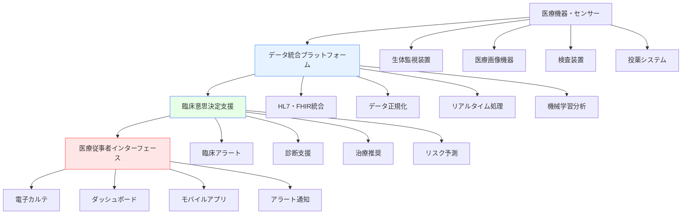

# 医療関連ソフトウェア

!!! info "このページについて"
    このページでは、医療分野で使用される状況認識支援ソフトウェアについて詳しく解説します。患者監視システムから病院情報システム（HIS）、医療画像処理、遠隔医療、緊急医療対応システムまで、医療現場の安全性と効率性を支える様々なソフトウェアソリューションを紹介します。

## 医療ソフトウェアの特徴

医療分野のソフトウェアは、人命に関わる重要性から、他分野とは異なる厳格な要件を満たす必要があります。

### 重要な要件

| 要件 | 説明 | 技術的実装 | 具体例・メリット |
|---|---|---|---|
| 高可用性・信頼性 | 24時間365日の連続稼働、障害時の即座復旧 | 冗長化システム、フェイルオーバー、リアルタイムバックアップ | ICU監視装置の二重化、電子カルテシステムの無停止運用により医療提供継続を保証 |
| リアルタイム処理 | 生体情報の即座な監視・分析・アラート | 低遅延通信、ストリーム処理、エッジコンピューティング | 心電図異常の即時検出、手術中のバイタル監視で迅速な対応が可能 |
| データプライバシー | 患者情報の厳格な保護、HIPAA・個人情報保護法準拠 | エンドツーエンド暗号化、アクセス制御、監査ログ | 医療記録の漏洩防止、アクセス権限管理による情報セキュリティ確保 |
| 医療規制準拠 | FDA、PMDA等の医療機器規制、HL7・DICOM標準 | 医療標準プロトコル、品質管理システム、トレーサビリティ | 国際標準準拠により、異なる医療機関・システム間でのデータ連携が円滑 |
| ユーザビリティ | 緊急時でも直感的に操作できるUI/UX | 音声認識、タッチレス操作、コンテキスト適応UI | 手術中の無菌状態でも操作可能、医療従事者の学習コスト削減 |

### システムアーキテクチャ



## 患者監視・生体情報システム

### 集中治療室（ICU）監視システム

ICUにおける患者の生体情報を24時間継続して監視し、異常の早期発見と迅速な対応を支援します。

#### 主要機能と技術仕様

| 機能 | 説明 | 技術仕様 |
|---|---|---|
| マルチパラメータ監視 | 心電図、血圧、酸素飽和度、体温等の同時監視 | 高精度ADC、ノイズフィルタ、1ms以下の時間精度 |
| インテリジェントアラーム | 個別患者に適応した閾値設定、偽陽性の削減 | 機械学習アルゴリズム、パターン認識、履歴分析 |
| トレンド分析 | 長期間のデータから患者状態の変化を予測 | 時系列解析、統計処理、予測モデリング |
| 中央監視 | 複数床の患者を一元管理 | ネットワーク分散処理、冗長化通信 |

??? TypeScript実装例

    ```typescript
    // ICU患者監視システムの実装例
    interface VitalSigns {
      patientId: string;
      timestamp: Date;
      heartRate: number;
      bloodPressure: {
        systolic: number;
        diastolic: number;
      };
      spO2: number; // 酸素飽和度
      temperature: number;
      respiratoryRate: number;
      consciousness: ConsciousnessLevel;
    }

    interface PatientAlert {
      id: string;
      patientId: string;
      alertType: AlertType;
      severity: AlertSeverity;
      message: string;
      timestamp: Date;
      parameters: {
        measured: number;
        threshold: number;
        trend?: string;
      };
      acknowledged: boolean;
      responseActions?: string[];
    }

    enum AlertType {
      BRADYCARDIA = 'bradycardia',
      TACHYCARDIA = 'tachycardia',
      HYPOTENSION = 'hypotension',
      HYPERTENSION = 'hypertension',
      HYPOXEMIA = 'hypoxemia',
      ARRHYTHMIA = 'arrhythmia',
      TEMPERATURE_ABNORMAL = 'temperature_abnormal'
    }

    enum AlertSeverity {
      LOW = 'low',
      MEDIUM = 'medium',
      HIGH = 'high',
      CRITICAL = 'critical'
    }

    class ICUMonitoringSystem {
      private patients: Map<string, PatientMonitor> = new Map();
      private alertManager: AlertManager;
      private trendAnalyzer: TrendAnalyzer;
      private mlEngine: MachineLearningEngine;

      constructor() {
        this.alertManager = new AlertManager();
        this.trendAnalyzer = new TrendAnalyzer();
        this.mlEngine = new MachineLearningEngine();
        this.setupRealtimeMonitoring();
      }

      // リアルタイム監視の設定
      private setupRealtimeMonitoring(): void {
        // 1秒間隔での生体情報取得
        interval(1000).pipe(
          mergeMap(() => this.collectAllVitalSigns()),
          tap(vitalSigns => this.processVitalSigns(vitalSigns)),
          catchError(error => {
            console.error('Vital signs collection error:', error);
            // 重要：監視システムの障害は即座に報告
            this.alertManager.createSystemAlert({
              type: 'SYSTEM_ERROR',
              message: 'Vital signs monitoring interrupted',
              severity: AlertSeverity.CRITICAL
            });
            return of([]);
          })
        ).subscribe();

        // アラート状態の監視
        this.monitorAlerts().subscribe(alert => {
          this.handleAlert(alert);
        });
      }

      // 生体情報の処理と解析
      private processVitalSigns(vitalSigns: VitalSigns): void {
        // 個別患者の監視設定を取得
        const monitor = this.patients.get(vitalSigns.patientId);
        if (!monitor) return;

        // 異常値の検知
        const alerts = this.detectAbnormalVitals(vitalSigns, monitor.thresholds);
        alerts.forEach(alert => this.alertManager.addAlert(alert));

        // トレンド分析
        const trendAnalysis = this.trendAnalyzer.analyze(vitalSigns, monitor.history);
        if (trendAnalysis.hasSignificantChange) {
          this.alertManager.addAlert({
            id: generateUUID(),
            patientId: vitalSigns.patientId,
            alertType: AlertType[trendAnalysis.parameter.toUpperCase() as keyof typeof AlertType],
            severity: trendAnalysis.severity,
            message: `${trendAnalysis.parameter} showing ${trendAnalysis.trend} trend`,
            timestamp: new Date(),
            parameters: trendAnalysis.parameters,
            acknowledged: false,
            responseActions: trendAnalysis.recommendations
          });
        }

        // 機械学習による予測
        const prediction = this.mlEngine.predictDeterioration(vitalSigns, monitor.history);
        if (prediction.riskLevel > 0.7) {
          this.alertManager.addAlert({
            id: generateUUID(),
            patientId: vitalSigns.patientId,
            alertType: 'DETERIORATION_RISK' as any,
            severity: AlertSeverity.HIGH,
            message: `High risk of clinical deterioration detected (${(prediction.riskLevel * 100).toFixed(1)}%)`,
            timestamp: new Date(),
            parameters: {
              measured: prediction.riskLevel,
              threshold: 0.7,
              trend: prediction.trendDirection
            },
            acknowledged: false,
            responseActions: prediction.interventions
          });
        }

        // 履歴の更新
        monitor.addVitalSigns(vitalSigns);
      }

      // 異常値検知アルゴリズム
      private detectAbnormalVitals(vitals: VitalSigns, thresholds: PatientThresholds): PatientAlert[] {
        const alerts: PatientAlert[] = [];

        // 心拍数チェック
        if (vitals.heartRate < thresholds.heartRate.min) {
          alerts.push(this.createAlert(vitals.patientId, AlertType.BRADYCARDIA, 
            `Heart rate: ${vitals.heartRate} bpm (below ${thresholds.heartRate.min})`,
            vitals.heartRate, thresholds.heartRate.min));
        } else if (vitals.heartRate > thresholds.heartRate.max) {
          alerts.push(this.createAlert(vitals.patientId, AlertType.TACHYCARDIA,
            `Heart rate: ${vitals.heartRate} bpm (above ${thresholds.heartRate.max})`,
            vitals.heartRate, thresholds.heartRate.max));
        }

        // 血圧チェック
        if (vitals.bloodPressure.systolic < thresholds.bloodPressure.systolic.min ||
            vitals.bloodPressure.diastolic < thresholds.bloodPressure.diastolic.min) {
          alerts.push(this.createAlert(vitals.patientId, AlertType.HYPOTENSION,
            `Low blood pressure: ${vitals.bloodPressure.systolic}/${vitals.bloodPressure.diastolic} mmHg`,
            vitals.bloodPressure.systolic, thresholds.bloodPressure.systolic.min));
        }

        // 酸素飽和度チェック
        if (vitals.spO2 < thresholds.spO2.min) {
          alerts.push(this.createAlert(vitals.patientId, AlertType.HYPOXEMIA,
            `Low oxygen saturation: ${vitals.spO2}% (below ${thresholds.spO2.min}%)`,
            vitals.spO2, thresholds.spO2.min));
        }

        return alerts;
      }

      // アラート処理
      private handleAlert(alert: PatientAlert): void {
        // アラートの優先度に基づく処理
        switch (alert.severity) {
          case AlertSeverity.CRITICAL:
            this.sendEmergencyNotification(alert);
            this.activateEmergencyProtocol(alert);
            break;
          case AlertSeverity.HIGH:
            this.notifyMedicalStaff(alert);
            this.logHighPriorityAlert(alert);
            break;
          case AlertSeverity.MEDIUM:
            this.addToAttentionList(alert);
            break;
          case AlertSeverity.LOW:
            this.logAlert(alert);
            break;
        }

        // アラートの記録
        this.alertManager.logAlert(alert);
      }

      // リアルタイムダッシュボードの更新
      getRealTimeDashboard(): Observable<ICUDashboard> {
        return combineLatest([
          this.getPatientSummaries(),
          this.getActiveAlerts(),
          this.getSystemStatus()
        ]).pipe(
          map(([patientSummaries, alerts, systemStatus]) => ({
            timestamp: new Date(),
            patientSummaries,
            activeAlerts: alerts,
            systemStatus,
            totalPatients: this.patients.size,
            criticalPatients: patientSummaries.filter(p => p.severity === 'CRITICAL').length,
            staffNotifications: this.getStaffNotifications()
          }))
        );
      }

      // 機械学習による改善
      optimizeThresholds(patientId: string): Promise<OptimizedThresholds> {
        const monitor = this.patients.get(patientId);
        if (!monitor) throw new Error('Patient not found');

        return this.mlEngine.optimizeAlertThresholds(
          monitor.history,
          monitor.thresholds,
          monitor.alertHistory
        );
      }
    }

    interface PatientMonitor {
      patientId: string;
      thresholds: PatientThresholds;
      history: VitalSigns[];
      alertHistory: PatientAlert[];
      addVitalSigns(vitals: VitalSigns): void;
    }

    interface PatientThresholds {
      heartRate: { min: number; max: number };
      bloodPressure: {
        systolic: { min: number; max: number };
        diastolic: { min: number; max: number };
      };
      spO2: { min: number; max: number };
      temperature: { min: number; max: number };
      respiratoryRate: { min: number; max: number };
    }

    interface ICUDashboard {
      timestamp: Date;
      patientSummaries: PatientSummary[];
      activeAlerts: PatientAlert[];
      systemStatus: SystemStatus;
      totalPatients: number;
      criticalPatients: number;
      staffNotifications: StaffNotification[];
    }
    ```

### 手術室監視システム

#### アネシア（麻酔）監視システム


??? TypeScript実装例

    ```typescript
    // 麻酔監視システムの実装例
    interface AnesthesiaData {
      patientId: string;
      timestamp: Date;
      anesthetics: {
        isoflurane?: number; // vol%
        sevoflurane?: number;
        propofol?: number; // mg/kg/h
        remifentanil?: number; // μg/kg/min
      };
      gasMonitoring: {
        etCO2: number; // End-tidal CO2
        fiO2: number; // Fraction of inspired oxygen
        respiratoryRate: number;
        tidalVolume: number;
      };
      hemodynamics: VitalSigns;
      depthOfAnesthesia: {
        bis: number; // Bispectral Index
        entropy?: number;
      };
    }

    class AnesthesiaMonitoringSystem {
      private currentPatient?: string;
      private anesthesiaData: Map<string, AnesthesiaData[]> = new Map();
      private protocolManager: ProtocolManager;

      // 麻酔深度の自動調整提案
      suggestAnesthesiaAdjustment(data: AnesthesiaData): AdjustmentSuggestion | null {
        const bis = data.depthOfAnesthesia.bis;
        const hemodynamics = data.hemodynamics;

        // BIS値による麻酔深度判定
        if (bis < 40) {
          return {
            type: 'REDUCE_ANESTHESIA',
            reason: 'Deep anesthesia detected (BIS < 40)',
            suggestion: 'Consider reducing anesthetic agents',
            urgency: 'MEDIUM',
            parameters: {
              currentBIS: bis,
              targetBIS: '40-60',
              adjustment: 'Reduce by 10-20%'
            }
          };
        } else if (bis > 60) {
          // ただし、血行動態の安定性も考慮
          if (hemodynamics.heartRate > 100 || hemodynamics.bloodPressure.systolic > 140) {
            return {
              type: 'INCREASE_ANESTHESIA',
              reason: 'Light anesthesia with hemodynamic instability',
              suggestion: 'Consider increasing anesthetic depth',
              urgency: 'HIGH',
              parameters: {
                currentBIS: bis,
                targetBIS: '40-60',
                hemodynamics: `HR:${hemodynamics.heartRate}, BP:${hemodynamics.bloodPressure.systolic}/${hemodynamics.bloodPressure.diastolic}`
              }
            };
          }
        }

        return null;
      }

      // 術中覚醒の早期検知
      detectIntraoperativeAwareness(data: AnesthesiaData): AwarenessRisk {
        const bis = data.depthOfAnesthesia.bis;
        const heartRate = data.hemodynamics.heartRate;
        const bloodPressure = data.hemodynamics.bloodPressure.systolic;
        
        // 覚醒リスクの総合評価
        let riskScore = 0;

        // BIS値による評価
        if (bis > 60) riskScore += 3;
        else if (bis > 50) riskScore += 1;

        // 血行動態による評価
        if (heartRate > baseline.heartRate * 1.2) riskScore += 2;
        if (bloodPressure > baseline.systolic * 1.3) riskScore += 2;

        // 麻酔薬濃度による評価
        const totalAnestheticConcentration = this.calculateTotalAnestheticLoad(data.anesthetics);
        if (totalAnestheticConcentration < 0.8) riskScore += 2;

        return {
          riskLevel: this.calculateRiskLevel(riskScore),
          score: riskScore,
          factors: this.identifyRiskFactors(data),
          recommendations: this.generateRecommendations(riskScore, data)
        };
      }
    }

    interface AdjustmentSuggestion {
      type: 'INCREASE_ANESTHESIA' | 'REDUCE_ANESTHESIA' | 'MAINTAIN_CURRENT';
      reason: string;
      suggestion: string;
      urgency: 'LOW' | 'MEDIUM' | 'HIGH' | 'CRITICAL';
      parameters: Record<string, any>;
    }

    interface AwarenessRisk {
      riskLevel: 'LOW' | 'MEDIUM' | 'HIGH' | 'CRITICAL';
      score: number;
      factors: string[];
      recommendations: string[];
    }
    ```

## 医療画像システム

### DICOM画像処理・管理システム

??? TypeScript実装例
    ```typescript
    // DICOM画像管理・処理システム
    interface DICOMStudy {
      studyInstanceUID: string;
      patientID: string;
      patientName: string;
      studyDate: Date;
      studyDescription: string;
      modality: Modality;
      series: DICOMSeries[];
      aiAnalysis?: AIAnalysisResult;
    }

    interface DICOMSeries {
      seriesInstanceUID: string;
      seriesNumber: number;
      seriesDescription: string;
      images: DICOMImage[];
      reconstructions?: ReconstructionData;
    }

    interface DICOMImage {
      sopInstanceUID: string;
      imageNumber: number;
      pixelData: ArrayBuffer;
      metadata: DICOMMetadata;
      annotations?: Annotation[];
    }

    enum Modality {
      CT = 'CT',
      MRI = 'MR',
      XRAY = 'CR',
      ULTRASOUND = 'US',
      MAMMOGRAPHY = 'MG',
      PET = 'PT',
      SPECT = 'NM'
    }

    class DICOMImageSystem {
      private pacs: PACSRepository;
      private aiEngine: MedicalAIEngine;
      private viewer: MedicalImageViewer;
      private reportingSystem: ReportingSystem;

      // AIによる画像解析
      async performAIAnalysis(study: DICOMStudy): Promise<AIAnalysisResult> {
        const analysisResults: AIAnalysisResult = {
          studyInstanceUID: study.studyInstanceUID,
          analysisDate: new Date(),
          findings: [],
          confidence: 0,
          recommendations: []
        };

        switch (study.modality) {
          case Modality.CT:
            analysisResults.findings.push(...await this.analyzeCTScan(study));
            break;
          case Modality.MRI:
            analysisResults.findings.push(...await this.analyzeMRIScan(study));
            break;
          case Modality.XRAY:
            analysisResults.findings.push(...await this.analyzeXRay(study));
            break;
          case Modality.MAMMOGRAPHY:
            analysisResults.findings.push(...await this.analyzeMammography(study));
            break;
        }

        // 総合的な信頼度の計算
        analysisResults.confidence = this.calculateOverallConfidence(analysisResults.findings);

        // 臨床的推奨事項の生成
        analysisResults.recommendations = this.generateClinicalRecommendations(analysisResults.findings);

        return analysisResults;
      }

      // CT画像の解析
      private async analyzeCTScan(study: DICOMStudy): Promise<AIFinding[]> {
        const findings: AIFinding[] = [];

        for (const series of study.series) {
          // 肺結節の検出
          const nodules = await this.aiEngine.detectPulmonaryNodules(series);
          findings.push(...nodules.map(nodule => ({
            type: 'PULMONARY_NODULE',
            location: nodule.location,
            confidence: nodule.confidence,
            measurements: {
              diameter: nodule.diameter,
              volume: nodule.volume,
              hounsfield: nodule.hounsfield
            },
            malignancyRisk: nodule.malignancyProbability,
            description: `${nodule.diameter}mm pulmonary nodule`,
            followUpRecommendation: this.getNodulelFollowUp(nodule)
          })));

          // 脳出血の検出（頭部CT）
          if (series.seriesDescription.includes('BRAIN') || series.seriesDescription.includes('HEAD')) {
            const hemorrhages = await this.aiEngine.detectICH(series);
            findings.push(...hemorrhages.map(hemorrhage => ({
              type: 'INTRACRANIAL_HEMORRHAGE',
              location: hemorrhage.location,
              confidence: hemorrhage.confidence,
              measurements: {
                volume: hemorrhage.volume,
                type: hemorrhage.subtype
              },
              severity: hemorrhage.severity,
              description: `${hemorrhage.subtype} hemorrhage in ${hemorrhage.location}`,
              followUpRecommendation: 'Immediate neurosurgical consultation'
            })));
          }

          // 肺塞栓の検出（造影CT）
          if (series.seriesDescription.includes('PE') || series.seriesDescription.includes('PULMONARY EMBOLISM')) {
            const emboli = await this.aiEngine.detectPulmonaryEmbolism(series);
            findings.push(...emboli.map(embolus => ({
              type: 'PULMONARY_EMBOLISM',
              location: embolus.location,
              confidence: embolus.confidence,
              measurements: {
                clotBurden: embolus.clotBurden,
                artery: embolus.affectedArtery
              },
              severity: embolus.severity,
              description: `Pulmonary embolism in ${embolus.location}`,
              followUpRecommendation: 'Immediate anticoagulation consideration'
            })));
          }
        }

        return findings;
      }

      // 重要所見の自動通知システム
      setupCriticalResultNotification(): void {
        this.aiEngine.onCriticalFinding().subscribe(finding => {
          // 緊急度の評価
          const urgency = this.evaluateUrgency(finding);
          
          if (urgency === 'CRITICAL') {
            // 即座の通知（5分以内）
            this.sendUrgentNotification(finding);
            
            // 自動的に放射線科医にアラート
            this.alertRadiologist(finding);
            
            // 主治医への緊急通知
            this.notifyAttendingPhysician(finding);

            // 緊急プロトコルの起動
            if (finding.type === 'INTRACRANIAL_HEMORRHAGE') {
              this.activateStrokeProtocol(finding);
            } else if (finding.type === 'PULMONARY_EMBOLISM') {
              this.activatePEProtocol(finding);
            }
          }
        });
      }

      // 3D画像再構成
      async generate3DReconstruction(series: DICOMSeries): Promise<ThreeDReconstruction> {
        // ボリュームレンダリング
        const volumeData = await this.processVolumeData(series.images);
        
        // サーフェスレンダリング
        const surfaceModel = await this.generateIsosurface(volumeData);
        
        // VR（バーチャルリアリティ）対応
        const vrCompatibleModel = await this.optimizeForVR(surfaceModel);

        return {
          volumeData,
          surfaceModel,
          vrModel: vrCompatibleModel,
          measurements: await this.generate3DMeasurements(surfaceModel),
          annotations: []
        };
      }

      // マルチモダリティ画像融合
      fuseMultimodalityImages(
        anatomicalSeries: DICOMSeries, // CT/MRI
        functionalSeries: DICOMSeries   // PET/SPECT
      ): Promise<FusedImageSet> {
        return this.aiEngine.performImageFusion({
          anatomical: anatomicalSeries,
          functional: functionalSeries,
          registrationMethod: 'RIGID_BODY',
          fusionMode: 'OVERLAY'
        });
      }
    }

    interface AIFinding {
      type: string;
      location: AnatomicalLocation;
      confidence: number;
      measurements: Record<string, any>;
      severity?: 'LOW' | 'MEDIUM' | 'HIGH' | 'CRITICAL';
      malignancyRisk?: number;
      description: string;
      followUpRecommendation: string;
    }

    interface AIAnalysisResult {
      studyInstanceUID: string;
      analysisDate: Date;
      findings: AIFinding[];
      confidence: number;
      recommendations: string[];
    }

    interface ThreeDReconstruction {
      volumeData: VolumeData;
      surfaceModel: SurfaceModel;
      vrModel: VRModel;
      measurements: ThreeDMeasurement[];
      annotations: Annotation[];
    }
    ```

## 病院情報システム（HIS）

### 電子カルテシステム（EMR/EHR）

??? TypeScript実装例

    ```typescript
    // 電子カルテシステムの実装例
    interface ElectronicHealthRecord {
      patientId: string;
      medicalRecordNumber: string;
      encounters: Encounter[];
      diagnoses: Diagnosis[];
      medications: Medication[];
      allergies: Allergy[];
      vitalSigns: VitalSigns[];
      labResults: LabResult[];
      imaging: ImagingResult[];
      procedures: Procedure[];
      clinicalNotes: ClinicalNote[];
      advanceDirectives?: AdvanceDirective[];
    }

    interface Encounter {
      encounterId: string;
      patientId: string;
      encounterType: EncounterType;
      admissionDate: Date;
      dischargeDate?: Date;
      attendingPhysician: Physician;
      location: Location;
      chiefComplaint: string;
      status: EncounterStatus;
    }

    enum EncounterType {
      INPATIENT = 'inpatient',
      OUTPATIENT = 'outpatient',
      EMERGENCY = 'emergency',
      SURGERY = 'surgery',
      CONSULTATION = 'consultation'
    }

    class ElectronicHealthRecordSystem {
      private ehrRepository: EHRRepository;
      private clinicalDecisionSupport: CDSEngine;
      private interoperabilityEngine: InteroperabilityEngine;
      private auditLogger: AuditLogger;

      constructor() {
        this.ehrRepository = new EHRRepository();
        this.clinicalDecisionSupport = new CDSEngine();
        this.interoperabilityEngine = new InteroperabilityEngine();
        this.auditLogger = new AuditLogger();
        this.setupClinicalDecisionSupport();
      }

      // 臨床意思決定支援システム
      private setupClinicalDecisionSupport(): void {
        // 薬物相互作用の監視
        this.clinicalDecisionSupport.onMedicationOrder().subscribe(order => {
          const patient = this.ehrRepository.getPatient(order.patientId);
          const interactions = this.checkDrugInteractions(order, patient.medications);
          
          if (interactions.severity === 'HIGH' || interactions.severity === 'CRITICAL') {
            this.sendClinicalAlert({
              type: 'DRUG_INTERACTION',
              severity: interactions.severity,
              message: interactions.description,
              patientId: order.patientId,
              physianId: order.prescriberId,
              recommendations: interactions.alternatives
            });
          }
        });

        // アレルギー反応の監視
        this.clinicalDecisionSupport.onMedicationOrder().subscribe(order => {
          const patient = this.ehrRepository.getPatient(order.patientId);
          const allergyCheck = this.checkAllergies(order.medication, patient.allergies);
          
          if (allergyCheck.hasContraindication) {
            this.sendClinicalAlert({
              type: 'ALLERGY_CONTRAINDICATION',
              severity: 'CRITICAL',
              message: `Patient has known allergy to ${allergyCheck.allergen}`,
              patientId: order.patientId,
              physianId: order.prescriberId,
              recommendations: ['Consider alternative medication', 'Verify allergy history']
            });
          }
        });

        // 異常検査値の監視
        this.clinicalDecisionSupport.onLabResult().subscribe(result => {
          const abnormalValues = this.identifyAbnormalValues(result);
          
          abnormalValues.forEach(abnormal => {
            if (abnormal.severity === 'CRITICAL') {
              this.sendClinicalAlert({
                type: 'CRITICAL_LAB_VALUE',
                severity: 'CRITICAL',
                message: `Critical ${abnormal.test}: ${abnormal.value} ${abnormal.unit}`,
                patientId: result.patientId,
                recommendations: abnormal.recommendations
              });
            }
          });
        });
      }

      // 薬物相互作用チェック
      private checkDrugInteractions(newOrder: MedicationOrder, currentMedications: Medication[]): DrugInteractionResult {
        const interactions: DrugInteraction[] = [];
        
        for (const currentMed of currentMedications) {
          if (currentMed.status === 'ACTIVE') {
            const interaction = this.clinicalDecisionSupport.checkInteraction(
              newOrder.medication.code,
              currentMed.code
            );
            
            if (interaction) {
              interactions.push(interaction);
            }
          }
        }

        // 最も重篤な相互作用のレベルを採用
        const severity = this.getHighestSeverity(interactions);
        
        return {
          hasInteractions: interactions.length > 0,
          severity,
          interactions,
          description: this.generateInteractionDescription(interactions),
          alternatives: this.suggestAlternatives(newOrder.medication, interactions)
        };
      }

      // 総合的な患者リスク評価
      assessPatientRisk(patientId: string): Promise<RiskAssessment> {
        return this.ehrRepository.getCompleteRecord(patientId).then(ehr => {
          const riskFactors = [];

          // 年齢リスク
          const age = this.calculateAge(ehr.patient.birthDate);
          if (age > 65) riskFactors.push({ factor: 'ADVANCED_AGE', score: Math.min((age - 65) / 5, 5) });

          // 併存疾患リスク（Charlson Comorbidity Index）
          const charlsonScore = this.calculateCharlsonScore(ehr.diagnoses);
          riskFactors.push({ factor: 'COMORBIDITIES', score: charlsonScore });

          // 薬剤リスク
          const medicationRisk = this.assessMedicationRisk(ehr.medications);
          riskFactors.push({ factor: 'MEDICATIONS', score: medicationRisk.score });

          // 最近の検査値異常
          const recentLabs = this.getRecentLabResults(ehr.labResults, 30); // 30日以内
          const labRisk = this.assessLabRisk(recentLabs);
          riskFactors.push({ factor: 'LABORATORY', score: labRisk.score });

          // 入院歴
          const hospitalizationRisk = this.assessHospitalizationRisk(ehr.encounters);
          riskFactors.push({ factor: 'HOSPITALIZATION_HISTORY', score: hospitalizationRisk });

          const totalScore = riskFactors.reduce((sum, rf) => sum + rf.score, 0);
          
          return {
            patientId,
            assessmentDate: new Date(),
            totalRiskScore: totalScore,
            riskLevel: this.categorizeRiskLevel(totalScore),
            riskFactors,
            recommendations: this.generateRiskRecommendations(riskFactors),
            nextAssessmentDate: this.calculateNextAssessmentDate(totalScore)
          };
        });
      }

      // 医療品質指標の監視
      monitorQualityIndicators(): Observable<QualityMetric> {
        return interval(3600000).pipe( // 1時間間隔
          mergeMap(() => this.calculateQualityMetrics())
        );
      }

      private async calculateQualityMetrics(): Promise<QualityMetric[]> {
        const metrics: QualityMetric[] = [];

        // 30日再入院率
        const readmissionRate = await this.calculate30DayReadmissionRate();
        metrics.push({
          type: 'THIRTY_DAY_READMISSION',
          value: readmissionRate.rate,
          target: 15.0, // 目標値15%未満
          period: { start: readmissionRate.period.start, end: readmissionRate.period.end },
          trend: readmissionRate.trend
        });

        // 院内感染率
        const infectionRate = await this.calculateInfectionRate();
        metrics.push({
          type: 'HEALTHCARE_ASSOCIATED_INFECTION',
          value: infectionRate.rate,
          target: 2.0, // 目標値2%未満
          period: infectionRate.period,
          breakdown: infectionRate.byType
        });

        // 薬剤有害事象
        const adeRate = await this.calculateADERate();
        metrics.push({
          type: 'ADVERSE_DRUG_EVENT',
          value: adeRate.rate,
          target: 5.0, // 目標値5%未満
          period: adeRate.period,
          severity: adeRate.severityDistribution
        });

        return metrics;
      }

      // FHIR準拠データ交換
      exportFHIRResource(patientId: string, resourceType: FHIRResourceType): Promise<FHIRResource> {
        return this.interoperabilityEngine.convertToFHIR(patientId, resourceType);
      }

      importFHIRResource(fhirResource: FHIRResource): Promise<ImportResult> {
        // FHIR形式データを内部形式に変換
        const convertedData = this.interoperabilityEngine.convertFromFHIR(fhirResource);
        
        // データ検証
        const validationResult = this.validateIncomingData(convertedData);
        if (!validationResult.isValid) {
          throw new Error(`Invalid FHIR data: ${validationResult.errors.join(', ')}`);
        }

        // データの統合
        return this.ehrRepository.mergeExternalData(convertedData);
      }
    }

    interface DrugInteractionResult {
      hasInteractions: boolean;
      severity: 'LOW' | 'MEDIUM' | 'HIGH' | 'CRITICAL';
      interactions: DrugInteraction[];
      description: string;
      alternatives: AlternativeMedication[];
    }

    interface RiskAssessment {
      patientId: string;
      assessmentDate: Date;
      totalRiskScore: number;
      riskLevel: 'LOW' | 'MEDIUM' | 'HIGH' | 'CRITICAL';
      riskFactors: RiskFactor[];
      recommendations: string[];
      nextAssessmentDate: Date;
    }

    interface QualityMetric {
      type: string;
      value: number;
      target: number;
      period: { start: Date; end: Date };
      trend?: 'IMPROVING' | 'STABLE' | 'WORSENING';
      breakdown?: Record<string, number>;
      severity?: Record<string, number>;
    }
    ```

## 遠隔医療・在宅医療システム

### テレヘルスプラットフォーム

??? TypeScript実装例

    ```typescript
    // 遠隔医療プラットフォームの実装例
    interface TelehealthSession {
      sessionId: string;
      patientId: string;
      providerId: string;
      sessionType: SessionType;
      scheduledTime: Date;
      actualStartTime?: Date;
      endTime?: Date;
      status: SessionStatus;
      connectionQuality: ConnectionQuality;
      recordedData?: RecordedSessionData;
      clinicalNotes?: string;
      followUpRequired?: boolean;
    }

    enum SessionType {
      CONSULTATION = 'consultation',
      FOLLOW_UP = 'follow_up',
      MEDICATION_REVIEW = 'medication_review',
      THERAPY = 'therapy',
      EMERGENCY = 'emergency',
      MONITORING = 'monitoring'
    }

    enum SessionStatus {
      SCHEDULED = 'scheduled',
      WAITING = 'waiting',
      IN_PROGRESS = 'in_progress',
      COMPLETED = 'completed',
      CANCELLED = 'cancelled',
      NO_SHOW = 'no_show'
    }

    interface RemoteMonitoringDevice {
      deviceId: string;
      patientId: string;
      deviceType: DeviceType;
      lastSync: Date;
      batteryLevel: number;
      connectionStatus: 'CONNECTED' | 'DISCONNECTED' | 'LOW_SIGNAL';
      calibrationDate: Date;
      nextMaintenanceDate: Date;
    }

    enum DeviceType {
      BLOOD_PRESSURE_MONITOR = 'blood_pressure',
      GLUCOSE_METER = 'glucose_meter',
      PULSE_OXIMETER = 'pulse_oximeter',
      WEIGHT_SCALE = 'weight_scale',
      ECG_MONITOR = 'ecg_monitor',
      ACTIVITY_TRACKER = 'activity_tracker',
      MEDICATION_DISPENSER = 'medication_dispenser'
    }

    class TelehealthPlatform {
      private sessionManager: SessionManager;
      private deviceManager: DeviceManager;
      private clinicalAI: ClinicalAIEngine;
      private emergencyProtocol: EmergencyProtocol;

      constructor() {
        this.sessionManager = new SessionManager();
        this.deviceManager = new DeviceManager();
        this.clinicalAI = new ClinicalAIEngine();
        this.emergencyProtocol = new EmergencyProtocol();
        this.setupRemoteMonitoring();
      }

      // リモート監視の設定
      private setupRemoteMonitoring(): void {
        // デバイスデータの自動収集
        this.deviceManager.onDataReceived().subscribe(deviceData => {
          this.processRemoteMonitoringData(deviceData);
        });

        // 緊急事態の自動検知
        this.clinicalAI.onCriticalAlertGenerated().subscribe(alert => {
          this.handleCriticalAlert(alert);
        });

        // 薬剤遵守の監視
        this.monitorMedicationAdherence().subscribe(adherenceData => {
          if (adherenceData.adherenceRate < 0.8) { // 80%未満
            this.scheduleAdherenceCounseling(adherenceData.patientId);
          }
        });
      }

      // リモート監視データの処理
      private processRemoteMonitoringData(deviceData: DeviceData): void {
        // データの妥当性検証
        const validationResult = this.validateDeviceData(deviceData);
        if (!validationResult.isValid) {
          this.logDataError(deviceData, validationResult.errors);
          return;
        }

        // 患者の基準値と比較
        const patientBaseline = this.getPatientBaseline(deviceData.patientId, deviceData.type);
        const analysis = this.analyzeAgainstBaseline(deviceData, patientBaseline);

        // 傾向分析
        const trendAnalysis = this.analyzeTrends(deviceData);

        // 臨床的意思決定支援
        const recommendations = this.clinicalAI.generateRecommendations({
          deviceData,
          baselineComparison: analysis,
          trendAnalysis,
          patientHistory: this.getPatientHistory(deviceData.patientId)
        });

        // 必要に応じてアラート生成
        if (analysis.isSignificantDeviation || trendAnalysis.hasWorseningTrend) {
          this.generateClinicalAlert({
            patientId: deviceData.patientId,
            alertType: 'REMOTE_MONITORING_ALERT',
            severity: this.determineSeverity(analysis, trendAnalysis),
            message: this.generateAlertMessage(deviceData, analysis, trendAnalysis),
            recommendations: recommendations,
            requiresImmediateAction: analysis.isCritical || trendAnalysis.isCritical
          });
        }

        // データストアに保存
        this.storeMonitoringData(deviceData, analysis, trendAnalysis);
      }

      // バーチャル診療の実施
      async conductVirtualConsultation(sessionId: string): Promise<ConsultationResult> {
        const session = await this.sessionManager.getSession(sessionId);
        
        // 患者の事前問診データを取得
        const preVisitData = await this.getPreVisitQuestionnaire(session.patientId);
        
        // リモート監視データの統合
        const recentMonitoringData = await this.getRecentMonitoringData(session.patientId, 7); // 7日間
        
        // AI支援診断の準備
        const aiPreliminaryAssessment = await this.clinicalAI.generatePreliminaryAssessment({
          patient: await this.getPatientRecord(session.patientId),
          preVisitData,
          monitoringData: recentMonitoringData,
          chiefComplaint: preVisitData.chiefComplaint
        });

        // セッション開始
        await this.sessionManager.startSession(sessionId);

        // リアルタイム支援情報を医療従事者に提供
        const supportData: RealTimeSupportData = {
          patientSummary: this.generatePatientSummary(session.patientId),
          aiSuggestions: aiPreliminaryAssessment.suggestions,
          differentialDiagnoses: aiPreliminaryAssessment.differentialDiagnoses,
          recommendedQuestions: aiPreliminaryAssessment.recommendedQuestions,
          riskFactors: aiPreliminaryAssessment.riskFactors
        };

        return {
          sessionId,
          duration: Date.now() - session.actualStartTime!.getTime(),
          clinicalFindings: aiPreliminaryAssessment.findings,
          diagnosis: aiPreliminaryAssessment.workingDiagnosis,
          treatmentPlan: aiPreliminaryAssessment.treatmentPlan,
          followUpRequired: this.assessFollowUpNeed(aiPreliminaryAssessment),
          prescriptions: aiPreliminaryAssessment.prescriptions,
          nextAppointment: this.scheduleNextAppointment(session.patientId, aiPreliminaryAssessment)
        };
      }

      // 在宅モニタリングアラートシステム
      private handleCriticalAlert(alert: CriticalAlert): void {
        switch (alert.severity) {
          case 'CRITICAL':
            // 即座の介入が必要
            this.emergencyProtocol.activate(alert);
            this.notifyEmergencyServices(alert);
            this.alertPrimaryCareProvider(alert);
            break;
          
          case 'HIGH':
            // 24時間以内の評価が必要
            this.schedulePriorityConsultation(alert.patientId);
            this.alertPrimaryCareProvider(alert);
            break;
          
          case 'MEDIUM':
            // 医療従事者による評価が必要
            this.addToProviderReviewQueue(alert);
            break;
          
          case 'LOW':
            // 継続監視
            this.logForTrendAnalysis(alert);
            break;
        }
      }

      // 遠隔リハビリテーション支援
      async supportRemoteRehabilitation(patientId: string): Promise<RehabilitationPlan> {
        const patient = await this.getPatientRecord(patientId);
        const condition = patient.primaryCondition;
        const functionalStatus = await this.assessFunctionalStatus(patientId);

        // 个人化されたリハビリプログラムの生成
        const programs = await this.clinicalAI.generateRehabProgram({
          condition,
          functionalStatus,
          patientPreferences: await this.getPatientPreferences(patientId),
          homeEnvironment: await this.getHomeEnvironmentData(patientId)
        });

        // VR/ARを活用したエクササイズの提案
        const immersiveExercises = await this.generateImmersiveExercises(condition, functionalStatus);

        // 進捗追跡システムの設定
        this.setupProgressTracking(patientId, programs);

        return {
          patientId,
          programs,
          immersiveExercises,
          milestone: this.defineMilestones(condition, functionalStatus),
          trackingMetrics: this.defineTrackingMetrics(programs),
          reviewSchedule: this.createReviewSchedule(condition)
        };
      }

      // 薬剤遵守監視
      private monitorMedicationAdherence(): Observable<MedicationAdherenceData> {
        return interval(86400000).pipe( // 24時間間隔
          mergeMap(() => this.calculateAdherence())
        );
      }

      private async calculateAdherence(): Promise<MedicationAdherenceData[]> {
        const activePatients = await this.getActivePatientsWithMedications();
        const adherenceData: MedicationAdherenceData[] = [];

        for (const patient of activePatients) {
          const expectedDoses = await this.getExpectedDoses(patient.id, 30); // 30日間
          const actualDoses = await this.getRecordedDoses(patient.id, 30);
          
          const adherenceRate = actualDoses.length / expectedDoses.length;
          const missedDoses = expectedDoses.filter(expected => 
            !actualDoses.some(actual => 
              this.isWithinTimeWindow(actual.timestamp, expected.timestamp, 3600000) // 1時間の許容範囲
            )
          );

          adherenceData.push({
            patientId: patient.id,
            period: { start: new Date(Date.now() - 30 * 86400000), end: new Date() },
            adherenceRate,
            expectedDoses: expectedDoses.length,
            actualDoses: actualDoses.length,
            missedDoses: missedDoses.length,
            patterns: this.identifyNonAdherencePatterns(actualDoses, expectedDoses),
            interventions: this.suggestAdherenceInterventions(adherenceRate, missedDoses)
          });
        }

        return adherenceData;
      }
    }

    interface DeviceData {
      deviceId: string;
      patientId: string;
      type: DeviceType;
      timestamp: Date;
      values: Record<string, number>;
      qualityIndicators?: QualityIndicator;
    }

    interface ConsultationResult {
      sessionId: string;
      duration: number;
      clinicalFindings: ClinicalFinding[];
      diagnosis?: string;
      treatmentPlan: TreatmentPlan;
      followUpRequired: boolean;
      prescriptions?: Prescription[];
      nextAppointment?: Date;
    }

    interface CriticalAlert {
      alertId: string;
      patientId: string;
      deviceType: DeviceType;
      alertType: string;
      severity: 'LOW' | 'MEDIUM' | 'HIGH' | 'CRITICAL';
      message: string;
      detectedAt: Date;
      requiresImmediateAction: boolean;
      suggestedActions: string[];
    }

    interface MedicationAdherenceData {
      patientId: string;
      period: { start: Date; end: Date };
      adherenceRate: number;
      expectedDoses: number;
      actualDoses: number;
      missedDoses: number;
      patterns: NonAdherencePattern[];
      interventions: AdherenceIntervention[];
    }
    ```

## 緊急医療・災害対応システム

### 救急指令システム

??? TypeScript実装例

    ```typescript
    // 救急指令システムの実装例
    interface EmergencyCall {
      callId: string;
      timestamp: Date;
      callerInformation: CallerInfo;
      location: EmergencyLocation;
      incidentType: IncidentType;
      severity: TriageSeverity;
      symptoms: string[];
      dispatchedUnits: DispatchedUnit[];
      status: EmergencyCallStatus;
      clinicalNotes?: string;
      outcome?: EmergencyOutcome;
    }

    interface EmergencyLocation {
      address: string;
      coordinates: { latitude: number; longitude: number };
      landmark?: string;
      accessInstructions?: string;
      hazards?: string[];
    }

    enum IncidentType {
      CARDIAC_ARREST = 'cardiac_arrest',
      BREATHING_DIFFICULTY = 'breathing_difficulty',
      CHEST_PAIN = 'chest_pain',
      STROKE = 'stroke',
      TRAUMA = 'trauma',
      UNCONSCIOUS = 'unconscious',
      ALLERGIC_REACTION = 'allergic_reaction',
      OVERDOSE = 'overdose',
      PSYCHIATRIC = 'psychiatric',
      BURNS = 'burns',
      OTHER = 'other'
    }

    enum TriageSeverity {
      RED = 'red',      // 生命に関わる緊急事態
      ORANGE = 'orange', // 重篤、迅速な対応が必要
      YELLOW = 'yellow', // 緊急だが安定
      GREEN = 'green',   // 非緊急
      BLACK = 'black'    // 救命不可能
    }

    class EmergencyDispatchSystem {
      private callCenter: CallCenter;
      private dispatchManager: DispatchManager;
      private triageAI: TriageAIEngine;
      private resourceManager: EmergencyResourceManager;
      private hospitalNetworkManager: HospitalNetworkManager;

      constructor() {
        this.callCenter = new CallCenter();
        this.dispatchManager = new DispatchManager();
        this.triageAI = new TriageAIEngine();
        this.resourceManager = new EmergencyResourceManager();
        this.hospitalNetworkManager = new HospitalNetworkManager();
        this.setupEmergencyResponse();
      }

      // 緊急通報の受付と処理
      async handleEmergencyCall(incomingCall: IncomingCall): Promise<EmergencyCall> {
        // 即座の位置特定
        const location = await this.determineLocation(incomingCall);
        
        // AIによる初期トリアージ
        const aiTriage = await this.triageAI.performInitialTriage({
          callerInput: incomingCall.audioTranscript,
          location,
          callerDemographics: incomingCall.callerInfo
        });

        // 緊急通報の作成
        const emergencyCall: EmergencyCall = {
          callId: generateUUID(),
          timestamp: new Date(),
          callerInformation: incomingCall.callerInfo,
          location,
          incidentType: aiTriage.incidentType,
          severity: aiTriage.severity,
          symptoms: aiTriage.identifiedSymptoms,
          dispatchedUnits: [],
          status: EmergencyCallStatus.RECEIVED,
          clinicalNotes: aiTriage.notes
        };

        // 緊急度に基づく即座の対応
        if (aiTriage.severity === TriageSeverity.RED) {
          this.activateImmediateResponse(emergencyCall);
        }

        // 最適な緊急車両の選択と派遣
        const dispatchDecision = await this.optimizeDispatch(emergencyCall);
        emergencyCall.dispatchedUnits = dispatchDecision.units;

        // 病院への事前連絡
        await this.notifyReceivingHospitals(emergencyCall, dispatchDecision);

        // コールの記録と追跡開始
        await this.callCenter.recordCall(emergencyCall);
        this.startCallTracking(emergencyCall.callId);

        return emergencyCall;
      }

      // AIによるトリアージシステム
      private async performAITriage(callData: CallData): Promise<TriageResult> {
        // 音声認識による症状抽出
        const symptoms = await this.triageAI.extractSymptoms(callData.audioTranscript);
        
        // 症状ベースの重症度評価
        const severityScore = this.triageAI.calculateSeverityScore(symptoms);
        
        // 年齢・性別・既往歴を考慮した修正
        const adjustedScore = this.adjustForRiskFactors(severityScore, callData.demographics);
        
        // 緊急度の決定
        const triageSeverity = this.determinePriority(adjustedScore);

        // 推奨プロトコルの生成
        const protocol = this.triageAI.getRecommendedProtocol(symptoms, triageSeverity);

        return {
          incidentType: this.classifyIncident(symptoms),
          severity: triageSeverity,
          identifiedSymptoms: symptoms,
          severityScore: adjustedScore,
          confidence: this.triageAI.getConfidenceLevel(),
          recommendedProtocol: protocol,
          notes: this.generateTriageNotes(symptoms, triageSeverity)
        };
      }

      // 最適化された救急車の派遣
      private async optimizeDispatch(emergencyCall: EmergencyCall): Promise<DispatchDecision> {
        // 利用可能な救急車両の取得
        const availableAmbulances = await this.resourceManager.getAvailableAmbulances(emergencyCall.location);
        
        // 各車両の到着予想時間計算
        const arrivalEstimates = await Promise.all(
          availableAmbulances.map(ambulance => 
            this.calculateArrivalTime(ambulance, emergencyCall.location)
          )
        );

        // 最適化アルゴリズム（時間、専門性、装備を考慮）
        const optimization = this.optimizeAmbulanceSelection({
          call: emergencyCall,
          ambulances: availableAmbulances,
          arrivalTimes: arrivalEstimates,
          hospitalDistances: await this.calculateHospitalDistances(emergencyCall.location)
        });

        // 最適救急車の選択
        const selectedAmbulance = optimization.primaryAmbulance;
        const backupAmbulance = optimization.backupAmbulance;

        // 救急車の派遣
        await this.dispatchManager.deployAmbulance(selectedAmbulance, emergencyCall);
        
        // 必要に応じてバックアップも派遣
        if (emergencyCall.severity === TriageSeverity.RED && backupAmbulance) {
          await this.dispatchManager.deployAmbulance(backupAmbulance, emergencyCall);
        }

        return {
          units: [
            {
              ambulanceId: selectedAmbulance.id,
              role: 'PRIMARY',
              estimatedArrival: optimization.primaryArrival,
              dispatchTime: new Date()
            },
            ...(backupAmbulance ? [{
              ambulanceId: backupAmbulance.id,
              role: 'BACKUP',
              estimatedArrival: optimization.backupArrival,
              dispatchTime: new Date()
            }] : [])
          ],
          route: optimization.optimalRoute,
          specialInstructions: optimization.instructions
        };
      }

      // リアルタイム追跡と監視
      setupRealTimeTracking(): void {
        // 救急車の位置追跡
        this.resourceManager.trackAmbulanceLocations().subscribe(locationUpdate => {
          this.updateETACalculations(locationUpdate);
          this.notifyStakeholders(locationUpdate);
        });

        // 病院受け入れ準備状況の監視
        this.hospitalNetworkManager.monitorBedAvailability().subscribe(availability => {
          this.updateHospitalRecommendations(availability);
        });

        // 交通状況の監視
        this.monitorTrafficConditions().subscribe(trafficData => {
          this.adjustRoutesForTraffic(trafficData);
        });
      }

      // 病院ネットワークとの統合
      private async selectOptimalHospital(emergencyCall: EmergencyCall): Promise<HospitalSelection> {
        const criteria = {
          incidentType: emergencyCall.incidentType,
          severity: emergencyCall.severity,
          patientLocation: emergencyCall.location,
          specialtyRequired: this.determineSpecialtyNeeds(emergencyCall)
        };

        // 利用可能な病院の取得
        const availableHospitals = await this.hospitalNetworkManager.getAvailableHospitals(criteria);

        // 各病院の評価
        const hospitalScores = availableHospitals.map(hospital => ({
          hospital,
          score: this.scoreHospital(hospital, criteria),
          eta: this.calculateHospitalETA(emergencyCall.location, hospital.location),
          bedAvailability: hospital.currentCapacity,
          specialistAvailability: hospital.specialistCoverage
        }));

        // 最適病院の選択
        const optimalHospital = hospitalScores.reduce((best, current) => 
          current.score > best.score ? current : best
        );

        return {
          primaryHospital: optimalHospital.hospital,
          alternativeHospitals: hospitalScores.slice(0, 3).map(hs => hs.hospital),
          estimatedArrival: optimalHospital.eta,
          notificationSent: await this.notifyHospital(optimalHospital.hospital, emergencyCall)
        };
      }

      // 大規模災害対応モード
      activateDisasterResponse(disasterEvent: DisasterEvent): Promise<DisasterResponse> {
        return new Promise(async (resolve) => {
          // 災害対応モードの有効化
          this.resourceManager.activateDisasterMode();
          
          // 追加リソースの要請
          const additionalResources = await this.requestAdditionalResources(disasterEvent);
          
          // トリアージプロトコルの変更
          this.triageAI.switchToDisasterTriage();
          
          // 病院ネットワークの協調
          const hospitalCoordination = await this.coordinateHospitalNetwork(disasterEvent);
          
          // 代替医療施設の活用
          const fieldHospitals = await this.setupFieldHospitals(disasterEvent);
          
          // リソース配分の最適化
          const resourceAllocation = this.optimizeDisasterResources({
            event: disasterEvent,
            additionalResources,
            hospitalCoordination,
            fieldHospitals
          });

          resolve({
            mode: 'DISASTER_RESPONSE',
            additionalResources,
            hospitalCoordination,
            fieldHospitals,
            resourceAllocation,
            activatedAt: new Date()
          });
        });
      }

      // パフォーマンス指標の監視
      monitorPerformanceMetrics(): Observable<EmergencyPerformanceMetrics> {
        return interval(300000).pipe( // 5分間隔
          map(() => ({
            averageResponseTime: this.calculateAverageResponseTime(),
            callVolume: this.getCurrentCallVolume(),
            triageAccuracy: this.calculateTriageAccuracy(),
            resourceUtilization: this.calculateResourceUtilization(),
            hospitalDiversionRate: this.calculateDiversionRate(),
            patientOutcomes: this.analyzePatientOutcomes()
          }))
        );
      }
    }

    interface TriageResult {
      incidentType: IncidentType;
      severity: TriageSeverity;
      identifiedSymptoms: string[];
      severityScore: number;
      confidence: number;
      recommendedProtocol: EmergencyProtocol;
      notes: string;
    }

    interface DispatchDecision {
      units: DispatchedUnit[];
      route: RouteInformation;
      specialInstructions: string[];
    }

    interface DispatchedUnit {
      ambulanceId: string;
      role: 'PRIMARY' | 'BACKUP' | 'SPECIALTY';
      estimatedArrival: Date;
      dispatchTime: Date;
    }

    interface EmergencyPerformanceMetrics {
      averageResponseTime: number; // minutes
      callVolume: number;
      triageAccuracy: number; // percentage
      resourceUtilization: number; // percentage
      hospitalDiversionRate: number; // percentage
      patientOutcomes: OutcomeAnalysis;
    }
    ```

## 医療データ分析・研究支援システム

### 臨床研究データ管理システム

??? TypeScript実装例

    ```typescript
    // 臨床研究データ管理システムの実装例
    interface ClinicalTrial {
      trialId: string;
      title: string;
      pi: PrincipalInvestigator; // 主任研究者
      protocol: StudyProtocol;
      participants: StudyParticipant[];
      sites: StudySite[];
      status: TrialStatus;
      phase: ClinicalPhase;
      startDate: Date;
      estimatedCompletionDate: Date;
      primaryEndpoint: Endpoint;
      secondaryEndpoints: Endpoint[];
      inclusionCriteria: InclusionCriterion[];
      exclusionCriteria: ExclusionCriterion[];
      dataCollection: DataCollectionPlan;
      statisticalPlan: StatisticalAnalysisPlan;
      regulatoryApprovals: RegulatoryApproval[];
    }

    interface StudyParticipant {
      participantId: string;
      trialId: string;
      demographics: ParticipantDemographics;
      enrollmentDate: Date;
      randomizationGroup?: string;
      visitSchedule: VisitSchedule;
      adverseEvents: AdverseEvent[];
      protocolDeviations: ProtocolDeviation[];
      status: ParticipantStatus;
      dataCompleteness: number; // percentage
    }

    enum ClinicalPhase {
      PHASE_0 = 'phase_0',
      PHASE_I = 'phase_1',
      PHASE_II = 'phase_2',
      PHASE_III = 'phase_3',
      PHASE_IV = 'phase_4'
    }

    enum TrialStatus {
      PLANNING = 'planning',
      RECRUITING = 'recruiting',
      ACTIVE = 'active',
      COMPLETED = 'completed',
      TERMINATED = 'terminated',
      SUSPENDED = 'suspended'
    }

    class ClinicalDataManagementSystem {
      private trialDatabase: ClinicalTrialDatabase;
      private edcSystem: ElectronicDataCapture;
      private statisticsEngine: StatisticalEngine;
      private regulatoryReporting: RegulatoryReporting;
      private qualityAssurance: DataQualityEngine;

      constructor() {
        this.trialDatabase = new ClinicalTrialDatabase();
        this.edcSystem = new ElectronicDataCapture();
        this.statisticsEngine = new StatisticalEngine();
        this.regulatoryReporting = new RegulatoryReporting();
        this.qualityAssurance = new DataQualityEngine();
        this.setupDataMonitoring();
      }

      // データ品質の自動監視
      private setupDataMonitoring(): void {
        // データ完全性チェック
        this.qualityAssurance.onDataEntry().subscribe(entry => {
          const validationResult = this.validateDataEntry(entry);
          if (!validationResult.isValid) {
            this.flagDataQualityIssue(entry, validationResult.issues);
          }
        });

        // プロトコル逸脱の監視
        this.monitorProtocolCompliance().subscribe(deviation => {
          this.logProtocolDeviation(deviation);
          if (deviation.severity === 'MAJOR') {
            this.alertInvestigators(deviation);
          }
        });

        // 有害事象の自動検出
        this.detectAdverseEvents().subscribe(ae => {
          this.processAdverseEvent(ae);
          if (ae.severity === 'SERIOUS') {
            this.initiateExpediteReporting(ae);
          }
        });
      }

      // リアルタイムデータ収集
      async collectRealTimeData(participantId: string, visitId: string): Promise<DataCollectionResult> {
        const participant = await this.trialDatabase.getParticipant(participantId);
        const visit = participant.visitSchedule.find(v => v.visitId === visitId);
        
        if (!visit) {
          throw new Error('Visit not found');
        }

        const dataPoints: DataPoint[] = [];

        // バイタルサインの自動取得
        if (visit.requiredAssessments.includes('VITALS')) {
          const vitals = await this.collectVitalSigns(participantId);
          dataPoints.push(...this.mapVitalsToDataPoints(vitals));
        }

        // 臨床検査の統合
        if (visit.requiredAssessments.includes('LABORATORY')) {
          const labResults = await this.retrieveLabResults(participantId, visit.date);
          dataPoints.push(...this.mapLabResultsToDataPoints(labResults));
        }

        // DICOM画像データの処理
        if (visit.requiredAssessments.includes('IMAGING')) {
          const imagingData = await this.processImagingData(participantId, visit.date);
          dataPoints.push(...this.mapImagingToDataPoints(imagingData));
        }

        // PRO（Patient-Reported Outcomes）データ
        if (visit.requiredAssessments.includes('PRO')) {
          const proData = await this.collectPROData(participantId, visit.questionnaireIds);
          dataPoints.push(...this.mapPROToDataPoints(proData));
        }

        // データ検証
        const validationResults = await this.validateCollectedData(dataPoints);
        
        // EDCシステムに自動投入
        await this.edcSystem.submitData(participantId, visitId, dataPoints);

        return {
          participantId,
          visitId,
          collectedDataPoints: dataPoints.length,
          validationResults,
          submissionTimestamp: new Date(),
          dataCompleteness: this.calculateCompleteness(visit.requiredAssessments, dataPoints)
        };
      }

      // 統計解析の自動化
      async performInterimAnalysis(trialId: string): Promise<InterimAnalysisResult> {
        const trial = await this.trialDatabase.getTrial(trialId);
        const allParticipants = trial.participants;
        
        // データロック
        const lockedDataset = await this.lockDataset(trialId, new Date());
        
        // 主要評価項目の解析
        const primaryAnalysis = await this.analyzePrimaryEndpoint(
          trial.primaryEndpoint,
          lockedDataset
        );

        // 副次評価項目の解析
        const secondaryAnalyses = await Promise.all(
          trial.secondaryEndpoints.map(endpoint => 
            this.analyzeSecondaryEndpoint(endpoint, lockedDataset)
          )
        );

        // 安全性解析
        const safetyAnalysis = await this.performSafetyAnalysis(lockedDataset);

        // 有効性解析
        const efficacyAnalysis = await this.performEfficacyAnalysis(
          trial.primaryEndpoint,
          lockedDataset
        );

        // 統計的検定
        const statisticalTests = await this.performStatisticalTests(
          trial.statisticalPlan,
          lockedDataset
        );

        // データモニタリング委員会(DMC)向けレポート生成
        const dmcReport = await this.generateDMCReport({
          primaryAnalysis,
          secondaryAnalyses,
          safetyAnalysis,
          efficacyAnalysis,
          statisticalTests
        });

        return {
          trialId,
          analysisDate: new Date(),
          dataLockDate: lockedDataset.lockDate,
          participantCount: allParticipants.length,
          primaryAnalysis,
          secondaryAnalyses,
          safetyAnalysis,
          efficacyAnalysis,
          dmcReport,
          recommendations: await this.generateRecommendations(primaryAnalysis, safetyAnalysis)
        };
      }

      // 適応的臨床試験の管理
      async manageAdaptiveTrial(trialId: string): Promise<AdaptiveDecision> {
        const trial = await this.trialDatabase.getTrial(trialId);
        
        // 現在のデータによる予測
        const currentData = await this.getCurrentTrialData(trialId);
        const predictiveModel = await this.buildPredictiveModel(currentData);
        
        // 成功確率の計算
        const successProbability = await predictiveModel.predictSuccess(trial.primaryEndpoint);
        
        // 無益性解析
        const futilityAnalysis = await this.performFutilityAnalysis(currentData, trial.primaryEndpoint);
        
        // 適応的決定
        const decision = this.makeAdaptiveDecision({
          successProbability,
          futilityAnalysis,
          currentSampleSize: trial.participants.length,
          plannedSampleSize: trial.protocol.targetEnrollment,
          interimAnalysisResults: await this.performInterimAnalysis(trialId)
        });

        // 試験修正の実装
        if (decision.action === 'MODIFY_DESIGN') {
          await this.implementDesignModification(trialId, decision.modifications);
        } else if (decision.action === 'STOP_FOR_EFFICACY') {
          await this.stopTrialForEfficacy(trialId, decision.rationale);
        } else if (decision.action === 'STOP_FOR_FUTILITY') {
          await this.stopTrialForFutility(trialId, decision.rationale);
        }

        return decision;
      }

      // 規制当局への報告書自動生成
      async generateRegulatorySubmission(
        trialId: string,
        submissionType: SubmissionType
      ): Promise<RegulatorySubmission> {
        const trial = await this.trialDatabase.getTrial(trialId);
        const analysisResults = await this.performFinalAnalysis(trialId);

        let submission: RegulatorySubmission;

        switch (submissionType) {
          case SubmissionType.CSR:
            submission = await this.generateCSR(trial, analysisResults);
            break;
          case SubmissionType.NDA:
            submission = await this.generateNDA(trial, analysisResults);
            break;
          case SubmissionType.BLA:
            submission = await this.generateBLA(trial, analysisResults);
            break;
          case SubmissionType.MAA:
            submission = await this.generateMAA(trial, analysisResults);
            break;
          default:
            throw new Error(`Unsupported submission type: ${submissionType}`);
        }

        // 品質チェック
        const qualityCheck = await this.validateSubmission(submission);
        if (!qualityCheck.isValid) {
          throw new Error(`Submission validation failed: ${qualityCheck.errors.join(', ')}`);
        }

        // 電子署名
        await this.applyElectronicSignature(submission, trial.pi);

        return submission;
      }

      // リアルワールドエビデンス (RWE) 統合
      async integrateRealWorldData(trialId: string): Promise<RWEIntegration> {
        const trial = await this.trialDatabase.getTrial(trialId);
        
        // 外部データソースの連携
        const ehrData = await this.connectEHRSystems(trial.participants);
        const claimsData = await this.connectInsuranceClaims(trial.participants);
        const registryData = await this.connectDiseaseRegistries(trial.indication);

        // データハーモナイゼーション
        const harmonizedData = await this.harmonizeDataSources({
          trialData: await this.getTrialData(trialId),
          ehrData,
          claimsData,
          registryData
        });

        // リアルワールドエビデンスの生成
        const rweAnalysis = await this.generateRealWorldEvidence(harmonizedData);

        // 外部妥当性の評価
        const externalValidity = await this.assessExternalValidity(
          trial,
          rweAnalysis.realWorldPopulation
        );

        return {
          trialId,
          harmonizedData,
          rweAnalysis,
          externalValidity,
          generalizability: this.assessGeneralizability(trial, rweAnalysis),
          recommendations: this.generateRWERecommendations(rweAnalysis, externalValidity)
        };
      }

      // 分散型臨床試験 (DCT) サポート
      async supportDecentralizedTrial(trialId: string): Promise<DCTSupport> {
        const trial = await this.trialDatabase.getTrial(trialId);

        // バーチャル訪問の管理
        const virtualVisits = await this.manageVirtualVisits(trial.participants);

        // モバイルデバイスからのデータ収集
        const mobileData = await this.collectMobileData(trial.participants);

        // 在宅での検査・評価
        const homeAssessments = await this.coordinateHomeAssessments(trial.participants);

        // デジタルバイオマーカーの収集
        const digitalBiomarkers = await this.collectDigitalBiomarkers(trial.participants);

        // データ統合・品質管理
        const integratedData = await this.integrateDCTData({
          virtualVisits,
          mobileData,
          homeAssessments,
          digitalBiomarkers
        });

        return {
          trialId,
          virtualVisits,
          mobileData: mobileData.length,
          homeAssessments: homeAssessments.length,
          digitalBiomarkers: digitalBiomarkers.length,
          dataQuality: await this.assessDCTDataQuality(integratedData),
          participantSatisfaction: await this.measureParticipantSatisfaction(trial.participants),
          costEffectiveness: await this.calculateDCTCostEffectiveness(trial)
        };
      }

      // 機械学習による予測
      predictTrialOutcome(trialId: string): Promise<OutcomePrediction> {
        return this.statisticsEngine.predictOutcome({
          historicalTrials: this.getHistoricalTrialData(),
          currentTrial: this.getCurrentTrialData(trialId),
          externalFactors: this.getExternalFactors()
        });
      }
    }

    interface DataCollectionResult {
      participantId: string;
      visitId: string;
      collectedDataPoints: number;
      validationResults: ValidationResult[];
      submissionTimestamp: Date;
      dataCompleteness: number;
    }

    interface InterimAnalysisResult {
      trialId: string;
      analysisDate: Date;
      dataLockDate: Date;
      participantCount: number;
      primaryAnalysis: StatisticalResult;
      secondaryAnalyses: StatisticalResult[];
      safetyAnalysis: SafetyAnalysisResult;
      efficacyAnalysis: EfficacyAnalysisResult;
      dmcReport: DMCReport;
      recommendations: string[];
    }

    interface AdaptiveDecision {
      action: 'CONTINUE' | 'MODIFY_DESIGN' | 'STOP_FOR_EFFICACY' | 'STOP_FOR_FUTILITY';
      rationale: string;
      modifications?: ProtocolModification[];
      newSampleSize?: number;
      statisticalEvidence: StatisticalEvidence;
    }

    interface RWEIntegration {
      trialId: string;
      harmonizedData: HarmonizedDataset;
      rweAnalysis: RealWorldEvidenceAnalysis;
      externalValidity: ExternalValidityAssessment;
      generalizability: GeneralizabilityScore;
      recommendations: string[];
    }

    interface DCTSupport {
      trialId: string;
      virtualVisits: VirtualVisit[];
      mobileData: number;
      homeAssessments: number;
      digitalBiomarkers: number;
      dataQuality: DataQualityScore;
      participantSatisfaction: SatisfactionScore;
      costEffectiveness: CostEffectivenessAnalysis;
    }
    ```

## セキュリティとプライバシー保護

### 医療データセキュリティシステム

??? TypeScript実装例

    ```typescript
    // 医療データセキュリティシステムの実装例
    interface MedicalDataSecurityPolicy {
      policyId: string;
      scope: SecurityScope;
      dataClassification: DataClassification;
      accessControls: AccessControl[];
      encryptionRequirements: EncryptionRequirement;
      auditingRequirements: AuditRequirement;
      retentionPolicy: DataRetentionPolicy;
      privacyControls: PrivacyControl[];
      incidentResponse: IncidentResponsePlan;
    }

    enum DataClassification {
      PUBLIC = 'public',
      INTERNAL = 'internal',
      CONFIDENTIAL = 'confidential',
      RESTRICTED = 'restricted',
      PHI = 'phi' // Protected Health Information
    }

    enum SecurityScope {
      SYSTEM_WIDE = 'system_wide',
      APPLICATION = 'application',
      DATABASE = 'database',
      NETWORK = 'network',
      ENDPOINT = 'endpoint'
    }

    interface AccessControl {
      resourceType: ResourceType;
      permissions: Permission[];
      roleBasedControls: RoleBasedControl[];
      attributeBasedControls: AttributeBasedControl[];
      contextualControls: ContextualControl[];
      timeBasedControls: TimeBasedControl[];
    }

    class MedicalDataSecuritySystem {
      private accessManager: AccessManager;
      private encryptionService: EncryptionService;
      private auditSystem: AuditSystem;
      private threatDetection: ThreatDetectionEngine;
      private complianceMonitor: ComplianceMonitor;
      private privacyEngine: PrivacyEngine;

      constructor() {
        this.accessManager = new AccessManager();
        this.encryptionService = new EncryptionService();
        this.auditSystem = new AuditSystem();
        this.threatDetection = new ThreatDetectionEngine();
        this.complianceMonitor = new ComplianceMonitor();
        this.privacyEngine = new PrivacyEngine();
        this.initializeSecuritySystems();
      }

      // 多層セキュリティの実装
      private initializeSecuritySystems(): void {
        // ゼロトラストアーキテクチャの実装
        this.implementZeroTrustArchitecture();

        // 継続的な脅威監視
        this.threatDetection.startContinuousMonitoring().subscribe(threat => {
          this.handleSecurityThreat(threat);
        });

        // リアルタイムコンプライアンス監視
        this.complianceMonitor.startComplianceMonitoring().subscribe(violation => {
          this.handleComplianceViolation(violation);
        });

        // 自動化された侵入検知
        this.setupAutomatedIntrusionDetection();

        // 異常行動分析
        this.setupBehavioralAnalytics();
      }

      // 動的アクセス制御
      async validateAccess(
        user: User,
        resource: MedicalResource,
        action: Action,
        context: AccessContext
      ): Promise<AccessDecision> {
        // 多要素認証の検証
        const mfaResult = await this.verifyMultiFactorAuthentication(user);
        if (!mfaResult.verified) {
          return {
            granted: false,
            reason: 'MFA_FAILED',
            risk_level: 'HIGH',
            required_actions: ['Complete MFA verification']
          };
        }

        // ロールベースアクセス制御 (RBAC)
        const rbacResult = this.accessManager.checkRoleBasedAccess(user.roles, resource, action);

        // 属性ベースアクセス制御 (ABAC)
        const abacResult = this.accessManager.checkAttributeBasedAccess(
          user.attributes,
          resource.attributes,
          action,
          context
        );

        // コンテキスト認識アクセス制御
        const contextResult = this.accessManager.checkContextualAccess(user, resource, context);

        // リスクベース認証
        const riskAssessment = await this.assessAccessRisk({
          user,
          resource,
          action,
          context,
          historicalPatterns: await this.getUserAccessPatterns(user.id)
        });

        // 最小権限原則の適用
        const minimumPrivilege = this.applyMinimumPrivilegeRule(user, resource, action);

        // 総合的なアクセス決定
        const decision = this.makeAccessDecision({
          mfa: mfaResult,
          rbac: rbacResult,
          abac: abacResult,
          context: contextResult,
          risk: riskAssessment,
          privilege: minimumPrivilege
        });

        // アクセスログの記録
        await this.auditSystem.logAccessAttempt({
          user,
          resource,
          action,
          decision,
          timestamp: new Date(),
          contextualInfo: context
        });

        return decision;
      }

      // 暗号化サービス
      async encryptMedicalData(data: MedicalData, classification: DataClassification): Promise<EncryptedData> {
        let encryptionLevel: EncryptionLevel;

        // データ分類に基づく暗号化レベルの決定
        switch (classification) {
          case DataClassification.PHI:
            encryptionLevel = EncryptionLevel.AES_256_GCM;
            break;
          case DataClassification.RESTRICTED:
            encryptionLevel = EncryptionLevel.AES_256_CBC;
            break;
          case DataClassification.CONFIDENTIAL:
            encryptionLevel = EncryptionLevel.AES_192_GCM;
            break;
          default:
            encryptionLevel = EncryptionLevel.AES_128_GCM;
        }

        // エンドツーエンド暗号化
        const e2eEncryption = await this.encryptionService.encryptE2E(data, encryptionLevel);

        // データベース透過暗号化
        const tdeEncryption = await this.encryptionService.enableTDE(data);

        // ファイルレベル暗号化
        const fileEncryption = await this.encryptionService.encryptFiles(data.files);

        // 暗号化キーの管理
        const keyManagement = await this.manageEncryptionKeys(encryptionLevel);

        return {
          encryptedData: e2eEncryption,
          encryptionMetadata: {
            algorithm: encryptionLevel,
            keyId: keyManagement.keyId,
            encryptionTimestamp: new Date(),
            dataClassification: classification
          },
          integrityHash: await this.generateIntegrityHash(e2eEncryption)
        };
      }

      // プライバシー保護機能
      async protectPatientPrivacy(data: PatientData): Promise<PrivacyProtectedData> {
        // データ匿名化
        const anonymizedData = await this.privacyEngine.anonymizeData(data, {
          technique: 'K_ANONYMITY',
          k: 5, // k=5による匿名化
          suppressionThreshold: 0.05
        });

        // 差分プライバシーの適用
        const differentialPrivacy = await this.privacyEngine.applyDifferentialPrivacy(data, {
          epsilon: 1.0, // プライバシー予算
          mechanism: 'LAPLACE'
        });

        // 合成データの生成
        const syntheticData = await this.privacyEngine.generateSyntheticData(data, {
          method: 'GAN',
          utilityMetrics: ['statistical_fidelity', 'machine_learning_efficacy']
        });

        // データマスキング
        const maskedData = await this.privacyEngine.maskSensitiveData(data, {
          fields: ['ssn', 'phone', 'email'],
          maskingStrategy: 'DYNAMIC'
        });

        // フェデレーテッドラーニング準備
        const federatedPrep = await this.privacyEngine.prepareFederatedLearning(data);

        return {
          originalDataHash: await this.generateDataHash(data),
          anonymizedData,
          differentialPrivacy,
          syntheticData,
          maskedData,
          federatedPrep,
          privacyMetrics: await this.calculatePrivacyMetrics({
            anonymizedData,
            differentialPrivacy,
            syntheticData
          })
        };
      }

      // 侵入検知・対応システム
      private setupAutomatedIntrusionDetection(): void {
        // 異常トラフィックの検知
        this.threatDetection.detectAnomalousTraffic().subscribe(anomaly => {
          this.handleNetworkAnomaly(anomaly);
        });

        // 不正アクセスパターンの検知
        this.threatDetection.detectUnauthorizedAccess().subscribe(attempt => {
          this.handleUnauthorizedAccess(attempt);
        });

        // マルウェア検知
        this.threatDetection.detectMalware().subscribe(malware => {
          this.handleMalwareDetection(malware);
        });

        // データ漏洩検知
        this.threatDetection.detectDataLeakage().subscribe(leak => {
          this.handleDataLeakage(leak);
        });

        // 内部脅威検知
        this.threatDetection.detectInsiderThreats().subscribe(threat => {
          this.handleInsiderThreat(threat);
        });
      }

      // 行動分析システム
      private setupBehavioralAnalytics(): void {
        // ユーザー行動ベースライン学習
        this.threatDetection.learnUserBehaviorBaseline().subscribe(baseline => {
          this.updateBehavioralBaseline(baseline);
        });

        // 異常行動パターン検知
        this.threatDetection.detectAnomalousUserBehavior().subscribe(behavior => {
          const riskScore = this.calculateBehaviorRiskScore(behavior);
          if (riskScore > 0.8) {
            this.triggerSecurityResponse(behavior);
          }
        });

        // アクセスパターン分析
        this.analyzeAccessPatterns().subscribe(patterns => {
          const suspiciousPatterns = patterns.filter(p => p.riskScore > 0.7);
          suspiciousPatterns.forEach(pattern => {
            this.investigateSuspiciousPattern(pattern);
          });
        });
      }

      // コンプライアンス監視
      async monitorCompliance(): Promise<ComplianceReport> {
        // HIPAA準拠チェック
        const hipaaCompliance = await this.complianceMonitor.checkHIPAACompliance();

        // GDPR準拠チェック
        const gdprCompliance = await this.complianceMonitor.checkGDPRCompliance();

        // SOC 2準拠チェック
        const soc2Compliance = await this.complianceMonitor.checkSOC2Compliance();

        // FDA Part 11準拠チェック（電子記録・署名）
        const fdaPart11Compliance = await this.complianceMonitor.checkFDAPart11Compliance();

        // ISO 27001準拠チェック（情報セキュリティ管理）
        const iso27001Compliance = await this.complianceMonitor.checkISO27001Compliance();

        // 総合コンプライアンススコアの算出
        const overallScore = this.calculateOverallComplianceScore({
          hipaa: hipaaCompliance,
          gdpr: gdprCompliance,
          soc2: soc2Compliance,
          fdaPart11: fdaPart11Compliance,
          iso27001: iso27001Compliance
        });

        return {
          assessmentDate: new Date(),
          overallScore,
          hipaaCompliance,
          gdprCompliance,
          soc2Compliance,
          fdaPart11Compliance,
          iso27001Compliance,
          recommendations: this.generateComplianceRecommendations(overallScore),
          nextAssessmentDate: this.calculateNextAssessmentDate(overallScore)
        };
      }

      // インシデント対応
      async respondToSecurityIncident(incident: SecurityIncident): Promise<IncidentResponse> {
        // インシデントの分類と優先度付け
        const classification = this.classifyIncident(incident);
        const priority = this.determinePriority(classification, incident.severity);

        // 即座の封じ込め措置
        const containmentActions = await this.executeContainmentMeasures(incident);

        // 影響範囲の特定
        const impactAssessment = await this.assessIncidentImpact(incident);

        // 証拠保全
        const evidenceCollection = await this.collectDigitalEvidence(incident);

        // ステークホルダーへの通知
        const notifications = await this.notifyStakeholders(incident, impactAssessment);

        // 復旧措置の実行
        const recoveryActions = await this.executeRecoveryPlan(incident);

        // 事後分析
        const postIncidentAnalysis = await this.conductPostIncidentAnalysis(incident);

        return {
          incidentId: incident.incidentId,
          responseStartTime: new Date(),
          classification,
          priority,
          containmentActions,
          impactAssessment,
          evidenceCollection,
          notifications,
          recoveryActions,
          postIncidentAnalysis,
          lessonsLearned: postIncidentAnalysis.recommendations,
          status: 'RESOLVED'
        };
      }
    }

    interface AccessDecision {
      granted: boolean;
      reason: string;
      risk_level: 'LOW' | 'MEDIUM' | 'HIGH' | 'CRITICAL';
      required_actions: string[];
      access_scope?: AccessScope;
      expiration_time?: Date;
      monitoring_level?: MonitoringLevel;
    }

    interface EncryptedData {
      encryptedData: Buffer;
      encryptionMetadata: EncryptionMetadata;
      integrityHash: string;
    }

    interface PrivacyProtectedData {
      originalDataHash: string;
      anonymizedData: AnonymizedData;
      differentialPrivacy: DifferentialPrivacyResult;
      syntheticData: SyntheticData;
      maskedData: MaskedData;
      federatedPrep: FederatedLearningData;
      privacyMetrics: PrivacyMetrics;
    }

    interface ComplianceReport {
      assessmentDate: Date;
      overallScore: number;
      hipaaCompliance: ComplianceResult;
      gdprCompliance: ComplianceResult;
      soc2Compliance: ComplianceResult;
      fdaPart11Compliance: ComplianceResult;
      iso27001Compliance: ComplianceResult;
      recommendations: ComplianceRecommendation[];
      nextAssessmentDate: Date;
    }
    ```

## 日本の医療ソフトウェア事例

### 国内開発システム

#### 電子カルテシステム

| ベンダー | 製品名 | 主な機能 | 導入実績・特徴 |
|---|---|---|---|
| 富士通 | HOPE EGMAIN-FX | 統合型電子カルテ、診療支援、医事会計連携 | 全国400施設以上導入、大規模病院向け統合システム |
| NEC | MEGAOAK | 電子カルテ、オーダリング、部門システム統合 | 中小病院から大学病院まで幅広く導入 |
| ソフトウェア・サービス | MediaCom-HIS | 電子カルテ、診療支援、地域連携 | 地域医療連携に強み、クラウド対応 |
| パナソニック ヘルスケア | HyperCLAVE | 診療情報統合、医療安全支援 | 医療安全機能に特化、アラート機能充実 |

#### 医療画像システム（PACS）

| ベンダー | 製品名 | 特徴 | 市場シェア・実績 |
|---|---|---|---|
| 富士フイルム | SYNAPSE | AI画像診断、3D画像処理、モバイル対応 | 国内シェアトップ、全世界5000施設以上 |
| キヤノンメディカル | Vitrea | 高度画像処理、AI診断支援、クラウドPACS | 高機能3D/4D画像処理、放射線科医の生産性向上 |
| GEヘルスケア | Centricity PACS | 統合画像管理、ワークフロー最適化 | グローバル展開、大規模病院に強み |
| 日立ヘルスケア | NEXUS PACS | 高速画像配信、災害対策 | BCP対策充実、地域医療ネットワーク対応 |

### 日本発の医療AI技術

#### 画像診断AI

##### エルピクセル（LPIXEL）

??? TypeScript実装例

    ```typescript
    // 医療画像AIの実装例（エルピクセル風）
    interface MedicalImageAIEngine {
      lungCT: LungCTAnalyzer;
      brainMRI: BrainMRIAnalyzer;
      mammography: MammographyAnalyzer;
      pathology: PathologyAnalyzer;
    }

    class LungCTAnalyzer {
      // 肺結節の自動検出
      async detectPulmonaryNodules(ctImages: CTImage[]): Promise<NoduleDetectionResult> {
        const preprocessedImages = await this.preprocessCTImages(ctImages);
        
        // 3D CNN による結節検出
        const detectionResults = await this.runNoduleDetectionModel(preprocessedImages);
        
        // 偽陽性削減
        const filteredResults = await this.reduceFalsePositives(detectionResults);
        
        // マルウェア性評価
        const malignancyScores = await Promise.all(
          filteredResults.map(nodule => this.assessMalignancy(nodule))
        );

        return {
          nodules: filteredResults.map((nodule, index) => ({
            location: nodule.coordinates,
            diameter: nodule.maxDiameter,
            volume: nodule.volume,
            malignancyProbability: malignancyScores[index],
            lungrads: this.calculateLungRADS(nodule, malignancyScores[index]),
            followUpRecommendation: this.getFollowUpRecommendation(malignancyScores[index])
          })),
          confidence: this.calculateOverallConfidence(filteredResults),
          processingTime: Date.now() - startTime,
          qualityMetrics: await this.assessImageQuality(ctImages)
        };
      }

      // 肺癌ステージング支援
      async assistLungCancerStaging(ctImages: CTImage[]): Promise<StagingResult> {
        // 腫瘍の分割・同定
        const tumorSegmentation = await this.segmentPrimaryTumor(ctImages);
        
        // リンパ節転移の評価
        const lymphNodeAssessment = await this.assessLymphNodes(ctImages);
        
        // TNM分類の自動判定
        const tnmStaging = this.determineTNMStaging(tumorSegmentation, lymphNodeAssessment);
        
        return {
          primaryTumor: tumorSegmentation,
          lymphNodes: lymphNodeAssessment,
          tnmStaging,
          stageGroup: this.calculateStageGroup(tnmStaging),
          prognosisData: await this.getPrognosisData(tnmStaging),
          treatmentGuidelines: await this.getRelevantGuidelines(tnmStaging)
        };
      }
    }

    interface NoduleDetectionResult {
      nodules: DetectedNodule[];
      confidence: number;
      processingTime: number;
      qualityMetrics: ImageQualityMetrics;
    }

    interface DetectedNodule {
      location: ThreeDCoordinates;
      diameter: number;
      volume: number;
      malignancyProbability: number;
      lungrads: LungRADSCategory;
      followUpRecommendation: string;
    }
    ```

    ##### アルムメディカル（Allm）

    ```typescript
    // 診断支援AIプラットフォーム
    class MedicalDiagnosisAI {
      private clinicalDataAnalyzer: ClinicalDataAnalyzer;
      private knowledgeBase: MedicalKnowledgeBase;
      private diagnosticReasoning: DiagnosticReasoningEngine;

      // 症候症候群ベース診断支援
      async supportDifferentialDiagnosis(
        patientData: PatientClinicalData
      ): Promise<DifferentialDiagnosisResult> {
        // 症状・検査値からの特徴抽出
        const clinicalFeatures = await this.clinicalDataAnalyzer.extractFeatures(patientData);
        
        // 症候群パターンマッチング
        const syndromeMatches = await this.knowledgeBase.matchSyndromes(clinicalFeatures);
        
        // 鑑別診断の生成
        const differentialDx = await this.diagnosticReasoning.generateDifferentials(
          clinicalFeatures,
          syndromeMatches
        );
        
        // 確率的診断推論
        const probabilisticReasoning = await this.calculateDiagnosticProbabilities(
          differentialDx,
          patientData
        );
        
        // 追加検査の提案
        const additionalTests = await this.suggestAdditionalTests(
          differentialDx,
          patientData.completedTests
        );

        return {
          primaryDiagnoses: differentialDx.slice(0, 5), // 上位5つ
          diagnosticProbabilities: probabilisticReasoning,
          nextBestTests: additionalTests,
          clinicalRecommendations: await this.generateClinicalRecommendations(differentialDx),
          evidenceBasis: await this.getEvidenceBasis(differentialDx),
          uncertaintyMetrics: this.calculateUncertainty(probabilisticReasoning)
        };
      }

      // 薬物相互作用チェック
      async checkAdvancedDrugInteractions(
        prescriptions: Prescription[],
        patientProfile: PatientProfile
      ): Promise<DrugInteractionAnalysis> {
        // 薬理遺伝学的要因の考慮
        const pharmacogenomics = await this.analyzePharmacogenomics(
          prescriptions,
          patientProfile.geneticProfile
        );
        
        // 個人化相互作用リスク評価
        const personalizedRisk = await this.assessPersonalizedInteractionRisk(
          prescriptions,
          patientProfile
        );

        // リアルワールドエビデンスとの照合
        const rweValidation = await this.validateAgainstRWE(prescriptions, patientProfile);

        return {
          interactions: personalizedRisk.interactions,
          pharmacogenomicAlerts: pharmacogenomics.alerts,
          dosageAdjustments: pharmacogenomics.dosageRecommendations,
          alternative_medications: personalizedRisk.alternatives,
          rweEvidence: rweValidation,
          riskScore: personalizedRisk.overallRisk
        };
      }
    }
    ```

### 新型コロナウイルス対応システム

#### COVID-19患者監視システム

??? TypeScript実装例

    ```typescript
    // COVID-19専用患者監視システム
    class COVID19MonitoringSystem {
      private severityAssessment: COVID19SeverityAssessment;
      private contactTracing: ContactTracingEngine;
      private resourceAllocation: ResourceAllocationOptimizer;
      private publicHealthInterface: PublicHealthInterface;

      // COVID-19重症度スコアリング
      async assessCOVID19Severity(
        patientData: COVID19PatientData
      ): Promise<COVID19SeverityAssessment> {
        // NEWS2スコア計算
        const news2Score = this.calculateNEWS2Score(patientData.vitalSigns);
        
        // COVID-19特有の症状スコア
        const covidSymptomScore = this.calculateCOVIDSymptomScore(patientData.symptoms);
        
        // 検査値による重症度判定
        const labBasedSeverity = this.assessLabBasedSeverity({
          dDimer: patientData.labs.dDimer,
          ldh: patientData.labs.ldh,
          crp: patientData.labs.crp,
          lymphocyteCount: patientData.labs.lymphocyteCount,
          troponin: patientData.labs.troponin
        });

        // 画像所見による評価
        const imagingAssessment = await this.assessPulmonaryImaging(patientData.chestCT);

        // 総合重症度の判定
        const overallSeverity = this.determineOverallSeverity({
          news2Score,
          covidSymptomScore,
          labBasedSeverity,
          imagingAssessment,
          riskFactors: patientData.riskFactors
        });

        return {
          severityLevel: overallSeverity.level,
          news2Score,
          covidSymptomScore,
          labBasedSeverity,
          imagingAssessment,
          deteriorationRisk: overallSeverity.deteriorationRisk,
          recommendations: this.generateCOVIDRecommendations(overallSeverity),
          escalationCriteria: this.defineEscalationCriteria(overallSeverity)
        };
      }

      // 病床・リソース最適配分
      async optimizeCOVIDBedAllocation(): Promise<BedAllocationPlan> {
        // 現在の病床使用状況
        const currentOccupancy = await this.getCurrentBedOccupancy();
        
        // 予測入院需要
        const admissionForecast = await this.forecastCOVIDAdmissions();
        
        // 重症度別病床需要
        const severityBasedDemand = this.calculateSeverityBasedDemand(admissionForecast);
        
        // スタッフ配置最適化
        const staffOptimization = await this.optimizeStaffAllocation(severityBasedDemand);
        
        // 設備・物品需要予測
        const resourceForecast = await this.forecastResourceNeeds(severityBasedDemand);

        return {
          bedAllocation: this.optimizeBedDistribution(currentOccupancy, severityBasedDemand),
          staffAllocation: staffOptimization,
          resourceRequirements: resourceForecast,
          transferRecommendations: this.generateTransferRecommendations(currentOccupancy),
          capacityAlerts: this.generateCapacityAlerts(severityBasedDemand, currentOccupancy)
        };
      }

      // 自動濃厚接触者追跡
      async performAutomatedContactTracing(
        indexCase: COVID19Case
      ): Promise<ContactTracingResult> {
        // 位置情報ベースの接触者特定
        const locationBasedContacts = await this.identifyLocationBasedContacts(
          indexCase.locationHistory,
          indexCase.infectionWindow
        );
        
        // Bluetooth接触履歴の分析
        const bluetoothContacts = await this.analyzeBluetooth接触s(
          indexCase.bluetoothHistory,
          indexCase.infectionWindow
        );
        
        // 医療機関内接触者の特定
        const facilityContacts = await this.identifyFacilityContacts(
          indexCase.facilityVisits,
          indexCase.infectionWindow
        );

        // 接触リスクの評価
        const riskAssessment = await this.assessContactRisk([
          ...locationBasedContacts,
          ...bluetoothContacts,
          ...facilityContacts
        ]);

        // 濃厚接触者の分類
        const contactClassification = this.classifyContacts(riskAssessment);

        // 自動通知・検査指示
        const notifications = await this.sendAutomatedNotifications(contactClassification);

        return {
          totalContacts: riskAssessment.length,
          closeContacts: contactClassification.close,
          casualContacts: contactClassification.casual,
          riskDistribution: this.analyzeRiskDistribution(riskAssessment),
          notificationStatus: notifications,
          followUpSchedule: this.createFollowUpSchedule(contactClassification)
        };
      }
    }
    ```

## 技術トレンドと将来展望

### AI・機械学習の医療応用

#### 次世代医療AI

??? TypeScript実装例

    ```typescript
    // 次世代医療AIシステム
    class NextGenerationMedicalAI {
      private foundationModel: MedicalFoundationModel;
      private multiModalAI: MultiModalMedicalAI;
      private federatedLearning: FederatedLearningEngine;
      private explainableAI: ExplainableAIEngine;

      // 大規模言語モデルによる臨床支援
      async provideClinicalAssistance(query: ClinicalQuery): Promise<ClinicalAssistanceResult> {
        // 医療専門知識の統合
        const medicalKnowledge = await this.foundationModel.integrateKnowledge([
          'pubmed_abstracts',
          'clinical_guidelines',
          'drug_databases',
          'medical_textbooks',
          'case_reports'
        ]);

        // コンテキスト理解
        const contextUnderstanding = await this.foundationModel.understandContext(
          query,
          medicalKnowledge
        );

        // 推論と回答生成
        const reasoning = await this.foundationModel.generateClinicalReasoning(
          contextUnderstanding
        );

        // エビデンスベースの検証
        const evidenceValidation = await this.validateWithEvidence(reasoning);

        // 回答の信頼性評価
        const reliabilityScore = await this.assessReliability(reasoning, evidenceValidation);

        return {
          answer: reasoning.primaryResponse,
          confidence: reliabilityScore.confidence,
          evidenceLevel: evidenceValidation.level,
          alternative_perspectives: reasoning.alternatives,
          references: evidenceValidation.sources,
          limitations: reasoning.uncertainties,
          followUpQuestions: await this.generateFollowUpQuestions(reasoning)
        };
      }

      // マルチモーダルAI診断
      async performMultiModalDiagnosis(
        medicalData: MultiModalMedicalData
      ): Promise<MultiModalDiagnosisResult> {
        // 各モダリティの個別分析
        const imageAnalysis = await this.multiModalAI.analyzeImages(medicalData.images);
        const textAnalysis = await this.multiModalAI.analyzeText(medicalData.clinicalNotes);
        const timeSeriesAnalysis = await this.multiModalAI.analyzeTimeSeries(medicalData.vitalSigns);
        const genomicAnalysis = await this.multiModalAI.analyzeGenomics(medicalData.geneticData);

        // モダリティ間の関連性分析
        const crossModalAnalysis = await this.multiModalAI.analyzeCrossModalRelations({
          images: imageAnalysis,
          text: textAnalysis,
          timeSeries: timeSeriesAnalysis,
          genomics: genomicAnalysis
        });

        // 統合診断推論
        const integratedDiagnosis = await this.multiModalAI.generateIntegratedDiagnosis(
          crossModalAnalysis
        );

        // 診断の説明可能性
        const explanations = await this.explainableAI.explainDiagnosis(integratedDiagnosis);

        return {
          primaryDiagnosis: integratedDiagnosis.primary,
          differentialDiagnoses: integratedDiagnosis.differentials,
          confidence: integratedDiagnosis.confidence,
          modalityContributions: explanations.modalityWeights,
          evidenceMap: explanations.evidenceHighlights,
          uncertaintyFactors: integratedDiagnosis.uncertainties,
          recommendations: await this.generateTreatmentRecommendations(integratedDiagnosis)
        };
      }

      // フェデレーテッドラーニング
      async participateInFederatedLearning(
        localData: LocalMedicalData,
        federatedTask: FederatedLearningTask
      ): Promise<FederatedLearningResult> {
        // ローカルモデルの訓練
        const localModel = await this.federatedLearning.trainLocalModel(
          localData,
          federatedTask.globalModel
        );

        // プライバシー保護のためのモデル更新
        const protectedUpdates = await this.federatedLearning.applyPrivacyProtection(
          localModel.updates,
          { 
            technique: 'DIFFERENTIAL_PRIVACY',
            mechanism: 'GAUSSIAN',
            noiseScale: federatedTask.privacyBudget
          }
        );

        // グローバルモデルへの貢献
        const contribution = await this.federatedLearning.contributeToGlobalModel(
          protectedUpdates,
          federatedTask.aggregationMethod
        );

        // モデル性能の評価
        const performanceMetrics = await this.evaluateModelPerformance(
          localModel,
          federatedTask.evaluationDataset
        );

        return {
          localModelPerformance: performanceMetrics,
          contributionMetrics: contribution.metrics,
          privacyGuarantees: protectedUpdates.privacyAnalysis,
          globalModelImprovement: contribution.improvement,
          nextRoundPreparation: await this.preparNextFederatedRound(contribution)
        };
      }
    }
    ```

### デジタルヘルス・ウェアラブル統合

#### IoMT（Internet of Medical Things）

??? TypeScript実装例

    ```typescript
    // IoMT統合プラットフォーム
    class IoMTIntegrationPlatform {
      private deviceManager: MedicalDeviceManager;
      private dataProcessor: IoMTDataProcessor;
      private edgeComputing: MedicalEdgeComputing;
      private predictiveAnalytics: PredictiveHealthAnalytics;

      // ウェアラブルデバイス統合
      async integrateWearableDevices(
        devices: WearableDevice[]
      ): Promise<WearableIntegrationResult> {
        const integrationResults: DeviceIntegrationStatus[] = [];

        for (const device of devices) {
          // デバイス認証・登録
          const authentication = await this.deviceManager.authenticateDevice(device);
          
          // データストリーミング設定
          const streaming = await this.setupDataStreaming(device);
          
          // エッジ処理の設定
          const edgeProcessing = await this.edgeComputing.configureEdgeProcessing(device);
          
          // キャリブレーション
          const calibration = await this.calibrateDevice(device);

          integrationResults.push({
            deviceId: device.id,
            type: device.type,
            authenticationStatus: authentication.status,
            streamingConfiguration: streaming,
            edgeProcessing,
            calibrationResult: calibration,
            dataQuality: await this.assessDataQuality(device)
          });
        }

        return {
          totalDevices: devices.length,
          successfulIntegrations: integrationResults.filter(r => r.authenticationStatus === 'SUCCESS').length,
          integrationDetails: integrationResults,
          dataFlowDiagram: await this.generateDataFlowDiagram(integrationResults),
          predictedDataVolume: await this.predictDataVolume(integrationResults)
        };
      }

      // リアルタイム健康監視
      async monitorPatientHealthRealTime(
        patientId: string,
        monitoringProtocol: HealthMonitoringProtocol
      ): Promise<Observable<HealthStatusUpdate>> {
        // 複数デバイスからのデータストリーミング
        const deviceStreams = await this.getPatientDeviceStreams(patientId);
        
        // データフュージョンによる統合
        const fusedDataStream = this.dataProcessor.fuseMultipleStreams(deviceStreams);

        // リアルタイム分析パイプライン
        return fusedDataStream.pipe(
          // データ品質フィルタリング
          filter(data => this.dataProcessor.validateQuality(data)),
          
          // 正規化・標準化
          map(data => this.dataProcessor.normalizeData(data)),
          
          // 異常検知
          map(data => ({
            ...data,
            anomalies: this.detectAnomalies(data, monitoringProtocol)
          })),
          
          // トレンド分析
          scan((acc, current) => this.analyzeTrends(acc, current), []),
          
          // リスクスコア計算
          map(trendData => ({
            ...trendData[trendData.length - 1],
            riskScore: this.calculateRealTimeRiskScore(trendData, monitoringProtocol),
            predictions: this.generateShortTermPredictions(trendData)
          })),
          
          // アラート生成
          tap(healthUpdate => {
            if (healthUpdate.riskScore > monitoringProtocol.alertThreshold) {
              this.generateHealthAlert(healthUpdate, patientId);
            }
          })
        );
      }

      // 予測的健康分析
      async performPredictiveHealthAnalysis(
        patientId: string,
        timeHorizon: number // days
      ): Promise<PredictiveHealthAnalysisResult> {
        // 患者の過去データ収集
        const historicalData = await this.getPatientHistoricalData(patientId, 365); // 1年分

        // 現在のウェアラブルデータ
        const currentWearableData = await this.getCurrentWearableData(patientId, 30); // 30日分

        // 環境要因データ
        const environmentalData = await this.getEnvironmentalData(patientId);

        // ライフスタイル要因
        const lifestyleData = await this.getLifestyleData(patientId);

        // 機械学習による予測モデル実行
        const healthPredictions = await this.predictiveAnalytics.predictHealthOutcomes({
          historical: historicalData,
          wearable: currentWearableData,
          environmental: environmentalData,
          lifestyle: lifestyleData,
          timeHorizon
        });

        // リスク因子の特定
        const riskFactors = await this.identifyRiskFactors(healthPredictions);

        // 介入提案の生成
        const interventionRecommendations = await this.generateInterventionRecommendations(
          healthPredictions,
          riskFactors
        );

        return {
          patientId,
          predictionHorizon: timeHorizon,
          healthPredictions,
          riskFactors,
          interventionRecommendations,
          confidenceIntervals: healthPredictions.uncertaintyBounds,
          modelPerformance: await this.evaluatePredictionModel(healthPredictions),
          lastUpdated: new Date()
        };
      }

      // デジタル治療薬（DTx）プラットフォーム
      async deployDigitalTherapeutics(
        prescription: DTxPrescription
      ): Promise<DTxDeploymentResult> {
        // 患者の適格性評価
        const eligibilityAssessment = await this.assessDTxEligibility(
          prescription.patientId,
          prescription.therapeuticProgram
        );

        if (!eligibilityAssessment.eligible) {
          return {
            deployed: false,
            reason: eligibilityAssessment.exclusionReasons,
            alternatives: await this.suggestDTxAlternatives(prescription)
          };
        }

        // デジタル治療薬の設定
        const dtxConfiguration = await this.configureDTx(prescription);

        // 患者エンゲージメント戦略
        const engagementStrategy = await this.developEngagementStrategy(
          prescription.patientId,
          prescription.therapeuticProgram
        );

        // プログレス監視の設定
        const progressMonitoring = await this.setupProgressMonitoring(
          prescription.patientId,
          dtxConfiguration
        );

        // アウトカム測定の設定
        const outcomeTracking = await this.setupOutcomeTracking(
          prescription.patientId,
          prescription.primaryOutcomes,
          prescription.secondaryOutcomes
        );

        return {
          deployed: true,
          dtxConfiguration,
          engagementStrategy,
          progressMonitoring,
          outcomeTracking,
          adherenceTracking: await this.setupAdherenceTracking(prescription),
          expectedDuration: prescription.duration,
          followUpSchedule: await this.createDTxFollowUpSchedule(prescription)
        };
      }
    }

    interface WearableIntegrationResult {
      totalDevices: number;
      successfulIntegrations: number;
      integrationDetails: DeviceIntegrationStatus[];
      dataFlowDiagram: DataFlowDiagram;
      predictedDataVolume: DataVolumeProjection;
    }

    interface PredictiveHealthAnalysisResult {
      patientId: string;
      predictionHorizon: number;
      healthPredictions: HealthPrediction[];
      riskFactors: RiskFactor[];
      interventionRecommendations: InterventionRecommendation[];
      confidenceIntervals: ConfidenceInterval[];
      modelPerformance: ModelPerformanceMetrics;
      lastUpdated: Date;
    }

    interface DTxDeploymentResult {
      deployed: boolean;
      reason?: string[];
      alternatives?: DTxAlternative[];
      dtxConfiguration?: DTxConfiguration;
      engagementStrategy?: EngagementStrategy;
      progressMonitoring?: ProgressMonitoring;
      outcomeTracking?: OutcomeTracking;
      adherenceTracking?: AdherenceTracking;
      expectedDuration?: number;
      followUpSchedule?: FollowUpSchedule;
    }
    ```

### 精密医療・個別化医療

#### ゲノム医療情報システム


??? TypeScript実装例

    ```typescript
    // ゲノム医療統合システム
    class PrecisionMedicineSystem {
      private genomicsEngine: GenomicsAnalysisEngine;
      private pharmacogenomics: PharmacogenomicsAnalyzer;
      private diseaseRiskPredictor: DiseaseRiskPredictor;
      private treatmentOptimizer: TreatmentOptimizer;

      // 包括的ゲノム解析
      async performComprehensiveGenomicAnalysis(
        genomicData: GenomicDataset
      ): Promise<GenomicAnalysisResult> {
        // 変異解析
        const variantAnalysis = await this.genomicsEngine.analyzeVariants(genomicData.variants);

        // 構造変異の検出
        const structuralVariants = await this.genomicsEngine.detectStructuralVariants(genomicData);

        // コピー数変異解析
        const cnvAnalysis = await this.genomicsEngine.analyzeCopyNumberVariants(genomicData);

        // 薬理遺伝学的プロファイル
        const pgxProfile = await this.pharmacogenomics.createPGxProfile(variantAnalysis);

        // 疾患感受性解析
        const diseaseSusceptibility = await this.diseaseRiskPredictor.analyzeSusceptibility(
          variantAnalysis,
          structuralVariants
        );

        // 治療反応性予測
        const treatmentResponse = await this.treatmentOptimizer.predictTreatmentResponse(
          pgxProfile,
          diseaseSusceptibility
        );

        // ポリジェニックリスクスコア計算
        const polygenic_scores = await this.calculatePolygenicRiskScores(variantAnalysis);

        // HLA型解析
        const hlaTyping = await this.genomicsEngine.performHLATyping(genomicData);

        return {
          variantAnalysis,
          structuralVariants,
          cnvAnalysis,
          pgxProfile,
          diseaseSusceptibility,
          treatmentResponse,
          polygenic_scores,
          hlaTyping,
          clinicalSignificance: await this.interpretClinicalSignificance({
            variantAnalysis,
            diseaseSusceptibility,
            treatmentResponse
          }),
          actionableFindings: await this.identifyActionableFindings({
            variantAnalysis,
            pgxProfile,
            diseaseSusceptibility
          })
        };
      }

      // 個別化治療計画
      async createPersonalizedTreatmentPlan(
        patientData: PatientData,
        genomicResults: GenomicAnalysisResult,
        clinicalContext: ClinicalContext
      ): Promise<PersonalizedTreatmentPlan> {
        // 薬剤選択の最適化
        const drugSelection = await this.optimizeDrugSelection(
          clinicalContext.diagnosis,
          genomicResults.pgxProfile,
          patientData.comorbidities
        );

        // 投与量の個別化
        const dosageOptimization = await this.optimizeDosage(
          drugSelection,
          genomicResults.pgxProfile,
          patientData.clinicalFactors
        );

        // 有害反応リスクの評価
        const adverseEventRisk = await this.assessAdverseEventRisk(
          drugSelection,
          genomicResults.pgxProfile,
          patientData.allergies
        );

        // 治療効果予測
        const efficacyPrediction = await this.predictTreatmentEfficacy(
          drugSelection,
          genomicResults.treatmentResponse,
          clinicalContext
        );

        // モニタリング計画
        const monitoringPlan = await this.createMonitoringPlan(
          drugSelection,
          genomicResults.pgxProfile,
          adverseEventRisk
        );

        // 代替治療オプション
        const alternativeOptions = await this.generateAlternativeOptions(
          drugSelection,
          genomicResults,
          clinicalContext
        );

        return {
          primaryTreatment: {
            medications: drugSelection,
            dosages: dosageOptimization,
            rationale: await this.generateTreatmentRationale(drugSelection, genomicResults)
          },
          riskAssessment: {
            efficacy: efficacyPrediction,
            safety: adverseEventRisk,
            overallRisk: this.calculateOverallTreatmentRisk(efficacyPrediction, adverseEventRisk)
          },
          monitoringPlan,
          alternativeOptions,
          genomicFactors: this.summarizeGenomicFactors(genomicResults),
          expectedOutcomes: await this.predictTreatmentOutcomes(drugSelection, genomicResults),
          followUpRecommendations: await this.generateFollowUpRecommendations(
            drugSelection,
            monitoringPlan
          )
        };
      }

      // 疾患リスク予測
      async predictDiseaseRisk(
        genomicData: GenomicAnalysisResult,
        environmentalFactors: EnvironmentalFactors,
        lifestyleFactors: LifestyleFactors
      ): Promise<DiseaseRiskPrediction> {
        // 単一遺伝子疾患リスク
        const monogenicRisks = await this.assessMonogenicRisks(genomicData.variantAnalysis);

        // 多因子疾患リスク
        const polygenic_risks = await this.assessPolygenicRisks(
          genomicData.polygenic_scores,
          environmentalFactors,
          lifestyleFactors
        );

        // 薬理遺伝学的リスク
        const pharmacogenomicRisks = await this.assessPharmacogenomicRisks(genomicData.pgxProfile);

        // 環境-遺伝子相互作用
        const geneEnvironmentInteractions = await this.analyzeGeneEnvironmentInteractions(
          genomicData.variantAnalysis,
          environmentalFactors
        );

        // ライフステージ別リスク
        const lifeStageRisks = await this.calculateLifeStageRisks(
          polygenic_risks,
          environmentalFactors.age,
          environmentalFactors.sex
        );

        // 予防的介入の提案
        const preventiveInterventions = await this.suggestPreventiveInterventions(
          polygenic_risks,
          geneEnvironmentInteractions
        );

        return {
          monogenicRisks,
          polygenic_risks,
          pharmacogenomicRisks,
          geneEnvironmentInteractions,
          lifeStageRisks,
          preventiveInterventions,
          overallRiskProfile: this.createOverallRiskProfile({
            monogenic: monogenicRisks,
            polygenic: polygenic_risks,
            pharmacogenomic: pharmacogenomicRisks
          }),
          recommendedScreening: await this.generateScreeningRecommendations(polygenic_risks),
          riskCommunication: await this.generateRiskCommunication(
            polygenic_risks,
            preventiveInterventions
          )
        };
      }

      // オミクス統合解析
      async performMultiOmicsIntegration(
        multiOmicsData: MultiOmicsDataset
      ): Promise<MultiOmicsIntegrationResult> {
        // トランスクリプトーム解析
        const transcriptomics = await this.analyzeTranblockcriptome(multiOmicsData.transcriptome);

        // プロテオーム解析
        const proteomics = await this.analyzeProteome(multiOmicsData.proteome);

        // メタボローム解析
        const metabolomics = await this.analyzeMetabolome(multiOmicsData.metabolome);

        // エピゲノム解析
        const epigenomics = await this.analyzeEpigenome(multiOmicsData.epigenome);

        // マイクロバイオーム解析
        const microbiomics = await this.analyzeMicrobiome(multiOmicsData.microbiome);

        // オミクス層間ネットワーク解析
        const networkAnalysis = await this.performNetworkAnalysis({
          genomics: multiOmicsData.genomics,
          transcriptomics,
          proteomics,
          metabolomics,
          epigenomics,
          microbiomics
        });

        // システム生物学的解釈
        const systemsBiologyInterpretation = await this.interpretSystemsBiology(networkAnalysis);

        // 疾患メカニズムの推論
        const diseaseMechanisms = await this.inferDiseaseMechanisms(
          networkAnalysis,
          systemsBiologyInterpretation
        );

        // 治療標的の同定
        const therapeuticTargets = await this.identifyTherapeuticTargets(
          diseaseMechanisms,
          networkAnalysis
        );

        return {
          individualOmicsResults: {
            transcriptomics,
            proteomics,
            metabolomics,
            epigenomics,
            microbiomics
          },
          networkAnalysis,
          systemsBiologyInterpretation,
          diseaseMechanisms,
          therapeuticTargets,
          personalizedInsights: await this.generatePersonalizedInsights({
            networkAnalysis,
            diseaseMechanisms,
            therapeuticTargets
          }),
          clinicalRecommendations: await this.generateClinicalRecommendations(
            diseaseMechanisms,
            therapeuticTargets
          )
        };
      }
    }
    ```

## 実装時の考慮事項

### 規制・法的コンプライアンス

#### 医療機器規制への対応

| 規制機関 | 規制内容 | 適用システム | 実装上の注意点 |
|---|---|---|---|
| PMDA（日本） | 医療機器法、薬機法 | 診断支援AI、医療機器ソフトウェア | 承認・認証手続き、QMS構築、リスク管理 |
| FDA（米国） | 510(k), De Novo、PMA | 医療デバイスソフトウェア、AI/ML医療機器 | 事前相談、Clinical Evaluation、Post-market surveillance |
| CE（欧州） | MDR（医療機器規則） | 医療機器ソフトウェア全般 | 適合性評価、CE marking、EUDAMED登録 |

#### データプライバシー法規制

??? TypeScript実装例

    ```typescript
    // プライバシー法規制対応フレームワーク
    class PrivacyComplianceFramework {
      private gdprCompliance: GDPRCompliance;
      private hipaaCompliance: HIPAACompliance;
      private japanPIPACompliance: PIPACompliance;

      // GDPR対応データ処理
      async processDataWithGDPRCompliance(
        personalData: PersonalData,
        processingPurpose: ProcessingPurpose,
        lawfulBasis: LawfulBasis
      ): Promise<GDPRCompliantResult> {
        // 法的根拠の確認
        const lawfulnessCheck = await this.gdprCompliance.verifyLawfulBasis(
          lawfulBasis,
          processingPurpose
        );

        if (!lawfulnessCheck.isValid) {
          throw new Error(`Invalid lawful basis: ${lawfulnessCheck.reason}`);
        }

        // データ最小化原則の適用
        const minimizedData = await this.gdprCompliance.applyDataMinimization(
          personalData,
          processingPurpose
        );

        // 目的制限の確認
        const purposeLimitation = await this.gdprCompliance.checkPurposeLimitation(
          minimizedData,
          processingPurpose
        );

        // データ保護影響評価（DPIA）
        const dpiaResult = await this.gdprCompliance.conductDPIA(
          minimizedData,
          processingPurpose
        );

        // 処理記録の作成
        const processingRecord = await this.gdprCompliance.createProcessingRecord({
          data: minimizedData,
          purpose: processingPurpose,
          lawfulBasis,
          dpiaResult
        });

        return {
          processedData: minimizedData,
          lawfulnessCheck,
          purposeLimitation,
          dpiaResult,
          processingRecord,
          dataSubjectRights: await this.gdprCompliance.defineDataSubjectRights(personalData),
          retentionSchedule: await this.gdprCompliance.createRetentionSchedule(
            minimizedData,
            processingPurpose
          )
        };
      }

      // HIPAA対応の医療情報処理
      async processHealthDataWithHIPAA(
        phi: ProtectedHealthInformation,
        coveredEntity: CoveredEntity,
        purpose: HIPAAPurpose
      ): Promise<HIPAACompliantResult> {
        // 最小必要基準の適用
        const minimumNecessary = await this.hipaaCompliance.applyMinimumNecessary(
          phi,
          purpose
        );

        // 利用・開示の記録
        const disclosureTracking = await this.hipaaCompliance.trackDisclosure({
          phi: minimumNecessary,
          purpose,
          recipient: purpose.recipient
        });

        // 技術的安全基準の実装
        const technicalSafeguards = await this.hipaaCompliance.implementTechnicalSafeguards(
          minimumNecessary
        );

        // 管理的安全基準の確認
        const administrativeSafeguards = await this.hipaaCompliance.verifyAdministrativeSafeguards(
          coveredEntity,
          purpose
        );

        // 物理的安全基準の確認
        const physicalSafeguards = await this.hipaaCompliance.verifyPhysicalSafeguards(
          coveredEntity
        );

        // 業務委託契約の確認（必要に応じて）
        const baaCheck = purpose.involvesTHirdParty ? 
          await this.hipaaCompliance.verifyBusinessAssociateAgreement(purpose.thirdParty) : 
          null;

        return {
          processedPHI: minimumNecessary,
          disclosureTracking,
          safeguards: {
            technical: technicalSafeguards,
            administrative: administrativeSafeguards,
            physical: physicalSafeguards
          },
          baaCompliance: baaCheck,
          patientRights: await this.hipaaCompliance.definePatientRights(phi),
          breachPrevention: await this.hipaaCompliance.implementBreachPrevention(minimumNecessary)
        };
      }

      // 日本個人情報保護法対応
      async processDataWithJapanPIPA(
        personalInfo: PersonalInformation,
        businessOperator: PersonalInformationBusinessOperator,
        purpose: PIPAPurpose
      ): Promise<PIPACompliantResult> {
        // 利用目的の特定・通知
        const purposeSpecification = await this.japanPIPACompliance.specifyUtilizationPurpose(
          personalInfo,
          purpose
        );

        // 同意の取得（必要な場合）
        const consentManagement = await this.japanPIPACompliance.manageConsent(
          personalInfo,
          purpose,
          businessOperator
        );

        // 安全管理措置の実装
        const safetyMeasures = await this.japanPIPACompliance.implementSafetyMeasures(
          personalInfo,
          businessOperator
        );

        // 従業者の監督
        const employeeSupervision = await this.japanPIPACompliance.superviseEmployees(
          businessOperator,
          personalInfo
        );

        // 委託先の監督
        const contractorSupervision = purpose.involvesOutsourcing ? 
          await this.japanPIPACompliance.superviseContractors(purpose.contractors) : 
          null;

        // 本人の権利への対応
        const individualRights = await this.japanPIPACompliance.implementIndividualRights(
          personalInfo
        );

        return {
          processedData: personalInfo,
          purposeSpecification,
          consentManagement,
          safetyMeasures,
          supervision: {
            employee: employeeSupervision,
            contractor: contractorSupervision
          },
          individualRights,
          incidentResponse: await this.japanPIPACompliance.prepareIncidentResponse(personalInfo),
          documentation: await this.japanPIPACompliance.maintainDocumentation({
            personalInfo,
            purpose,
            safetyMeasures
          })
        };
      }
    }
    ```

### システム統合・相互運用性

#### HL7 FHIR実装

??? TypeScript実装例

    ```typescript
    // HL7 FHIR統合システム
    class FHIRIntegrationSystem {
      private fhirClient: FHIRClient;
      private resourceMapper: FHIRResourceMapper;
      private validator: FHIRValidator;
      private terminologyService: FHIRTerminologyService;

      // FHIR リソース変換
      async convertToFHIRResource(
        internalData: InternalMedicalData,
        resourceType: FHIRResourceType
      ): Promise<FHIRResource> {
        // データ検証
        const validationResult = await this.validator.validateInternalData(internalData);
        if (!validationResult.isValid) {
          throw new Error(`Data validation failed: ${validationResult.errors.join(', ')}`);
        }

        // 用語体系のマッピング
        const terminologyMapping = await this.terminologyService.mapTerminologies(
          internalData,
          resourceType
        );

        // FHIR リソースの構築
        const fhirResource = await this.resourceMapper.mapToFHIRResource(
          internalData,
          resourceType,
          terminologyMapping
        );

        // FHIR プロファイル準拠チェック
        const profileValidation = await this.validator.validateAgainstProfile(
          fhirResource,
          resourceType
        );

        if (!profileValidation.isValid) {
          throw new Error(`Profile validation failed: ${profileValidation.errors.join(', ')}`);
        }

        return fhirResource;
      }

      // FHIR リソース消費
      async consumeFHIRResource(fhirResource: FHIRResource): Promise<InternalMedicalData> {
        // FHIR リソース検証
        const fhirValidation = await this.validator.validateFHIRResource(fhirResource);
        if (!fhirValidation.isValid) {
          throw new Error(`FHIR resource validation failed: ${fhirValidation.errors.join(', ')}`);
        }

        // 内部データ形式への変換
        const internalData = await this.resourceMapper.mapFromFHIRResource(fhirResource);

        // 用語体系の変換
        const convertedTerminologies = await this.terminologyService.convertTerminologies(
          internalData
        );

        // データ整合性チェック
        const integrityCheck = await this.validator.checkDataIntegrity(convertedTerminologies);
        if (!integrityCheck.isValid) {
          throw new Error(`Data integrity check failed: ${integrityCheck.errors.join(', ')}`);
        }

        return convertedTerminologies;
      }

      // FHIR バルクデータエクスポート
      async exportBulkData(
        parameters: BulkDataExportParameters
      ): Promise<BulkDataExportResult> {
        // エクスポート要求の検証
        const requestValidation = await this.validateBulkDataRequest(parameters);
        if (!requestValidation.isValid) {
          throw new Error(`Invalid bulk data request: ${requestValidation.errors.join(', ')}`);
        }

        // 非同期エクスポート処理の開始
        const exportJob = await this.fhirClient.initiateBulkDataExport(parameters);

        // エクスポート状況の監視
        const exportProgress = await this.monitorBulkDataExport(exportJob.jobId);

        // エクスポート完了時のファイル取得
        const exportedFiles = await this.retrieveBulkDataFiles(exportJob.jobId);

        // データ品質チェック
        const qualityAssessment = await this.assessBulkDataQuality(exportedFiles);

        return {
          jobId: exportJob.jobId,
          exportedFiles,
          qualityAssessment,
          statistics: {
            totalResources: exportProgress.totalResources,
            exportDuration: exportProgress.duration,
            fileSize: exportedFiles.reduce((sum, file) => sum + file.size, 0)
          },
          errors: exportProgress.errors
        };
      }

      // FHIR Subscription実装
      async setupFHIRSubscription(
        subscriptionCriteria: SubscriptionCriteria
      ): Promise<FHIRSubscription> {
        // サブスクリプション設定の作成
        const subscriptionResource = await this.createSubscriptionResource(subscriptionCriteria);

        // サブスクリプションの登録
        const registeredSubscription = await this.fhirClient.createSubscription(subscriptionResource);

        // Webhookエンドポイントの設定
        const webhookSetup = await this.setupWebhookEndpoint(
          registeredSubscription.id,
          subscriptionCriteria.endpoint
        );

        // 通知処理の設定
        this.setupNotificationProcessing(registeredSubscription.id, subscriptionCriteria.callback);

        return {
          subscriptionId: registeredSubscription.id,
          criteria: subscriptionCriteria.criteria,
          endpoint: webhookSetup.endpoint,
          status: 'ACTIVE',
          lastUpdate: new Date(),
          statistics: {
            notificationsSent: 0,
            errors: 0
          }
        };
      }

      // CDS Hooks統合
      async integrateCDSHooks(
        cdsService: CDSService
      ): Promise<CDSHooksIntegration> {
        // CDS Serviceの登録
        const serviceRegistration = await this.registerCDSService(cdsService);

        // Hook実装
        const hookImplementations = await this.implementCDSHooks(cdsService.supportedHooks);

        // SMART on FHIR認可の設定
        const smartAuthorization = await this.setupSMARTAuthorization(cdsService);

        // FHIR コンテキストの設定
        const fhirContext = await this.configureFHIRContext(cdsService);

        return {
          serviceId: serviceRegistration.id,
          hookImplementations,
          smartAuthorization,
          fhirContext,
          endpoints: serviceRegistration.endpoints,
          healthCheck: await this.createCDSHealthCheck(serviceRegistration.id)
        };
      }
    }
    ```

### パフォーマンス・スケーラビリティ

#### 大規模医療データ処理

??? TypeScript実装例

    ```typescript
    // 大規模医療データ処理システム
    class LargeScaleMedicalDataProcessor {
      private distributedComputing: DistributedComputingCluster;
      private streamProcessor: MedicalDataStreamProcessor;
      private cacheManager: MedicalDataCacheManager;
      private loadBalancer: HealthcareLoadBalancer;

      // 分散バッチ処理
      async processMedicalDataBatch(
        dataSet: LargeMedicalDataSet,
        processingParameters: BatchProcessingParameters
      ): Promise<BatchProcessingResult> {
        // データ分割
        const dataPartitions = await this.partitionMedicalData(dataSet, processingParameters);

        // 分散処理の設定
        const processingNodes = await this.distributedComputing.allocateNodes(
          dataPartitions.length,
          processingParameters.resourceRequirements
        );

        // 並列処理実行
        const processingPromises = dataPartitions.map((partition, index) => 
          this.processDataPartition(partition, processingNodes[index], processingParameters)
        );

        const partitionResults = await Promise.all(processingPromises);

        // 結果の統合
        const consolidatedResults = await this.consolidatePartitionResults(partitionResults);

        // データ品質チェック
        const qualityAssessment = await this.assessProcessingQuality(
          dataSet,
          consolidatedResults
        );

        // 結果の保存
        await this.saveProcessingResults(consolidatedResults, processingParameters.outputConfig);

        return {
          totalRecordsProcessed: dataSet.recordCount,
          processingDuration: Date.now() - processingStartTime,
          qualityAssessment,
          partitionResults: partitionResults.map(r => r.summary),
          performance: {
            throughput: dataSet.recordCount / (Date.now() - processingStartTime) * 1000, // records/sec
            resourceUtilization: await this.calculateResourceUtilization(processingNodes),
            errorRate: partitionResults.filter(r => r.errors.length > 0).length / partitionResults.length
          }
        };
      }

      // リアルタイムストリーム処理
      async processRealTimeDataStream(
        streamConfig: MedicalDataStreamConfig
      ): Promise<DataStreamProcessor> {
        // ストリーム処理パイプラインの構築
        const pipeline = await this.streamProcessor.createPipeline(streamConfig);

        // リアルタイム変換・フィルタリング
        const transformedStream = pipeline
          .filter(data => this.validateIncomingData(data))
          .map(data => this.normalizeDataFormat(data))
          .window(streamConfig.windowConfig)
          .aggregate(streamConfig.aggregationConfig);

        // 異常検知
        const anomalyDetectionStream = transformedStream
          .fork(stream => stream.detectAnomalies(streamConfig.anomalyThresholds));

        // アラート生成
        anomalyDetectionStream
          .filter(anomaly => anomaly.severity > streamConfig.alertThreshold)
          .subscribe(anomaly => this.generateRealTimeAlert(anomaly));

        // リアルタイム統計
        const statisticsStream = transformedStream
          .scan((acc, current) => this.updateStatistics(acc, current), {})
          .subscribe(stats => this.updateRealTimeStatistics(stats));

        // データ永続化
        transformedStream
          .buffer(streamConfig.bufferConfig)
          .subscribe(batch => this.persistDataBatch(batch));

        return {
          pipelineId: pipeline.id,
          inputRate: pipeline.getInputRate(),
          outputRate: pipeline.getOutputRate(),
          latency: pipeline.getLatency(),
          errors: pipeline.getErrorRate(),
          controls: {
            pause: () => pipeline.pause(),
            resume: () => pipeline.resume(),
            stop: () => pipeline.stop(),
            scale: (factor: number) => pipeline.scale(factor)
          }
        };
      }

      // 医療データキャッシング戦略
      async optimizeMedicalDataCaching(
        accessPatterns: DataAccessPatterns
      ): Promise<CacheOptimizationResult> {
        // アクセスパターンの分析
        const patternAnalysis = await this.cacheManager.analyzeAccessPatterns(accessPatterns);

        // 階層キャッシュの設定
        const cacheHierarchy = await this.cacheManager.setupHierarchicalCache({
          l1Cache: {
            type: 'MEMORY',
            size: '10GB',
            ttl: 300, // 5 minutes
            policy: 'LRU'
          },
          l2Cache: {
            type: 'SSD',
            size: '100GB', 
            ttl: 3600, // 1 hour
            policy: 'LFU'
          },
          l3Cache: {
            type: 'DISTRIBUTED',
            size: '1TB',
            ttl: 86400, // 24 hours
            policy: 'CUSTOM'
          }
        });

        // 予測的プリロード
        const predictivePreloading = await this.cacheManager.setupPredictivePreloading(
          patternAnalysis.predictedAccess
        );

        // 医療データ特有のキャッシュ戦略
        const medicalCacheStrategies = {
          // 患者データ：高頻度アクセス
          patientData: {
            cacheLevel: 'L1',
            invalidationTriggers: ['patient_update', 'new_encounter']
          },
          // 検査結果：中頻度アクセス、時系列性重要
          labResults: {
            cacheLevel: 'L2',
            partitionStrategy: 'TIME_BASED',
            compression: true
          },
          // 医療画像：大容量、低頻度アクセス
          medicalImages: {
            cacheLevel: 'L3',
            partitionStrategy: 'STUDY_BASED',
            compression: true,
            thumbnails: true
          },
          // 参照データ：読み取り専用、長期キャッシュ
          referenceData: {
            cacheLevel: 'ALL',
            ttl: 7 * 86400, // 1 week
            replicationStrategy: 'FULL'
          }
        };

        // キャッシュ効果の監視
        const monitoringSetup = await this.cacheManager.setupPerformanceMonitoring();

        return {
          cacheHierarchy,
          strategies: medicalCacheStrategies,
          predictivePreloading,
          monitoring: monitoringSetup,
          expectedPerformance: {
            hitRatio: patternAnalysis.projectedHitRatio,
            latencyReduction: patternAnalysis.projectedLatencyReduction,
            storageEfficiency: patternAnalysis.storageUtilization
          }
        };
      }

      // 自動スケーリング
      async implementAutoScaling(
        scalingConfig: MedicalSystemScalingConfig
      ): Promise<AutoScalingConfiguration> {
        // メトリクス監視の設定
        const metricsMonitoring = await this.loadBalancer.setupMetricsMonitoring([
          'cpu_utilization',
          'memory_usage',
          'request_latency',
          'queue_depth',
          'error_rate',
          'medical_data_throughput'
        ]);

        // スケーリングルールの定義
        const scalingRules = {
          scaleUp: {
            triggers: [
              { metric: 'cpu_utilization', threshold: 70, duration: 300 },
              { metric: 'memory_usage', threshold: 80, duration: 300 },
              { metric: 'request_latency', threshold: 2000, duration: 120 }
            ],
            action: {
              type: 'HORIZONTAL_SCALE_UP',
              increment: scalingConfig.scaleUpIncrement,
              maxInstances: scalingConfig.maxInstances,
              cooldownPeriod: 600
            }
          },
          scaleDown: {
            triggers: [
              { metric: 'cpu_utilization', threshold: 30, duration: 900 },
              { metric: 'memory_usage', threshold: 40, duration: 900 }
            ],
            action: {
              type: 'HORIZONTAL_SCALE_DOWN',
              decrement: scalingConfig.scaleDownDecrement,
              minInstances: scalingConfig.minInstances,
              cooldownPeriod: 1200
            }
          }
        };

        // 予測的スケーリング
        const predictiveScaling = await this.setupPredictiveScaling(scalingConfig);

        // ヘルスチェックの設定
        const healthChecks = await this.setupComprehensiveHealthChecks();

        // 緊急時スケーリング
        const emergencyScaling = await this.setupEmergencyScaling(scalingConfig);

        return {
          metricsMonitoring,
          scalingRules,
          predictiveScaling,
          healthChecks,
          emergencyScaling,
          status: 'ACTIVE',
          lastScalingEvent: null,
          configuration: scalingConfig
        };
      }
    }

    interface BatchProcessingResult {
      totalRecordsProcessed: number;
      processingDuration: number;
      qualityAssessment: DataQualityAssessment;
      partitionResults: PartitionSummary[];
      performance: ProcessingPerformanceMetrics;
    }

    interface DataStreamProcessor {
      pipelineId: string;
      inputRate: number;
      outputRate: number;
      latency: number;
      errors: number;
      controls: StreamControls;
    }

    interface CacheOptimizationResult {
      cacheHierarchy: CacheHierarchyConfig;
      strategies: CacheStrategies;
      predictivePreloading: PredictivePreloadingConfig;
      monitoring: CacheMonitoringSetup;
      expectedPerformance: ProjectedCachePerformance;
    }

    interface AutoScalingConfiguration {
      metricsMonitoring: MetricsMonitoringSetup;
      scalingRules: ScalingRules;
      predictiveScaling: PredictiveScalingConfig;
      healthChecks: HealthCheckConfiguration;
      emergencyScaling: EmergencyScalingConfig;
      status: 'ACTIVE' | 'INACTIVE' | 'MAINTENANCE';
      lastScalingEvent: ScalingEvent | null;
      configuration: MedicalSystemScalingConfig;
    }
    ```

## まとめ

医療関連ソフトウェアは、人命に関わる重要性から、極めて高い信頼性、セキュリティ、規制準拠が要求される分野です。AI・機械学習、IoMT、精密医療などの新技術の導入が進む一方で、患者安全を最優先とした慎重なアプローチが不可欠です。

### 開発時の重要ポイント

- **患者安全第一**: 医療安全機能、フェイルセーフ機能の徹底実装
- **高可用性設計**: 24時間365日稼働を前提とした冗長化・災害対策
- **厳格なセキュリティ**: 医療情報保護、アクセス制御、監査ログ
- **規制準拠**: PMDA、FDA、CE、ISO等の国際規格への対応
- **ユーザビリティ**: 医療従事者の操作性、緊急時対応を考慮したUI/UX
- **相互運用性**: HL7 FHIR等の標準規格による他システムとの連携
- **スケーラビリティ**: 大量医療データの処理、将来の拡張性
- **エビデンス重視**: 臨床的有効性の証明、継続的な効果検証

医療分野はデジタルトランスフォーメーションが加速している一方で、従来の医療慣行や規制環境との調和が重要です。技術的革新と医療安全のバランスを取りながら、真に医療現場に貢献できるソフトウェアの開発が求められています。

特に日本では、超高齢社会への対応、医療従事者不足の解消、医療費抑制などの社会課題解決に向けて、医療ITの活用がますます重要になっています。AI、IoT、ビッグデータ等の先端技術を活用しながら、日本の医療の質向上と持続可能性の確保に貢献する医療ソフトウェアの開発が期待されます。

## 関連リンク

### 制度・規制
- [厚生労働省 医療DX](https://www.mhlw.go.jp/stf/seisakunitsuite/bunya/kenkou_iryou/iryou/johoka/index.html)
- [PMDA 医療機器](https://www.pmda.go.jp/medical_devices/index.html)
- [FDA Digital Health](https://www.fda.gov/medical-devices/digital-health-center-excellence)

### 技術標準
- [HL7 FHIR](https://www.hl7.org/fhir/)
- [DICOM](https://www.dicomstandard.org/)
- [IHE International](https://www.ihe.net/)

### 学術・研究
- [日本医療情報学会](https://jami.jp/)
- [Healthcare Information and Management Systems Society (HIMSS)](https://www.himss.org/)
- [American Medical Informatics Association (AMIA)](https://amia.org/)

## 参考文献

- 厚生労働省. (2023). 医療DX推進総合戦略. 厚生労働省.
- 日本医療情報学会. (2022). 医療情報システムの安全管理に関するガイドライン. 日本医療情報学会.
- PMDA. (2021). AI・機械学習技術を利用した医療機器に関する指針. PMDA.
- FDA. (2021). Software as a Medical Device (SaMD): Clinical Evaluation. FDA.
- WHO. (2021). Ethics and Governance of Artificial Intelligence for Health. World Health Organization.
- HL7 International. (2020). FHIR R4 Implementation Guide. HL7.
- HIMSS. (2021). Digital Health Transformation: Guiding Principles and Best Practices. HIMSS.