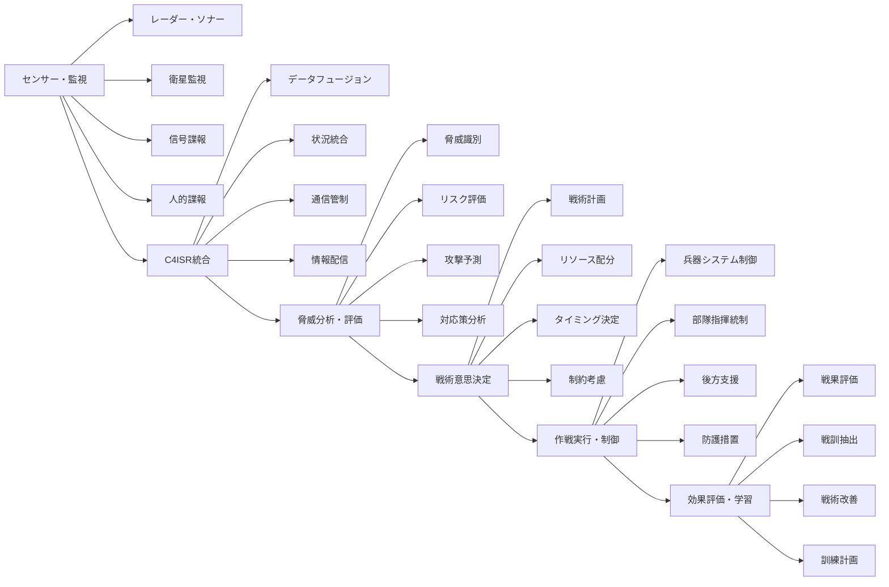
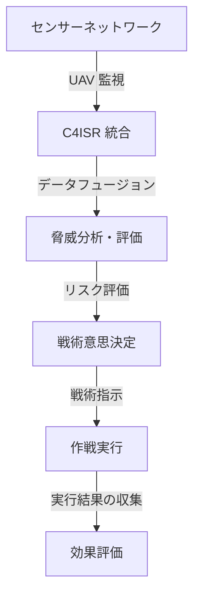

# 軍事・防衛ソフトウェア

!!! info "このページについて"
    このページでは、軍事・防衛分野で使用される状況認識支援ソフトウェアについて詳しく解説します。C4ISRシステム、脅威検知・分析、戦術意思決定支援、サイバーセキュリティなど、国防・安全保障の中核を支える様々なソフトウェアソリューションを紹介します。

## 軍事・防衛ソフトウェアの特徴

軍事・防衛分野のソフトウェアは、国家の安全保障に直結することから、他分野とは異なる極めて厳格な要件を満たす必要があります。

### 重要な要件

| 要件 | 説明 | 技術的実装 | 具体例・メリット |
|---|---|---|---|
| 最高レベルセキュリティ | 国家機密の保護、敵対勢力からの攻撃防止 | 多層暗号化、ゼロトラスト、エアギャップ | 作戦計画の機密保持、通信傍受の防止 |
| 超低遅延処理 | ミサイル迎撃等での瞬時判断 | ハードウェア専用処理、エッジコンピューティング | 弾道ミサイル迎撃での数百ミリ秒レベル応答 |
| 高可用性・冗長性 | 攻撃下でも継続稼働 | 分散システム、フェイルオーバー、自己修復 | EMP攻撃やサイバー攻撃下での作戦継続 |
| 相互運用性 | 多国間・多軍種間の連携 | 標準プロトコル、統合データ形式 | NATO諸国との情報共有、統合作戦実行 |
| 堅牢な認証・認可 | 多段階認証、アクセス制御 | 生体認証、多要素認証、最小権限原則 | 機密情報への不正アクセス防止 |

### システムアーキテクチャ



#### シナリオベースのアーキテクチャ例



## C4ISRシステム

### 統合C4ISRプラットフォーム

C4ISR（Command, Control, Communications, Computers, Intelligence, Surveillance, Reconnaissance）システムは、軍事作戦の中枢神経系として機能し、指揮統制、通信、コンピューター、諜報、監視、偵察の各機能を統合します。

#### C4ISRの内部構成
- **Command System**: 作戦計画の指揮、リアルタイムでの情報伝達
- **Control System**: 戦術的な部隊配置、リソース管理
- **Communications System**: 衛星通信、無線ネットワーク、量子暗号化通信
- **Intelligence System**: 監視衛星、信号諜報、人的諜報
- **Surveillance System**: UAV、レーダー、海底センサー
- **Reconnaissance System**: 偵察機、ドローン

#### ユースケース
- **ISR（Intelligence, Surveillance, Reconnaissance）**
  - 無人航空機（UAV）が敵の移動を監視し、リアルタイムで本部へデータ送信。
  - 部隊の配置転換や攻撃判断の迅速化に貢献。


??? TypeScript実装例

    この TypeScript 実装では、C4ISRシステムの統合プラットフォームを構築し、多様な情報源からのデータを融合して包括的な戦場認識を提供しています。リアルタイムでの脅威評価と戦術的意思決定支援も行います。

    ```typescript
    // C4ISRシステムの実装例
    interface C4ISRSystem {
        command: CommandSystem;
        control: ControlSystem;
        communications: CommunicationsSystem;
        computers: ComputerSystems;
        intelligence: IntelligenceSystem;
        surveillance: SurveillanceSystem;
        reconnaissance: ReconnaissanceSystem;
    }

    interface TacticalSituation {
        situationId: string;
        timestamp: Date;
        battlespace: Battlespace;
        friendlyForces: FriendlyForce[];
        enemyForces: EnemyForce[];
        neutralEntities: NeutralEntity[];
        environmentalFactors: EnvironmentalFactor[];
        threatAssessment: ThreatAssessment;
        missionStatus: MissionStatus;
    }

    interface Battlespace {
        areaOfOperations: GeographicArea;
        dimensions: {
            land: LandDomain;
            sea: SeaDomain;
            air: AirDomain;
            space: SpaceDomain;
            cyber: CyberDomain;
        };
        controlMeasures: ControlMeasure[];
        restrictionsAndConstraints: OperationalConstraint[];
    }

    enum ThreatLevel {
        LOW = 'low',
        MODERATE = 'moderate',
        HIGH = 'high',
        CRITICAL = 'critical',
        IMMINENT = 'imminent'
    }

    class IntegratedC4ISRPlatform {
        private dataFusion: SensorDataFusion;
        private situationalAwareness: BattlefieldSituationalAwareness;
        private threatAnalysis: ThreatAnalysisEngine;
        private decisionSupport: TacticalDecisionSupport;
        private communicationsManager: SecureCommunicationsManager;
        private intelligenceProcessor: IntelligenceProcessor;

        constructor() {
            this.dataFusion = new SensorDataFusion();
            this.situationalAwareness = new BattlefieldSituationalAwareness();
            this.threatAnalysis = new ThreatAnalysisEngine();
            this.decisionSupport = new TacticalDecisionSupport();
            this.communicationsManager = new SecureCommunicationsManager();
            this.intelligenceProcessor = new IntelligenceProcessor();
            this.initializeC4ISR();
        }

        // C4ISRシステムの初期化
        private initializeC4ISR(): void {
            // 多層センサーネットワーク設定
            this.dataFusion.configureSensorNetwork([
                'radar_systems', 'satellite_imagery', 'uav_sensors', 
                'ground_sensors', 'naval_sonar', 'signals_intelligence',
                'human_intelligence', 'imagery_intelligence'
            ]);

            // リアルタイム状況更新
            this.dataFusion.getIntegratedFeed().subscribe(sensorData => {
                this.updateBattlefieldSituation(sensorData);
            });

            // 脅威検知・評価
            this.threatAnalysis.onThreatDetected().subscribe(threat => {
                this.processThreatAlert(threat);
            });

            // 安全な通信チャネル確立
            this.establishSecureCommunications();
        }

        // 統合戦場状況認識
        async generateComprehensiveSituationalAwareness(
            operationalArea: OperationalArea
        ): Promise<TacticalSituation> {
            // マルチソースデータ統合
            const fusedData = await this.dataFusion.fuseSensorData(operationalArea);

            // 友軍部隊状況把握
            const friendlyForces = await this.trackFriendlyForces(operationalArea);

            // 敵軍活動分析
            const enemyForces = await this.analyzeEnemyActivity(fusedData, operationalArea);

            // 中立・民間要素識別
            const neutralEntities = await this.identifyNeutralEntities(fusedData);

            // 環境要因評価
            const environmentalFactors = await this.assessEnvironmentalFactors(operationalArea);

            // 脅威評価
            const threatAssessment = await this.assessIntegratedThreats({
                friendly: friendlyForces,
                enemy: enemyForces,
                environment: environmentalFactors
            });

            // 任務状況評価
            const missionStatus = await this.evaluateMissionStatus(
                friendlyForces, enemyForces, threatAssessment
            );

            return {
                situationId: generateUUID(),
                timestamp: new Date(),
                battlespace: {
                    areaOfOperations: operationalArea,
                    dimensions: await this.analyzeDomainSpecificSituations(operationalArea),
                    controlMeasures: await this.establishControlMeasures(operationalArea),
                    restrictionsAndConstraints: await this.identifyConstraints(operationalArea)
                },
                friendlyForces,
                enemyForces,
                neutralEntities,
                environmentalFactors,
                threatAssessment,
                missionStatus
            };
        }

        // 敵軍活動分析
        private async analyzeEnemyActivity(
            fusedData: FusedSensorData,
            operationalArea: OperationalArea
        ): Promise<EnemyForce[]> {
            // 信号諜報による通信解析
            const signalsIntelligence = await this.intelligenceProcessor.analyzeSignalsIntelligence(
                fusedData.signalsData
            );

            // 画像解析による装備・配置特定
            const imageryAnalysis = await this.intelligenceProcessor.analyzeImagery(
                fusedData.imageryData
            );

            // 移動パターン解析
            const movementAnalysis = await this.analyzeEnemyMovementPatterns(
                fusedData.trackingData
            );

            // 戦術分析
            const tacticalAnalysis = await this.analyzeTacticalBehavior(
                signalsIntelligence,
                imageryAnalysis,
                movementAnalysis
            );

            // 意図推定
            const intentEstimation = await this.estimateEnemyIntent(
                tacticalAnalysis,
                operationalArea
            );

            return this.synthesizeEnemyForceEstimate({
                signals: signalsIntelligence,
                imagery: imageryAnalysis,
                movement: movementAnalysis,
                tactical: tacticalAnalysis,
                intent: intentEstimation
            });
        }

        // 統合脅威評価
        async performIntegratedThreatAssessment(
            situation: TacticalSituation
        ): Promise<IntegratedThreatAssessment> {
            // 動的脅威分析
            const dynamicThreats = await this.threatAnalysis.analyzeDynamicThreats(situation);

            // 複合脅威評価
            const compoundThreats = await this.assessCompoundThreats(situation, dynamicThreats);

            // 時系列脅威推移
            const threatEvolution = await this.analyzeThreatEvolution(situation);

            // 対抗策効果予測
            const countermeasureEffectiveness = await this.predictCountermeasureEffectiveness(
                dynamicThreats,
                situation.friendlyForces
            );

            // リスク優先度付け
            const riskPrioritization = await this.prioritizeRisks(dynamicThreats, compoundThreats);

            return {
                situationId: situation.situationId,
                assessmentTimestamp: new Date(),
                dynamicThreats,
                compoundThreats,
                threatEvolution,
                countermeasureEffectiveness,
                riskPrioritization,
                overallThreatLevel: this.calculateOverallThreatLevel(dynamicThreats),
                recommendedActions: await this.generateThreatResponse(riskPrioritization),
                confidenceLevel: this.assessAssessmentConfidence(dynamicThreats, compoundThreats)
            };
        }

        // 戦術的意思決定支援
        async supportTacticalDecisionMaking(
            situation: TacticalSituation,
            missionObjectives: MissionObjective[]
        ): Promise<TacticalDecisionSupport> {
            // 行動課程策定
            const coursesOfAction = await this.developCoursesOfAction(
                situation,
                missionObjectives
            );

            // 戦術シミュレーション
            const tacticalSimulations = await this.runTacticalSimulations(
                coursesOfAction,
                situation
            );

            // リスク・効果分析
            const riskEffectAnalysis = await this.analyzeRiskAndEffect(
                coursesOfAction,
                tacticalSimulations
            );

            // 資源要求分析
            const resourceRequirements = await this.analyzeResourceRequirements(coursesOfAction);

            // 最適行動課程選定
            const optimalCOA = await this.selectOptimalCourseOfAction(
                coursesOfAction,
                riskEffectAnalysis,
                resourceRequirements
            );

            // 実行計画策定
            const executionPlan = await this.developExecutionPlan(optimalCOA, situation);

            return {
                situationId: situation.situationId,
                decisionTimestamp: new Date(),
                coursesOfAction,
                tacticalSimulations,
                riskEffectAnalysis,
                resourceRequirements,
                recommendedCOA: optimalCOA,
                executionPlan,
                contingencyPlans: await this.developContingencyPlans(optimalCOA, situation),
                synchronizationMatrix: await this.createSynchronizationMatrix(executionPlan)
            };
        }

        // 安全な戦術通信
        async establishSecureTacticalCommunications(
            units: MilitaryUnit[]
        ): Promise<SecureCommunicationNetwork> {
            // 暗号化通信チャネル設定
            const encryptedChannels = await this.communicationsManager.establishEncryptedChannels(units);

            // 周波数ホッピング設定
            const frequencyHopping = await this.setupFrequencyHopping(units);

            // 量子鍵配送（将来技術）
            const quantumKeyDistribution = await this.implementQuantumKeyDistribution(units);

            // 通信経路最適化
            const routeOptimization = await this.optimizeCommunicationRoutes(units);

            // 電子戦対策
            const electronicWarfareCountermeasures = await this.implementEWCountermeasures(units);

            return {
                networkId: generateSecureNetworkId(),
                participatingUnits: units.map(u => u.unitId),
                encryptedChannels,
                frequencyHopping,
                quantumKeyDistribution,
                routeOptimization,
                electronicWarfareCountermeasures,
                networkResilience: await this.calculateNetworkResilience(encryptedChannels),
                communicationSecurity: await this.assessCommunicationSecurity(encryptedChannels)
            };
        }

        // インテリジェンス統合・分析
        async integrateAndAnalyzeIntelligence(
            operationalArea: OperationalArea
        ): Promise<IntelligenceProduct> {
            // 複数情報源からの情報収集
            const collectedIntelligence = await this.collectMultiSourceIntelligence(operationalArea);

            // 信頼性評価
            const reliabilityAssessment = await this.assessIntelligenceReliability(collectedIntelligence);

            // 情報統合・分析
            const integratedAnalysis = await this.integrateIntelligenceData(
                collectedIntelligence,
                reliabilityAssessment
            );

            // 仮説検証
            const hypothesisTesting = await this.testIntelligenceHypotheses(integratedAnalysis);

            // 情報ギャップ特定
            const informationGaps = await this.identifyInformationGaps(
                integratedAnalysis,
                operationalArea
            );

            // 収集優先度設定
            const collectionPriorities = await this.setCollectionPriorities(informationGaps);

            return {
                productId: generateSecureId(),
                operationalArea,
                productionTimestamp: new Date(),
                integratedAnalysis,
                reliabilityAssessment,
                hypothesisTesting,
                informationGaps,
                collectionPriorities,
                keyJudgments: await this.generateKeyJudgments(integratedAnalysis),
                confidenceAssessment: await this.assessAnalysisConfidence(integratedAnalysis),
                disseminationGuidance: await this.createDisseminationGuidance(integratedAnalysis)
            };
        }
    }

    interface IntegratedThreatAssessment {
        situationId: string;
        assessmentTimestamp: Date;
        dynamicThreats: DynamicThreat[];
        compoundThreats: CompoundThreat[];
        threatEvolution: ThreatEvolution;
        countermeasureEffectiveness: CountermeasureEffectiveness[];
        riskPrioritization: RiskPriority[];
        overallThreatLevel: ThreatLevel;
        recommendedActions: RecommendedAction[];
        confidenceLevel: number;
    }

    interface TacticalDecisionSupport {
        situationId: string;
        decisionTimestamp: Date;
        coursesOfAction: CourseOfAction[];
        tacticalSimulations: TacticalSimulation[];
        riskEffectAnalysis: RiskEffectAnalysis;
        resourceRequirements: ResourceRequirement[];
        recommendedCOA: CourseOfAction;
        executionPlan: ExecutionPlan;
        contingencyPlans: ContingencyPlan[];
        synchronizationMatrix: SynchronizationMatrix;
    }

    interface SecureCommunicationNetwork {
        networkId: string;
        participatingUnits: string[];
        encryptedChannels: EncryptedChannel[];
        frequencyHopping: FrequencyHoppingConfig;
        quantumKeyDistribution: QuantumKeyConfig;
        routeOptimization: RouteOptimization;
        electronicWarfareCountermeasures: EWCountermeasure[];
        networkResilience: number;
        communicationSecurity: SecurityAssessment;
    }

    interface IntelligenceProduct {
        productId: string;
        operationalArea: OperationalArea;
        productionTimestamp: Date;
        integratedAnalysis: IntegratedIntelligenceAnalysis;
        reliabilityAssessment: ReliabilityAssessment;
        hypothesisTesting: HypothesisTestResult[];
        informationGaps: InformationGap[];
        collectionPriorities: CollectionPriority[];
        keyJudgments: string[];
        confidenceAssessment: ConfidenceAssessment;
        disseminationGuidance: DisseminationGuidance;
    }
    ```

### 戦場管理システム（BMS）

戦場管理システムは、戦術レベルでの状況認識と意思決定を支援し、部隊間の情報共有と協調を実現します。兵器システムとの統合により、効果的な火力運用と防護を可能にします。

#### BMSの内部構成
- **状況認識モジュール**: 戦場のリアルタイム把握
- **兵站管理システム**: 補給と兵器管理
- **目標管理**: 戦術目標の設定と管理
- **通信ネットワーク**: 部隊間のリアルタイム通信
- **指揮統制**: 作戦計画の実行と修正

## 脅威検知・分析システム

### 多層防空システム

多層防空システムは、航空機、弾道ミサイル、巡航ミサイル、ドローンなど多様な空中脅威を検知・追跡・迎撃する統合システムです。レーダー、光学センサー、音響センサーなどを組み合わせて早期警戒と精密追跡を実現します。

#### ユースケース
- **脅威検知システム**
  - 監視レーダーが接近する弾道ミサイルを早期に検知し、迎撃システムに自動命令。
  - 被害の最小化と人的損害の回避。
#### シナリオ
- **シナリオ1**: 北朝鮮からのミサイル発射を即座に探知し、日米共同の迎撃体制を構築。
- **シナリオ2**: 南シナ海での無人潜水艦の探知、音響センサーによる長距離追跡。
- **シナリオ3**: サイバー攻撃検知、重要な軍事ネットワークへの侵入を排除。


??? TypeScript実装例

    この TypeScript 実装では、多層防空システムの脅威検知・分析・迎撃を統合管理し、多様な空中脅威に対する効果的な防衛を実現しています。レーダーネットワークの管理から迎撃システムの制御まで包括的にカバーしています。

    ```typescript
    // 多層防空システムの実装例
    interface AirDefenseSystem {
        surveillanceLayer: SurveillanceLayer;
        trackingLayer: TrackingLayer;
        engagementLayer: EngagementLayer;
        commandControlLayer: CommandControlLayer;
    }

    interface AirThreat {
        threatId: string;
        detectionTime: Date;
        threatType: ThreatType;
        position: Position3D;
        velocity: Velocity3D;
        trajectory: TrajectoryData;
        rcs: number; // Radar Cross Section
        threatClassification: ThreatClassification;
        engagementPriority: EngagementPriority;
    }

    enum ThreatType {
        FIGHTER_AIRCRAFT = 'fighter_aircraft',
        BOMBER_AIRCRAFT = 'bomber_aircraft',
        BALLISTIC_MISSILE = 'ballistic_missile',
        CRUISE_MISSILE = 'cruise_missile',
        UAV_DRONE = 'uav_drone',
        HELICOPTER = 'helicopter',
        UNKNOWN_AIRCRAFT = 'unknown_aircraft'
    }

    enum ThreatClassification {
        FRIENDLY = 'friendly',
        HOSTILE = 'hostile',
        NEUTRAL = 'neutral',
        UNKNOWN = 'unknown'
    }

    class IntegratedAirDefenseSystem {
        private radarNetwork: RadarNetworkManager;
        private threatProcessor: ThreatProcessor;
        private trackingSystem: TrackingSystemManager;
        private weaponSystems: WeaponSystemCoordinator;
        private identificationSystem: IdentificationSystem;
        private commandCenter: AirDefenseCommandCenter;

        constructor() {
            this.radarNetwork = new RadarNetworkManager();
            this.threatProcessor = new ThreatProcessor();
            this.trackingSystem = new TrackingSystemManager();
            this.weaponSystems = new WeaponSystemCoordinator();
            this.identificationSystem = new IdentificationSystem();
            this.commandCenter = new AirDefenseCommandCenter();
            this.initializeAirDefense();
        }

        // 統合防空システム初期化
        private initializeAirDefense(): void {
            // レーダーネットワーク設定
            this.radarNetwork.configureRadarNetwork([
                'long_range_surveillance', 'medium_range_tracking',
                'short_range_acquisition', 'gap_filling_radars'
            ]);

            // 脅威処理パイプライン設定
            this.setupThreatProcessingPipeline();

            // 自動交戦ルール設定
            this.configureRulesOfEngagement();

            // 友軍識別システム初期化
            this.identificationSystem.initializeIFF();
        }

        // 包括的脅威検知・分析
        async detectAndAnalyzeAirThreats(): Promise<Observable<ThreatAnalysisResult>> {
            return this.radarNetwork.getCombinedDetections().pipe(
                // 生検知データのフィルタリング
                filter(detection => this.validateDetection(detection)),
                
                // 複数センサーデータの統合
                mergeMap(detection => this.fuseSensorData(detection)),
                
                // 脅威分類・識別
                mergeMap(fusedData => this.classifyAndIdentifyThreat(fusedData)),
                
                // 軌道予測・分析
                map(threat => this.analyzeTrajectory(threat)),
                
                // 交戦性評価
                map(threat => this.assessHostility(threat)),
                
                // 優先度付け
                map(threat => this.prioritizeThreats(threat)),
                
                // 対応策立案
                mergeMap(threat => this.developCountermeasures(threat))
            );
        }

        // 弾道ミサイル防衛
        async defendAgainstBallisticMissiles(
            missileThreats: BallisticMissileThreat[]
        ): Promise<BMDEngagementResult> {
            const engagementResults: IndividualEngagementResult[] = [];

            for (const missile of missileThreats) {
                // 軌道計算・予測
                const trajectoryPrediction = await this.predictBallisticTrajectory(missile);

                // 迎撃可能性評価
                const interceptFeasibility = await this.assessInterceptFeasibility(
                    missile,
                    trajectoryPrediction
                );

                // 最適迎撃システム選択
                const optimalInterceptor = await this.selectOptimalInterceptor(
                    missile,
                    interceptFeasibility
                );

                // 迎撃実行
                const engagementResult = await this.executeInterception(
                    missile,
                    optimalInterceptor,
                    trajectoryPrediction
                );

                engagementResults.push(engagementResult);

                // リーカー評価・対応
                if (!engagementResult.successful) {
                    await this.handleLeakerScenario(missile, trajectoryPrediction);
                }
            }

            return {
                totalThreats: missileThreats.length,
                engagementResults,
                overallSuccessRate: this.calculateSuccessRate(engagementResults),
                ammunitionExpenditure: this.calculateAmmoExpenditure(engagementResults),
                systemStatus: await this.assessSystemStatus(),
                recommendedActions: await this.generateBMDRecommendations(engagementResults)
            };
        }

        // 低空・超低空脅威対処
        async engageLowAltitudeThreats(
            lowAltitudeThreats: LowAltitudeThreat[]
        ): Promise<LowAltitudeEngagementResult> {
            // 低空監視センサー強化
            const enhancedSurveillance = await this.enhanceLowAltitudeSurveillance();

            // 地形マスキング効果分析
            const terrainMasking = await this.analyzeTerrainMasking(lowAltitudeThreats);

            // 短距離防空システム配備
            const shoradsDeployment = await this.deploySHORADSystems(lowAltitudeThreats);

            // 対空機関砲・近接防空システム連携
            const ciwsIntegration = await this.integrateCIWSystems(lowAltitudeThreats);

            // 電子戦対抗措置
            const ewarCountermeasures = await this.implementEWCountermeasures(lowAltitudeThreats);

            const engagementResults: LowAltitudeEngagement[] = [];

            for (const threat of lowAltitudeThreats) {
                const engagement = await this.engageLowAltitudeThreat(
                    threat,
                    shoradsDeployment,
                    ciwsIntegration
                );
                engagementResults.push(engagement);
            }

            return {
                threatsEngaged: lowAltitudeThreats.length,
                enhancedSurveillance,
                terrainMasking,
                engagementResults,
                effectivenessAssessment: await this.assessLowAltitudeEffectiveness(engagementResults),
                systemAdaptations: await this.recommendSystemAdaptations(engagementResults)
            };
        }

        // UAV群（スウォーム）対処
        async counterUAVSwarm(
            uavSwarm: UAVSwarmThreat
        ): Promise<CounterUAVResult> {
            // スウォーム特性分析
            const swarmAnalysis = await this.analyzeUAVSwarm(uavSwarm);

            // 協調飛行パターン解析
            const coordinationAnalysis = await this.analyzeSwarmCoordination(uavSwarm);

            // 複数対処戦術選択
            const counterTactics = await this.selectCounterSwarmTactics(swarmAnalysis);

            let counterResults: CounterUAVMeasure[] = [];

            // 電子戦による妨害
            if (counterTactics.includes('ELECTRONIC_WARFARE')) {
                const ewResult = await this.deployElectronicWarfare(uavSwarm);
                counterResults.push(ewResult);
            }

            // 網状迎撃システム
            if (counterTactics.includes('NET_BASED_INTERCEPTION')) {
                const netResult = await this.deployNetBasedInterception(uavSwarm);
                counterResults.push(netResult);
            }

            // 指向性エネルギー兵器
            if (counterTactics.includes('DIRECTED_ENERGY')) {
                const deResult = await this.deployDirectedEnergyWeapons(uavSwarm);
                counterResults.push(deResult);
            }

            // 対UAV専用ミサイル
            if (counterTactics.includes('ANTI_UAV_MISSILES')) {
                const missileResult = await this.deployAntiUAVMissiles(uavSwarm);
                counterResults.push(missileResult);
            }

            return {
                swarmThreatId: uavSwarm.swarmId,
                swarmCharacteristics: swarmAnalysis,
                coordinationPattern: coordinationAnalysis,
                counterTactics,
                counterResults,
                overallEffectiveness: this.assessOverallEffectiveness(counterResults),
                lessonsLearned: await this.extractCounterUAVLessons(counterResults)
            };
        }

        // 統合火器管制
        async coordinateIntegratedFireControl(
            airThreats: AirThreat[]
        ): Promise<IntegratedFireControlResult> {
            // 脅威優先度マトリックス作成
            const threatPriority = await this.createThreatPriorityMatrix(airThreats);

            // 利用可能兵器システム評価
            const availableWeapons = await this.assessAvailableWeaponSystems();

            // 最適兵器割り当て
            const weaponAssignment = await this.optimizeWeaponAssignment(
                threatPriority,
                availableWeapons
            );

            // 交戦スケジュール策定
            const engagementSchedule = await this.createEngagementSchedule(weaponAssignment);

            // 同期火器管制実行
            const fireControlExecution = await this.executeSynchronizedFireControl(
                engagementSchedule
            );

            // 効果評価
            const battleDamageAssessment = await this.conductBattleDamageAssessment(
                fireControlExecution
            );

            // 再割り当て・追加交戦判定
            const reengagementDecision = await this.determineReengagement(
                battleDamageAssessment,
                airThreats
            );

            return {
                totalThreats: airThreats.length,
                threatPriority,
                weaponAssignment,
                engagementSchedule,
                fireControlExecution,
                battleDamageAssessment,
                reengagementDecision,
                ammunitionStatus: await this.checkAmmunitionStatus(),
                systemReadiness: await this.assessSystemReadiness()
            };
        }

        // リアルタイム空域管理
        manageAirspace(): Observable<AirspaceStatus> {
            return merge(
                // 民間航空管制との調整
                this.coordinateWithCivilianATC(),
                // 友軍機飛行計画管理
                this.manageFriendlyFlightPlans(),
                // 制限空域設定
                this.manageRestrictedAirspace(),
                // 緊急時空域開放
                this.handleEmergencyAirspaceOpening()
            ).pipe(
                // 空域状況統合
                scan((airspaceState, update) => this.updateAirspaceState(airspaceState, update), {}),
                // 衝突回避支援
                map(airspace => this.provideCollisionAvoidance(airspace)),
                // 空域使用最適化
                map(airspace => this.optimizeAirspaceUsage(airspace))
            );
        }
    }

    interface BMDEngagementResult {
        totalThreats: number;
        engagementResults: IndividualEngagementResult[];
        overallSuccessRate: number;
        ammunitionExpenditure: AmmunitionExpenditure;
        systemStatus: SystemStatus;
        recommendedActions: string[];
    }

    interface LowAltitudeEngagementResult {
        threatsEngaged: number;
        enhancedSurveillance: SurveillanceEnhancement;
        terrainMasking: TerrainMaskingAnalysis;
        engagementResults: LowAltitudeEngagement[];
        effectivenessAssessment: EffectivenessAssessment;
        systemAdaptations: SystemAdaptation[];
    }

    interface CounterUAVResult {
        swarmThreatId: string;
        swarmCharacteristics: SwarmAnalysis;
        coordinationPattern: CoordinationAnalysis;
        counterTactics: CounterTactic[];
        counterResults: CounterUAVMeasure[];
        overallEffectiveness: number;
        lessonsLearned: string[];
    }

    interface IntegratedFireControlResult {
        totalThreats: number;
        threatPriority: ThreatPriorityMatrix;
        weaponAssignment: WeaponAssignment[];
        engagementSchedule: EngagementSchedule;
        fireControlExecution: FireControlExecution;
        battleDamageAssessment: BattleDamageAssessment;
        reengagementDecision: ReengagementDecision;
        ammunitionStatus: AmmunitionStatus;
        systemReadiness: SystemReadiness;
    }
    ```

### サイバー脅威検知システム

サイバー脅威検知システムは、軍事ネットワークやシステムに対するサイバー攻撃を検知・分析・対処するシステムです。APT攻撃、マルウェア、内部脅威など多様なサイバー脅威からの防護を実現します。

## 戦術意思決定支援システム

### 戦術シミュレーション・ウォーゲーミング

戦術シミュレーション・ウォーゲーミングシステムは、仮想的な戦闘シナリオを通じて戦術・戦略の検証と訓練を行うシステムです。AI対戦相手やマルチプレイヤー環境を提供し、リアルなシミュレーション環境での戦術研究を可能にします。

#### ユースケース
- **戦術シミュレーション**
  - 海上での多国籍演習シミュレーションにおいて、NATO加盟国の統合演習が行われる。
  - 連携の精度向上と迅速な意思決定を実現。

### 作戦計画支援システム

作戦計画支援システムは、軍事作戦の立案・実行・評価を包括的に支援するシステムです。地形分析、兵力配置、補給計画、リスク評価などを統合し、効果的な作戦計画の策定を支援します。

## 軍事AI・自動化システム

### 自律兵器システム

自律兵器システム（LAWS: Lethal Autonomous Weapons Systems）は、人間の直接介入なしに目標を選択・攻撃できるシステムです。倫理的・法的課題が議論される中、人間の監督下での半自律システムの開発が進められています。


??? TypeScript実装例

    この TypeScript 実装では、自律兵器システムの倫理的制約と人間の監督を重視した半自律システムを構築しています。厳格な交戦規則と人間による最終承認を必須とする設計となっています。

    ```typescript
    // 半自律兵器システムの実装例（倫理的制約下）
    interface SemiAutonomousWeaponSystem {
        sensorSuite: AutonomousSensorSuite;
        targetProcessor: TargetProcessingSystem;
        decisionEngine: EthicalDecisionEngine;
        humanInterface: HumanSupervisorInterface;
        weaponPlatform: WeaponPlatform;
        safetySystem: SafetyConstraintSystem;
    }

    interface EthicalConstraints {
        rulesOfEngagement: RulesOfEngagement;
        proportionalityRules: ProportionalityRule[];
        collateralDamageThresholds: CollateralDamageThreshold[];
        humanSupervisionRequirements: SupervisionRequirement[];
        autonomyLimitations: AutonomyLimitation[];
    }

    interface TargetCandidate {
        candidateId: string;
        detectionTime: Date;
        position: Position3D;
        targetClassification: TargetClassification;
        hostilityAssessment: HostilityAssessment;
        threatLevel: ThreatLevel;
        confidence: number;
        engagementFeasibility: EngagementFeasibility;
        collateralRisk: CollateralRisk;
    }

    enum AutonomyLevel {
        HUMAN_OPERATED = 'human_operated',           // 人間が完全制御
        HUMAN_DELEGATED = 'human_delegated',         // 人間が個別に命令
        HUMAN_SUPERVISED = 'human_supervised',       // 人間が監督、システムが実行
        HUMAN_INITIATED = 'human_initiated',         // 人間が開始、システムが継続
        HUMAN_GOVERNED = 'human_governed'            // 人間が規則設定、システムが自律動作
    }

    class SemiAutonomousWeaponSystem {
        private autonomyLevel: AutonomyLevel;
        private ethicalConstraints: EthicalConstraints;
        private decisionEngine: EthicalDecisionEngine;
        private humanSupervisor: HumanSupervisorInterface;
        private targetProcessor: TargetProcessingSystem;
        private safetySystem: SafetyConstraintSystem;
        private auditSystem: WeaponSystemAuditSystem;

        constructor(
            autonomyLevel: AutonomyLevel,
            ethicalConstraints: EthicalConstraints
        ) {
            this.autonomyLevel = autonomyLevel;
            this.ethicalConstraints = ethicalConstraints;
            this.decisionEngine = new EthicalDecisionEngine(ethicalConstraints);
            this.humanSupervisor = new HumanSupervisorInterface();
            this.targetProcessor = new TargetProcessingSystem();
            this.safetySystem = new SafetyConstraintSystem();
            this.auditSystem = new WeaponSystemAuditSystem();
            this.initializeSystemSafeguards();
        }

        // システム安全機能初期化
        private initializeSystemSafeguards(): void {
            // 人間監督必須設定
            this.humanSupervisor.enableMandatorySupervision();

            // 安全制約システム設定
            this.safetySystem.enforceHardConstraints(this.ethicalConstraints);

            // 監査ログ開始
            this.auditSystem.startComprehensiveLogging();

            // 緊急停止機能確認
            this.verifyEmergencyStopCapability();
        }

        // 倫理的目標選定プロセス
        async performEthicalTargetSelection(
            detectedTargets: DetectedTarget[]
        ): Promise<EthicalTargetSelectionResult> {
            // 目標分類・識別
            const classifiedTargets = await this.classifyTargets(detectedTargets);

            // 民間人・非戦闘員識別
            const civilianAssessment = await this.identifyCivilians(classifiedTargets);

            // 比例性原則の適用
            const proportionalityAssessment = await this.assessProportionality(
                classifiedTargets,
                civilianAssessment
            );

            // 付随的損害評価
            const collateralDamageAssessment = await this.assessCollateralDamage(
                classifiedTargets,
                civilianAssessment
            );

            // 軍事的必要性評価
            const militaryNecessity = await this.evaluateMilitaryNecessity(classifiedTargets);

            // 倫理的制約チェック
            const ethicalComplianceCheck = await this.checkEthicalCompliance({
                targets: classifiedTargets,
                civilians: civilianAssessment,
                proportionality: proportionalityAssessment,
                collateralDamage: collateralDamageAssessment,
                militaryNecessity
            });

            // 人間承認要求判定
            const humanApprovalRequired = this.determineHumanApprovalRequirement(
                ethicalComplianceCheck
            );

            return {
                candidateTargets: classifiedTargets,
                civilianAssessment,
                proportionalityAssessment,
                collateralDamageAssessment,
                militaryNecessity,
                ethicalComplianceCheck,
                humanApprovalRequired,
                recommendedAction: await this.generateEthicalRecommendation(ethicalComplianceCheck),
                confidenceMetrics: await this.calculateDecisionConfidence(ethicalComplianceCheck)
            };
        }

        // 人間監督下での交戦決定
        async executeEngagementWithHumanSupervision(
            targetSelection: EthicalTargetSelectionResult,
            supervisor: HumanSupervisor
        ): Promise<EngagementExecutionResult> {
            // 人間監督者への状況提示
            const situationPresentation = await this.presentSituationToHuman(
                targetSelection,
                supervisor
            );

            // 人間による決定待機
            const humanDecision = await this.awaitHumanDecision(
                situationPresentation,
                supervisor
            );

            if (humanDecision.approved) {
                // 承認された交戦実行
                const engagementExecution = await this.executeApprovedEngagement(
                    targetSelection.candidateTargets[0],
                    humanDecision.constraints
                );

                // リアルタイム効果評価
                const effectAssessment = await this.assessEngagementEffect(engagementExecution);

                // 人間への結果報告
                await this.reportResultsToHuman(effectAssessment, supervisor);

                return {
                    executed: true,
                    humanDecision,
                    engagementExecution,
                    effectAssessment,
                    auditTrail: await this.generateAuditTrail(humanDecision, engagementExecution),
                    lessonsLearned: await this.extractLessonsLearned(effectAssessment)
                };
            } else {
                // 交戦の拒否・延期
                await this.handleEngagementDenial(humanDecision);

                return {
                    executed: false,
                    humanDecision,
                    engagementExecution: null,
                    effectAssessment: null,
                    auditTrail: await this.generateDenialAuditTrail(humanDecision),
                    lessonsLearned: await this.analyzeDenialReasons(humanDecision)
                };
            }
        }

        // 自律性制限下での動作
        async operateWithinAutonomyLimits(
            operationalContext: OperationalContext
        ): Promise<AutonomousOperationResult> {
            // 自律性レベル確認
            const currentAutonomyLevel = this.validateCurrentAutonomyLevel();

            // 許可された自律動作範囲確認
            const permittedActions = await this.determinePermittedAutonomousActions(
                currentAutonomyLevel,
                operationalContext
            );

            // 制約内での動作実行
            const autonomousActions: AutonomousAction[] = [];

            for (const action of permittedActions) {
                if (await this.isActionWithinConstraints(action, this.ethicalConstraints)) {
                    const executedAction = await this.executeConstrainedAction(action);
                    autonomousActions.push(executedAction);

                    // 人間監督者への通知
                    await this.notifyHumanSupervisor(executedAction);
                }
            }

            // 自律動作評価
            const operationAssessment = await this.assessAutonomousOperation(autonomousActions);

            return {
                autonomyLevel: currentAutonomyLevel,
                permittedActions,
                executedActions: autonomousActions,
                operationAssessment,
                constraintCompliance: await this.verifyConstraintCompliance(autonomousActions),
                humanNotifications: await this.getHumanNotificationStatus(),
                systemHealth: await this.assessSystemHealth()
            };
        }

        // システム安全性監視
        monitorSystemSafety(): Observable<SystemSafetyStatus> {
            return merge(
                // ハードウェア健全性監視
                this.monitorHardwareHealth(),
                // ソフトウェア整合性監視
                this.monitorSoftwareIntegrity(),
                // 通信セキュリティ監視
                this.monitorCommunicationSecurity(),
                // 人間監督接続監視
                this.monitorHumanSupervisionConnection(),
                // 倫理的制約遵守監視
                this.monitorEthicalConstraintCompliance()
            ).pipe(
                // 安全性状態統合
                scan((safetyState, update) => this.updateSafetyState(safetyState, update), {}),
                // 重大な安全性問題の検出
                tap(safetyState => {
                    if (safetyState.criticalIssueDetected) {
                        this.triggerEmergencyShutdown(safetyState);
                    }
                }),
                // 人間への安全性報告
                tap(safetyState => this.reportSafetyToHuman(safetyState))
            );
        }

        // 機械学習安全性確保
        async ensureMLSafety(
            mlModel: MachineLearningModel
        ): Promise<MLSafetyAssessment> {
            // モデル検証・テスト
            const modelValidation = await this.validateMLModel(mlModel);

            // 対抗例テスト
            const adversarialTesting = await this.conductAdversarialTesting(mlModel);

            // バイアス検出・軽減
            const biasAssessment = await this.assessAndMitigateBias(mlModel);

            // 説明可能性確保
            const explainability = await this.ensureModelExplainability(mlModel);

            // 堅牢性テスト
            const robustnessTesting = await this.testModelRobustness(mlModel);

            // 継続学習制約
            const learningConstraints = await this.establishLearningConstraints(mlModel);

            return {
                modelId: mlModel.id,
                validationResults: modelValidation,
                adversarialTesting,
                biasAssessment,
                explainability,
                robustnessTesting,
                learningConstraints,
                safetyScore: this.calculateMLSafetyScore({
                    validation: modelValidation,
                    adversarial: adversarialTesting,
                    bias: biasAssessment,
                    robustness: robustnessTesting
                }),
                certificationStatus: await this.assessMLCertificationStatus(mlModel),
                recommendedSafeguards: await this.recommendMLSafeguards(mlModel)
            };
        }

        // 国際法遵守確認
        async verifyInternationalLawCompliance(
            proposedAction: ProposedMilitaryAction
        ): Promise<InternationalLawComplianceResult> {
            // ジュネーブ条約遵守確認
            const genevaComplianceCheck = await this.checkGenevaConventionCompliance(proposedAction);

            // 戦争法規遵守確認
            const lawsOfWarCheck = await this.checkLawsOfWarCompliance(proposedAction);

            // 国際人道法遵守確認
            const ihlComplianceCheck = await this.checkIHLCompliance(proposedAction);

            // 特定通常兵器禁止制限条約遵守確認
            const ccwComplianceCheck = await this.checkCCWCompliance(proposedAction);

            // 追加議定書遵守確認
            const additionalProtocolsCheck = await this.checkAdditionalProtocolsCompliance(proposedAction);

            return {
                actionId: proposedAction.id,
                genevaCompliance: genevaComplianceCheck,
                lawsOfWarCompliance: lawsOfWarCheck,
                ihlCompliance: ihlComplianceCheck,
                ccwCompliance: ccwComplianceCheck,
                additionalProtocols: additionalProtocolsCheck,
                overallCompliance: this.assessOverallLegalCompliance({
                    geneva: genevaComplianceCheck,
                    lawsOfWar: lawsOfWarCheck,
                    ihl: ihlComplianceCheck,
                    ccw: ccwComplianceCheck,
                    additionalProtocols: additionalProtocolsCheck
                }),
                legalRisks: await this.identifyLegalRisks(proposedAction),
                recommendedModifications: await this.recommendLegalModifications(proposedAction)
            };
        }
    }

    interface EthicalTargetSelectionResult {
        candidateTargets: TargetCandidate[];
        civilianAssessment: CivilianAssessment;
        proportionalityAssessment: ProportionalityAssessment;
        collateralDamageAssessment: CollateralDamageAssessment;
        militaryNecessity: MilitaryNecessityEvaluation;
        ethicalComplianceCheck: EthicalComplianceCheck;
        humanApprovalRequired: boolean;
        recommendedAction: RecommendedAction;
        confidenceMetrics: DecisionConfidenceMetrics;
    }

    interface EngagementExecutionResult {
        executed: boolean;
        humanDecision: HumanEngagementDecision;
        engagementExecution: EngagementExecution | null;
        effectAssessment: EffectAssessment | null;
        auditTrail: AuditTrail;
        lessonsLearned: string[];
    }

    interface AutonomousOperationResult {
        autonomyLevel: AutonomyLevel;
        permittedActions: PermittedAction[];
        executedActions: AutonomousAction[];
        operationAssessment: OperationAssessment;
        constraintCompliance: ConstraintComplianceResult;
        humanNotifications: HumanNotificationStatus;
        systemHealth: SystemHealthStatus;
    }

    interface MLSafetyAssessment {
        modelId: string;
        validationResults: ModelValidationResult;
        adversarialTesting: AdversarialTestingResult;
        biasAssessment: BiasAssessmentResult;
        explainability: ExplainabilityAssessment;
        robustnessTesting: RobustnessTestingResult;
        learningConstraints: LearningConstraint[];
        safetyScore: number;
        certificationStatus: CertificationStatus;
        recommendedSafeguards: RecommendedSafeguard[];
    }

    interface InternationalLawComplianceResult {
        actionId: string;
        genevaCompliance: ComplianceCheckResult;
        lawsOfWarCompliance: ComplianceCheckResult;
        ihlCompliance: ComplianceCheckResult;
        ccwCompliance: ComplianceCheckResult;
        additionalProtocols: ComplianceCheckResult;
        overallCompliance: OverallComplianceAssessment;
        legalRisks: LegalRisk[];
        recommendedModifications: LegalModification[];
    }
    ```

### 軍事ロボティクス

軍事ロボティクスは、無人地上車両（UGV）、無人航空機（UAV）、無人水上・水中車両（USV/UUV）など、様々な軍事ロボットの統合運用を支援するシステムです。群ロボットの協調制御や人間-ロボット協働も重要な要素です。

## 軍事ソフトウェアの実際例

### 米国の軍事システム

#### 統合戦闘システム

**Aegis Combat System（イージスシステム）**

| 項目 | 内容 |
|---|---|
| 開発 | Lockheed Martin |
| 主要機能 | 統合防空・弾道ミサイル防衛 |
| 特徴 | フェーズドアレイレーダー、垂直発射システム |
| 運用 | 米海軍、多国海軍 |

#### 戦場管理システム

**Blue Force Tracker (BFT)**

| 項目 | 内容 |
|---|---|
| 機能 | 友軍部隊位置把握・状況共有 |
| 技術 | GPS、衛星通信 |
| 運用 | 陸軍・海兵隊車両 |
| 効果 | 味方による誤射防止、状況認識向上 |

### NATO・同盟国システム

#### NATO統合防空ミサイル防衛システム (NATINAMDS)

| 項目 | 内容 |
|---|---|
| 目的 | NATO領域の統合防空 |
| 参加国 | NATO加盟国 |
| 機能 | 多国間センサーデータ共有、統合指揮統制 |
| 相互運用性 | STANAG標準準拠 |

### 日本の防衛システム

#### 統合防空システム

**JADGE（日本防空指揮システム）**

| 項目 | 内容 |
|---|---|
| 運用 | 航空自衛隊 |
| 機能 | 全国レーダー網統合、戦闘機誘導 |
| 特徴 | リアルタイム脅威処理、自動迎撃支援 |
| 発展 | 弾道ミサイル防衛機能追加 |

##### 運用体制と演習結果
- **JADGE システム**:
  - 航空自衛隊が全国のレーダー網を統合し、リアルタイムでの弾道ミサイル監視を行う。
  - 日米共同演習で SM-3 迎撃試験を成功させ、実戦配備を進めています。

#### 弾道ミサイル防衛システム

**BMD システム**

| 要素 | システム | 機能 |
|---|---|---|
| 早期警戒 | FPS-5、FPS-7レーダー | 弾道ミサイル探知・追跡 |
| 迎撃システム | PAC-3、SM-3 | 終末段階・中間段階迎撃 |
| 指揮統制 | JADGE拡張版 | 統合迎撃管理 |

##### 運用体制と演習結果
- **BMD システム**:
  - FPS-5、FPS-7 レーダーにより、早期警戒と迎撃準備を実施。
  - PAC-3 と SM-3 による中間段階と終末段階での迎撃が可能。
  - 実戦を想定した訓練で成功率の向上を図っています。

### オープンソース・学術研究システム

#### シミュレーション・訓練システム

**OpenDIS (Distributed Interactive Simulation)**

| 項目 | 内容 |
|---|---|
| 概要 | 分散型軍事シミュレーション標準 |
| ライセンス | オープンスタンダード |
| 用途 | 訓練シミュレーション、ウォーゲーミング |
| 実装 | 多言語・多プラットフォーム対応 |


??? TypeScript実装例

    ```typescript
    // OpenDIS風分散軍事シミュレーション
    class DistributedMilitarySimulation {
        // 実体状態更新プロトコル（Entity State PDU）
        sendEntityStateUpdate(entity: SimulationEntity): void {
            const entityStatePDU: EntityStatePDU = {
                pduHeader: {
                    protocolVersion: 7,
                    exerciseId: this.exerciseId,
                    pduType: PDUType.ENTITY_STATE,
                    timestamp: Date.now()
                },
                entityId: entity.id,
                forceId: entity.forceId,
                location: entity.position,
                orientation: entity.orientation,
                linearVelocity: entity.velocity,
                appearance: entity.appearance,
                deadReckoningParams: entity.deadReckoning
            };
            
            this.networkManager.broadcast(entityStatePDU);
        }
        
        // 火器発射プロトコル（Fire PDU）
        sendFirePDU(firingEntity: Entity, targetEntity: Entity, munition: Munition): void {
            const firePDU: FirePDU = {
                pduHeader: this.createPDUHeader(PDUType.FIRE),
                firingEntityId: firingEntity.id,
                targetEntityId: targetEntity.id,
                munitionEntityId: munition.id,
                locationInWorld: munition.initialPosition,
                descriptor: munition.descriptor,
                velocity: munition.initialVelocity
            };
            
            this.networkManager.broadcast(firePDU);
        }
    }
    ```

### 軍事AI研究プロジェクト

#### DARPA軍事AI研究

=== "Project Maven"
    |対象|技術|目的|
    |---|---|---|
    |UAV映像の自動解析|コンピュータビジョン、機械学習|人間アナリストの負荷軽減|

=== "ATLAS（Assured Autonomy）"
    |対象|技術|目的|
    |---|---|---|
    |自律システムの信頼性保証|形式検証、テスト自動化|軍事AI の安全性確保|

## 技術トレンドと将来展望

### 次世代軍事技術

#### クラウド・エッジ統合

##### Joint Enterprise Defense Infrastructure (JEDI)
- マルチクラウド環境での軍事システム統合
- エッジコンピューティングによる前方展開支援
- AI/ML ワークロードの分散処理

#### 量子技術応用

=== "量子暗号通信"
    - 理論的に破られない通信セキュリティ
    - 量子鍵配送（QKD）システム
    - 量子ネットワーク構築

=== "量子レーダー"
    - ステルス機能への対抗
    - 量子もつれを利用した高精度探知
    - 電子妨害への耐性

### 人工知能の軍事応用

=== "連合学習（Federated Learning）"
    - 分散した軍事データでのAI訓練
    - プライバシー保護された学習
    - システム間での知見共有

=== "説明可能AI（XAI）"
    - 軍事決定の透明性確保
    - 人間指揮官への判断根拠提示
    - 責任所在の明確化

=== "敵対的機械学習対策"
    - AI システムへの攻撃検知
    - 敵対的サンプルへの耐性強化
    - 堅牢なAI モデル開発

### 倫理・法的課題

#### 自律兵器システムの規制

=== "国際的議論"
    - 国連特定通常兵器禁止制限条約（CCW）での検討
    - "キラーロボット"規制論
    - 人間の判断関与（Human in/on/out of the loop）

=== "技術的制約"
    - 確実な人間監督メカニズム
    - 民間人保護機能の必須化
    - 自律性レベルの制限

#### AI 軍事利用の倫理

##### 原則
- 人間中心の設計
- 透明性・説明責任
- 比例性・軍事的必要性原則
- 無差別攻撃の禁止

## まとめ

軍事・防衛ソフトウェアは、国家の安全保障の根幹を支える重要技術です。技術的優位性の追求と同時に、倫理的・法的制約の遵守が不可欠となっています。

### 開発時の重要ポイント

- **最高レベルセキュリティ**: 多層防御、ゼロトラスト、暗号化
- **極限の信頼性**: 攻撃下でも継続稼働する堅牢性
- **迅速な意思決定**: リアルタイム処理と瞬時判断
- **相互運用性**: 多国間・多軍種間での連携
- **人間中心設計**: 適切な人間の関与と監督
- **倫理的制約**: 国際法・戦争法の遵守
- **説明可能性**: 決定プロセスの透明性確保

特に現代では、AI・自律化技術の進歩により、軍事ソフトウェアの能力が飛躍的に向上している一方で、その使用に関する倫理的・法的議論が重要性を増しています。技術的優位性と人道的価値のバランスを取りながら、真に安全保障に貢献できるシステムの開発が求められています。

### 関連リンク

#### 国際機関・軍事組織
- [NATO](https://www.nato.int/)
- [防衛省](https://www.mod.go.jp/)
- [Joint Chiefs of Staff](https://www.jcs.mil/)

#### 技術標準・規格
- [STANAG (NATO Standardization Agreement)](https://nso.nato.int/)
- [IEEE Standards for Military Systems](https://standards.ieee.org/)
- [OpenDIS](https://github.com/open-dis)

#### 研究機関
- [DARPA](https://www.darpa.mil/)
- [防衛装備庁](https://www.mod.go.jp/atla/)
- [NATO CCDCOE](https://ccdcoe.org/)

### 参考文献

- U.S. Department of Defense. (2023). 2023 Cyber Strategy. DoD.
- NATO Allied Command Transformation. (2022). Multi-Domain Operations. NATO.
- 防衛省. (2023). 令和5年版防衛白書. 防衛省.
- Russell, S., & Norvig, P. (2020). Artificial Intelligence: A Modern Approach (4th ed.). Pearson.
- Scharre, P. (2018). Army of None: Autonomous Weapons and the Future of War. W. W. Norton & Company.
