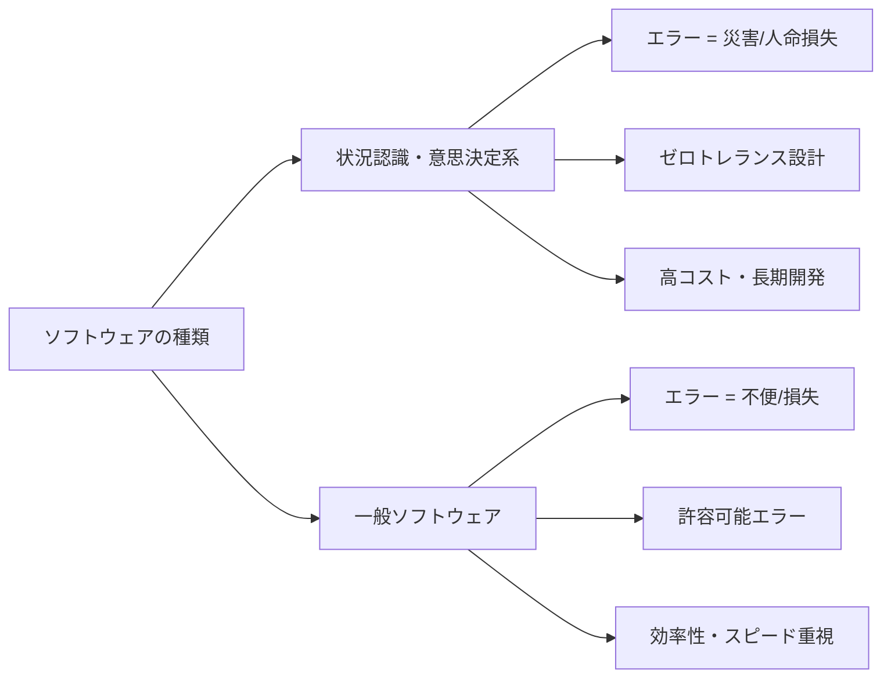
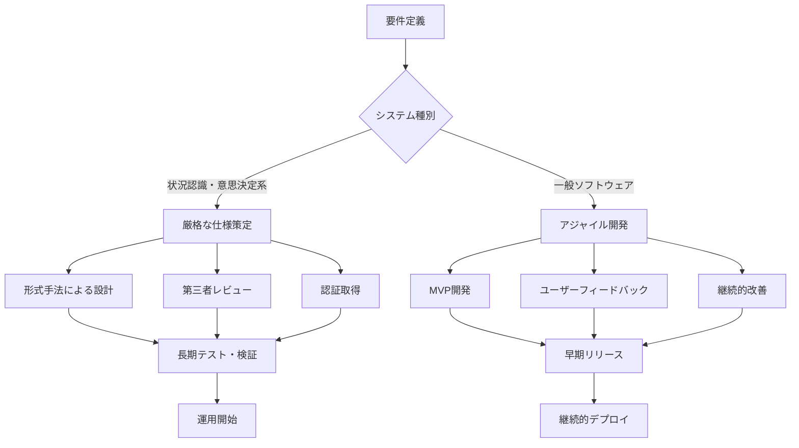

# 状況認識・意思決定系 vs 一般ソフトウェア

!!! info "このページについて"
    このページでは、状況認識・意思決定系ソフトウェアと一般的なソフトウェアの根本的な違いを詳細に分析します。生命・安全・セキュリティに直結する責任の重さが、技術要件、開発プロセス、運用体制にどのような影響を与えるかを解説します。

## 根本的な違いの概要

状況認識・意思決定系ソフトウェアと一般的なソフトウェアの最大の違いは、**エラーが人命・社会インフラに与える影響の深刻さ**にあります。この違いが、すべての技術的・経営的判断に影響を与えます。



## 主要な違い比較表

| 観点 | 状況認識・意思決定系ソフトウェア | 一般的なソフトウェア |
|------|--------------------------------|---------------------|
| **応答性要求** | サブ秒〜数秒以内（生命に関わる） | 数秒〜数十秒（ユーザビリティ重視） |
| **エラー許容度** | ゼロトレランス（エラー＝災害） | ある程度許容（修正・やり直し可能） |
| **データソース** | 多様な異種システム統合必須 | 比較的単純な構造 |
| **可用性要求** | 99.999%（5-nines）以上 | 99.9%程度で十分 |
| **ユーザー対象** | 高度専門職（パイロット、医師等） | 一般ユーザー |

## 技術要件詳細比較

### リアルタイム性の要求

| 技術要素 | 状況認識・意思決定系 | 一般的なソフトウェア | 具体例 |
|----------|---------------------|---------------------|--------|
| **応答時間** | ハードリアルタイム<br>（デッドライン厳守） | ソフトリアルタイム<br>（ベストエフォート） | 航空管制：100ms以内 vs SNS：数秒OK |
| **冗長化設計** | 完全冗長化必須<br>（N+2以上） | 単一障害点許容<br>（N+1程度） | 原発制御：3重系統 vs Webサービス：単系統 |
| **データ整合性** | 強一貫性必須<br>（ACID特性厳守） | 結果整合性許容<br>（CAP定理のバランス） | 医療記録：即座同期 vs ブログ：遅延同期OK |

??? TypeScript実装例
    ```typescript
    // 状況認識・意思決定系：航空管制システムの例
    interface CriticalSystemRequirements {
      responseTime: 'sub-second'; // 数百ミリ秒以内
      updateInterval: 'real-time'; // 1秒以内の更新
      criticalAlert: 'immediate'; // 即座のアラート
    }

    class AirTrafficControlSystem {
      // 衝突回避：100ms以内の応答が必須
      processCollisionRisk(aircraftData: AircraftPosition[]): void {
        const startTime = performance.now();
        const riskAssessment = this.calculateCPA(aircraftData);
        
        if (riskAssessment.timeToCollision < 30) { // 30秒以内
          this.triggerImmediateAlert(); // 即座にアラート発出
        }
        
        const processingTime = performance.now() - startTime;
        if (processingTime > 100) { // 100ms超過は致命的
          this.logCriticalPerformanceIssue(processingTime);
        }
      }
    }

    // 一般ソフトウェア：ECサイトの例
    class ECommerceSystem {
      async processOrder(order: Order): Promise<void> {
        try {
          // 在庫確認や決済処理に数秒かかっても問題ない
          await this.validateInventory(order);
          await this.processPayment(order);
          await this.sendConfirmationEmail(order); // 非同期処理で十分
        } catch (error) {
          // エラーが発生しても後で修正可能
          this.scheduleRetry(order);
        }
      }
    }
    ```

### セキュリティ・認証要求

| 要素 | 状況認識・意思決定系 | 一般的なソフトウェア |
|------|---------------------|---------------------|
| **暗号化** | 軍事・政府レベル（256bit AES以上） | 一般企業レベル（128bit可） |
| **認証** | 多要素認証・生体認証必須 | パスワード＋2FA程度 |
| **監査ログ** | 全操作記録・法的証拠能力 | 運用監視・デバッグ目的 |
| **アクセス制御** | 最小権限・Need-to-Know | 役割ベース・部門単位 |

## UI/UX要求比較

### 表示設計の違い

| UI/UX要素 | 状況認識・意思決定系 | 一般的なソフトウェア |
|-----------|---------------------|---------------------|
| **情報密度** | 高密度・多次元表示 | 段階的・階層的表示 |
| **色彩設計** | 機能的・警告色重視 | 美的・ブランド重視 |
| **操作学習** | 専門訓練前提 | 直感的操作重視 |
| **エラー表示** | 即座・明確・具体的 | 親切・分かりやすさ重視 |
| **表示優先度** | 重要度順・階層明確 | ユーザー体験重視 |

??? TypeScript実装例
    ```typescript
    // 状況認識系：航空管制ディスプレイ
    @Component({
      selector: 'atc-radar-display',
      template: `
        <div class="radar-scope" [class.critical-alert]="hasCriticalAlert">
          <svg class="aircraft-display">
            <g *ngFor="let aircraft of aircraftPositions$ | async">
              <!-- 航空機アイコンは瞬時に認識できる形状と色 -->
              <g [attr.transform]="getAircraftTransform(aircraft)"
                 [class]="getAircraftClass(aircraft)">
                <polygon points="0,-10 5,5 0,2 -5,5" 
                         [style.fill]="getAircraftColor(aircraft)"/>
                <text [attr.x]="15" [attr.y]="0" class="callsign">
                  {{aircraft.callsign}}
                </text>
              </g>
            </g>
          </svg>
          
          <!-- 重要な情報は常に視認可能 -->
          <div class="alert-panel" *ngIf="activeAlerts$ | async as alerts">
            <div *ngFor="let alert of alerts" 
                 [class]="'alert-' + alert.severity">
              {{alert.message}}
            </div>
          </div>
        </div>
      `
    })
    export class ATCRadarDisplay {
      // 色による即座の識別
      getAircraftColor(aircraft: Aircraft): string {
        switch (aircraft.status) {
          case 'emergency': return '#FF0000';    // 緊急：赤
          case 'warning': return '#FFA500';      // 警告：オレンジ
          case 'normal': return '#00FF00';       // 正常：緑
          default: return '#FFFFFF';             // 不明：白
        }
      }
    }

    // 一般ソフトウェア：管理ダッシュボード
    @Component({
      selector: 'admin-dashboard',
      template: `
        <!-- 複雑な情報も段階的に表示 -->
        <mat-tab-group>
          <mat-tab label="Sales">
            <app-sales-chart></app-sales-chart>
          </mat-tab>
          <mat-tab label="Users">
            <app-user-analytics></app-user-analytics>
          </mat-tab>
          <mat-tab label="Settings">
            <app-system-settings></app-system-settings>
          </mat-tab>
        </mat-tab-group>
      `
    })
    export class AdminDashboard {
      // 複雑な操作も段階的に学習可能
    }
    ```

## 開発・運用コスト比較

### 総保有コスト（TCO）

| コスト要素 | 状況認識・意思決定系 | 一般的なソフトウェア | コスト比率 |
|-----------|---------------------|---------------------|-----------|
| **初期開発** | 数億〜数千億円 | 数百万〜数億円 | **10-100倍** |
| **開発期間** | 5-15年 | 6ヶ月-3年 | **5-10倍** |
| **人材コスト** | 高度専門家必須 | 一般エンジニア | **3-5倍** |
| **認証費用** | 厳格な第三者認証 | 自社品質保証 | **追加で数億円** |
| **運用監視** | 24時間365日専門監視 | 営業時間内対応可 | **2-3倍** |
| **保守更新** | 慎重な段階更新 | 継続的デリバリ | **時間10倍** |

### 開発プロセスの違い



## 技術実装の特徴比較

| 実装特徴 | 状況認識・意思決定系 | 一般的なソフトウェア |
|----------|---------------------|---------------------|
| **アーキテクチャ** | 分散・冗長・フェイルセーフ | モノリス〜マイクロサービス |
| **プログラミング言語** | Ada、C++、Rust（安全性重視） | JavaScript、Python、Java（生産性重視） |
| **データベース** | 分散DB・レプリケーション必須 | 単一DB・定期バックアップ |
| **通信プロトコル** | 暗号化・認証・完全性保証 | HTTPS・標準的セキュリティ |
| **監視・ログ** | 全操作記録・法的証拠能力 | 運用監視・デバッグ目的 |

## 業界別特徴比較

| 業界・分野 | 状況認識・意思決定系の例 | 一般ソフトウェアの例 | 主な違い |
|-----------|------------------------|---------------------|----------|
| **航空** | 航空管制システム（JATS） | 航空券予約システム | 生命 vs 利便性 |
| **医療** | ICU監視システム | 健康管理アプリ | 診断精度 vs 一般情報 |
| **海事** | 船舶衝突回避システム | 釣り情報アプリ | 安全航行 vs 趣味情報 |
| **軍事** | C4ISRシステム | ゲーム・シミュレータ | 国防 vs エンターテイメント |
| **エネルギー** | 原発制御システム | 電気料金管理アプリ | 安全制御 vs 情報管理 |

## 法規制・標準準拠比較

| 規制分野 | 状況認識・意思決定系 | 一般的なソフトウェア |
|----------|---------------------|---------------------|
| **安全認証** | DO-178C、IEC 61508等の厳格認証 | ISO 9001等の一般品質規格 |
| **セキュリティ** | Common Criteria EAL6-7 | 一般的なペネトレーションテスト |
| **データ保護** | 軍事機密・医療情報保護法 | GDPR・個人情報保護法 |
| **監査要求** | 政府・第三者機関による厳格監査 | 内部監査・顧客監査 |
| **更新手続き** | 認証機関承認必須 | 自社判断で実施可能 |

## 障害時の影響比較

| 障害レベル | 状況認識・意思決定系 | 一般的なソフトウェア |
|-----------|---------------------|---------------------|
| **軽微な障害** | 即座の代替手段起動 | ユーザーに通知・後で修正 |
| **中程度障害** | 段階的縮退運転 | サービス一時停止 |
| **重大障害** | 安全側自動停止 | 全機能停止・復旧作業 |
| **最悪ケース** | 人命・社会インフラへの影響 | 事業損失・顧客離れ |

??? TypeScript実装例
    ```typescript
    // 状況認識・意思決定系：原子力発電所制御システム
    class NuclearPlantSafetySystem {
      handleSensorFailure(sensorId: string): void {
        // センサー故障時の段階的縮退運転
        const backupSensors = this.getBackupSensors(sensorId);
        
        if (backupSensors.length > 0) {
          // バックアップセンサーに切り替え
          this.switchToBackupSensor(backupSensors[0]);
          this.logDegradedOperation('SENSOR_BACKUP_MODE');
        } else {
          // 安全側への自動停止
          this.initiateControlledShutdown();
          this.alertOperators('CRITICAL_SENSOR_FAILURE');
        }
      }
      
      // フェイルセーフ：危険側に倒れない設計
      private initiateControlledShutdown(): void {
        // 制御棒挿入など安全な状態への移行
        this.insertControlRods();
        this.activateEmergencyCooling();
        this.sealContainment();
      }
    }

    // 一般ソフトウェア：ECサイト
    class ECommerceService {
      handleDatabaseFailure(): void {
        try {
          // データベース復旧を試行
          this.database.reconnect();
        } catch (error) {
          // 失敗しても事業継続可能
          this.enableMaintenanceMode();
          this.notifyUsers('一時的にサービスを停止しています');
          this.scheduleBackupDataRestore();
        }
      }
    }
    ```

## エラーハンドリングとフェイルセーフ

### グレースフルデグラデーション

状況認識・意思決定系システムでは、部分的な障害が発生しても**安全側への自動移行**が設計されています。

??? TypeScript実装例
    ```typescript
    // 医療システムでのフェイルセーフ例
    class CriticalCareMonitoring {
      handleVitalSignSensorFailure(patientId: string, sensorType: VitalSignType): void {
        // 1. 代替センサーの確認
        const backupSensors = this.getBackupSensors(patientId, sensorType);
        
        if (backupSensors.length > 0) {
          // 2. 自動切り替え
          this.activateBackupSensor(backupSensors[0]);
          this.notifyMedicalStaff('SENSOR_SWITCHED', patientId);
        } else {
          // 3. 手動監視モードへ移行
          this.enableManualMonitoringMode(patientId);
          this.triggerCriticalAlert('MANUAL_MONITORING_REQUIRED', patientId);
        }
        
        // 4. すべての変更をログに記録
        this.auditLogger.logCriticalSystemChange({
          patientId,
          sensorType,
          action: 'FAILOVER_ACTIVATED',
          timestamp: new Date(),
          operator: this.getCurrentOperator()
        });
      }
    }
    ```

## パフォーマンス最適化の違い

### リアルタイム処理最適化

??? TypeScript実装例
    ```typescript
    // 状況認識系：航空管制での最適化
    class RadarDataProcessor {
      // WebWorkerによる並列処理
      processRadarData(radarData: RadarContact[]): Observable<ProcessedRadarData> {
        return from(radarData).pipe(
          // バッファリングで処理効率化（ただし遅延は最小限）
          bufferTime(50), // 50ms以内でバッファ
          
          // 重要度による優先処理
          map(contacts => this.prioritizeByThreatLevel(contacts)),
          
          // WebWorkerで並列処理
          mergeMap(prioritizedContacts => 
            this.webWorkerService.process(prioritizedContacts)
          ),
          
          // エラー時は即座にフォールバック
          catchError(error => {
            this.fallbackToSimpleProcessing();
            return throwError(error);
          })
        );
      }
    }

    // 一般ソフトウェア：SNSでの最適化
    class SocialMediaFeed {
      loadUserTimeline(userId: string): Observable<Post[]> {
        return this.cacheService.get(`timeline_${userId}`).pipe(
          // キャッシュがあれば即座に返却
          switchMap(cached => 
            cached ? of(cached) : this.loadFromServer(userId)
          ),
          
          // 背景で新しいデータを取得
          tap(posts => this.prefetchNextPage(userId)),
          
          // エラーは無視して空配列返却
          catchError(() => of([]))
        );
      }
    }
    ```

## 将来の技術動向

### 新技術の適用方針

| 技術分野 | 状況認識・意思決定系での適用 | 一般ソフトウェアでの適用 |
|----------|---------------------------|------------------------|
| **AI・機械学習** | 慎重な段階導入・人間監督必須 | 積極的導入・自動化推進 |
| **クラウド** | ハイブリッド・エッジ重視 | クラウドファースト |
| **IoT** | セキュア・高信頼性重視 | スケール・コスト重視 |
| **5G/6G** | 超低遅延・高可用性活用 | 高速・大容量活用 |

## まとめ

状況認識・意思決定系ソフトウェアと一般的なソフトウェアの違いは、単なる技術仕様の違いではなく、**社会的責任と人命への影響**という根本的な設計思想の違いから生まれています。

### 重要な選択指針

1. **責任の重さ**: エラーが人命に関わるか
2. **技術的複雑性**: 多様なシステム統合が必要か
3. **専門性要求**: 高度な専門知識を持つユーザーか
4. **コスト許容**: 高コスト・長期開発が可能か
5. **規制遵守**: 厳格な法規制・認証が必要か

この違いを理解することで、プロジェクトの性質に応じた適切な開発アプローチと技術選択が可能になります。

## 関連リンク

- [状況認識 vs 意思決定システムの特徴比較](../sa-vs-dm-systems)
- [ソフトウェア概要](../)
- [基本概念：状況認識とは](../../basics/what-is-sa)
- [基本概念：意思決定とは](../../basics/decision-making)