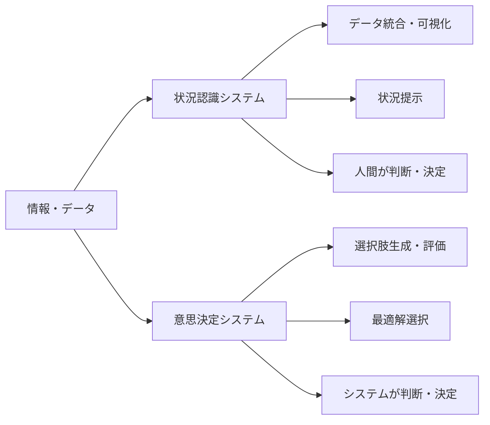
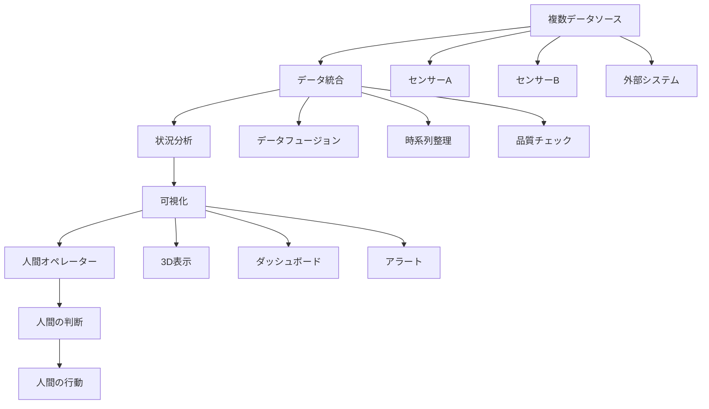
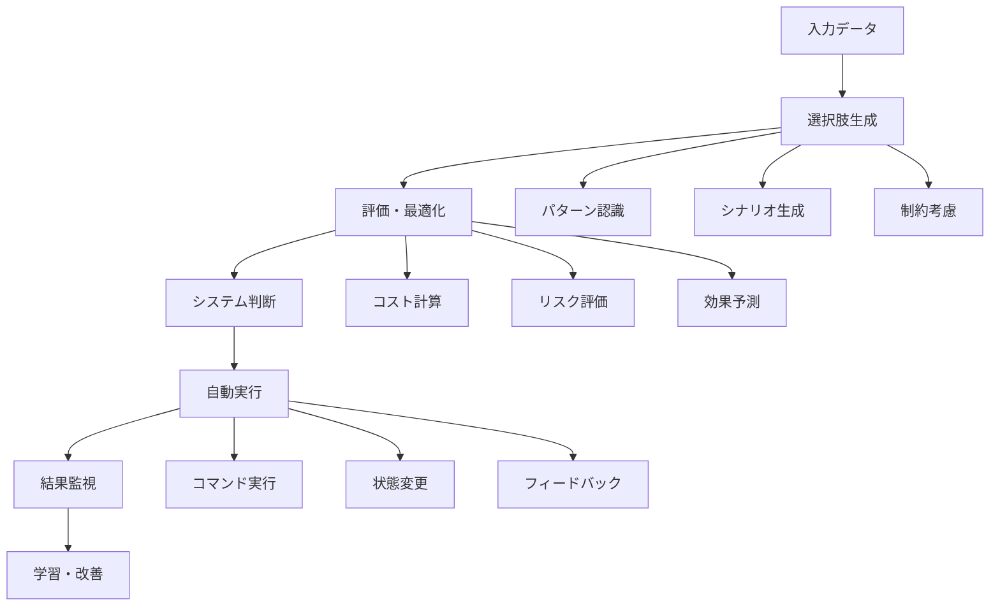

# 状況認識 vs 意思決定システムの特徴比較

!!! info "このページについて"
    このページでは、状況認識（Situational Awareness）重視システムと意思決定（Decision Making）重視システムの技術的な違いを詳細に分析します。同じ「状況認識・意思決定系」に分類されるシステムでも、人間とシステムの役割分担によって設計思想が大きく異なることを解説します。

## 根本的な設計思想の違い

状況認識システムと意思決定システムでは、**人間とシステムの責任分担**が根本的に異なります。



## 主要な違い比較表

| 観点 | 状況認識重視システム | 意思決定重視システム |
|------|-------------------|-------------------|
| **主目的** | **情報の統合・可視化・理解** | **選択肢の評価・判断・実行** |
| **ユーザーの役割** | 人間が判断・決定を行う | システムが推薦・自動実行 |
| **システムの責任** | 正確な情報提示 | 最適な選択肢提案 |
| **技術的焦点** | データフュージョン・可視化 | 最適化・AI・自動化 |
| **エラーの影響** | 人間の判断ミス誘発 | システムの自動誤動作 |

## 分野別システム分類

### 状況認識重視システム

| 分野 | システム例 | 特徴 | 人間の役割 |
|------|-----------|------|----------|
| **航空管制** | レーダー表示システム | 管制官が全体状況を把握し交通整理 | 最終判断・指示 |
| **医療監視** | ICUモニタリング | 医師・看護師が患者状態を総合把握 | 診断・治療決定 |
| **船舶航海** | ECDIS（電子海図） | 船長が航路・周辺状況を総合判断 | 航路決定・操船 |
| **軍事偵察** | ISR（情報収集）システム | 指揮官が戦術状況を俯瞰把握 | 作戦判断・指示 |
| **気象予報** | 気象データ統合表示 | 予報官が総合的に天気を予測 | 予報作成・警報判断 |

### 意思決定重視システム

| 分野 | システム例 | 特徴 | システムの役割 |
|------|-----------|------|--------------|
| **航空安全** | TCAS（衝突回避） | システムが回避行動を自動指示 | 回避判断・指示 |
| **医療診断** | AI診断支援 | システムが診断候補を推薦 | 診断候補提示 |
| **金融取引** | アルゴリズム取引 | システムが自動売買判断・実行 | 取引実行 |
| **製造制御** | 自動制御システム | システムが製造工程を自動制御 | プロセス制御 |
| **交通制御** | 信号制御システム | システムが交通流を最適制御 | 信号制御 |

## 技術アーキテクチャの違い

### 状況認識重視システムの設計

??? TypeScript実装例
    ```typescript
    // 状況認識システムの典型的な構造
    interface SituationalAwarenessArchitecture {
      // データ収集・統合が中心
      dataCollection: {
        multiSourceIntegration: boolean;
        realTimeStreaming: boolean;
        dataFusion: boolean;
      };
      
      // 可視化・表示に重点
      visualization: {
        comprehensiveDisplay: boolean;
        contextualInformation: boolean;
        alertHighlighting: boolean;
      };
      
      // 人間支援機能
      humanInterface: {
        intuitivePresentaion: boolean;
        expertiseSupport: boolean;
        decisionAiding: boolean; // 支援のみ
      };
    }

    class SituationalAwarenessSystem {
      private dataSources: DataSource[];
      private dataFusion: DataFusionEngine;
      private visualization: VisualizationEngine;
      
      // 情報の統合・表示
      async generateSituationPicture(): Promise<SituationDisplay> {
        // 1. 多様なデータソースから情報収集
        const rawData = await this.collectFromAllSources();
        
        // 2. データの相関・統合
        const fusedData = this.dataFusion.integrate(rawData);
        
        // 3. 可視化・表示
        const display = this.visualization.render(fusedData);
        
        // 4. 異常・重要事項のハイライト
        const alertedDisplay = this.highlightAnomalies(display);
        
        return alertedDisplay;
      }
      
      // 警告生成（判断は人間が行う）
      generateWarnings(situation: SituationData): Warning[] {
        return this.detectAnomalies(situation);
      }
    }
    ```

### 意思決定重視システムの設計

??? TypeScript実装例
    ```typescript
    // 意思決定システムの典型的な構造
    interface DecisionMakingArchitecture {
      // 判断・選択が中心
      decisionEngine: {
        optionGeneration: boolean;
        evaluation: boolean;
        optimization: boolean;
      };
      
      // 自動化・実行に重点
      automation: {
        automaticExecution: boolean;
        realTimeResponse: boolean;
        adaptiveBehavior: boolean;
      };
      
      // AI・機械学習活用
      intelligence: {
        machineLearning: boolean;
        predictiveAnalytics: boolean;
        continuousLearning: boolean;
      };
    }

    class DecisionMakingSystem {
      private decisionEngine: DecisionEngine;
      private optimizationEngine: OptimizationEngine;
      private executionEngine: ExecutionEngine;
      
      // 選択肢の生成・評価・実行
      async makeDecision(context: DecisionContext): Promise<DecisionResult> {
        // 1. 選択肢の生成
        const options = await this.generateOptions(context);
        
        // 2. 各選択肢の評価
        const evaluatedOptions = await this.evaluateOptions(options, context);
        
        // 3. 最適解の選択
        const bestOption = this.optimizationEngine.selectBest(evaluatedOptions);
        
        // 4. 実行（自動または推薦）
        const result = await this.executionEngine.execute(bestOption);
        
        return result;
      }
    }
    ```

## データフローの比較

### 状況認識システムのフロー



### 意思決定システムのフロー



## UI/UX設計の違い

### 状況認識重視のUI設計

??? TypeScript実装例
    ```typescript
    // 航空管制レーダー画面の例
    @Component({
      selector: 'atc-situation-display',
      template: `
        <!-- 全体状況を一目で把握できる設計 -->
        <div class="radar-scope">
          <!-- 重要な情報ほど目立つ表示 -->
          <div class="aircraft-layer">
            <div *ngFor="let aircraft of aircraftList" 
                [class]="getAircraftClass(aircraft)"
                [style.color]="getStatusColor(aircraft)">
              <!-- 航空機情報をリッチに表示 -->
              <span class="callsign">{{aircraft.callsign}}</span>
              <span class="altitude">{{aircraft.altitude}}</span>
              <span class="speed">{{aircraft.speed}}</span>
            </div>
          </div>
          
          <!-- コンテキスト情報をレイヤー表示 -->
          <div class="weather-overlay" [style.opacity]="weatherOpacity">
            <!-- 気象情報オーバーレイ -->
          </div>
          
          <!-- アラートは明確に -->
          <div class="alert-panel" *ngIf="hasAlerts">
            <div *ngFor="let alert of alerts" 
                [class]="'alert-' + alert.severity">
              {{alert.message}}
            </div>
          </div>
        </div>
        
        <!-- 操作は補助的 -->
        <div class="control-panel">
          <button (click)="toggleWeatherOverlay()">気象表示切替</button>
          <button (click)="adjustTimeScale()">時間軸調整</button>
        </div>
      `,
  
        .radar-scope {
          width: 100%;
          height: 800px;
          background: #001122;
          position: relative;
          /* 高密度情報表示 */
        }
        
        .aircraft-layer {
          position: absolute;
          top: 0;
          left: 0;
          width: 100%;
          height: 100%;
          /* 航空機を正確に配置 */
        }
        
        .alert-panel {
          position: fixed;
          top: 20px;
          right: 20px;
          z-index: 1000;
        }
        
        .alert-critical {
          background: #ff0000;
          color: white;
          font-weight: bold;
          animation: blink 1s infinite;
        }
      `]
    })
    export class SituationDisplayComponent {
      // 人間の認知を支援する表示
      getStatusColor(aircraft: Aircraft): string {
        // 即座に理解できる色分け
        switch (aircraft.emergencyStatus) {
          case 'emergency': return '#FF0000';    // 緊急：赤
          case 'urgent': return '#FFA500';       // 緊急：オレンジ
          case 'normal': return '#00FF00';       // 正常：緑
          default: return '#FFFFFF';             // 不明：白
        }
      }
      
      // 情報は提示するが、判断は人間
      getAircraftClass(aircraft: Aircraft): string {
        const classes = ['aircraft'];
        if (aircraft.conflictRisk) classes.push('conflict-risk');
        if (aircraft.weatherRisk) classes.push('weather-risk');
        return classes.join(' ');
      }
    }
    ```

### 意思決定重視のUI設計

??? TypeScript実装例
    ```typescript
    // 投資推薦システムの例
    @Component({
      selector: 'investment-advisor',
      template: `
        <!-- 推薦結果を明確に提示 -->
        <div class="recommendation-panel">
          <h2>AI投資推薦</h2>
          
          <!-- システムの判断結果 -->
          <div class="recommendation" 
              [class]="recommendation.confidence">
            <h3>{{recommendation.action}}</h3>
            <div class="confidence-meter">
              <div class="confidence-bar" 
                  [style.width.%]="recommendation.confidence">
              </div>
              <span>信頼度: {{recommendation.confidence}}%</span>
            </div>
            <p>期待収益: {{recommendation.expectedReturn}}%</p>
            <p>リスクレベル: {{recommendation.riskLevel}}</p>
          </div>
          
          <!-- 実行ボタンが中心 -->
          <div class="action-buttons">
            <button (click)="executeRecommendation()" 
                    class="execute-btn primary"
                    [disabled]="recommendation.confidence < 70">
              推薦通りに実行
            </button>
            <button (click)="modifyAndExecute()" 
                    class="modify-btn secondary">
              調整して実行
            </button>
            <button (click)="rejectRecommendation()" 
                    class="reject-btn">
              推薦を拒否
            </button>
          </div>
          
          <!-- 根拠の説明（透明性確保） -->
          <div class="reasoning" *ngIf="showReasoning">
            <h4>AI判断根拠</h4>
            <ul>
              <li *ngFor="let reason of recommendation.reasons">
                <span class="weight">{{reason.weight}}%</span>
                {{reason.description}}
              </li>
            </ul>
          </div>
          
          <!-- 過去の推薦実績 -->
          <div class="performance-history">
            <h4>過去30日の推薦成績</h4>
            <div class="metrics">
              <span>成功率: {{performanceMetrics.successRate}}%</span>
              <span>平均収益: {{performanceMetrics.avgReturn}}%</span>
            </div>
          </div>
        </div>
      `,
  
        .recommendation-panel {
          max-width: 600px;
          margin: 0 auto;
          padding: 20px;
        }
        
        .recommendation {
          background: linear-gradient(135deg, #667eea 0%, #764ba2 100%);
          color: white;
          padding: 20px;
          border-radius: 10px;
          margin: 20px 0;
        }
        
        .confidence-meter {
          background: rgba(255,255,255,0.2);
          height: 20px;
          border-radius: 10px;
          position: relative;
          margin: 10px 0;
        }
        
        .confidence-bar {
          background: #00ff88;
          height: 100%;
          border-radius: 10px;
          transition: width 0.5s ease;
        }
        
        .action-buttons {
          display: flex;
          gap: 10px;
          margin: 20px 0;
        }
        
        .execute-btn {
          background: #28a745;
          color: white;
          padding: 15px 30px;
          border: none;
          border-radius: 5px;
          font-size: 16px;
          cursor: pointer;
        }
        
        .execute-btn:disabled {
          background: #6c757d;
          cursor: not-allowed;
        }
      `]
    })
    export class InvestmentAdvisorComponent {
      recommendation: InvestmentRecommendation;
      performanceMetrics: PerformanceMetrics;
      showReasoning = false;
      
      // システムの判断を実行
      executeRecommendation(): void {
        // 確認ダイアログ
        const confirmed = confirm(
          `${this.recommendation.action}を実行しますか？\n` +
          `予想収益: ${this.recommendation.expectedReturn}%\n` +
          `信頼度: ${this.recommendation.confidence}%`
        );
        
        if (confirmed) {
          this.tradingService.executeStrategy(this.recommendation)
            .subscribe(result => {
              this.showExecutionResult(result);
            });
        }
      }
      
      // ユーザーが推薦を調整
      modifyAndExecute(): void {
        // 推薦パラメータの調整画面を表示
        this.openModificationDialog();
      }
    }
    ```

## パフォーマンス要求の違い

### 応答性・処理要求

| 要求項目 | 状況認識重視 | 意思決定重視 |
|----------|-------------|-------------|
| **表示更新** | 1-2秒（視認性重視） | 即座（判断結果表示） |
| **データ処理** | 統合・可視化処理 | 最適化計算・推論 |
| **精度要求** | 表示精度（視認性） | 判断精度（正解率） |
| **ユーザビリティ** | 直感的理解 | 信頼できる推薦 |
| **メモリ使用** | 大量データ保持 | 計算結果保持 |

### 最適化の焦点

??? TypeScript実装例
    ```typescript
    // 状況認識系：表示最適化
    class SituationDisplayOptimizer {
      // 大量データの効率的な可視化
      optimizeVisualization(data: SensorData[]): void {
        // レベル・オブ・ディテール（LOD）による最適化
        const viewBounds = this.getCurrentViewBounds();
        const filteredData = data.filter(item => 
          this.isInViewBounds(item, viewBounds)
        );
        
        // 重要度による表示優先度
        const prioritizedData = this.prioritizeByImportance(filteredData);
        
        // WebGL による高速描画
        this.webglRenderer.render(prioritizedData);
        
        // フレームレート維持
        if (this.frameRate < 30) {
          this.reduceLevelOfDetail();
        }
      }
    }

    // 意思決定系：計算最適化
    class DecisionOptimizer {
      // 最適解計算の高速化
      async optimizeDecision(options: DecisionOption[]): Promise<OptimalDecision> {
        // 並列計算による高速化
        const evaluationPromises = options.map(option => 
          this.workerPool.evaluate(option)
        );
        
        const evaluations = await Promise.all(evaluationPromises);
        
        // 遺伝的アルゴリズムによる最適化
        const geneticOptimizer = new GeneticAlgorithm({
          populationSize: 100,
          generations: 50,
          mutationRate: 0.01
        });
        
        return geneticOptimizer.findOptimal(evaluations);
      }
    }
    ```

    ## エラーハンドリングの違い

    ### 状況認識系：情報品質保証

    ```typescript
    class SituationAwarenessErrorHandling {
      // データ品質の確保
      validateDataQuality(data: SensorData[]): QualityReport {
        const qualityIssues: QualityIssue[] = [];
        
        // データの完整性チェック
        const completeness = this.checkDataCompleteness(data);
        if (completeness < 0.9) {
          qualityIssues.push({
            type: 'INCOMPLETE_DATA',
            severity: 'HIGH',
            description: `データ完整性: ${completeness * 100}%`,
            recommendation: '追加センサーの確認が必要'
          });
        }
        
        // 一貫性チェック
        const consistencyErrors = this.checkDataConsistency(data);
        if (consistencyErrors.length > 0) {
          qualityIssues.push({
            type: 'INCONSISTENT_DATA',
            severity: 'MEDIUM',
            description: '複数ソース間でデータ不整合',
            recommendation: 'センサー校正の確認'
          });
        }
        
        return { qualityIssues, overallQuality: this.calculateOverallQuality(data) };
      }
      
      // 表示エラーの処理
      handleDisplayError(error: DisplayError): void {
        // クリティカルな表示は代替手段で表示
        if (error.isCritical) {
          this.fallbackToSimpleDisplay();
          this.alertOperator('表示システム障害のため簡易モードに切替');
        } else {
          // 非クリティカルエラーは無視して継続
          this.logError(error);
        }
      }
    }
    ```

### 意思決定系：判断品質保証


??? TypeScript実装例
    ```typescript
    class DecisionMakingErrorHandling {
      // 判断の品質確保
      validateDecisionQuality(decision: Decision): ValidationResult {
        const validationErrors: ValidationError[] = [];
        
        // 信頼度チェック
        if (decision.confidence < this.minimumConfidenceThreshold) {
          validationErrors.push({
            type: 'LOW_CONFIDENCE',
            severity: 'HIGH',
            description: `信頼度が閾値を下回る: ${decision.confidence}`,
            recommendation: '人間による確認を推奨'
          });
        }
        
        // 過去実績との比較
        const similarDecisions = this.findSimilarPastDecisions(decision);
        const averageOutcome = this.calculateAverageOutcome(similarDecisions);
        
        if (decision.expectedOutcome < averageOutcome * 0.8) {
          validationErrors.push({
            type: 'POOR_EXPECTED_OUTCOME',
            severity: 'MEDIUM',
            description: '期待結果が過去実績を大幅に下回る',
            recommendation: 'パラメータの再検討'
          });
        }
        
        return { errors: validationErrors, isValid: validationErrors.length === 0 };
      }
      
      // 実行エラーの処理
      handleExecutionError(error: ExecutionError): void {
        // 実行失敗時は安全な状態に戻す
        this.rollbackToSafeState();
        
        // 代替案の検討
        const alternatives = this.generateAlternatives();
        if (alternatives.length > 0) {
          this.executeAlternative(alternatives[0]);
        } else {
          this.requestHumanIntervention();
        }
      }
    }
    ```

## 学習・改善アプローチの違い

### 状況認識系：表示品質の継続改善

??? TypeScript実装例
    ```typescript
    class SituationDisplayLearning {
      // ユーザー行動から表示改善
      learnFromUserBehavior(userActions: UserAction[]): DisplayImprovement[] {
        const improvements: DisplayImprovement[] = [];
        
        // 見落としパターンの分析
        const missedAlerts = this.analyzeMissedAlerts(userActions);
        if (missedAlerts.length > 0) {
          improvements.push({
            type: 'ENHANCE_ALERT_VISIBILITY',
            description: 'アラートの視認性向上',
            implementation: () => this.enhanceAlertDesign()
          });
        }
        
        // 視線追跡による注目度分析
        const attentionPatterns = this.analyzeAttentionPatterns(userActions);
        const lowAttentionAreas = attentionPatterns.filter(area => area.attention < 0.3);
        
        if (lowAttentionAreas.length > 0) {
          improvements.push({
            type: 'IMPROVE_LAYOUT',
            description: '重要情報のレイアウト改善',
            implementation: () => this.optimizeInformationLayout(lowAttentionAreas)
          });
        }
        
        return improvements;
      }
    }
    ```

### 意思決定系：判断精度の継続改善

??? TypeScript実装例
    ```typescript
    class DecisionLearningSystem {
      // 結果から判断モデルを改善
      learnFromOutcomes(decisions: DecisionHistory[]): ModelImprovement {
        // 成功・失敗パターンの分析
        const successfulDecisions = decisions.filter(d => d.outcome.success);
        const failedDecisions = decisions.filter(d => !d.outcome.success);
        
        // 特徴量の重要度分析
        const featureImportance = this.analyzeFeatureImportance(
          successfulDecisions,
          failedDecisions
        );
        
        // モデルパラメータの調整
        const parameterAdjustments = this.calculateParameterAdjustments(featureImportance);
        
        // 新しいモデルの訓練
        const improvedModel = this.trainImprovedModel(
          decisions,
          parameterAdjustments
        );
        
        return {
          modelVersion: this.currentModelVersion + 1,
          improvements: parameterAdjustments,
          expectedPerformanceGain: this.estimatePerformanceGain(improvedModel),
          deploymentRecommendation: this.shouldDeploy(improvedModel)
        };
      }
      
      // A/Bテストによる段階的改善
      async conductABTest(
        currentModel: DecisionModel,
        improvedModel: DecisionModel
      ): Promise<ABTestResult> {
        const testDuration = 30; // days
        const trafficSplit = 0.1; // 10% to new model
        
        return this.abTestService.run({
          modelA: currentModel,
          modelB: improvedModel,
          duration: testDuration,
          trafficSplit,
          successMetrics: ['accuracy', 'precision', 'userSatisfaction']
        });
      }
    }
    ```

## 具体的な実装例比較

### 医療分野での比較

#### 状況認識：ICU監視システム

??? TypeScript実装例
    ```typescript
    // ICU患者監視ダッシュボード
    @Component({
      selector: 'icu-patient-monitor',
      template: `
        <div class="patient-overview">
          <div class="vital-signs-panel">
            <h3>患者 {{patient.name}} ({{patient.age}}歳)</h3>
            
            <!-- バイタルサインの総合表示 -->
            <div class="vitals-grid">
              <div class="vital-item" 
                  [class.critical]="isVitalCritical('heartRate')">
                <span class="label">心拍数</span>
                <span class="value">{{vitals.heartRate}}</span>
                <span class="unit">bpm</span>
              </div>
              
              <div class="vital-item"
                  [class.critical]="isVitalCritical('bloodPressure')">
                <span class="label">血圧</span>
                <span class="value">{{vitals.systolic}}/{{vitals.diastolic}}</span>
                <span class="unit">mmHg</span>
              </div>
              
              <div class="vital-item"
                  [class.critical]="isVitalCritical('oxygenSaturation')">
                <span class="label">酸素飽和度</span>
                <span class="value">{{vitals.oxygenSaturation}}</span>
                <span class="unit">%</span>
              </div>
            </div>
            
            <!-- トレンド表示 -->
            <div class="trend-charts">
              <canvas #vitalTrendChart width="400" height="200"></canvas>
            </div>
            
            <!-- 投薬履歴 -->
            <div class="medication-timeline">
              <h4>投薬履歴</h4>
              <div *ngFor="let med of recentMedications" class="medication-item">
                <span class="time">{{med.timestamp | date:'short'}}</span>
                <span class="drug">{{med.drugName}}</span>
                <span class="dose">{{med.dosage}}</span>
              </div>
            </div>
          </div>
          
          <!-- アラートパネル -->
          <div class="alert-panel" *ngIf="alerts.length > 0">
            <div *ngFor="let alert of alerts" 
                [class]="'alert-' + alert.severity">
              <span class="timestamp">{{alert.timestamp | date:'HH:mm:ss'}}</span>
              <span class="message">{{alert.message}}</span>
            </div>
          </div>
        </div>
      `
    })
    export class ICUPatientMonitor {
      patient: Patient;
      vitals: VitalSigns;
      alerts: MedicalAlert[];
      recentMedications: MedicationRecord[];
      
      // 医師・看護師の判断を支援する情報提示
      isVitalCritical(vitalType: string): boolean {
        const thresholds = this.getCriticalThresholds(this.patient);
        return this.vitals[vitalType] < thresholds[vitalType].min ||
              this.vitals[vitalType] > thresholds[vitalType].max;
      }
      
      // アラート生成（判断は医療従事者が行う）
      generateAlerts(): MedicalAlert[] {
        const alerts: MedicalAlert[] = [];
        
        // 異常値の検出
        if (this.vitals.heartRate > 120) {
          alerts.push({
            severity: 'HIGH',
            message: '頻脈: 心拍数が120bpmを超過',
            timestamp: new Date(),
            suggestedAction: '医師への報告を検討'
          });
        }
        
        return alerts;
      }
    }
    ```

#### 意思決定：AI診断支援システム

??? TypeScript実装例
    ```typescript
    // AI診断支援システム
    @Component({
      selector: 'ai-diagnostic-advisor',
      template: `
        <div class="diagnostic-assistant">
          <h2>AI診断支援</h2>
          
          <!-- 症状入力 -->
          <div class="symptom-input">
            <h3>症状・所見入力</h3>
            <mat-form-field>
              <mat-label>主訴</mat-label>
              <textarea matInput [(ngModel)]="symptoms.chiefComplaint"></textarea>
            </mat-form-field>
            
            <div class="vital-inputs">
              <mat-form-field>
                <mat-label>体温</mat-label>
                <input matInput type="number" [(ngModel)]="symptoms.temperature">
              </mat-form-field>
              <!-- 他のバイタル入力 -->
            </div>
            
            <button mat-raised-button color="primary" 
                    (click)="generateDiagnosis()">
              AI診断実行
            </button>
          </div>
          
          <!-- AI診断結果 -->
          <div class="diagnostic-results" *ngIf="diagnosticResults">
            <h3>AI診断候補</h3>
            
            <div *ngFor="let diagnosis of diagnosticResults.candidates; let i = index"
                class="diagnosis-item"
                [class.top-candidate]="i === 0">
              <div class="diagnosis-header">
                <span class="rank">#{{i + 1}}</span>
                <span class="disease-name">{{diagnosis.diseaseName}}</span>
                <span class="probability">{{diagnosis.probability}}%</span>
              </div>
              
              <div class="supporting-evidence">
                <h5>支持する所見:</h5>
                <ul>
                  <li *ngFor="let evidence of diagnosis.supportingEvidence">
                    {{evidence.finding}} (重み: {{evidence.weight}})
                  </li>
                </ul>
              </div>
              
              <div class="recommended-tests">
                <h5>推奨検査:</h5>
                <div *ngFor="let test of diagnosis.recommendedTests">
                  <mat-checkbox [(ngModel)]="test.selected">
                    {{test.testName}} (優先度: {{test.priority}})
                  </mat-checkbox>
                </div>
              </div>
              
              <div class="treatment-suggestions">
                <h5>治療候補:</h5>
                <div *ngFor="let treatment of diagnosis.treatmentOptions">
                  <button mat-stroked-button 
                          (click)="selectTreatment(treatment)"
                          [color]="treatment.recommended ? 'primary' : 'basic'">
                    {{treatment.treatmentName}}
                    <span *ngIf="treatment.recommended">(推奨)</span>
                  </button>
                </div>
              </div>
            </div>
            
            <!-- AI信頼度メーター -->
            <div class="confidence-indicator">
              <h4>AI診断信頼度</h4>
              <mat-progress-bar mode="determinate" 
                              [value]="diagnosticResults.overallConfidence">
              </mat-progress-bar>
              <span>{{diagnosticResults.overallConfidence}}%</span>
              
              <div class="confidence-warning" 
                  *ngIf="diagnosticResults.overallConfidence < 70">
                <mat-icon>warning</mat-icon>
                信頼度が低いため、専門医への相談を推奨します
              </div>
            </div>
            
            <!-- 実行ボタン -->
            <div class="action-buttons">
              <button mat-raised-button color="primary"
                      (click)="implementRecommendations()"
                      [disabled]="!hasValidRecommendations()">
                推奨検査・治療を実行
              </button>
              
              <button mat-stroked-button 
                      (click)="requestSecondOpinion()">
                セカンドオピニオン要請
              </button>
              
              <button mat-stroked-button 
                      (click)="modifyDiagnosis()">
                診断を調整
              </button>
            </div>
          </div>
        </div>
      `
    })
    export class AIDiagnosticAdvisor {
      symptoms: SymptomInput = {};
      diagnosticResults: DiagnosticResults;
      
      // AI による診断実行
      async generateDiagnosis(): Promise<void> {
        this.loading = true;
        
        try {
          // AI診断エンジンに症状を送信
          this.diagnosticResults = await this.aiDiagnosticService.diagnose({
            symptoms: this.symptoms,
            patientHistory: this.patientHistory,
            labResults: this.latestLabResults
          });
          
          // 診断結果をログに記録
          this.auditService.logDiagnosticSession({
            patientId: this.patient.id,
            symptoms: this.symptoms,
            aiResults: this.diagnosticResults,
            timestamp: new Date()
          });
          
        } catch (error) {
          this.handleDiagnosticError(error);
        } finally {
          this.loading = false;
        }
      }
      
      // 推奨治療の実行
      implementRecommendations(): void {
        const selectedTreatments = this.getSelectedTreatments();
        const selectedTests = this.getSelectedTests();
        
        // 確認ダイアログ
        const confirmation = this.confirmTreatmentPlan(selectedTreatments, selectedTests);
        
        if (confirmation) {
          // 治療オーダーの自動生成
          this.orderService.createTreatmentOrders(selectedTreatments);
          this.orderService.createTestOrders(selectedTests);
          
          // 実行結果の追跡
          this.trackTreatmentOutcomes(selectedTreatments);
        }
      }
      
      // セカンドオピニオンの要請
      requestSecondOpinion(): void {
        this.consultationService.requestSpecialistReview({
          patientId: this.patient.id,
          aiDiagnosis: this.diagnosticResults,
          requestingPhysician: this.currentUser.id,
          urgency: this.assessUrgency()
        });
      }
    }
    ```

## まとめ

状況認識重視システムと意思決定重視システムは、同じ「高信頼性システム」カテゴリーに属しながら、**人間とシステムの役割分担**において根本的に異なります。

### 重要な設計判断基準

| 判断基準 | 状況認識重視を選択 | 意思決定重視を選択 |
|----------|------------------|------------------|
| **専門性** | 高度な専門知識が必要 | 明確な判断基準がある |
| **責任** | 人間が最終責任を負う | システムが推薦責任を負う |
| **複雑性** | 多様な要因の総合判断 | 定量的な最適化問題 |
| **時間** | 検討時間が確保できる | 瞬時の判断が必要 |
| **説明責任** | 人間の判断過程が重要 | システムの透明性が重要 |

### 技術選択のガイドライン

1. **状況認識重視**: データ統合・可視化技術に投資
2. **意思決定重視**: AI・最適化技術に投資
3. **ハイブリッド**: 段階的な自動化を検討

適切な選択により、人間の能力を最大限に活用しつつ、システムの利点を効果的に組み合わせることが可能になります。

## 関連リンク

- [SA/DM系 vs 一般ソフトウェア比較](../sa-dm-vs-general-software)
- [ソフトウェア概要](../)
- [状況認識の理論と実践](../../situational-awareness-guide/)
- [意思決定の理論と実践](../../decision-making-guide/)
- [AIと将来展望](../../ai-and-future/)