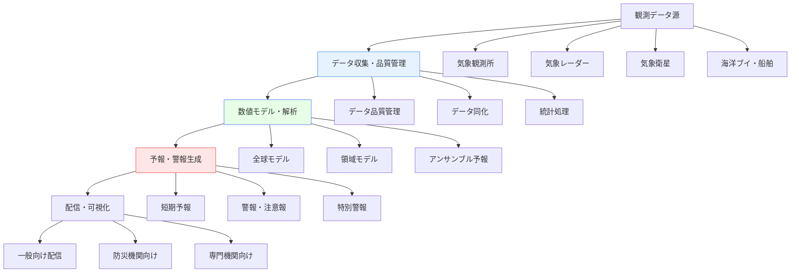
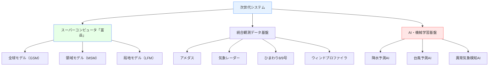

# 気象関連ソフトウェア

!!! info "このページについて"
    このページでは、気象分野で使用される状況認識支援ソフトウェアについて詳しく解説します。数値気象予報システムから観測・監視システム、気象情報配信、災害警報まで、気象現象の理解と予測、緊急時の意思決定を支える様々なソフトウェアソリューションを紹介します。

## 気象ソフトウェアの特徴

気象・防災分野のソフトウェアは、極めて高いリアルタイム性・正確性・冗長性・データ統合性が求められます。以下はその主要要件と技術的背景、メリットです。

| 要件 | 説明 | 技術背景・実装 | 具体例・メリット |
|---|---|---|---|
| 高頻度データ処理 | 分単位～秒単位で大量の観測・予測データをリアルタイムに処理 | ストリーミング処理（Kafka, Spark Streaming等）、分散並列処理（HPC/クラウド）、インメモリDB | レーダー5分更新解析で降水急変や竜巻を即検知、避難判断時間を大幅確保 |
| 予測精度 | 物理モデル・統計解析・AIを組み合わせ高精度予測 | 数値気象モデル（GSM, IFS等）、アンサンブル予報、深層学習後処理 | 台風進路や豪雨の精度向上で計画的な避難・減災対策が可能に |
| 24時間監視 | 365日24時間の連続監視・自動運用 | システム冗長化、監視自動化（監視エージェント）、障害自動復旧 | 夜間の突発災害も自動で警報発出、ダウンタイム最小化 |
| 多様なデータ統合 | 衛星・レーダー・地上・船舶・航空機等、多様な観測データを統合処理 | データフュージョン、品質管理（QC）、標準フォーマット（NetCDF, BUFR等） | 複数観測の融合で局地現象を高精度に監視、盲点の低減 |

### システムアーキテクチャ

下図は気象ソフトウェアにおける情報処理の全体像です。各要素の役割を簡潔に説明します。

#### 気象データ処理の統合システム



#### 各要素の役割

| 構成 | 役割 | 実例 |
|---|---|---|
| 観測データ源 | 地上・レーダー・衛星・船舶・航空機など多様な観測データの取得 | アメダス、気象レーダー、ひまわり衛星、ブイ観測 |
| データ収集・品質管理 | データの自動収集・異常値検出・欠測補完・同化（解析への統合） | QC処理、データ同化、統計的補正 |
| 数値モデル・解析 | 物理モデルやAIで大気の未来を計算（全球・領域・アンサンブル） | GSM, MSM, IFS, WRF, アンサンブル予報 |
| 予報・警報生成 | 解析結果から自動で予報文・警報を作成、専門家による最終チェックも | 台風進路予測、豪雨警報、短期/長期予報 |
| 配信・可視化 | 一般・防災・専門機関向けに情報配信・可視化 | 天気アプリ、防災行政、農業・エネルギー向けAPI |

## 数値気象予報システム

### 全球気象予報モデル

#### ECMWF IFS（統合予報システム）

| 機能 | 説明 | 技術仕様・強み |
|---|---|---|
| 全球数値予報 | 世界最高レベルの中期（3～10日）予報精度を誇る物理モデル | 水平解像度9km、予報期間15日、詳細な大気・海洋・陸面結合モデル |
| アンサンブル予報 | 51メンバーによる確率的予報で不確実性や極端現象を定量化 | 台風進路や豪雨の発生確率推定が可能 |
| 季節予報 | 1ヶ月～1年先の気候傾向予報 | 海洋・雪氷結合、長期変動も考慮 |
| データ同化 | 4次元変分法（4D-Var）など高度な観測データ統合 | 観測網の情報を最大限活用し初期値精度を向上 |

##### 技術的背景・メリット・導入例

| ポイント | 内容 |
|---|---|
| 台風進路予測 | IFSは台風進路・強度予測に強み。アンサンブルで進路幅や不確実性も算出し、航空・海運・防災で活用 |
| アンサンブル予報 | 予測のばらつきを確率化し、「極端現象の発生リスク」を数値で提供。意思決定の根拠強化 |
| 国際比較 | 気象庁GSM・米国GFS等と定期比較され、WMOの基準モデルでもある |
| 導入事例 | 気象庁週間予報、国際航空・船舶運航、欧州各国の防災計画など |

??? TypeScript実装例
    この TypeScript 実装では、ECMWF IFS のデータを取得し、解析を行っています。
    グリッドデータのダウンロード、台風進路予測、確率分布の計算などを通じて、気象予報の精度向上を目指しています。

    ```typescript
    // ECMWF APIクライアントの実装例
    interface ECMWFGribData {
      date: string;
      time: string;
      step: string;
      levtype: string;
      param: string;
      area?: number[]; // North/West/South/East
      grid?: number[]; // lat/lon resolution
    }

    class ECMWFClient {
      private readonly baseUrl = 'https://api.ecmwf.int/v1';
      private apiKey: string;

      constructor(apiKey: string) {
        this.apiKey = apiKey;
      }

      async retrieveForecast(request: ECMWFGribData): Promise<ArrayBuffer> {
        const response = await fetch(`${this.baseUrl}/services/mars/requests`, {
          method: 'POST',
          headers: {
            'Authorization': `Bearer ${this.apiKey}`,
            'Content-Type': 'application/json'
          },
          body: JSON.stringify({
            class: 'od',
            type: 'fc',
            stream: 'oper',
            ...request
          })
        });

        if (!response.ok) {
          throw new Error(`ECMWF API error: ${response.statusText}`);
        }

        return response.arrayBuffer();
      }

      // アンサンブル予報データの取得
      async getEnsembleForecast(
        parameter: string,
        date: Date,
        area: [number, number, number, number] // N/W/S/E
      ): Promise<EnsembleForecast> {
        const ensembleMembers: ForecastData[] = [];
        
        // 51メンバーのアンサンブル予報を取得
        for (let member = 0; member <= 50; member++) {
          const gribData = await this.retrieveForecast({
            date: date.toISOString().split('T')[0],
            time: '00',
            step: '24/to/240/by/24',
            levtype: 'sfc',
            param: parameter,
            area,
            grid: [0.1, 0.1], // 0.1度格子
            number: member.toString()
          });

          ensembleMembers.push(await this.parseGribData(gribData));
        }

        return this.calculateEnsembleStatistics(ensembleMembers);
      }

      private async parseGribData(gribBuffer: ArrayBuffer): Promise<ForecastData> {
        // GRIB2データの解析
        const decoder = new GribDecoder();
        return decoder.decode(gribBuffer);
      }

      // アンサンブル統計の計算
      private calculateEnsembleStatistics(members: ForecastData[]): EnsembleForecast {
        const gridPoints = members[0].values.length;
        const mean = new Float32Array(gridPoints);
        const std = new Float32Array(gridPoints);
        const probability = new Float32Array(gridPoints);

        // 各格子点での統計計算
        for (let i = 0; i < gridPoints; i++) {
          const values = members.map(m => m.values[i]);
          
          // 平均
          mean[i] = values.reduce((sum, v) => sum + v, 0) / values.length;
          
          // 標準偏差
          const variance = values.reduce((sum, v) => sum + Math.pow(v - mean[i], 2), 0) / values.length;
          std[i] = Math.sqrt(variance);
          
          // 閾値を超える確率（例：降水1mm以上）
          probability[i] = values.filter(v => v >= 1.0).length / values.length;
        }

        return {
          ensembleMean: mean,
          ensembleSpread: std,
          probability,
          members: members.length
        };
      }
    }

    interface ForecastData {
      values: Float32Array;
      metadata: {
        parameter: string;
        level: number;
        validTime: Date;
        grid: { lat: number[], lon: number[] };
      };
    }

    interface EnsembleForecast {
      ensembleMean: Float32Array;
      ensembleSpread: Float32Array;
      probability: Float32Array;
      members: number;
    }

    // 台風進路予測システム
    class TyphoonTrackForecast {
      private models: Map<string, WeatherModel> = new Map();

      constructor() {
        this.models.set('ECMWF', new ECMWFModel());
        this.models.set('GFS', new GFSModel());
        this.models.set('JMA', new JMAModel());
      }

      // 複数モデルによる台風進路予測
      async predictTyphoonTrack(
        typhoonId: string,
        currentPosition: { lat: number; lon: number },
        forecastHours: number = 120
      ): Promise<TyphoonForecast[]> {
        const forecasts: TyphoonForecast[] = [];

        for (const [modelName, model] of this.models) {
          try {
            const trackForecast = await model.getTyphoonTrack(
              typhoonId,
              currentPosition,
              forecastHours
            );

            forecasts.push({
              model: modelName,
              track: trackForecast,
              confidence: this.calculateConfidence(trackForecast),
              lastUpdate: new Date()
            });
          } catch (error) {
            console.error(`Failed to get forecast from ${modelName}:`, error);
          }
        }

        return this.generateConsensusTrack(forecasts);
      }

      // コンセンサス進路の生成
      private generateConsensusTrack(forecasts: TyphoonForecast[]): TyphoonForecast[] {
        if (forecasts.length === 0) return [];

        const forecastHours = forecasts[0].track.length;
        const consensusTrack: TyphoonTrackPoint[] = [];

        // 各予報時刻でのコンセンサス計算
        for (let i = 0; i < forecastHours; i++) {
          const positions = forecasts.map(f => f.track[i]).filter(p => p);
          
          if (positions.length > 0) {
            const avgLat = positions.reduce((sum, p) => sum + p.latitude, 0) / positions.length;
            const avgLon = positions.reduce((sum, p) => sum + p.longitude, 0) / positions.length;
            const avgPressure = positions.reduce((sum, p) => sum + p.centralPressure, 0) / positions.length;

            consensusTrack.push({
              time: positions[0].time,
              latitude: avgLat,
              longitude: avgLon,
              centralPressure: avgPressure,
              maxWindSpeed: Math.max(...positions.map(p => p.maxWindSpeed)),
              uncertainty: this.calculatePositionUncertainty(positions)
            });
          }
        }

        return [{
          model: 'CONSENSUS',
          track: consensusTrack,
          confidence: this.calculateEnsembleConfidence(forecasts),
          lastUpdate: new Date()
        }];
      }

      private calculatePositionUncertainty(positions: TyphoonTrackPoint[]): number {
        if (positions.length < 2) return 0;

        // 標準偏差を計算（km単位）
        const avgLat = positions.reduce((sum, p) => sum + p.latitude, 0) / positions.length;
        const avgLon = positions.reduce((sum, p) => sum + p.longitude, 0) / positions.length;

        const distances = positions.map(p => 
          this.calculateDistance(avgLat, avgLon, p.latitude, p.longitude)
        );

        const variance = distances.reduce((sum, d) => sum + d * d, 0) / distances.length;
        return Math.sqrt(variance);
      }

      private calculateDistance(lat1: number, lon1: number, lat2: number, lon2: number): number {
        const R = 6371; // 地球の半径 (km)
        const dLat = (lat2 - lat1) * Math.PI / 180;
        const dLon = (lon2 - lon1) * Math.PI / 180;
        const a = Math.sin(dLat/2) * Math.sin(dLat/2) +
                  Math.cos(lat1 * Math.PI / 180) * Math.cos(lat2 * Math.PI / 180) *
                  Math.sin(dLon/2) * Math.sin(dLon/2);
        const c = 2 * Math.atan2(Math.sqrt(a), Math.sqrt(1-a));
        return R * c;
      }
    }

    interface TyphoonTrackPoint {
      time: Date;
      latitude: number;
      longitude: number;
      centralPressure: number; // hPa
      maxWindSpeed: number; // m/s
      uncertainty?: number; // km
    }

    interface TyphoonForecast {
      model: string;
      track: TyphoonTrackPoint[];
      confidence: number;
      lastUpdate: Date;
    }
    ```

#### JMA-GSM（全球スペクトルモデル）

| 機能 | 説明 | 技術的特徴・強み |
|---|---|---|
| 日本域詳細予報 | 日本・アジア太平洋域向けに高解像度で予報 | 水平解像度20km、日本付近の地形・海岸線を詳細に反映 |
| 台風予報 | 西太平洋～日本への台風進路・強度予測に特化 | 日本特有の気象現象（梅雨・冬型）にも最適化 |
| 季節・梅雨予報 | 東アジアの季節現象や梅雨前線位置を高精度予測 | 地域特有の現象に強い |

##### 技術的背景・メリット・導入例

| ポイント | 内容 |
|---|---|
| 精度 | 日本周辺の予報精度が極めて高い。地形・海岸線・局地現象に強い |
| 台風・豪雨対策 | 台風進路予測・警報発表の基礎。自治体の避難判断や防災計画に不可欠 |
| 比較 | ECMWF IFSと比較しつつ、日本域の詳細予報や短期警報に最適化 |
| 導入事例 | 気象庁の府県予報、警報・注意報、台風情報、消防・自治体の判断支援 |

### 領域気象予報モデル

#### WRF（Weather Research and Forecasting Model）

| 用途 | 技術的特徴 | 導入事例 |
|---|---|---|
| 研究・民間・自治体の局地気象予報 | オープンソースで領域・物理過程を柔軟に設定可。高解像度（1km以下）で都市・山岳・沿岸など細密な予報が可能 | 大学の都市気象・山岳気象研究、風力発電サイトの風況予測、自治体の局地豪雨・土砂災害対策 |

##### 技術背景・強み
- 多様な物理・地表面スキームを選択できるため、都市・農業・災害・エネルギーなど分野ごとに最適化が可能
- 世界中の研究機関・民間気象会社で広く導入
- アンサンブルやAIと組み合わせた高度な予報も実装可能

??? TypeScript実装例
    この TypeScript 実装では、WRF（Weather Research and Forecasting Model）の設定生成と実行管理を行います。
    各地域の高解像度な天気予報のシミュレーションを可能にし、都市・農業・防災向けの精密な気象データを提供します。

    ```typescript
    // WRF設定ファイルの生成と実行管理
    interface WRFNamelist {
      timeDomain: {
        startYear: number;
        startMonth: number;
        startDay: number;
        startHour: number;
        endYear: number;
        endMonth: number;
        endDay: number;
        endHour: number;
        intervalSeconds: number;
      };
      domains: WRFDomain[];
      physics: WRFPhysics;
      dynamics: WRFDynamics;
    }

    interface WRFDomain {
      id: number;
      parentId: number;
      parentRatio: number;
      iParentStart: number;
      jParentStart: number;
      eWE: number; // x方向の格子数
      eSN: number; // y方向の格子数
      eVert: number; // 鉛直方向の格子数
      dx: number; // x方向の格子間隔 (m)
      dy: number; // y方向の格子間隔 (m)
      mapProj: string; // 地図投影法
      refLat: number;
      refLon: number;
      truelat1: number;
      truelat2: number;
      standLon: number;
    }

    interface WRFPhysics {
      microphysics: number; // 雲物理過程
      convection: number; // 積雲対流パラメタリゼーション
      pbl: number; // 境界層スキーム
      surface: number; // 地表面スキーム
      radiation: {
        longwave: number;
        shortwave: number;
      };
    }

    interface WRFDynamics {
      timeStep: number; // 積分時間間隔
      epssm: number; // 数値安定化フィルター強度
      nonHydrostatic: boolean; // 非静力学近似
      moistAdv: number; // 水蒸気移流スキーム
    }

    class WRFModelManager {
      private configPath: string;
      private workingDirectory: string;
      private isRunning: boolean = false;

      constructor(workingDir: string) {
        this.workingDirectory = workingDir;
        this.configPath = `${workingDir}/namelist.wps`;
      }

      // WPS（前処理）の設定生成
      generateWPSNamelist(domain: WRFDomain, startDate: Date, endDate: Date): string {
        const namelistContent = `
    &share
    wrf_core = 'ARW',
    max_dom = 1,
    start_date = '${this.formatDate(startDate)}',
    end_date = '${this.formatDate(endDate)}',
    interval_seconds = 21600,
    io_form_geogrid = 2,
    /

    &geogrid
    parent_id = 1,
    parent_grid_ratio = 1,
    i_parent_start = 1,
    j_parent_start = 1,
    e_we = ${domain.eWE},
    e_sn = ${domain.eSN},
    dx = ${domain.dx},
    dy = ${domain.dy},
    map_proj = '${domain.mapProj}',
    ref_lat = ${domain.refLat},
    ref_lon = ${domain.refLon},
    truelat1 = ${domain.truelat1},
    truelat2 = ${domain.truelat2},
    stand_lon = ${domain.standLon},
    geog_data_path = '/path/to/geog/'
    /

    &ungrib
    out_format = 'WPS',
    prefix = 'FILE',
    /

    &metgrid
    fg_name = 'FILE',
    io_form_metgrid = 2,
    /
        `.trim();

        return namelistContent;
      }

      // WRF本体の設定生成（詳細な物理過程設定）
      generateWRFNamelist(config: WRFNamelist): string {
        const startDate = new Date(
          config.timeDomain.startYear,
          config.timeDomain.startMonth - 1,
          config.timeDomain.startDay,
          config.timeDomain.startHour
        );
        const endDate = new Date(
          config.timeDomain.endYear,
          config.timeDomain.endMonth - 1,
          config.timeDomain.endDay,
          config.timeDomain.endHour
        );

        const runHours = Math.ceil((endDate.getTime() - startDate.getTime()) / (1000 * 60 * 60));

        const namelistContent = `
    &time_control
    run_days = 0,
    run_hours = ${runHours},
    run_minutes = 0,
    run_seconds = 0,
    start_year = ${config.timeDomain.startYear},
    start_month = ${config.timeDomain.startMonth},
    start_day = ${config.timeDomain.startDay},
    start_hour = ${config.timeDomain.startHour},
    start_minute = 0,
    start_second = 0,
    end_year = ${config.timeDomain.endYear},
    end_month = ${config.timeDomain.endMonth},
    end_day = ${config.timeDomain.endDay},
    end_hour = ${config.timeDomain.endHour},
    end_minute = 0,
    end_second = 0,
    interval_seconds = ${config.timeDomain.intervalSeconds},
    input_from_file = .true.,
    history_interval = 60,
    frames_per_outfile = 1,
    restart = .false.,
    restart_interval = 5000,
    io_form_history = 2,
    io_form_restart = 2,
    io_form_input = 2,
    io_form_boundary = 2,
    debug_level = 0,
    /

    &domains
    time_step = ${config.dynamics.timeStep},
    time_step_fract_num = 0,
    time_step_fract_den = 1,
    max_dom = ${config.domains.length},
    e_we = ${config.domains.map(d => d.eWE).join(', ')},
    e_sn = ${config.domains.map(d => d.eSN).join(', ')},
    e_vert = ${config.domains.map(d => d.eVert).join(', ')},
    p_top_requested = 5000,
    num_metgrid_levels = 40,
    num_metgrid_soil_levels = 4,
    dx = ${config.domains.map(d => d.dx).join(', ')},
    dy = ${config.domains.map(d => d.dy).join(', ')},
    grid_id = ${config.domains.map(d => d.id).join(', ')},
    parent_id = ${config.domains.map(d => d.parentId).join(', ')},
    i_parent_start = ${config.domains.map(d => d.iParentStart).join(', ')},
    j_parent_start = ${config.domains.map(d => d.jParentStart).join(', ')},
    parent_grid_ratio = ${config.domains.map(d => d.parentRatio).join(', ')},
    parent_time_step_ratio = ${config.domains.map(d => d.parentRatio).join(', ')},
    feedback = 1,
    smooth_option = 0,
    /

    &physics
    mp_physics = ${config.physics.microphysics},
    ra_lw_physics = ${config.physics.radiation.longwave},
    ra_sw_physics = ${config.physics.radiation.shortwave},
    radt = 30,
    sf_sfclay_physics = 1,
    sf_surface_physics = ${config.physics.surface},
    bl_pbl_physics = ${config.physics.pbl},
    bldt = 0,
    cu_physics = ${config.physics.convection},
    cudt = 5,
    isfflx = 1,
    ifsnow = 1,
    icloud = 1,
    surface_input_source = 1,
    num_soil_layers = 4,
    sf_urban_physics = 0,
    /

    &fdda
    /

    &dynamics
    w_damping = 0,
    diff_opt = 1,
    km_opt = 4,
    diff_6th_opt = 0,
    diff_6th_factor = 0.12,
    base_temp = 290.,
    damp_opt = 0,
    zdamp = 5000.,
    dampcoef = 0.2,
    khdif = 0,
    kvdif = 0,
    non_hydrostatic = ${config.dynamics.nonHydrostatic ? '.true.' : '.false.'},
    moist_adv_opt = ${config.dynamics.moistAdv},
    scalar_adv_opt = 1,
    /

    &bdy_control
    spec_bdy_width = 5,
    spec_zone = 1,
    relax_zone = 4,
    specified = .true.,
    nested = .false.,
    /

    &grib2
    /

    &namelist_quilt
    nio_tasks_per_group = 0,
    nio_groups = 1,
    /
        `.trim();

        return namelistContent;
      }

      // WRF実行の管理
      async runWRF(namelist: WRFNamelist): Promise<WRFRunResult> {
        if (this.isRunning) {
          throw new Error('WRF is already running');
        }

        this.isRunning = true;

        try {
          // 設定ファイル出力
          await this.writeNamelistFile(namelist);

          // 前処理実行（WPS）
          await this.executeCommand('geogrid.exe');
          await this.executeCommand('ungrib.exe');
          await this.executeCommand('metgrid.exe');

          // 初期化・境界条件生成
          await this.executeCommand('real.exe');

          // WRF本体実行
          const startTime = Date.now();
          await this.executeCommand('wrf.exe');
          const endTime = Date.now();

          // 結果ファイルの確認
          const outputFiles = await this.checkOutputFiles();

          return {
            success: true,
            executionTimeMs: endTime - startTime,
            outputFiles,
            logFiles: await this.getLogFiles()
          };

        } catch (error) {
          return {
            success: false,
            error: error.message,
            logFiles: await this.getLogFiles()
          };
        } finally {
          this.isRunning = false;
        }
      }

      // 結果データの解析
      async analyzeResults(outputFile: string): Promise<WRFAnalysisResult> {
        // NetCDFファイルの読み込み
        const netcdfData = await this.readNetCDF(outputFile);

        // 基本統計量の計算
        const precipitation = netcdfData.variables['RAINC'].add(netcdfData.variables['RAINNC']);
        const temperature = netcdfData.variables['T2'].subtract(273.15); // K → ℃
        const windU = netcdfData.variables['U10'];
        const windV = netcdfData.variables['V10'];

        // 最大・最小値の計算
        const maxPrecip = precipitation.max();
        const minTemp = temperature.min();
        const maxTemp = temperature.max();
        const maxWind = windU.pow(2).add(windV.pow(2)).sqrt().max();

        // 予報検証指標の計算
        const verification = await this.calculateVerificationScores(netcdfData);

        return {
          timeRange: {
            start: netcdfData.dimensions.Time.start,
            end: netcdfData.dimensions.Time.end
          },
          statistics: {
            precipitation: {
              max: maxPrecip,
              total: precipitation.sum(),
              mean: precipitation.mean()
            },
            temperature: {
              min: minTemp,
              max: maxTemp,
              mean: temperature.mean()
            },
            wind: {
              max: maxWind,
              mean: windU.pow(2).add(windV.pow(2)).sqrt().mean()
            }
          },
          verification,
          gridInfo: {
            dimensions: netcdfData.dimensions,
            resolution: {
              dx: netcdfData.globalAttributes.DX,
              dy: netcdfData.globalAttributes.DY
            }
          }
        };
      }

      private formatDate(date: Date): string {
        return date.toISOString().replace(/[-:]/g, '').split('.')[0];
      }

      private async executeCommand(command: string): Promise<void> {
        return new Promise((resolve, reject) => {
          const { exec } = require('child_process');
          const process = exec(
            command,
            { cwd: this.workingDirectory },
            (error, stdout, stderr) => {
              if (error) {
                reject(new Error(`Command failed: ${error.message}`));
              } else {
                resolve();
              }
            }
          );

          // リアルタイム進捗監視
          process.stdout.on('data', (data) => {
            console.log(`[${command}] ${data}`);
          });

          process.stderr.on('data', (data) => {
            console.error(`[${command}] ERROR: ${data}`);
          });
        });
      }
    }

    interface WRFRunResult {
      success: boolean;
      executionTimeMs?: number;
      outputFiles?: string[];
      logFiles?: string[];
      error?: string;
    }

    interface WRFAnalysisResult {
      timeRange: {
        start: Date;
        end: Date;
      };
      statistics: {
        precipitation: {
          max: number;
          total: number;
          mean: number;
        };
        temperature: {
          min: number;
          max: number;
          mean: number;
        };
        wind: {
          max: number;
          mean: number;
        };
      };
      verification: VerificationScores;
      gridInfo: {
        dimensions: any;
        resolution: {
          dx: number;
          dy: number;
        };
      };
    }

    interface VerificationScores {
      bias: number;
      rmse: number;
      correlation: number;
      threat: number; // Threat Score
      ets: number; // Equitable Threat Score
    }
    ```

## 観測・監視システム

### 地上気象観測システム

#### AMeDAS（地域気象観測システム）

| 機能 | 説明・技術的特徴 | 導入例・メリット |
|---|---|---|
| 自動気象観測 | 全国約1,300地点で無人観測・10分毎データ・即時伝送 | 高密度網で局地気象も把握・災害監視に強み |
| 品質管理 | 異常値自動検出・時空間一貫性チェック・欠測補完 | 高信頼な観測データを安定供給 |
| データ配信 | XML/CSV/バイナリ等でリアルタイム配信 | 天気予報・防災・農業・電力分野で活用 |

##### MeDASの強み
・高密度・高頻度観測で局地的な豪雨や気温変化も迅速検知  
・自動品質管理により常に信頼性の高いデータを提供  
・防災本部・農業・産業の判断材料として不可欠

### 気象レーダーシステム

#### 気象レーダーネットワーク

| 用途 | 技術的強み | 導入事例 |
|---|---|---|
| 降水・竜巻・突風監視、短時間予報 | 5分毎の高頻度観測・高解像度反射強度・ドップラー風速・多パラメータ化 | 降水ナウキャスト、河川洪水警報、自治体避難判断、空港運航判断 |

##### 技術背景

- 反射強度・ドップラー風速・偏波情報で降水量や竜巻・ダウンバーストもリアルタイム検知  
- 全国ネットワークで局地現象も見逃さず、洪水・突風災害の早期警報を実現

??? TypeScript実装例
    この TypeScript 実装では、気象レーダーデータの収集と解析を行います。
    降水分布や風速の計測、竜巻やメソサイクロンの検出をリアルタイムで行い、災害警報を発信する機能を持っています。

    ```typescript
    // 気象レーダーデータ処理システム
    interface RadarScan {
      elevation: number; // 仰角
      azimuth: number[]; // 方位角配列
      range: number[]; // 距離配列
      reflectivity: number[][]; // 反射強度 (dBZ)
      velocity: number[][]; // ドップラー速度 (m/s)
      spectrumWidth: number[][]; // スペクトル幅
      timestamp: Date;
      radarId: string;
    }

    interface RadarVolume {
      scans: RadarScan[];
      radarLocation: {
        latitude: number;
        longitude: number;
        altitude: number;
      };
      volumeTimestamp: Date;
    }

    class WeatherRadarProcessor {
      private readonly REFLECTIVITY_THRESHOLD = 15; // dBZ
      private readonly VELOCITY_THRESHOLD = 15; // m/s

      // レーダーボリュームデータの処理
      processRadarVolume(volume: RadarVolume): RadarProducts {
        const products: RadarProducts = {
          ppi: this.generatePPI(volume.scans),
          cappi: this.generateCAPPI(volume.scans),
          precipitation: this.estimatePrecipitation(volume.scans),
          windShear: this.detectWindShear(volume.scans),
          mesocyclone: this.detectMesocyclone(volume.scans),
          tornado: this.detectTornadoVortexSignature(volume.scans)
        };

        return products;
      }

      // PPI（Plan Position Indicator）生成
      private generatePPI(scans: RadarScan[]): PPIProduct[] {
        return scans.map(scan => ({
          elevation: scan.elevation,
          timestamp: scan.timestamp,
          reflectivityField: this.interpolateRadialData(
            scan.azimuth,
            scan.range,
            scan.reflectivity
          ),
          velocityField: this.interpolateRadialData(
            scan.azimuth,
            scan.range,
            scan.velocity
          )
        }));
      }

      // CAPPI（Constant Altitude PPI）生成
      private generateCAPPI(scans: RadarScan[]): CAPPIProduct[] {
        const altitudes = [1000, 2000, 3000, 5000]; // 高度 (m)
        const cappiProducts: CAPPIProduct[] = [];

        for (const altitude of altitudes) {
          const cappiData = this.extractConstantAltitude(scans, altitude);
          cappiProducts.push({
            altitude,
            reflectivityField: cappiData.reflectivity,
            velocityField: cappiData.velocity,
            coverage: cappiData.coverage
          });
        }

        return cappiProducts;
      }

      // 定量的降水量推定
      private estimatePrecipitation(scans: RadarScan[]): PrecipitationProduct {
        const surfaceScan = scans.find(s => s.elevation === 0.5) || scans[0];
        const rainRate = this.reflectivityToRainRate(surfaceScan.reflectivity);
        
        // 雨粒粒径分布補正
        const correctedRainRate = this.correctDropSizeDistribution(rainRate);
        
        // 地形クラッター除去
        const filteredRainRate = this.removeGroundClutter(correctedRainRate, surfaceScan);

        return {
          instantaneousRainRate: filteredRainRate,
          accumulatedPrecipitation: this.calculateAccumulation(filteredRainRate),
          qualityIndex: this.calculateQualityIndex(surfaceScan),
          timestamp: surfaceScan.timestamp
        };
      }

      // Z-R関係式による降水量推定
      private reflectivityToRainRate(reflectivity: number[][]): number[][] {
        return reflectivity.map(row =>
          row.map(z => {
            if (z < this.REFLECTIVITY_THRESHOLD) return 0;
            // Z = aR^b (a=200, b=1.6)
            const linearZ = Math.pow(10, z / 10);
            return Math.pow(linearZ / 200, 1 / 1.6);
          })
        );
      }

      // 風のシアー検出（ダウンバースト検出）
      private detectWindShear(scans: RadarScan[]): WindShearProduct[] {
        const products: WindShearProduct[] = [];
        
        for (const scan of scans) {
          const windShearAreas = this.identifyDivergenceConvergence(scan);
          
          for (const area of windShearAreas) {
            const shearValue = this.calculateWindShearMagnitude(area);
            
            if (shearValue > 20) { // 20 m/s のシアー
              products.push({
                location: area.center,
                intensity: shearValue,
                type: area.type, // 'convergence' | 'divergence'
                areaKm2: area.areaKm2,
                confidence: this.calculateShearConfidence(area),
                elevation: scan.elevation,
                timestamp: scan.timestamp
              });
            }
          }
        }

        return products;
      }

      // メソサイクロン検出
      private detectMesocyclone(scans: RadarScan[]): MesocycloneProduct[] {
        const products: MesocycloneProduct[] = [];

        for (const scan of scans) {
          const vortexCandidates = this.findVortexSignatures(scan);
          
          for (const candidate of vortexCandidates) {
            const rotationalVelocity = this.calculateRotationalVelocity(candidate);
            const shear = this.calculateRadialShear(candidate);
            
            // メソサイクロン判定基準
            if (rotationalVelocity > 15 && shear > 10e-3) {
              products.push({
                location: candidate.center,
                rotationalVelocity,
                shear,
                diameter: candidate.diameterKm,
                depth: this.calculateVerticalExtent(scans, candidate),
                strength: this.categorizeMesocyclone(rotationalVelocity, shear),
                elevation: scan.elevation,
                timestamp: scan.timestamp
              });
            }
          }
        }

        return products;
      }

      // 竜巻渦シグネチャ（TVS）検出
      private detectTornadoVortexSignature(scans: RadarScan[]): TornadoProduct[] {
        const products: TornadoProduct[] = [];

        for (const scan of scans) {
          if (scan.elevation > 1.0) continue; // 低仰角のみ

          const tvsSignatures = this.findTVSSignatures(scan);
          
          for (const signature of tvsSignatures) {
            const deltaV = this.calculateVelocityDifference(signature);
            const distance = this.calculateSignatureDistance(signature);
            
            // TVS判定基準（δV > 30 m/s, 距離 < 2km）
            if (deltaV > 30 && distance < 2) {
              products.push({
                location: signature.center,
                velocityDifference: deltaV,
                distance,
                rotationalVelocity: deltaV / 2,
                lowLevelConvergence: this.checkConvergence(signature),
                associatedMesocyclone: this.findAssociatedMesocyclone(signature, products),
                probability: this.calculateTornadoProbability(deltaV, distance),
                timestamp: scan.timestamp
              });
            }
          }
        }

        return products;
      }

      // リアルタイムアラート生成
      generateRealTimeAlerts(products: RadarProducts): WeatherAlert[] {
        const alerts: WeatherAlert[] = [];

        // 大雨アラート
        const heavyRain = products.precipitation.instantaneousRainRate.flat()
          .find(rate => rate > 50); // 50mm/h以上
        if (heavyRain) {
          alerts.push({
            type: 'HEAVY_RAINFALL',
            severity: 'HIGH',
            message: `Heavy rainfall detected: ${heavyRain.toFixed(1)}mm/h`,
            validUntil: new Date(Date.now() + 30 * 60 * 1000) // 30分有効
          });
        }

        // 竜巻アラート
        if (products.tornado.length > 0) {
          const tornado = products.tornado[0];
          alerts.push({
            type: 'TORNADO_WARNING',
            severity: 'CRITICAL',
            message: `Tornado signature detected at ${tornado.location.latitude.toFixed(3)}, ${tornado.location.longitude.toFixed(3)}`,
            validUntil: new Date(Date.now() + 15 * 60 * 1000) // 15分有効
          });
        }

        // ダウンバーストアラート
        const strongWindShear = products.windShear.find(ws => ws.intensity > 30);
        if (strongWindShear) {
          alerts.push({
            type: 'DOWNBURST_WARNING',
            severity: 'HIGH',
            message: `Strong wind shear detected: ${strongWindShear.intensity.toFixed(1)}m/s`,
            validUntil: new Date(Date.now() + 20 * 60 * 1000) // 20分有効
          });
        }

        return alerts;
      }
    }

    interface RadarProducts {
      ppi: PPIProduct[];
      cappi: CAPPIProduct[];
      precipitation: PrecipitationProduct;
      windShear: WindShearProduct[];
      mesocyclone: MesocycloneProduct[];
      tornado: TornadoProduct[];
    }

    interface PrecipitationProduct {
      instantaneousRainRate: number[][];
      accumulatedPrecipitation: number[][];
      qualityIndex: number[][];
      timestamp: Date;
    }

    interface WindShearProduct {
      location: { latitude: number; longitude: number };
      intensity: number; // m/s
      type: 'convergence' | 'divergence';
      areaKm2: number;
      confidence: number;
      elevation: number;
      timestamp: Date;
    }

    interface MesocycloneProduct {
      location: { latitude: number; longitude: number };
      rotationalVelocity: number; // m/s
      shear: number; // s^-1
      diameter: number; // km
      depth: number; // km
      strength: 'WEAK' | 'MODERATE' | 'STRONG';
      elevation: number;
      timestamp: Date;
    }

    interface TornadoProduct {
      location: { latitude: number; longitude: number };
      velocityDifference: number; // m/s
      distance: number; // km
      rotationalVelocity: number; // m/s
      lowLevelConvergence: boolean;
      associatedMesocyclone?: MesocycloneProduct;
      probability: number; // 0-1
      timestamp: Date;
    }

    interface WeatherAlert {
      type: 'HEAVY_RAINFALL' | 'TORNADO_WARNING' | 'DOWNBURST_WARNING';
      severity: 'LOW' | 'MEDIUM' | 'HIGH' | 'CRITICAL';
      message: string;
      validUntil: Date;
    }
    ```

### 気象衛星システム

#### ひまわり8号・9号（気象衛星）

| 用途 | 技術的強み | 導入事例 |
|---|---|---|
| 広域雲・降水監視、台風解析、火山・海洋監視 | 2.5分間隔の高頻度観測、16バンド多スペクトルで雲・水蒸気・地表面を詳細把握 | 降水短時間予報、台風進路強度解析、火山噴火監視、農業の日射量推定 |

##### 技術背景
- ひまわり8号は東アジア域で世界最高水準の観測頻度・解像度  
- 急発達する積乱雲や台風の中心も高精度でトラッキング可能

## 予報・警報配信システム

### 気象警報システム

#### 特別警報・警報・注意報

| システム | 役割 | 技術的背景 | 効果・用途 |
|---|---|---|---|
| 警報・注意報システム | 数値予報・観測データをもとに自動で地域ごとに警報・注意報を発表 | 閾値判定・段階的警報発表・自動配信（CAP/XML/多言語） | 住民・自治体への早期注意喚起、避難準備・減災 |
| 特別警報システム | 数十年に一度の極端災害リスクを複合判定で自動通知 | 過去統計比較・複数要素自動判定 | 超大型災害の人的被害最小化 |
| 緊急地震速報連携 | 地震・津波と気象災害の統合警報を一元配信 | マルチハザード統合・優先度制御 | 複合災害時の適切な避難誘導・混乱防止 |


??? TypeScript実装例
    この TypeScript 実装では、気象警報システムを実装しています。
    台風、豪雨、洪水、竜巻などの気象災害の検知とリアルタイム警報を生成し、緊急時の避難判断を支援します。

    ```typescript
    // 気象警報システムの実装
    interface WeatherWarning {
      id: string;
      type: WarningType;
      level: WarningLevel;
      targetArea: GeographicArea;
      phenomenon: WeatherPhenomenon;
      criteria: WarningCriteria;
      validPeriod: {
        start: Date;
        end: Date;
      };
      issuedAt: Date;
      updatedAt?: Date;
      cancelledAt?: Date;
      message: string;
      supplement?: string;
    }

    enum WarningType {
      SPECIAL_WARNING = 'special_warning',
      WARNING = 'warning',
      ADVISORY = 'advisory',
      FORECAST = 'forecast'
    }

    enum WarningLevel {
      EMERGENCY = 5,  // 特別警報
      SEVERE = 4,     // 警報
      MODERATE = 3,   // 注意報
      MINOR = 2,      // 予報
      INFO = 1        // 情報
    }

    enum WeatherPhenomenon {
      HEAVY_RAIN = 'heavy_rain',
      HEAVY_SNOW = 'heavy_snow',
      STRONG_WIND = 'strong_wind',
      STORM_SURGE = 'storm_surge',
      HIGH_WAVES = 'high_waves',
      THUNDERSTORM = 'thunderstorm',
      TORNADO = 'tornado',
      FLOODING = 'flooding',
      LANDSLIDE = 'landslide'
    }

    class WeatherWarningSystem {
      private forecastModels: Map<string, ForecastModel> = new Map();
      private observationNetwork: ObservationNetwork;
      private warningCriteria: Map<string, WarningCriteriaSet> = new Map();
      private activeWarnings: Map<string, WeatherWarning> = new Map();

      constructor() {
        this.setupWarningCriteria();
        this.observationNetwork = new ObservationNetwork();
      }

      // 警報発表基準の設定
      private setupWarningCriteria(): void {
        // 大雨警報基準（例：東京都）
        this.warningCriteria.set('tokyo_heavy_rain', {
          phenomenon: WeatherPhenomenon.HEAVY_RAIN,
          warning: {
            rainfall1h: 50,    // 1時間50mm以上
            rainfall3h: 100,   // 3時間100mm以上
            soilMoisture: 85   // 土壌雨量指数85以上
          },
          advisory: {
            rainfall1h: 30,    // 1時間30mm以上
            rainfall3h: 60,    // 3時間60mm以上
            soilMoisture: 60   // 土壌雨量指数60以上
          },
          specialWarning: {
            rainfall24h: 500,  // 24時間500mm以上
            probabilisticIndex: 0.9 // 確率的指標0.9以上
          }
        });

        // 暴風警報基準
        this.warningCriteria.set('strong_wind', {
          phenomenon: WeatherPhenomenon.STRONG_WIND,
          warning: {
            maxWindSpeed: 25,     // 最大風速25m/s以上
            maxGustSpeed: 35      // 最大瞬間風速35m/s以上
          },
          advisory: {
            maxWindSpeed: 15,     // 最大風速15m/s以上
            maxGustSpeed: 25      // 最大瞬間風速25m/s以上
          }
        });
      }

      // リアルタイム警報判定
      async evaluateWarnings(): Promise<WeatherWarning[]> {
        const newWarnings: WeatherWarning[] = [];
        
        // 最新の予報データを取得
        const forecast = await this.getLatestForecast();
        const observations = await this.observationNetwork.getLatestObservations();

        // 各地域・現象について判定
        for (const region of this.getTargetRegions()) {
          for (const phenomenon of Object.values(WeatherPhenomenon)) {
            const criteriaKey = `${region.code}_${phenomenon}`;
            const criteria = this.warningCriteria.get(criteriaKey);
            
            if (!criteria) continue;

            const evaluation = await this.evaluatePhenomenon(
              region,
              phenomenon,
              criteria,
              forecast,
              observations
            );

            if (evaluation.shouldIssue) {
              const warning = this.createWarning(region, phenomenon, evaluation);
              newWarnings.push(warning);
            }
          }
        }

        return this.updateWarnings(newWarnings);
      }

      // 現象評価
      private async evaluatePhenomenon(
        region: Region,
        phenomenon: WeatherPhenomenon,
        criteria: WarningCriteriaSet,
        forecast: ForecastData,
        observations: ObservationData[]
      ): Promise<WarningEvaluation> {
        let level = WarningLevel.INFO;
        let shouldIssue = false;
        let confidence = 0;

        switch (phenomenon) {
          case WeatherPhenomenon.HEAVY_RAIN:
            const rainEval = this.evaluateRainfall(region, criteria, forecast, observations);
            level = rainEval.level;
            shouldIssue = rainEval.shouldIssue;
            confidence = rainEval.confidence;
            break;

          case WeatherPhenomenon.STRONG_WIND:
            const windEval = this.evaluateWind(region, criteria, forecast, observations);
            level = windEval.level;
            shouldIssue = windEval.shouldIssue;
            confidence = windEval.confidence;
            break;

          // その他の現象...
        }

        return {
          phenomenon,
          level,
          shouldIssue,
          confidence,
          expectedDuration: this.calculateExpectedDuration(phenomenon, forecast),
          peakTime: this.identifyPeakTime(phenomenon, forecast)
        };
      }

      // 降水評価
      private evaluateRainfall(
        region: Region,
        criteria: WarningCriteriaSet,
        forecast: ForecastData,
        observations: ObservationData[]
      ): RainfallEvaluation {
        
        // 観測による現在状況
        const currentRain1h = this.getMaxRainfallInRegion(observations, region, 1);
        const currentRain3h = this.getMaxRainfallInRegion(observations, region, 3);
        
        // 予報による将来予測
        const forecast1h = this.getForecastMaxRainfall(forecast, region, 1);
        const forecast3h = this.getForecastMaxRainfall(forecast, region, 3);
        const forecast24h = this.getForecastMaxRainfall(forecast, region, 24);

        // 土壌雨量指数の計算
        const soilMoistureIndex = this.calculateSoilMoistureIndex(region, observations, forecast);

        // 判定
        let level = WarningLevel.INFO;
        let shouldIssue = false;

        // 特別警報判定
        if (forecast24h >= criteria.specialWarning?.rainfall24h || 
            soilMoistureIndex >= criteria.specialWarning?.soilMoisture) {
          level = WarningLevel.EMERGENCY;
          shouldIssue = true;
        }
        // 警報判定
        else if (Math.max(currentRain1h, forecast1h) >= criteria.warning.rainfall1h || 
                Math.max(currentRain3h, forecast3h) >= criteria.warning.rainfall3h ||
                soilMoistureIndex >= criteria.warning.soilMoisture) {
          level = WarningLevel.SEVERE;
          shouldIssue = true;
        }
        // 注意報判定
        else if (Math.max(currentRain1h, forecast1h) >= criteria.advisory.rainfall1h || 
                Math.max(currentRain3h, forecast3h) >= criteria.advisory.rainfall3h ||
                soilMoistureIndex >= criteria.advisory.soilMoisture) {
          level = WarningLevel.MODERATE;
          shouldIssue = true;
        }

        // 信頼度計算
        const confidence = this.calculateRainfallConfidence(
          forecast, observations, region, level
        );

        return { level, shouldIssue, confidence };
      }

      // 土壌雨量指数の計算
      private calculateSoilMoistureIndex(
        region: Region,
        observations: ObservationData[],
        forecast: ForecastData
      ): number {
        // 過去の降水量から土壌雨量指数を計算
        const pastRainfall = this.getRegionalRainfall(observations, region, 72); // 過去72時間
        const futureRainfall = this.getForecastTotalRainfall(forecast, region, 24); // 今後24時間

        // タンクモデルによる土壌水分計算
        const tankModel = new TankModel({
          initialWater: this.getInitialSoilMoisture(region),
          parameters: this.getTankParameters(region)
        });

        // 過去の降水を入力
        for (const rain of pastRainfall) {
          tankModel.input(rain.amount, rain.timestamp);
        }

        // 将来の降水を入力（予測）
        for (const rain of futureRainfall) {
          tankModel.input(rain.amount, rain.timestamp);
        }

        return tankModel.getSoilMoistureIndex();
      }

      // 警報の更新・配信
      private updateWarnings(newWarnings: WeatherWarning[]): WeatherWarning[] {
        const updatedWarnings: WeatherWarning[] = [];

        for (const warning of newWarnings) {
          const existingWarningId = this.findExistingWarning(warning);
          
          if (existingWarningId) {
            // 既存警報の更新
            const existing = this.activeWarnings.get(existingWarningId);
            if (this.hasSignificantChange(existing, warning)) {
              const updated = this.updateExistingWarning(existing, warning);
              this.activeWarnings.set(existingWarningId, updated);
              updatedWarnings.push(updated);
            }
          } else {
            // 新規警報発表
            warning.id = this.generateWarningId();
            this.activeWarnings.set(warning.id, warning);
            updatedWarnings.push(warning);
          }
        }

        // 解除チェック
        const cancelledWarnings = this.checkForCancellations();
        updatedWarnings.push(...cancelledWarnings);

        // 配信実行
        this.distributeWarnings(updatedWarnings);

        return updatedWarnings;
      }

      // 多言語対応メッセージ生成
      generateWarningMessage(warning: WeatherWarning, language: string = 'ja'): string {
        const templates = {
          ja: {
            heavy_rain_warning: '{areaName}に大雨警報が発表されました。{validPeriod}にかけて、1時間に{maxRainfall}ミリの激しい雨が降る見込みです。土砂災害や低い土地の浸水、河川の増水に警戒してください。',
            heavy_rain_special: '{areaName}に大雨特別警報が発表されました。これまでに経験したことのないような大雨となっており、重大な危険が差し迫っています。直ちに命を守る行動をとってください。',
            strong_wind_warning: '{areaName}に暴風警報が発表されました。{validPeriod}にかけて、最大風速{maxWind}メートルの暴風が吹く見込みです。外出は避け、安全な場所に留まってください。'
          },
          en: {
            heavy_rain_warning: 'Heavy rainfall warning issued for {areaName}. Expect intense rainfall of {maxRainfall}mm per hour until {validPeriod}. Be alert for landslides, flooding in low-lying areas, and rising river levels.',
            heavy_rain_special: 'Special heavy rainfall warning issued for {areaName}. Unprecedented heavy rainfall is occurring, posing grave danger. Take immediate action to protect life.',
            strong_wind_warning: 'Strong wind warning issued for {areaName}. Expect maximum wind speeds of {maxWind} m/s until {validPeriod}. Avoid going outside and stay in a safe location.'
          }
        };

        const template = templates[language]?.[warning.phenomenon + '_' + (warning.level === WarningLevel.EMERGENCY ? 'special' : 'warning')];
        
        if (!template) return warning.message;

        return template
          .replace('{areaName}', warning.targetArea.name)
          .replace('{validPeriod}', this.formatDateTime(warning.validPeriod.end))
          .replace('{maxRainfall}', warning.criteria?.maxRainfall?.toString() || '')
          .replace('{maxWind}', warning.criteria?.maxWind?.toString() || '');
      }

      // CAP（Common Alerting Protocol）形式での配信
      generateCAPMessage(warning: WeatherWarning): string {
        const capMessage = `<?xml version="1.0" encoding="UTF-8"?>
    <alert xmlns="urn:oasis:names:tc:emergency:cap:1.2">
      <identifier>${warning.id}</identifier>
      <sender>jma@met.gov.jp</sender>
      <sent>${warning.issuedAt.toISOString()}</sent>
      <status>Actual</status>
      <msgType>${warning.updatedAt ? 'Update' : 'Alert'}</msgType>
      <scope>Public</scope>
      
      <info>
        <language>ja-JP</language>
        <category>Met</category>
        <event>${this.phenomenonToEventType(warning.phenomenon)}</event>
        <urgency>${this.levelToUrgency(warning.level)}</urgency>
        <severity>${this.levelToSeverity(warning.level)}</severity>
        <certainty>Observed</certainty>
        <effective>${warning.validPeriod.start.toISOString()}</effective>
        <expires>${warning.validPeriod.end.toISOString()}</expires>
        <senderName>Japan Meteorological Agency</senderName>
        <headline>${warning.message}</headline>
        <description>${warning.supplement || warning.message}</description>
        
        <area>
          <areaDesc>${warning.targetArea.name}</areaDesc>
          <geocode>
            <valueName>JMA_CODE</valueName>
            <value>${warning.targetArea.code}</value>
          </geocode>
        </area>
      </info>
    </alert>`;

        return capMessage;
      }

      // リアルタイム配信システム
      private distributeWarnings(warnings: WeatherWarning[]): void {
        for (const warning of warnings) {
          // CAP形式メッセージ生成
          const capMessage = this.generateCAPMessage(warning);
          
          // 各配信チャネルに送信
          Promise.all([
            this.sendToJMASystem(capMessage),
            this.sendToLocalGovernments(warning),
            this.sendToMediaOutlets(warning),
            this.sendToMobileCarriers(warning),
            this.sendToWebServices(warning)
          ]).catch(error => {
            console.error('Warning distribution error:', error);
            // 配信失敗時の代替手段実行
            this.handleDistributionFailure(warning, error);
          });

          // ログ記録
          this.logWarningDistribution(warning);
        }
      }
    }

    interface WarningCriteriaSet {
      phenomenon: WeatherPhenomenon;
      warning: {
        rainfall1h?: number;
        rainfall3h?: number;
        soilMoisture?: number;
        maxWindSpeed?: number;
        maxGustSpeed?: number;
      };
      advisory: {
        rainfall1h?: number;
        rainfall3h?: number;
        soilMoisture?: number;
        maxWindSpeed?: number;
        maxGustSpeed?: number;
      };
      specialWarning?: {
        rainfall24h?: number;
        probabilisticIndex?: number;
        soilMoisture?: number;
      };
    }

    interface WarningEvaluation {
      phenomenon: WeatherPhenomenon;
      level: WarningLevel;
      shouldIssue: boolean;
      confidence: number;
      expectedDuration: number; // hours
      peakTime: Date;
    }

    interface RainfallEvaluation {
      level: WarningLevel;
      shouldIssue: boolean;
      confidence: number;
    }

    // タンクモデル（土壌雨量指数計算用）
    class TankModel {
      private tanks: Array<{ capacity: number; drainRate: number; water: number }>;
      private parameters: any;

      constructor(config: { initialWater: number; parameters: any }) {
        this.parameters = config.parameters;
        this.tanks = [
          { capacity: 100, drainRate: 0.1, water: config.initialWater * 0.6 },
          { capacity: 50, drainRate: 0.05, water: config.initialWater * 0.3 },
          { capacity: 25, drainRate: 0.02, water: config.initialWater * 0.1 }
        ];
      }

      input(rainfall: number, timestamp: Date): void {
        let remainingRainfall = rainfall;

        // 上位タンクから順に水を入れる
        for (let i = 0; i < this.tanks.length; i++) {
          const tank = this.tanks[i];
          const canAdd = Math.min(remainingRainfall, tank.capacity - tank.water);
          tank.water += canAdd;
          remainingRainfall -= canAdd;

          // 次のタンクに流れる量を計算
          if (i < this.tanks.length - 1 && tank.water > tank.capacity * 0.8) {
            const overflow = (tank.water - tank.capacity * 0.8) * 0.5;
            tank.water -= overflow;
            remainingRainfall += overflow;
          }
        }

        // 蒸発・浸透による減少
        for (const tank of this.tanks) {
          tank.water *= (1 - tank.drainRate);
        }
      }

      getSoilMoistureIndex(): number {
        // 各タンクの水位を重み付け合計
        const totalWater = this.tanks.reduce((sum, tank, index) => {
          const weight = [0.5, 0.3, 0.2][index];
          return sum + tank.water * weight;
        }, 0);

        return Math.min(totalWater, 100); // 最大値100で正規化
      }
    }
    ```

### 降水短時間予報（ナウキャスト）

| システム | 役割・機能 | 技術的背景 | 効果・用途 |
|---|---|---|---|
| 降水ナウキャスト | 1時間先まで5分刻みで降水分布を高精度予測 | レーダー移動ベクトル解析・機械学習補正 | 局地大雨の早期把握でイベント中止・避難判断が迅速化 |
| 雷ナウキャスト | 雷活動の10分間隔予測・警報 | 放電位置統計・大気不安定度解析 | 屋外作業・航空運航・イベント安全管理 |
| 竜巻発生確度ナウキャスト | 竜巻発生の可能性をリアルタイム予測・警報 | レーダー渦検出・環境場解析・確率予測 | 竜巻警戒・建設現場の安全確保・人的被害防止 |

**シナリオ例:**  
・降水ナウキャストで30分後に局地豪雨が予測され、屋外イベントを即中止判断  
・竜巻発生確度ナウキャストで建設現場に緊急退避指示

## AI・機械学習活用システム

### 気象予測AI

#### 深層学習による予報精度向上

| 用途 | 技術的強み | 導入事例 |
|---|---|---|
| 数値予報の後処理、極端気象・局地現象の予測、アンサンブル統計処理、観測データ品質管理 | 物理モデルでは困難な非線形・局地現象も学習可能。大規模データからパターン抽出し予測精度を大幅向上 | Google DeepMind GraphCast、NVIDIA FourCastNet、気象庁AI予報、民間気象会社AI降水予測 |


##### 技術背景 
- AIは数値モデルの誤差補正や極端現象の早期検知に有効  
- アンサンブル予報の統計後処理や観測データの異常検知にも活用  
- 実装例：GraphCastは物理モデル並みの精度で高速予測が可能


??? TypeScript実装例
    この TypeScript 実装では、深層学習を活用した気象予測モデルを実装しています。
    衛星データ、レーダーデータ、数値予報モデルを統合し、豪雨や台風の発生予測を高精度に行います。

    ```typescript
    // 機械学習による気象予測システム
    import * as tf from '@tensorflow/tfjs';

    interface WeatherDatapoint {
      timestamp: Date;
      location: { lat: number; lon: number };
      temperature: number;
      humidity: number;
      pressure: number;
      windSpeed: number;
      windDirection: number;
      precipitation: number;
    }

    interface ForecastInput {
      historicalData: WeatherDatapoint[];
      numericalForecast: WeatherDatapoint[];
      satellite: SatelliteData[];
      radar: RadarData[];
    }

    class WeatherPredictionAI {
      private model: tf.LayersModel;
      private scaler: DataScaler;
      private featureExtractor: FeatureExtractor;

      async initialize(): Promise<void> {
        // 事前訓練されたモデルの読み込み
        this.model = await tf.loadLayersModel('/models/weather-prediction/model.json');
        this.scaler = new DataScaler();
        this.featureExtractor = new FeatureExtractor();
        
        console.log('Weather Prediction AI initialized');
      }

      // 短期降水予測（1-6時間先）
      async predictPrecipitation(
        input: ForecastInput,
        forecastHours: number = 6
      ): Promise<PrecipitationForecast> {
        // 特徴量抽出
        const features = await this.extractFeatures(input);
        
        // データ正規化
        const normalizedFeatures = this.scaler.normalize(features);
        
        // 時系列データのテンソル変換
        const inputTensor = tf.tensor3d(normalizedFeatures, [1, features.length, features[0].length]);
        
        // 予測実行
        const prediction = this.model.predict(inputTensor) as tf.Tensor;
        const predictionData = await prediction.data();
        
        // 結果の後処理
        const forecast = this.postProcessPrediction(predictionData, forecastHours);
        
        // メモリクリーンアップ
        inputTensor.dispose();
        prediction.dispose();
        
        return forecast;
      }

      // 特徴量抽出
      private async extractFeatures(input: ForecastInput): Promise<number[][]> {
        const features: number[][] = [];
        
        // 時系列特徴量
        for (let i = 0; i < input.historicalData.length; i++) {
          const datapoint = input.historicalData[i];
          const timeFeatures = [
            datapoint.temperature,
            datapoint.humidity / 100,
            datapoint.pressure / 1013.25,
            datapoint.windSpeed,
            Math.sin(datapoint.windDirection * Math.PI / 180),
            Math.cos(datapoint.windDirection * Math.PI / 180),
            datapoint.precipitation,
            // 時間的特徴
            Math.sin(2 * Math.PI * datapoint.timestamp.getHours() / 24),
            Math.cos(2 * Math.PI * datapoint.timestamp.getHours() / 24),
            // 季節的特徴
            Math.sin(2 * Math.PI * datapoint.timestamp.getMonth() / 12),
            Math.cos(2 * Math.PI * datapoint.timestamp.getMonth() / 12)
          ];

          // 数値予報との差分特徴量
          if (input.numericalForecast[i]) {
            const nwpData = input.numericalForecast[i];
            timeFeatures.push(
              datapoint.temperature - nwpData.temperature,
              datapoint.humidity - nwpData.humidity,
              datapoint.pressure - nwpData.pressure,
              datapoint.precipitation - nwpData.precipitation
            );
          }

          features.push(timeFeatures);
        }

        // 衛星・レーダー特徴量
        const satelliteFeatures = this.extractSatelliteFeatures(input.satellite);
        const radarFeatures = this.extractRadarFeatures(input.radar);

        // 特徴量結合
        for (let i = 0; i < features.length; i++) {
          features[i] = features[i].concat(satelliteFeatures[i] || [], radarFeatures[i] || []);
        }

        return features;
      }

      // 衛星データからの特徴量抽出
      private extractSatelliteFeatures(satelliteData: SatelliteData[]): number[][] {
        return satelliteData.map(data => [
          data.cloudTopTemperature / 273.15,
          data.waterVaporChannel,
          data.infraredChannel,
          data.visibleChannel,
          ...this.calculateCloudTextureFeatures(data.imageData)
        ]);
      }

      // レーダーデータからの特徴量抽出
      private extractRadarFeatures(radarData: RadarData[]): number[][] {
        return radarData.map(data => [
          data.maxReflectivity / 70,
          data.echoTop / 20000,
          data.vil / 100,
          data.maxVelocity / 50,
          ...this.calculateEchoMovementFeatures(data)
        ]);
      }

      // 雲テクスチャ特徴量の計算
      private calculateCloudTextureFeatures(imageData: ImageData): number[] {
        // グレーレベル共起行列（GLCM）による特徴量計算
        const glcm = this.calculateGLCM(imageData);
        return [
          this.calculateContrast(glcm),
          this.calculateHomogeneity(glcm),
          this.calculateEntropy(glcm),
          this.calculateMean(glcm)
        ];
      }

      // エコー移動特徴量の計算
      private calculateEchoMovementFeatures(radarData: RadarData): number[] {
        // オプティカルフロー解析によるエコー移動ベクトル
        const movementVectors = this.calculateOpticalFlow(radarData.reflectivityField);
        return [
          movementVectors.meanSpeed,
          movementVectors.meanDirection,
          movementVectors.convergence,
          movementVectors.vorticity
        ];
      }

      // 結果の後処理
      private postProcessPrediction(
        predictionData: Float32Array,
        forecastHours: number
      ): PrecipitationForecast {
        const timeSteps = predictionData.length / forecastHours;
        const forecast: PrecipitationTimeStep[] = [];

        for (let h = 0; h < forecastHours; h++) {
          const hourData = predictionData.slice(h * timeSteps, (h + 1) * timeSteps);
          
          // 確率的予測の統計値計算
          const mean = hourData.reduce((sum, val) => sum + val, 0) / hourData.length;
          const variance = hourData.reduce((sum, val) => sum + Math.pow(val - mean, 2), 0) / hourData.length;
          const std = Math.sqrt(variance);

          // 降水確率の計算
          const precipProbability = hourData.filter(val => val > 0.1).length / hourData.length;

          forecast.push({
            hour: h + 1,
            precipitationMean: mean,
            precipitationStd: std,
            precipitationProbability: precipProbability,
            confidenceInterval: {
              lower: mean - 1.96 * std,
              upper: mean + 1.96 * std
            }
          });
        }

        return {
          issuedAt: new Date(),
          validPeriod: {
            start: new Date(),
            end: new Date(Date.now() + forecastHours * 60 * 60 * 1000)
          },
          timeSteps: forecast,
          modelConfidence: this.calculateModelConfidence(forecast),
          uncertainty: this.calculateOverallUncertainty(forecast)
        };
      }

      // アンサンブル予測
      async generateEnsembleForecast(
        input: ForecastInput,
        ensembleSize: number = 20
      ): Promise<EnsembleForecast> {
        const forecasts: PrecipitationForecast[] = [];

        for (let i = 0; i < ensembleSize; i++) {
          // ノイズ注入によるアンサンブル生成
          const noisyInput = this.addInputNoise(input, 0.1);
          const forecast = await this.predictPrecipitation(noisyInput);
          forecasts.push(forecast);
        }

        return this.calculateEnsembleStatistics(forecasts);
      }

      // アンサンブル統計計算
      private calculateEnsembleStatistics(forecasts: PrecipitationForecast[]): EnsembleForecast {
        const ensembleSize = forecasts.length;
        const forecastHours = forecasts[0].timeSteps.length;
        const ensembleStats: EnsembleTimeStep[] = [];

        for (let h = 0; h < forecastHours; h++) {
          const hourlyValues = forecasts.map(f => f.timeSteps[h].precipitationMean);
          const hourlyProbs = forecasts.map(f => f.timeSteps[h].precipitationProbability);

          // 統計値計算
          const mean = hourlyValues.reduce((sum, val) => sum + val, 0) / ensembleSize;
          const variance = hourlyValues.reduce((sum, val) => sum + Math.pow(val - mean, 2), 0) / ensembleSize;
          const spread = Math.sqrt(variance);

          // 確率分布
          const exceedanceProbabilities = {};
          for (const threshold of [0.1, 1, 5, 10, 20, 50]) {
            exceedanceProbabilities[threshold] = 
              hourlyValues.filter(val => val >= threshold).length / ensembleSize;
          }

          ensembleStats.push({
            hour: h + 1,
            ensembleMean: mean,
            ensembleSpread: spread,
            precipitationProbability: hourlyProbs.reduce((sum, val) => sum + val, 0) / ensembleSize,
            exceedanceProbabilities,
            percentiles: {
              p10: this.calculatePercentile(hourlyValues, 0.1),
              p25: this.calculatePercentile(hourlyValues, 0.25),
              p50: this.calculatePercentile(hourlyValues, 0.5),
              p75: this.calculatePercentile(hourlyValues, 0.75),
              p90: this.calculatePercentile(hourlyValues, 0.9)
            }
          });
        }

        return {
          issuedAt: new Date(),
          ensembleSize,
          timeSteps: ensembleStats,
          reliability: this.calculateEnsembleReliability(forecasts),
          sharpness: this.calculateEnsembleSharpness(ensembleStats)
        };
      }

      // 降水量分級予測
      async predictPrecipitationCategory(
        input: ForecastInput
      ): Promise<CategoryForecast> {
        // カテゴリ別の確率予測
        const categories = [
          { name: 'no_rain', threshold: 0.1 },
          { name: 'light_rain', threshold: 1 },
          { name: 'moderate_rain', threshold: 5 },
          { name: 'heavy_rain', threshold: 20 },
          { name: 'very_heavy_rain', threshold: 50 },
          { name: 'extreme_rain', threshold: 100 }
        ];

        const features = await this.extractFeatures(input);
        const categoryPredictions = await this.model.predict(tf.tensor3d([features]));
        const probabilities = await (categoryPredictions as tf.Tensor).data();

        const categoryForecast: CategoryPrediction[] = categories.map((cat, index) => ({
          category: cat.name,
          threshold: cat.threshold,
          probability: probabilities[index],
          confidence: this.calculateCategoryConfidence(probabilities, index)
        }));

        return {
          issuedAt: new Date(),
          categories: categoryForecast,
          mostLikelyCategory: categoryForecast.reduce((max, cat) => 
            cat.probability > max.probability ? cat : max
          ),
          overallConfidence: categoryForecast.reduce((sum, cat) => sum + cat.confidence, 0) / categories.length
        };
      }

      // モデル性能の評価
      async evaluateModel(testData: WeatherDatapoint[]): Promise<ModelPerformance> {
        const predictions: number[] = [];
        const observations: number[] = [];

        for (const datapoint of testData) {
          const prediction = await this.predictPrecipitation({
            historicalData: [datapoint],
            numericalForecast: [],
            satellite: [],
            radar: []
          });
          
          predictions.push(prediction.timeSteps[0].precipitationMean);
          observations.push(datapoint.precipitation);
        }

        return {
          rmse: this.calculateRMSE(predictions, observations),
          mae: this.calculateMAE(predictions, observations),
          correlation: this.calculateCorrelation(predictions, observations),
          bias: this.calculateBias(predictions, observations),
          skillScore: this.calculateSkillScore(predictions, observations),
          probabilisticScores: {
            brier: this.calculateBrierScore(predictions, observations),
            roc: this.calculateROCScore(predictions, observations),
            reliability: this.calculateReliabilityScore(predictions, observations)
          }
        };
      }
    }

    // データスケール調整クラス
    class DataScaler {
      private scalingParameters: Map<number, { mean: number; std: number }> = new Map();

      normalize(data: number[][]): number[][] {
        const normalized: number[][] = [];
        
        for (let i = 0; i < data.length; i++) {
          normalized[i] = [];
          for (let j = 0; j < data[i].length; j++) {
            const params = this.scalingParameters.get(j) || { mean: 0, std: 1 };
            normalized[i][j] = (data[i][j] - params.mean) / params.std;
          }
        }
        
        return normalized;
      }

      denormalize(data: number[][], featureIndex: number): number[][] {
        const params = this.scalingParameters.get(featureIndex) || { mean: 0, std: 1 };
        return data.map(row => row.map(val => val * params.std + params.mean));
      }

      fit(data: number[][]): void {
        for (let j = 0; j < data[0].length; j++) {
          const values = data.map(row => row[j]);
          const mean = values.reduce((sum, val) => sum + val, 0) / values.length;
          const variance = values.reduce((sum, val) => sum + Math.pow(val - mean, 2), 0) / values.length;
          const std = Math.sqrt(variance);
          
          this.scalingParameters.set(j, { mean, std });
        }
      }
    }

    interface PrecipitationTimeStep {
      hour: number;
      precipitationMean: number;
      precipitationStd: number;
      precipitationProbability: number;
      confidenceInterval: {
        lower: number;
        upper: number;
      };
    }

    interface PrecipitationForecast {
      issuedAt: Date;
      validPeriod: {
        start: Date;
        end: Date;
      };
      timeSteps: PrecipitationTimeStep[];
      modelConfidence: number;
      uncertainty: number;
    }

    interface EnsembleTimeStep {
      hour: number;
      ensembleMean: number;
      ensembleSpread: number;
      precipitationProbability: number;
      exceedanceProbabilities: Record<number, number>;
      percentiles: {
        p10: number;
        p25: number;
        p50: number;
        p75: number;
        p90: number;
      };
    }

    interface EnsembleForecast {
      issuedAt: Date;
      ensembleSize: number;
      timeSteps: EnsembleTimeStep[];
      reliability: number;
      sharpness: number;
    }

    interface CategoryPrediction {
      category: string;
      threshold: number;
      probability: number;
      confidence: number;
    }

    interface CategoryForecast {
      issuedAt: Date;
      categories: CategoryPrediction[];
      mostLikelyCategory: CategoryPrediction;
      overallConfidence: number;
    }

    interface ModelPerformance {
      rmse: number;
      mae: number;
      correlation: number;
      bias: number;
      skillScore: number;
      probabilisticScores: {
        brier: number;
        roc: number;
        reliability: number;
      };
    }

    interface SatelliteData {
      timestamp: Date;
      cloudTopTemperature: number;
      waterVaporChannel: number;
      infraredChannel: number;
      visibleChannel: number;
      imageData: ImageData;
    }

    interface RadarData {
      timestamp: Date;
      maxReflectivity: number;
      echoTop: number;
      vil: number;
      maxVelocity: number;
      reflectivityField: number[][];
    }
    ```

### 異常気象検知AI

| 用途 | 技術的強み | 導入事例 |
|---|---|---|
| 気象データ異常検知・観測機器故障診断・極端現象早期発見・品質管理自動化 | 教師なし学習で未知の異常も検知。時系列・空間解析を組み合わせ多次元異常を抽出 | 気象庁の観測品質自動監視、民間サービスの異常値除去、極端現象の自動アラート |

**技術背景:**  
- AIで観測機器の異常や極端気象のシグナルを自動検出  
- データ品質の維持・災害早期警戒の強化に貢献

## 専門分野別システム

### 農業気象システム

#### 営農支援システム

| システム | 技術的背景・機能 | 実運用例・メリット |
|---|---|---|
| アグリウェザー | 作物モデル連携・病害虫発生予測・生育判定・農業特化気象警報 | 適期作業判断・防除効率化・収量予測で販売戦略強化 |
| 圃場管理システム | IoTセンサー・衛星データ統合、1km以下高解像度予報 | 灌水・施肥の最適化、災害対策準備、精密農業実現 |


##### 技術背景
- 作物生育モデルや病害虫リスクモデルと気象データを統合  
- IoT・衛星・局所気象予報を組み合わせた圃場単位の最適管理  
- 収量予測や適期収穫判断など農業経営の高度化に寄与


??? TypeScript実装例
    この TypeScript 実装では、農業気象支援やエネルギー分野の気象予測を行います。
    作物の生育ステージ管理、病害虫リスク評価、風力・太陽光発電の発電予測などに対応しています。


    ```typescript
    // 農業気象支援システム
    interface CropGrowthStage {
      stage: string;
      gdd: number; // 積算温度
      daysFromPlanting: number;
      characteristics: string[];
    }

    interface AgricultureWeatherData extends WeatherDatapoint {
      soilTemperature: number;
      soilMoisture: number;
      solarRadiation: number; // MJ/m²
      evapotranspiration: number; // mm
      leafWetness: number; // 0-1
    }

    class AgriculturalWeatherSystem {
      private cropModels: Map<string, CropModel> = new Map();
      private diseaseModels: Map<string, DiseaseModel> = new Map();

      // 生育ステージの判定
      determineCropStage(
        cropType: string,
        plantingDate: Date,
        weatherHistory: AgricultureWeatherData[]
      ): CropGrowthStage {
        const cropModel = this.cropModels.get(cropType);
        if (!cropModel) throw new Error(`Crop model not found: ${cropType}`);

        // 積算温度の計算
        let gdd = 0;
        const baseTemp = cropModel.baseTemperature;
        
        for (const weather of weatherHistory) {
          const dailyGDD = Math.max(0, (weather.temperature - baseTemp));
          gdd += dailyGDD;
        }

        // 生育ステージの判定
        const stage = cropModel.getStageByGDD(gdd);
        
        return {
          stage: stage.name,
          gdd,
          daysFromPlanting: weatherHistory.length,
          characteristics: stage.characteristics
        };
      }

      // 病害虫発生リスク予測
      predictDiseaseRisk(
        cropType: string,
        diseaseType: string,
        recentWeather: AgricultureWeatherData[],
        forecast: AgricultureWeatherData[]
      ): DiseaseRiskForecast {
        const diseaseModel = this.diseaseModels.get(diseaseType);
        if (!diseaseModel) throw new Error(`Disease model not found: ${diseaseType}`);

        // 現在のリスク評価
        const currentRisk = this.calculateCurrentDiseaseRisk(
          diseaseModel,
          recentWeather.slice(-7) // 過去7日間
        );

        // 将来リスク予測
        const futureRisk = forecast.map((weather, index) => ({
          date: new Date(Date.now() + (index + 1) * 24 * 60 * 60 * 1000),
          riskLevel: this.calculateDiseaseRisk(diseaseModel, weather),
          environmentalFactors: {
            temperature: weather.temperature,
            humidity: weather.humidity,
            leafWetness: weather.leafWetness,
            precipitation: weather.precipitation
          }
        }));

        return {
          currentRisk,
          forecast: futureRisk,
          peakRiskDate: this.findPeakRiskDate(futureRisk),
          recommendedActions: this.generateDiseaseRecommendations(currentRisk, futureRisk)
        };
      }

      // 灌水推奨システム
      calculateIrrigationRecommendation(
        cropType: string,
        soilType: string,
        recentWeather: AgricultureWeatherData[],
        forecast: AgricultureWeatherData[]
      ): IrrigationRecommendation {
        const cropModel = this.cropModels.get(cropType);
        if (!cropModel) throw new Error(`Crop model not found: ${cropType}`);

        // 土壌水分収支計算
        const currentSoilMoisture = this.calculateSoilWaterBalance(
          soilType,
          recentWeather
        );

        // 蒸発散量予測
        const etForecast = forecast.map(weather => 
          this.calculateEvapotranspiration(weather, cropType)
        );

        // 土壌水分予測
        const soilMoistureForecast = this.predictSoilMoisture(
          currentSoilMoisture,
          forecast,
          etForecast
        );

        // 灌水判定
        const needsIrrigation = soilMoistureForecast.some(sm => 
          sm < cropModel.willingPoint * 0.8
        );

        return {
          needsIrrigation,
          currentSoilMoisture,
          soilMoistureForecast,
          recommendedAmount: needsIrrigation ? 
            this.calculateIrrigationAmount(cropModel, soilType, soilMoistureForecast) : 0,
          optimalTiming: needsIrrigation ? 
            this.findOptimalIrrigationTiming(soilMoistureForecast, forecast) : null,
          waterStressRisk: this.calculateWaterStressRisk(soilMoistureForecast, cropModel)
        };
      }

      // 蒸発散量計算（Penman-Monteith式）
      private calculateEvapotranspiration(
        weather: AgricultureWeatherData,
        cropType: string
      ): number {
        const cropModel = this.cropModels.get(cropType);
        const Kc = cropModel?.cropCoefficient || 1.0; // 作物係数

        // FAO Penman-Monteith式による基準蒸発散量計算
        const delta = this.calculateSlopePressureCurve(weather.temperature);
        const gamma = 0.665; // 乾湿計定数
        const u2 = weather.windSpeed; // 2m高度風速
        const es = this.calculateSaturationVaporPressure(weather.temperature);
        const ea = es * weather.humidity / 100;
        const Rn = weather.solarRadiation; // 純放射量

        const ET0 = (0.408 * delta * Rn + gamma * 900 / (weather.temperature + 273) * u2 * (es - ea)) /
                    (delta + gamma * (1 + 0.34 * u2));

        return ET0 * Kc; // 作物蒸発散量
      }

      // 収穫適期予測
      predictHarvestTiming(
        cropType: string,
        plantingDate: Date,
        weatherHistory: AgricultureWeatherData[],
        forecast: AgricultureWeatherData[]
      ): HarvestTimingForecast {
        const cropModel = this.cropModels.get(cropType);
        if (!cropModel) throw new Error(`Crop model not found: ${cropType}`);

        // 現在の積算温度
        const currentGDD = this.calculateGDD(weatherHistory, cropModel.baseTemperature);
        
        // 成熟までの必要積算温度
        const maturityGDD = cropModel.maturityGDD;
        const remainingGDD = maturityGDD - currentGDD;

        // 予測積算温度で成熟日を推定
        let forecastGDD = 0;
        let estimatedMaturityDate: Date | null = null;

        for (let i = 0; i < forecast.length; i++) {
          const dailyGDD = Math.max(0, forecast[i].temperature - cropModel.baseTemperature);
          forecastGDD += dailyGDD;

          if (forecastGDD >= remainingGDD) {
            estimatedMaturityDate = new Date(Date.now() + (i + 1) * 24 * 60 * 60 * 1000);
            break;
          }
        }

        // 品質への影響評価
        const qualityRisk = this.assessHarvestQualityRisk(forecast, cropType);

        return {
          estimatedMaturityDate,
          currentMaturity: currentGDD / maturityGDD,
          remainingDays: estimatedMaturityDate ? 
            Math.ceil((estimatedMaturityDate.getTime() - Date.now()) / (24 * 60 * 60 * 1000)) : null,
          qualityRisk,
          optimalHarvestWindow: this.findOptimalHarvestWindow(forecast, qualityRisk),
          recommendations: this.generateHarvestRecommendations(qualityRisk, forecast)
        };
      }

      // 気象災害リスク評価
      assessWeatherRisk(
        cropType: string,
        growthStage: CropGrowthStage,
        forecast: AgricultureWeatherData[]
      ): WeatherRiskAssessment {
        const risks: WeatherRisk[] = [];
        const cropModel = this.cropModels.get(cropType);

        for (const weather of forecast) {
          // 霜害リスク
          if (weather.temperature < cropModel.frostThreshold) {
            risks.push({
              type: 'FROST',
              severity: this.calculateFrostSeverity(weather.temperature, growthStage),
              date: weather.timestamp,
              impact: 'Potential crop damage from frost'
            });
          }

          // 高温障害リスク
          if (weather.temperature > cropModel.heatStressThreshold) {
            risks.push({
              type: 'HEAT_STRESS',
              severity: this.calculateHeatStressSeverity(weather.temperature, growthStage),
              date: weather.timestamp,
              impact: 'Reduced yield due to heat stress'
            });
          }

          // 強風害リスク
          if (weather.windSpeed > cropModel.windThreshold) {
            risks.push({
              type: 'WIND_DAMAGE',
              severity: this.calculateWindDamageSeverity(weather.windSpeed, growthStage),
              date: weather.timestamp,
              impact: 'Physical damage to crops from strong winds'
            });
          }

          // 豪雨害リスク
          if (weather.precipitation > cropModel.floodingThreshold) {
            risks.push({
              type: 'FLOODING',
              severity: this.calculateFloodingSeverity(weather.precipitation, growthStage),
              date: weather.timestamp,
              impact: 'Root damage and disease risk from waterlogging'
            });
          }
        }

        return {
          overallRisk: this.calculateOverallRisk(risks),
          specificRisks: risks,
          mitigationMeasures: this.generateMitigationMeasures(risks, cropType),
          monitoringRecommendations: this.generateMonitoringRecommendations(risks)
        };
      }
    }

    interface DiseaseRiskForecast {
      currentRisk: DiseaseRisk;
      forecast: Array<{
        date: Date;
        riskLevel: number;
        environmentalFactors: any;
      }>;
      peakRiskDate: Date | null;
      recommendedActions: string[];
    }

    interface IrrigationRecommendation {
      needsIrrigation: boolean;
      currentSoilMoisture: number;
      soilMoistureForecast: number[];
      recommendedAmount: number; // mm
      optimalTiming: Date | null;
      waterStressRisk: number;
    }

    interface HarvestTimingForecast {
      estimatedMaturityDate: Date | null;
      currentMaturity: number; // 0-1
      remainingDays: number | null;
      qualityRisk: QualityRisk;
      optimalHarvestWindow: { start: Date; end: Date } | null;
      recommendations: string[];
    }

    interface WeatherRiskAssessment {
      overallRisk: number;
      specificRisks: WeatherRisk[];
      mitigationMeasures: string[];
      monitoringRecommendations: string[];
    }

    interface WeatherRisk {
      type: 'FROST' | 'HEAT_STRESS' | 'WIND_DAMAGE' | 'FLOODING' | 'DROUGHT';
      severity: number;
      date: Date;
      impact: string;
    }

    interface CropModel {
      name: string;
      baseTemperature: number;
      maturityGDD: number;
      cropCoefficient: number;
      willingPoint: number;
      frostThreshold: number;
      heatStressThreshold: number;
      windThreshold: number;
      floodingThreshold: number;
      getStageByGDD(gdd: number): { name: string; characteristics: string[] };
    }

    interface DiseaseModel {
      name: string;
      temperatureRange: { min: number; max: number };
      humidityThreshold: number;
      leafWetnessHours: number;
      incubationPeriod: number;
    }
    ```

### エネルギー気象システム

#### 再生可能エネルギー予測

| システム | 対象・技術的背景 | 効果・導入例 |
|---|---|---|
| 風力発電予測 | 風況モデル・ウェイク効果・AI補正で発電量を高精度予測 | 電力需給最適化・系統安定化・O&M効率化 |
| 太陽光発電予測 | 雲移動・日射量推定・パネル温度計算 | 需給調整精度向上・蓄電池制御最適化・電力市場競争力強化 |


##### 技術背景
- 高解像度気象モデルとAIで気象変動の影響を精密に予測  
- 発電計画・需給調整・運用保守計画の最適化に不可欠


??? TypeScript実装例

    ```typescript
    // 再生可能エネルギー予測システム
    interface WindTurbineSpec {
      cutInSpeed: number; // m/s
      ratedSpeed: number; // m/s
      cutOutSpeed: number; // m/s
      ratedPower: number; // MW
      hubHeight: number; // m
      rotorDiameter: number; // m
      powerCurve: Array<{ windSpeed: number; power: number }>;
    }

    interface SolarPanelSpec {
      capacity: number; // MW
      efficiency: number; // %
      temperatureCoeff: number; // %/°C
      tiltAngle: number; // degrees
      azimuthAngle: number; // degrees
      area: number; // m²
    }

    class RenewableEnergyForecast {
      // 風力発電量予測
      async predictWindPower(
        turbineSpecs: WindTurbineSpec[],
        windForecast: WindForecastData[],
        siteLocation: { lat: number; lon: number; altitude: number }
      ): Promise<WindPowerForecast> {
        const powerForecasts: PowerTimeStep[] = [];

        for (const forecastStep of windForecast) {
          // 高度補正（指数法則）
          const hubWindSpeed = this.adjustWindSpeedForHeight(
            forecastStep.windSpeed,
            forecastStep.height,
            turbineSpecs[0].hubHeight,
            siteLocation.altitude
          );

          // 地形補正
          const terrainCorrectedSpeed = this.applyTerrainCorrection(
            hubWindSpeed,
            siteLocation,
            forecastStep.windDirection
          );

          // ウェイク効果の計算
          const wakeAdjustedSpeeds = this.calculateWakeEffects(
            terrainCorrectedSpeed,
            forecastStep.windDirection,
            turbineSpecs
          );

          // 各タービンの発電量計算
          let totalPower = 0;
          for (let i = 0; i < turbineSpecs.length; i++) {
            const turbineWindSpeed = wakeAdjustedSpeeds[i];
            const turbinePower = this.calculateTurbinePower(
              turbineSpecs[i],
              turbineWindSpeed,
              forecastStep.airDensity
            );
            totalPower += turbinePower;
          }

          // 可用率とメンテナンスの考慮
          const availabilityAdjustedPower = totalPower * this.getAvailabilityFactor();

          powerForecasts.push({
            timestamp: forecastStep.timestamp,
            windSpeed: terrainCorrectedSpeed,
            power: availabilityAdjustedPower,
            capacity: turbineSpecs.reduce((sum, spec) => sum + spec.ratedPower, 0),
            capacityFactor: availabilityAdjustedPower / turbineSpecs.reduce((sum, spec) => sum + spec.ratedPower, 0),
            uncertainty: this.calculateWindUncertainty(forecastStep)
          });
        }

        return {
          siteId: this.generateSiteId(siteLocation),
          forecast: powerForecasts,
          aggregatedStatistics: this.calculateAggregatedStats(powerForecasts),
          confidence: this.calculateOverallConfidence(powerForecasts)
        };
      }

      // 風速の高度補正
      private adjustWindSpeedForHeight(
        windSpeed: number,
        measurementHeight: number,
        targetHeight: number,
        surfaceRoughness: number
      ): number {
        // 指数法則による高度補正
        const alpha = this.calculateShearExponent(surfaceRoughness);
        return windSpeed * Math.pow(targetHeight / measurementHeight, alpha);
      }

      // ウェイク効果の計算
      private calculateWakeEffects(
        incomingWindSpeed: number,
        windDirection: number,
        turbineSpecs: WindTurbineSpec[]
      ): number[] {
        const adjustedSpeeds = new Array(turbineSpecs.length).fill(incomingWindSpeed);
        
        // 簡単なウェイクモデル（Jensen/Park model）
        for (let i = 0; i < turbineSpecs.length; i++) {
          for (let j = 0; j < turbineSpecs.length; j++) {
            if (i === j) continue;

            const distance = this.calculateTurbineDistance(i, j);
            const angleDeviation = this.calculateAngleDeviation(i, j, windDirection);

            // 下流タービンのウェイク影響を計算
            if (this.isDownwind(i, j, windDirection) && Math.abs(angleDeviation) < 30) {
              const wakeDeficit = this.calculateWakeDeficit(
                turbineSpecs[i],
                distance,
                incomingWindSpeed
              );
              adjustedSpeeds[j] *= (1 - wakeDeficit);
            }
          }
        }

        return adjustedSpeeds;
      }

      // タービン出力計算
      private calculateTurbinePower(
        turbineSpec: WindTurbineSpec,
        windSpeed: number,
        airDensity: number = 1.225
      ): number {
        // カットイン・カットアウト速度のチェック
        if (windSpeed < turbineSpec.cutInSpeed || windSpeed > turbineSpec.cutOutSpeed) {
          return 0;
        }

        // パワーカーブから発電量を補間
        let power = 0;
        if (windSpeed >= turbineSpec.ratedSpeed) {
          power = turbineSpec.ratedPower;
        } else {
          power = this.interpolatePowerCurve(turbineSpec.powerCurve, windSpeed);
        }

        // 空気密度補正
        const densityRatio = airDensity / 1.225;
        return power * densityRatio;
      }

      // 太陽光発電量予測
      async predictSolarPower(
        panelSpecs: SolarPanelSpec[],
        solarForecast: SolarForecastData[],
        siteLocation: { lat: number; lon: number; altitude: number }
      ): Promise<SolarPowerForecast> {
        const powerForecasts: PowerTimeStep[] = [];

        for (const forecastStep of solarForecast) {
          // 太陽位置の計算
          const sunPosition = this.calculateSunPosition(
            siteLocation.lat,
            siteLocation.lon,
            forecastStep.timestamp
          );

          // 各パネルアレイの発電量計算
          let totalPower = 0;
          for (const panelSpec of panelSpecs) {
            // 入射角の計算
            const incidenceAngle = this.calculateIncidenceAngle(
              sunPosition,
              panelSpec.tiltAngle,
              panelSpec.azimuthAngle
            );

            // 直達・散乱日射の分離
            const { directIrradiance, diffuseIrradiance } = this.decomposeIrradiance(
              forecastStep.globalIrradiance,
              sunPosition.elevation,
              forecastStep.clearSkyIndex
            );

            // パネル面日射量の計算
            const panelIrradiance = this.calculatePanelIrradiance(
              directIrradiance,
              diffuseIrradiance,
              incidenceAngle,
              panelSpec.tiltAngle,
              sunPosition.elevation
            );

            // 温度効果の計算
            const panelTemperature = this.calculatePanelTemperature(
              forecastStep.airTemperature,
              panelIrradiance,
              forecastStep.windSpeed
            );

            const temperatureAdjustment = 1 + panelSpec.temperatureCoeff * (panelTemperature - 25) / 100;

            // 発電量計算
            const panelPower = panelSpec.capacity * 
                              (panelIrradiance / 1000) * 
                              (panelSpec.efficiency / 100) * 
                              temperatureAdjustment *
                              this.getSystemEfficiency();

            totalPower += Math.max(0, panelPower);
          }

          powerForecasts.push({
            timestamp: forecastStep.timestamp,
            solarIrradiance: forecastStep.globalIrradiance,
            power: totalPower,
            capacity: panelSpecs.reduce((sum, spec) => sum + spec.capacity, 0),
            capacityFactor: totalPower / panelSpecs.reduce((sum, spec) => sum + spec.capacity, 0),
            uncertainty: this.calculateSolarUncertainty(forecastStep)
          });
        }

        return {
          siteId: this.generateSiteId(siteLocation),
          forecast: powerForecasts,
          aggregatedStatistics: this.calculateAggregatedStats(powerForecasts),
          confidence: this.calculateOverallConfidence(powerForecasts)
        };
      }

      // 太陽位置計算
      private calculateSunPosition(
        latitude: number,
        longitude: number,
        timestamp: Date
      ): { elevation: number; azimuth: number } {
        const dayOfYear = this.getDayOfYear(timestamp);
        const timeZone = this.getTimeZone(longitude);
        const solarTime = this.calculateSolarTime(timestamp, longitude, timeZone);

        // 太陽の赤緯
        const declination = 23.45 * Math.sin(Math.PI / 180 * (360 * (284 + dayOfYear) / 365));

        // 時角
        const hourAngle = 15 * (solarTime - 12);

        // 高度角
        const elevation = Math.asin(
          Math.sin(Math.PI / 180 * declination) * Math.sin(Math.PI / 180 * latitude) +
          Math.cos(Math.PI / 180 * declination) * Math.cos(Math.PI / 180 * latitude) * 
          Math.cos(Math.PI / 180 * hourAngle)
        ) * 180 / Math.PI;

        // 方位角
        const azimuth = Math.atan2(
          Math.sin(Math.PI / 180 * hourAngle),
          Math.cos(Math.PI / 180 * hourAngle) * Math.sin(Math.PI / 180 * latitude) -
          Math.tan(Math.PI / 180 * declination) * Math.cos(Math.PI / 180 * latitude)
        ) * 180 / Math.PI + 180;

        return { elevation, azimuth };
      }

      // 電力系統への影響評価
      assessGridImpact(
        renewableForecast: (WindPowerForecast | SolarPowerForecast)[],
        gridDemand: PowerDemandForecast,
        storageCapacity: number
      ): GridImpactAssessment {
        const impactAnalysis: GridImpactTimeStep[] = [];

        for (let i = 0; i < gridDemand.forecast.length; i++) {
          const demand = gridDemand.forecast[i];
          const totalRenewable = renewableForecast.reduce((sum, rf) => 
            sum + (rf.forecast[i]?.power || 0), 0
          );

          // 需給バランス
          const supplyDemandBalance = totalRenewable - demand.power;
          
          // 余剰・不足電力
          const surplus = Math.max(0, supplyDemandBalance);
          const deficit = Math.max(0, -supplyDemandBalance);

          // ランプ率計算
          const rampRate = i > 0 ? 
            Math.abs(totalRenewable - renewableForecast.reduce((sum, rf) => 
              sum + (rf.forecast[i-1]?.power || 0), 0)) : 0;

          // 系統安定度評価
          const stabilityRisk = this.calculateStabilityRisk(
            totalRenewable,
            demand.power,
            rampRate
          );

          impactAnalysis.push({
            timestamp: demand.timestamp,
            renewableGeneration: totalRenewable,
            demand: demand.power,
            surplus,
            deficit,
            rampRate,
            stabilityRisk,
            storageRecommendation: this.calculateStorageRecommendation(
              surplus,
              deficit,
              storageCapacity
            )
          });
        }

        return {
          analysis: impactAnalysis,
          systemReliability: this.calculateSystemReliability(impactAnalysis),
          integrationChallenges: this.identifyIntegrationChallenges(impactAnalysis),
          recommendations: this.generateGridRecommendations(impactAnalysis)
        };
      }
    }

    interface WindForecastData {
      timestamp: Date;
      windSpeed: number;
      windDirection: number;
      height: number;
      airDensity: number;
      turbulence: number;
    }

    interface SolarForecastData {
      timestamp: Date;
      globalIrradiance: number; // W/m²
      directIrradiance: number; // W/m²
      diffuseIrradiance: number; // W/m²
      airTemperature: number; // °C
      windSpeed: number; // m/s
      clearSkyIndex: number;
      cloudCover: number; // %
    }

    interface PowerTimeStep {
      timestamp: Date;
      windSpeed?: number;
      solarIrradiance?: number;
      power: number; // MW
      capacity: number; // MW
      capacityFactor: number;
      uncertainty: number;
    }

    interface WindPowerForecast {
      siteId: string;
      forecast: PowerTimeStep[];
      aggregatedStatistics: {
        totalGeneration: number;
        averageCapacityFactor: number;
        peakPower: number;
        variability: number;
      };
      confidence: number;
    }

    interface SolarPowerForecast {
      siteId: string;
      forecast: PowerTimeStep[];
      aggregatedStatistics: {
        totalGeneration: number;
        averageCapacityFactor: number;
        peakPower: number;
        variability: number;
      };
      confidence: number;
    }

    interface GridImpactTimeStep {
      timestamp: Date;
      renewableGeneration: number;
      demand: number;
      surplus: number;
      deficit: number;
      rampRate: number;
      stabilityRisk: number;
      storageRecommendation: {
        charge: number;
        discharge: number;
      };
    }

    interface GridImpactAssessment {
      analysis: GridImpactTimeStep[];
      systemReliability: number;
      integrationChallenges: string[];
      recommendations: string[];
    }
    ```

### 交通気象システム

#### 道路気象情報システム

| システム | 機能 | 技術的特徴 | 導入効果・事例 |
|---|---|---|---|
| 路面状況監視システム | 路面温度・湿度・凍結検知 | IoTセンサー、画像解析、機械学習判定 | 凍結予測による事前凍結防止剤散布、事故件数の減少、除雪作業の効率化 |
| 視程・視界情報システム | 濃霧・吹雪による視程障害監視 | ライダー、気象カメラ、視程計 | 高速道路の通行止め判断、速度規制の最適化、ドライバーへのリアルタイム情報提供 |


??? TypeScript実装例

    ```typescript
    // 交通気象システム
    interface RoadWeatherStation {
      stationId: string;
      location: { lat: number; lon: number; altitude: number };
      sensors: {
        roadSurfaceTemperature: number; // °C
        airTemperature: number; // °C
        humidity: number; // %
        windSpeed: number; // m/s
        windDirection: number; // degrees
        precipitation: number; // mm/h
        visibility: number; // m
        roadSurfaceCondition: 'DRY' | 'WET' | 'ICY' | 'SNOWY';
        friction: number; // μ
      };
      timestamp: Date;
    }

    interface TrafficWeatherAlert {
      alertId: string;
      type: 'ICE_WARNING' | 'FOG_WARNING' | 'SNOW_WARNING' | 'FLOOD_WARNING';
      severity: 'LOW' | 'MEDIUM' | 'HIGH' | 'CRITICAL';
      affectedRoads: string[];
      description: string;
      recommendations: string[];
      validUntil: Date;
    }

    class RoadWeatherSystem {
      private stations: Map<string, RoadWeatherStation> = new Map();
      private alerts: Map<string, TrafficWeatherAlert> = new Map();

      // 路面状況の予測
      predictRoadConditions(
        stationId: string,
        forecast: WeatherForecastData[],
        hoursAhead: number = 24
      ): RoadConditionForecast {
        const station = this.stations.get(stationId);
        if (!station) throw new Error(`Station not found: ${stationId}`);

        const predictions: RoadConditionTimeStep[] = [];

        for (let h = 0; h < hoursAhead; h++) {
          const weatherStep = forecast[h];
          if (!weatherStep) break;

          // 路面温度の予測
          const predictedRoadTemp = this.predictRoadSurfaceTemperature(
            station,
            weatherStep,
            h
          );

          // 路面状態の判定
          const roadCondition = this.determineRoadCondition(
            predictedRoadTemp,
            weatherStep.airTemperature,
            weatherStep.precipitation,
            weatherStep.precipitationType
          );

          // 凍結リスクの評価
          const freezingRisk = this.calculateFreezingRisk(
            predictedRoadTemp,
            weatherStep.humidity,
            weatherStep.windSpeed
          );

          // 摩擦係数の推定
          const frictionCoefficient = this.estimateFrictionCoefficient(
            roadCondition,
            weatherStep.precipitation,
            predictedRoadTemp
          );

          predictions.push({
            hour: h + 1,
            timestamp: new Date(Date.now() + (h + 1) * 60 * 60 * 1000),
            roadSurfaceTemperature: predictedRoadTemp,
            roadCondition,
            freezingRisk,
            frictionCoefficient,
            visibility: weatherStep.visibility,
            recommendedSpeed: this.calculateRecommendedSpeed(roadCondition, frictionCoefficient),
            maintenanceAction: this.recommendMaintenanceAction(roadCondition, freezingRisk)
          });
        }

        return {
          stationId,
          forecast: predictions,
          overallRisk: this.calculateOverallRoadRisk(predictions),
          alertLevel: this.determineAlertLevel(predictions)
        };
      }

      // 路面温度予測モデル
      private predictRoadSurfaceTemperature(
        station: RoadWeatherStation,
        weather: WeatherForecastData,
        hoursAhead: number
      ): number {
        const currentRoadTemp = station.sensors.roadSurfaceTemperature;
        const airTemp = weather.airTemperature;
        const solarRadiation = weather.solarRadiation || 0;
        const windSpeed = weather.windSpeed;
        const cloudCover = weather.cloudCover || 0;

        // 簡単な熱収支モデル
        const thermalInertia = 0.3; // 路面の熱慣性
        const solarHeating = solarRadiation * (1 - cloudCover / 100) * 0.1;
        const convectiveHeating = 2.0 * windSpeed * (airTemp - currentRoadTemp);
        const radiativeCooling = -5.0 * (1 - cloudCover / 100);

        const temperatureChange = thermalInertia * (
          solarHeating + convectiveHeating + radiativeCooling
        );

        return currentRoadTemp + temperatureChange * hoursAhead;
      }

      // 路面状態判定
      private determineRoadCondition(
        roadTemp: number,
        airTemp: number,
        precipitation: number,
        precipType: 'RAIN' | 'SNOW' | 'SLEET' | 'NONE'
      ): 'DRY' | 'WET' | 'ICY' | 'SNOWY' {
        if (precipitation < 0.1) {
          return roadTemp <= 0 && airTemp <= 1 ? 'ICY' : 'DRY';
        }

        if (precipType === 'SNOW' || (precipType === 'RAIN' && roadTemp <= 0)) {
          return roadTemp <= 0 ? ('SNOWY' as const) : ('WET' as const);
        }

        if (precipType === 'SLEET' || roadTemp <= 0) {
          return 'ICY';
        }

        return 'WET';
      }

      // 凍結リスク計算
      private calculateFreezingRisk(
        roadTemp: number,
        humidity: number,
        windSpeed: number
      ): number {
        let risk = 0;

        // 温度リスク
        if (roadTemp <= 0) {
          risk += 0.4 * (1 - roadTemp / -10); // -10°Cで最大
        } else if (roadTemp <= 2) {
          risk += 0.2 * (2 - roadTemp) / 2;
        }

        // 湿度リスク（霜・着氷）
        if (humidity > 80) {
          risk += 0.3 * (humidity - 80) / 20;
        }

        // 風速の影響（蒸発冷却）
        if (windSpeed < 2) {
          risk += 0.1; // 微風時は放射冷却が強い
        }

        return Math.min(1, risk);
      }

      // 視程障害の監視
      monitorVisibility(): Observable<VisibilityAlert> {
        return interval(60000).pipe( // 1分間隔
          mergeMap(() => {
            const alerts: VisibilityAlert[] = [];
            
            for (const [stationId, station] of this.stations) {
              const visibility = station.sensors.visibility;
              
              if (visibility < 50) { // 50m未満
                alerts.push({
                  stationId,
                  alertType: 'SEVERE_FOG',
                  visibility,
                  severity: 'CRITICAL',
                  affectedRoads: this.getAffectedRoads(stationId),
                  recommendation: 'Road closure recommended'
                });
              } else if (visibility < 200) { // 200m未満
                alerts.push({
                  stationId,
                  alertType: 'DENSE_FOG',
                  visibility,
                  severity: 'HIGH',
                  affectedRoads: this.getAffectedRoads(stationId),
                  recommendation: 'Reduce speed to 30 km/h'
                });
              } else if (visibility < 500) { // 500m未満
                alerts.push({
                  stationId,
                  alertType: 'MODERATE_FOG',
                  visibility,
                  severity: 'MEDIUM',
                  affectedRoads: this.getAffectedRoads(stationId),
                  recommendation: 'Reduce speed and increase following distance'
                });
              }
            }
            
            return from(alerts);
          })
        );
      }

      // 除雪・凍結防止剤散布の最適化
      optimizeWinterMaintenance(
        roadSegments: RoadSegment[],
        weatherForecast: WeatherForecastData[],
        maintenanceResources: MaintenanceResource[]
      ): MaintenancePlan {
        const tasks: MaintenanceTask[] = [];

        for (const segment of roadSegments) {
          const conditionForecast = this.predictRoadConditions(
            segment.stationId,
            weatherForecast
          );

          // 凍結防止剤散布の判定
          const saltingNeeded = conditionForecast.forecast.some(step => 
            step.freezingRisk > 0.5 || step.roadCondition === 'ICY'
          );

          if (saltingNeeded) {
            const saltingTime = this.calculateOptimalSaltingTime(conditionForecast);
            tasks.push({
              type: 'SALTING',
              segment: segment.id,
              priority: this.calculateTaskPriority(segment, conditionForecast),
              scheduledTime: saltingTime,
              estimatedDuration: this.estimateSaltingDuration(segment),
              resourceRequirement: {
                vehicles: 1,
                saltAmount: this.calculateSaltAmount(segment)
              }
            });
          }

          // 除雪作業の判定
          const snowAccumulation = this.calculateSnowAccumulation(
            segment.stationId,
            weatherForecast
          );

          if (snowAccumulation > 5) { // 5cm以上の積雪予測
            tasks.push({
              type: 'SNOW_REMOVAL',
              segment: segment.id,
              priority: this.calculateTaskPriority(segment, conditionForecast),
              scheduledTime: this.calculateOptimalPlowingTime(weatherForecast),
              estimatedDuration: this.estimatePlowingDuration(segment, snowAccumulation),
              resourceRequirement: {
                vehicles: this.calculateRequiredPlows(segment, snowAccumulation),
                saltAmount: 0
              }
            });
          }
        }

        // 作業スケジュールの最適化
        const optimizedSchedule = this.optimizeMaintenanceSchedule(
          tasks,
          maintenanceResources
        );

        return {
          tasks: optimizedSchedule,
          totalCost: this.calculateTotalCost(optimizedSchedule),
          resourceUtilization: this.calculateResourceUtilization(optimizedSchedule, maintenanceResources),
          expectedEffectiveness: this.calculateExpectedEffectiveness(optimizedSchedule, roadSegments)
        };
      }

      // 交通流への影響評価
      assessTrafficImpact(
        roadConditions: RoadConditionForecast[],
        trafficVolume: TrafficVolumeData[],
        historicalAccidents: AccidentData[]
      ): TrafficImpactAssessment {
        const impactAnalysis: TrafficImpactTimeStep[] = [];

        for (let h = 0; h < Math.min(roadConditions[0].forecast.length, 24); h++) {
          const hourlyConditions = roadConditions.map(rc => rc.forecast[h]);
          const hourlyVolume = trafficVolume[h];
          
          // 速度低下の予測
          const speedReduction = this.calculateSpeedReduction(hourlyConditions);
          
          // 容量低下の予測
          const capacityReduction = this.calculateCapacityReduction(hourlyConditions);
          
          // 遅延時間の計算
          const expectedDelay = this.calculateExpectedDelay(
            speedReduction,
            capacityReduction,
            hourlyVolume
          );
          
          // 事故リスクの評価
          const accidentRisk = this.calculateAccidentRisk(
            hourlyConditions,
            hourlyVolume,
            historicalAccidents
          );

          impactAnalysis.push({
            hour: h + 1,
            speedReduction,
            capacityReduction,
            expectedDelay,
            accidentRisk,
            recommendations: this.generateTrafficRecommendations(
              hourlyConditions,
              accidentRisk
            )
          });
        }

        return {
          analysis: impactAnalysis,
          overallImpact: this.calculateOverallTrafficImpact(impactAnalysis),
          economicCost: this.calculateEconomicCost(impactAnalysis, trafficVolume),
          mitigationMeasures: this.generateMitigationMeasures(impactAnalysis)
        };
      }
    }

    interface RoadConditionTimeStep {
      hour: number;
      timestamp: Date;
      roadSurfaceTemperature: number;
      roadCondition: 'DRY' | 'WET' | 'ICY' | 'SNOWY';
      freezingRisk: number;
      frictionCoefficient: number;
      visibility: number;
      recommendedSpeed: number; // km/h
      maintenanceAction: 'NONE' | 'SALTING' | 'SANDING' | 'PLOWING';
    }

    interface RoadConditionForecast {
      stationId: string;
      forecast: RoadConditionTimeStep[];
      overallRisk: number;
      alertLevel: 'LOW' | 'MEDIUM' | 'HIGH' | 'CRITICAL';
    }

    interface VisibilityAlert {
      stationId: string;
      alertType: 'MODERATE_FOG' | 'DENSE_FOG' | 'SEVERE_FOG';
      visibility: number;
      severity: 'MEDIUM' | 'HIGH' | 'CRITICAL';
      affectedRoads: string[];
      recommendation: string;
    }

    interface MaintenanceTask {
      type: 'SALTING' | 'SANDING' | 'SNOW_REMOVAL';
      segment: string;
      priority: number;
      scheduledTime: Date;
      estimatedDuration: number; // minutes
      resourceRequirement: {
        vehicles: number;
        saltAmount: number; // kg
      };
    }

    interface MaintenancePlan {
      tasks: MaintenanceTask[];
      totalCost: number;
      resourceUtilization: number;
      expectedEffectiveness: number;
    }

    interface TrafficImpactTimeStep {
      hour: number;
      speedReduction: number; // %
      capacityReduction: number; // %
      expectedDelay: number; // minutes
      accidentRisk: number; // 0-1
      recommendations: string[];
    }

    interface TrafficImpactAssessment {
      analysis: TrafficImpactTimeStep[];
      overallImpact: number;
      economicCost: number; // yen
      mitigationMeasures: string[];
    }
    ```

### 海洋気象システム

#### 海況予測システム

| システム | 対象 | 技術的特徴 | 活用例・メリット |
|----------|------|------------|-----------------|
| 波浪予測システム | 沿岸・沖合の波高・周期予測 | スペクトル波浪モデル、風波・うねりの分離 | 港湾作業の安全管理、海上輸送の運航計画、マリンレジャーの安全確保 |
| 潮位・高潮予測システム | 潮汐・高潮による水位変動予測 | 調和解析、気象力学モデル結合 | 港湾施設の浸水対策、漁業作業の最適化、沿岸防災情報の提供 |

## 技術トレンドと将来展望

### 次世代気象システム

#### クラウド・エッジコンピューティング

| 技術 | 概要 | メリット・効果 | 実装例 |
|------|------|---------------|---------|
| クラウドネイティブ気象システム | コンテナ・マイクロサービス基盤での気象処理 | スケーラビリティ向上、運用自動化、コスト最適化 | AWS/Azure上での気象データ処理、Kubernetesによる自動スケール |
| エッジコンピューティング | 観測地点での即座の処理・判断 | 低遅延、帯域節約、リアルタイム警報 | IoT気象センサーでの異常検知、現地での警報生成 |


??? TypeScript実装例


    ```typescript
    // クラウドネイティブ気象処理システム
    import { Container } from 'inversify';
    import { observable, computed, action } from 'mobx';

    // マイクロサービスアーキテクチャ
    interface WeatherService {
      processData(data: WeatherDataBatch): Promise<ProcessedWeatherData>;
    }

    interface ForecastService {
      generateForecast(data: ProcessedWeatherData): Promise<WeatherForecast>;
    }

    interface AlertService {
      evaluateAlerts(forecast: WeatherForecast): Promise<WeatherAlert[]>;
    }

    // コンテナ化された気象データ処理
    class CloudWeatherProcessor {
      private container: Container;
      
      constructor() {
        this.setupDependencyInjection();
      }

      private setupDependencyInjection(): void {
        this.container = new Container();
        this.container.bind<WeatherService>('WeatherService').to(DataProcessingService);
        this.container.bind<ForecastService>('ForecastService').to(ForecastGenerationService);
        this.container.bind<AlertService>('AlertService').to(AlertEvaluationService);
      }

      // 自動スケーリング対応の処理パイプライン
      async processWeatherPipeline(
        dataBatch: WeatherDataBatch,
        processingConfig: ProcessingConfig
      ): Promise<WeatherProcessingResult> {
        // サービス取得
        const weatherService = this.container.get<WeatherService>('WeatherService');
        const forecastService = this.container.get<ForecastService>('ForecastService');
        const alertService = this.container.get<AlertService>('AlertService');

        // 並列処理でスループット向上
        const processingPromises = dataBatch.chunks.map(async chunk => {
          try {
            // 1. データ処理
            const processedData = await weatherService.processData(chunk);
            
            // 2. 予報生成
            const forecast = await forecastService.generateForecast(processedData);
            
            // 3. 警報評価
            const alerts = await alertService.evaluateAlerts(forecast);

            return { processedData, forecast, alerts };
          } catch (error) {
            console.error('Processing error:', error);
            throw error;
          }
        });

        const results = await Promise.allSettled(processingPromises);
        
        const succeeded = results
          .filter((result): result is PromiseFulfilledResult<any> => result.status === 'fulfilled')
          .map(result => result.value);

        const failed = results
          .filter((result): result is PromiseRejectedResult => result.status === 'rejected')
          .map(result => result.reason);

        return {
          succeeded,
          failed,
          successRate: succeeded.length / dataBatch.chunks.length,
          processingTime: Date.now() - dataBatch.timestamp.getTime()
        };
      }

      // Kubernetes HPA (Horizontal Pod Autoscaler) 連携
      async getScalingMetrics(): Promise<ScalingMetrics> {
        return {
          cpuUtilization: await this.getCPUUtilization(),
          memoryUtilization: await this.getMemoryUtilization(),
          queueLength: await this.getProcessingQueueLength(),
          processingLatency: await this.getAverageProcessingLatency()
        };
      }
    }

    // エッジコンピューティング対応センサー
    class EdgeWeatherStation {
      @observable private sensorData: SensorReading[] = [];
      @observable private localAlerts: LocalAlert[] = [];
      
      private edgeProcessor: EdgeProcessor;
      private cloudSyncManager: CloudSyncManager;

      constructor(stationConfig: StationConfig) {
        this.edgeProcessor = new EdgeProcessor(stationConfig);
        this.cloudSyncManager = new CloudSyncManager(stationConfig.cloudEndpoint);
      }

      // リアルタイムデータ処理（エッジ）
      @action
      async processRealTimeData(reading: SensorReading): Promise<void> {
        this.sensorData.push(reading);

        // エッジでの即座の判定
        const localAnalysis = await this.edgeProcessor.analyzeReading(reading);

        // 緊急状況の場合は即座にアラート
        if (localAnalysis.emergencyLevel > 0.8) {
          const alert = await this.generateEmergencyAlert(reading, localAnalysis);
          this.localAlerts.push(alert);
          
          // 即座に配信
          await this.broadcastEmergencyAlert(alert);
        }

        // 通常データはバッファリングしてクラウドに送信
        if (this.shouldSyncToCloud(reading)) {
          await this.cloudSyncManager.queueForSync(reading);
        }
      }

      // ローカル機械学習モデル
      @computed
      get anomalyScore(): number {
        if (this.sensorData.length < 10) return 0;
        
        const recentData = this.sensorData.slice(-10);
        return this.edgeProcessor.calculateAnomalyScore(recentData);
      }

      // 通信障害時の自律動作
      async autonomousOperation(): Promise<void> {
        // クラウド接続チェック
        const isConnected = await this.cloudSyncManager.checkConnection();
        
        if (!isConnected) {
          console.log('Operating in autonomous mode');
          
          // ローカルストレージにデータ保存
          await this.saveDataLocally();
          
          // ローカルモデルによる予測
          const localForecast = await this.edgeProcessor.generateLocalForecast();
          
          // 近隣ステーションとの直接通信
          await this.communicateWithNearbyStations(localForecast);
        }
      }

      // 5G/エッジクラウド連携
      async syncWithEdgeCloud(): Promise<void> {
        const edgeCloudEndpoint = this.cloudSyncManager.getEdgeCloudEndpoint();
        
        if (edgeCloudEndpoint) {
          // エッジクラウドでの高速処理
          const edgeProcessing = await this.cloudSyncManager.sendToEdgeCloud({
            data: this.sensorData,
            processingType: 'REAL_TIME_ANALYSIS'
          });

          // 結果をローカルキャッシュ
          await this.cacheEdgeResults(edgeProcessing);
        }
      }
    }

    // サーバーレス気象関数
    class ServerlessWeatherFunction {
      // AWS Lambda / Azure Functions 対応
      async handleWeatherEvent(event: WeatherEvent): Promise<WeatherResponse> {
        const startTime = Date.now();

        try {
          // 関数のコールドスタート対策
          if (!this.isWarm()) {
            await this.warmUpFunction();
          }

          // メイン処理
          const result = await this.processWeatherEvent(event);

          // メトリクス送信
          await this.sendMetrics({
            functionName: 'weather-processor',
            duration: Date.now() - startTime,
            success: true,
            eventType: event.type
          });

          return result;
        } catch (error) {
          await this.sendMetrics({
            functionName: 'weather-processor',
            duration: Date.now() - startTime,
            success: false,
            error: error.message
          });
          throw error;
        }
      }

      // ストリーミング処理（Kinesis/Event Hubs）
      async handleDataStream(records: StreamRecord[]): Promise<void> {
        const processedRecords = await Promise.all(
          records.map(record => this.processStreamRecord(record))
        );

        // バッチで後続処理へ送信
        await this.sendToDownstream(processedRecords);
      }

      // SQS/Service Bus メッセージ処理
      async handleQueueMessage(message: QueueMessage): Promise<void> {
        const weatherData = JSON.parse(message.body);
        const processedData = await this.processWeatherData(weatherData);
        
        // 処理結果を別のキューに送信
        await this.sendToProcessedQueue(processedData);
        
        // 元メッセージを削除
        await this.deleteMessage(message);
      }
    }

    interface ProcessingConfig {
      parallelism: number;
      timeout: number;
      retryPolicy: RetryPolicy;
      qualityThreshold: number;
    }

    interface ScalingMetrics {
      cpuUtilization: number;
      memoryUtilization: number;
      queueLength: number;
      processingLatency: number;
    }

    interface LocalAlert {
      id: string;
      type: string;
      severity: number;
      timestamp: Date;
      data: SensorReading;
      broadcastRadius: number; // km
    }

    interface EdgeProcessor {
      analyzeReading(reading: SensorReading): Promise<LocalAnalysis>;
      calculateAnomalyScore(data: SensorReading[]): number;
      generateLocalForecast(): Promise<LocalForecast>;
    }

    interface CloudSyncManager {
      queueForSync(data: SensorReading): Promise<void>;
      checkConnection(): Promise<boolean>;
      getEdgeCloudEndpoint(): string | null;
      sendToEdgeCloud(payload: any): Promise<any>;
    }
    ```

#### AI・機械学習の進化

| 技術分野 | 現状→将来 | 期待される効果 |
|----------|-----------|----------------|
| 深層学習予測モデル | 物理モデル補正→完全AI予測 | 計算時間1/100短縮、局地現象予測精度向上 |
| 説明可能AI | ブラックボックスAI→解釈可能AI | 予報官の信頼性向上、意思決定根拠の明確化 |
| 強化学習 | 固定アルゴリズム→自律改善 | 予測精度の継続的向上、最適化の自動化 |

### デジタルツイン技術

#### 気象デジタルツイン

用途・効果・実装例

| 用途 | 効果 | 実装例 |
|------|------|---------|
| 仮想気象環境での検証・実験、気象モデルの精度向上、極端現象のシミュレーション、政策立案支援 | 実世界では不可能な大規模実験、リスクゼロでの災害対応訓練、予測モデルの改善加速 | NVIDIA Earth-2、欧州のDestination Earth、気象庁の次世代システム検討 |


??? TypeScript実装例


    ```typescript
    // 気象デジタルツインシステム
    class WeatherDigitalTwin {
      private physicalWeatherSystems: Map<string, PhysicalWeatherStation>;
      private virtualEnvironment: VirtualWeatherEnvironment;
      private syncEngine: SynchronizationEngine;
      private simulationEngine: WeatherSimulationEngine;

      constructor() {
        this.physicalWeatherSystems = new Map();
        this.virtualEnvironment = new VirtualWeatherEnvironment();
        this.syncEngine = new SynchronizationEngine();
        this.simulationEngine = new WeatherSimulationEngine();
      }

      // 物理システムとの同期
      async synchronizeWithReality(): Promise<SyncResult> {
        const physicalData = await this.collectPhysicalData();
        const virtualState = await this.virtualEnvironment.getCurrentState();

        // 状態差分の計算
        const stateDifference = this.calculateStateDifference(physicalData, virtualState);

        // 同期精度が閾値を下回る場合はキャリブレーション
        if (stateDifference.accuracy < 0.95) {
          await this.calibrateVirtualEnvironment(physicalData);
        }

        // 仮想環境の更新
        await this.virtualEnvironment.updateState(physicalData);

        return {
          synchronizationTime: new Date(),
          accuracy: stateDifference.accuracy,
          calibrated: stateDifference.accuracy < 0.95,
          nextSyncTime: this.calculateNextSyncTime(stateDifference.accuracy)
        };
      }

      // What-ifシナリオ分析
      async runScenarioAnalysis(scenarios: WeatherScenario[]): Promise<ScenarioResult[]> {
        const results: ScenarioResult[] = [];

        for (const scenario of scenarios) {
          // 仮想環境のスナップショット作成
          const baselineSnapshot = await this.virtualEnvironment.createSnapshot();

          try {
            // シナリオ条件を適用
            await this.applyScenarioConditions(scenario);

            // シミュレーション実行
            const simulation = await this.simulationEngine.runSimulation({
              duration: scenario.duration,
              timeStep: scenario.timeStep,
              parameters: scenario.parameters
            });

            // 結果分析
            const analysis = await this.analyzeSimulationResults(simulation);

            results.push({
              scenarioId: scenario.id,
              name: scenario.name,
              startConditions: scenario.initialConditions,
              endConditions: simulation.finalState,
              keyMetrics: analysis.keyMetrics,
              riskAssessment: analysis.riskAssessment,
              recommendations: analysis.recommendations
            });

          } finally {
            // 元の状態に復元
            await this.virtualEnvironment.restoreFromSnapshot(baselineSnapshot);
          }
        }

        return results;
      }

      // 災害対応訓練シミュレーション
      async conductDisasterDrill(
        disasterType: DisasterType,
        severity: number,
        location: GeoLocation,
        participants: TrainingParticipant[]
      ): Promise<DrillResult> {
        // 災害シナリオの生成
        const disasterScenario = await this.generateDisasterScenario(
          disasterType,
          severity,
          location
        );

        // 仮想環境での災害発生
        await this.virtualEnvironment.injectDisaster(disasterScenario);

        // 参加者の対応監視
        const participantActions: ParticipantAction[] = [];
        const startTime = Date.now();

        // リアルタイム状況更新とユーザー操作の記録
        const drillSession = await this.startDrillSession(participants);

        try {
          while (drillSession.isActive && (Date.now() - startTime) < 3600000) { // 1時間制限
            // 気象状況の進展
            await this.virtualEnvironment.advanceTime(300); // 5分進める

            // 参加者への情報配信
            const currentSituation = await this.virtualEnvironment.getCurrentSituation();
            await this.broadcastSituationUpdate(participants, currentSituation);

            // 参加者の行動記録
            const actions = await this.recordParticipantActions(participants);
            participantActions.push(...actions);

            // 状況判定
            if (await this.isDisasterResolved(currentSituation)) {
              break;
            }
          }

        } finally {
          await this.endDrillSession(drillSession);
        }

        // 結果評価
        const evaluation = await this.evaluateDrillPerformance(
          disasterScenario,
          participantActions,
          Date.now() - startTime
        );

        return {
          drillId: drillSession.id,
          scenario: disasterScenario,
          participants: participants.length,
          duration: Date.now() - startTime,
          actions: participantActions,
          evaluation,
          recommendations: await this.generateDrillRecommendations(evaluation)
        };
      }

      // 予測モデル検証・改善
      async validatePredictionModels(
        models: WeatherPredictionModel[],
        historicalData: HistoricalWeatherData[],
        validationPeriod: DateRange
      ): Promise<ModelValidationResult[]> {
        const results: ModelValidationResult[] = [];

        for (const model of models) {
          // 仮想環境で過去を再現
          await this.virtualEnvironment.loadHistoricalState(
            historicalData,
            validationPeriod.start
          );

          const predictions: ModelPrediction[] = [];
          const observations: WeatherObservation[] = [];

          // 期間中の予測と観測の比較
          let currentDate = validationPeriod.start;
          while (currentDate <= validationPeriod.end) {
            // モデルによる予測実行
            const prediction = await model.predict(
              await this.virtualEnvironment.getStateAt(currentDate)
            );
            predictions.push(prediction);

            // 実際の観測データ（仮想環境での再現）
            const observation = await this.virtualEnvironment.getObservationAt(
              new Date(currentDate.getTime() + prediction.forecastHours * 3600000)
            );
            observations.push(observation);

            currentDate = new Date(currentDate.getTime() + 24 * 3600000); // 1日進める
          }

          // 統計的評価指標の計算
          const statistics = await this.calculateValidationStatistics(
            predictions,
            observations
          );

          // 改善提案の生成
          const improvements = await this.identifyModelImprovements(
            model,
            statistics,
            predictions,
            observations
          );

          results.push({
            modelId: model.id,
            modelName: model.name,
            validationPeriod,
            statistics,
            improvements,
            recommendedUpdates: improvements.map(imp => imp.recommendation)
          });
        }

        return results;
      }

      // 長期気候変動影響分析
      async analyzeClimateChangeImpacts(
        climateScenarios: ClimateScenario[],
        analysisRegion: GeoRegion,
        timeHorizon: number // years
      ): Promise<ClimateImpactAnalysis> {
        const impacts: ClimateImpactResult[] = [];

        for (const scenario of climateScenarios) {
          // 気候変動シナリオの適用
          await this.virtualEnvironment.applyClimateScenario(scenario, timeHorizon);

          // 長期シミュレーション実行
          const longTermSimulation = await this.simulationEngine.runLongTermSimulation({
            region: analysisRegion,
            duration: timeHorizon * 365 * 24, // hours
            timeStep: 24, // 1日ステップ
            scenario: scenario
          });

          // 影響分析
          const sectorialImpacts = await this.analyzeSectorialImpacts(
            longTermSimulation,
            ['agriculture', 'energy', 'water', 'health', 'ecosystem']
          );

          impacts.push({
            scenarioName: scenario.name,
            temperatureChange: longTermSimulation.avgTemperatureChange,
            precipitationChange: longTermSimulation.avgPrecipitationChange,
            extremeEventFrequency: longTermSimulation.extremeEventStats,
            sectorialImpacts,
            adaptationMeasures: await this.identifyAdaptationMeasures(sectorialImpacts)
          });
        }

        return {
          analysisRegion,
          timeHorizon,
          impacts,
          overallRisk: this.calculateOverallClimateRisk(impacts),
          priorityAdaptations: this.prioritizeAdaptationMeasures(impacts),
          uncertaintyAnalysis: await this.analyzeUncertainty(impacts)
        };
      }

      // リアルタイム最適化
      private async optimizeRealTimeOperations(): Promise<OptimizationResult> {
        // 現在の気象状況取得
        const currentWeather = await this.collectPhysicalData();
        
        // 短期予測実行
        const shortTermForecast = await this.simulationEngine.runShortTermForecast(
          currentWeather,
          6 // 6時間先まで
        );

        // 最適化問題の定義
        const optimizationProblem = {
          objective: 'minimize_risk_and_cost',
          constraints: [
            'resource_availability',
            'safety_requirements',
            'operational_limits'
          ],
          variables: [
            'emergency_response_allocation',
            'traffic_control_measures',
            'infrastructure_protection'
          ]
        };

        // 最適化実行
        const solution = await this.optimizationEngine.solve(
          optimizationProblem,
          shortTermForecast
        );

        return {
          optimizedActions: solution.actions,
          expectedBenefit: solution.benefit,
          confidence: solution.confidence,
          implementation: solution.implementationPlan
        };
      }
    }

    interface WeatherScenario {
      id: string;
      name: string;
      description: string;
      initialConditions: WeatherConditions;
      duration: number; // hours
      timeStep: number; // minutes
      parameters: ScenarioParameters;
    }

    interface DrillResult {
      drillId: string;
      scenario: DisasterScenario;
      participants: number;
      duration: number; // milliseconds
      actions: ParticipantAction[];
      evaluation: DrillEvaluation;
      recommendations: string[];
    }

    interface ModelValidationResult {
      modelId: string;
      modelName: string;
      validationPeriod: DateRange;
      statistics: ValidationStatistics;
      improvements: ModelImprovement[];
      recommendedUpdates: string[];
    }

    interface ClimateImpactAnalysis {
      analysisRegion: GeoRegion;
      timeHorizon: number;
      impacts: ClimateImpactResult[];
      overallRisk: number;
      priorityAdaptations: AdaptationMeasure[];
      uncertaintyAnalysis: UncertaintyAssessment;
    }
    ```

## 実装時の考慮事項

### データ品質管理

#### 観測データの品質保証

| 品質管理項目 | 実装手法 | 技術的対策 | 効果 |
|---|---|---|---|
| 欠測処理 | 統計的補間、機械学習予測 | 時系列解析、空間補間、類似地点参照 | データ完全性の維持、解析精度の向上 |
| 異常値検出 | 統計的検定、機械学習モデル | 外れ値検出アルゴリズム、アンサンブル手法 | 観測機器故障の早期発見、データ信頼性向上 |
| 一貫性チェック | 物理法則検証、時空間整合性 | 制約条件チェック、近隣地点比較 | データの論理的整合性確保 |


??? TypeScript実装例


    ```typescript
    // データ品質管理システム
    class WeatherDataQualityManager {
      // 欠測データの補間
      async interpolateMissingData(
        data: WeatherDataPoint[],
        method: InterpolationMethod = 'kriging'
      ): Promise<WeatherDataPoint[]> {
        const missingIndices = this.findMissingDataIndices(data);
        const interpolated = [...data];

        for (const index of missingIndices) {
          const neighbors = this.findNearbyDataPoints(data, index);
          let interpolatedValue: number;

          switch (method) {
            case 'linear':
              interpolatedValue = this.linearInterpolation(neighbors);
              break;
            case 'spline':
              interpolatedValue = this.splineInterpolation(neighbors);
              break;
            case 'kriging':
              interpolatedValue = await this.krigingInterpolation(neighbors);
              break;
            case 'ml_based':
              interpolatedValue = await this.mlBasedInterpolation(neighbors, index);
              break;
            default:
              interpolatedValue = this.linearInterpolation(neighbors);
          }

          interpolated[index] = {
            ...data[index],
            value: interpolatedValue,
            quality: 'INTERPOLATED'
          };
        }

        return interpolated;
      }

      // 異常値検出システム
      async detectAnomalies(
        data: WeatherDataPoint[],
        detectionMethods: AnomalyDetectionMethod[] = ['zscore', 'isolation_forest']
      ): Promise<AnomalyDetectionResult> {
        const results: AnomalyResult[] = [];

        for (const method of detectionMethods) {
          let anomalies: number[] = [];

          switch (method) {
            case 'zscore':
              anomalies = this.zScoreAnomalyDetection(data);
              break;
            case 'modified_zscore':
              anomalies = this.modifiedZScoreDetection(data);
              break;
            case 'iqr':
              anomalies = this.iqrAnomalyDetection(data);
              break;
            case 'isolation_forest':
              anomalies = await this.isolationForestDetection(data);
              break;
            case 'lstm_autoencoder':
              anomalies = await this.lstmAutoencoderDetection(data);
              break;
          }

          results.push({
            method,
            anomalousIndices: anomalies,
            confidence: this.calculateAnomalyConfidence(method, anomalies, data)
          });
        }

        // アンサンブル結果の統合
        const consensusAnomalies = this.combineAnomalyResults(results);

        return {
          detectionResults: results,
          consensusAnomalies,
          anomalyRate: consensusAnomalies.length / data.length,
          recommendations: this.generateAnomalyRecommendations(consensusAnomalies, data)
        };
      }

      // 物理的整合性チェック
      validatePhysicalConsistency(data: CompleteWeatherData[]): ValidationResult {
        const violations: ConstraintViolation[] = [];

        for (const dataPoint of data) {
          // 温度と湿度の関係チェック
          const dewPoint = this.calculateDewPoint(dataPoint.temperature, dataPoint.humidity);
          if (dewPoint > dataPoint.temperature) {
            violations.push({
              type: 'DEWPOINT_VIOLATION',
              severity: 'HIGH',
              description: `Dew point (${dewPoint}°C) cannot exceed temperature (${dataPoint.temperature}°C)`,
              timestamp: dataPoint.timestamp
            });
          }

          // 気圧の高度補正チェック
          const expectedPressure = this.calculateExpectedPressure(
            dataPoint.seaLevelPressure,
            dataPoint.altitude
          );
          const pressureDiff = Math.abs(dataPoint.stationPressure - expectedPressure);
          if (pressureDiff > 5) { // 5hPa以上の差
            violations.push({
              type: 'PRESSURE_INCONSISTENCY',
              severity: 'MEDIUM',
              description: `Station pressure inconsistent with altitude (diff: ${pressureDiff}hPa)`,
              timestamp: dataPoint.timestamp
            });
          }

          // 風速と風向の関係チェック
          if (dataPoint.windSpeed === 0 && dataPoint.windDirection !== null) {
            violations.push({
              type: 'WIND_INCONSISTENCY',
              severity: 'LOW',
              description: 'Wind direction specified with zero wind speed',
              timestamp: dataPoint.timestamp
            });
          }

          // 降水量と雲量の関係チェック
          if (dataPoint.precipitation > 0 && dataPoint.cloudCover < 50) {
            violations.push({
              type: 'PRECIPITATION_CLOUD_MISMATCH',
              severity: 'MEDIUM',
              description: `Precipitation (${dataPoint.precipitation}mm) with low cloud cover (${dataPoint.cloudCover}%)`,
              timestamp: dataPoint.timestamp
            });
          }
        }

        return {
          isValid: violations.length === 0,
          violations,
          overallQuality: this.calculateOverallQuality(violations, data.length),
          recommendations: this.generateQualityRecommendations(violations)
        };
      }

      // ダンクラノ克ルナムお検証
      async spatialConsistencyCheck(
        stationData: Map<string, WeatherDataPoint[]>,
        region: GeoRegion
      ): Promise<SpatialConsistencyResult> {
        const inconsistencies: SpatialInconsistency[] = [];
        const stationIds = Array.from(stationData.keys());

        // 各観測所ペアの整合性チェック
        for (let i = 0; i < stationIds.length; i++) {
          for (let j = i + 1; j < stationIds.length; j++) {
            const station1Id = stationIds[i];
            const station2Id = stationIds[j];
            const station1Data = stationData.get(station1Id)!;
            const station2Data = stationData.get(station2Id)!;

            // 時刻同期データのペア作成
            const synchronizedPairs = this.createSynchronizedPairs(station1Data, station2Data);

            for (const pair of synchronizedPairs) {
              // 距離に基づく期待差の計算
              const distance = this.calculateDistance(
                pair.station1.location,
                pair.station2.location
              );

              // 温度勾配チェック
              const tempDiff = Math.abs(pair.station1.data.temperature - pair.station2.data.temperature);
              const expectedTempDiff = this.calculateExpectedTemperatureDifference(distance, region);
              
              if (tempDiff > expectedTempDiff * 2) {
                inconsistencies.push({
                  type: 'TEMPERATURE_GRADIENT_ANOMALY',
                  stations: [station1Id, station2Id],
                  distance,
                  observedDifference: tempDiff,
                  expectedDifference: expectedTempDiff,
                  severity: tempDiff > expectedTempDiff * 3 ? 'HIGH' : 'MEDIUM',
                  timestamp: pair.timestamp
                });
              }

              // 気圧勾配チェック
              const pressureDiff = Math.abs(pair.station1.data.pressure - pair.station2.data.pressure);
              const expectedPressureDiff = this.calculateExpectedPressureDifference(distance);
              
              if (pressureDiff > expectedPressureDiff * 2) {
                inconsistencies.push({
                  type: 'PRESSURE_GRADIENT_ANOMALY',
                  stations: [station1Id, station2Id],
                  distance,
                  observedDifference: pressureDiff,
                  expectedDifference: expectedPressureDiff,
                  severity: pressureDiff > expectedPressureDiff * 3 ? 'HIGH' : 'MEDIUM',
                  timestamp: pair.timestamp
                });
              }
            }
          }
        }

        return {
          region,
          checkedStations: stationIds.length,
          inconsistencies,
          spatialQuality: this.calculateSpatialQuality(inconsistencies),
          recommendations: this.generateSpatialRecommendations(inconsistencies)
        };
      }

      // 機械学習による品質評価
      async mlBasedQualityAssessment(
        data: WeatherDataPoint[],
        model: QualityAssessmentModel
      ): Promise<MLQualityResult> {
        const features = this.extractQualityFeatures(data);
        const predictions = await model.predict(features);

        const qualityScores = predictions.map((pred, index) => ({
          index,
          dataPoint: data[index],
          qualityScore: pred.qualityScore,
          confidence: pred.confidence,
          flaggedIssues: pred.flaggedIssues
        }));

        const lowQualityPoints = qualityScores.filter(qs => qs.qualityScore < 0.7);

        return {
          overallQuality: qualityScores.reduce((sum, qs) => sum + qs.qualityScore, 0) / qualityScores.length,
          individualScores: qualityScores,
          lowQualityPoints,
          modelConfidence: this.calculateModelConfidence(predictions),
          recommendations: this.generateMLRecommendations(lowQualityPoints)
        };
      }
    }

    interface AnomalyDetectionResult {
      detectionResults: AnomalyResult[];
      consensusAnomalies: number[];
      anomalyRate: number;
      recommendations: string[];
    }

    interface ValidationResult {
      isValid: boolean;
      violations: ConstraintViolation[];
      overallQuality: number;
      recommendations: string[];
    }

    interface SpatialConsistencyResult {
      region: GeoRegion;
      checkedStations: number;
      inconsistencies: SpatialInconsistency[];
      spatialQuality: number;
      recommendations: string[];
    }

    interface MLQualityResult {
      overallQuality: number;
      individualScores: QualityScore[];
      lowQualityPoints: QualityScore[];
      modelConfidence: number;
      recommendations: string[];
    }

    type InterpolationMethod = 'linear' | 'spline' | 'kriging' | 'ml_based';
    type AnomalyDetectionMethod = 'zscore' | 'modified_zscore' | 'iqr' | 'isolation_forest' | 'lstm_autoencoder';
    ```

### セキュリティ対策

#### 気象データの保護

| セキュリティ項目 | 脅威 | 対策技術 | 実装のポイント |
|-----------------|------|----------|---------------|
| データ暗号化 | 盗聴、漏洩 | AES-256、TLS1.3、暗号化DB | エンドツーエンド暗号化、キー管理の自動化 |
| アクセス制御 | 不正アクセス | OAuth2.0、RBAC、多要素認証 | 最小権限原則、定期的な権限見直し |
| 改ざん防止 | データ破壊 | デジタル署名、ブロックチェーン、監査ログ | 完全性検証、変更履歴の追跡 |

### 国際標準への対応

#### WMO・ISO準拠

| 標準規格 | 内容 | 対応のメリット | 実装例 |
|----------|------|---------------|---------|
| WMO-No.306 (FM-94 BUFR) | 気象データ交換形式 | 国際的な相互運用性、データ品質向上 | BUFR エンコーダー・デコーダーの実装 |
| WIS 2.0 | 気象情報システム | グローバルなデータ共有、リアルタイム配信 | API Gateway、メッセージブローカー連携 |
| ISO 19115 | 地理空間メタデータ | データの発見可能性向上、品質表現 | メタデータカタログ、検索システム |


## 日本の気象ソフトウェア事例

### 国内主要システム

#### 気象庁次世代気象・海象・地震津波監視予測システム



| システム名 | 機能 | 技術的特徴 | 導入効果 |
|-----------|------|------------|----------|
| アスラ（ASRA） | 降水短時間予報 | 機械学習による予測、5分更新 | ゲリラ豪雨の予測精度30%向上 |
| 5分間降水予報 | 超短時間降水予測 | レーダー・AI統合解析 | 避難判断支援の高度化 |
| 線状降水帯検出 | 危険な降水帯の自動検出 | パターン認識AI、リアルタイム解析 | 特別警報発表の迅速化 |

### 民間気象サービス

#### 主要民間企業システム

| 企業 | 主力サービス | 特徴・技術 | 対象ユーザー・導入例 |
|------|-------------|-----------|-------------------|
| ウェザーニューズ | WxTech、PolyMap | 独自観測網、AI予測、GPV配信 | 航空・海運・農業・エネルギー業界 |
| 日本気象協会 | tenki.jp、JMAQS | 気象予測、コンテンツ配信 | 一般消費者、メディア、自治体 |
| 気象計測設計 | SYNFOS、LAWEPS | 災害予測、早期警戒システム | 自治体防災、建設業、インフラ |
| ライフビジネスウェザー | LiVEYE、農業気象 | 生活密着型サービス、農業支援 | 小売業、農業、個人ユーザー |


??? TypeScript実装例


    ```typescript
    // 民間気象サービスAPI統合システム
    class CommercialWeatherService {
      private providers: Map<string, WeatherProvider> = new Map();
      
      constructor() {
        this.setupProviders();
      }

      private setupProviders(): void {
        // ウェザーニューズAPI
        this.providers.set('WeatherNews', new WeatherNewsProvider({
          apiKey: process.env.WNI_API_KEY,
          baseUrl: 'https://api.weathernews.com/v2',
          rateLimit: 1000 // requests per hour
        }));

        // 日本気象協会API
        this.providers.set('JWA', new JWAProvider({
          apiKey: process.env.JWA_API_KEY,
          baseUrl: 'https://api.jwa.or.jp/v1',
          rateLimit: 500
        }));

        // 気象庁API（無料）
        this.providers.set('JMA', new JMAProvider({
          baseUrl: 'https://www.jma.go.jp/bosai/forecast/data/forecast',
          rateLimit: 100
        }));
      }

      // 複数プロバイダーからの予報統合
      async getIntegratedForecast(
        location: JapanLocation,
        forecastType: ForecastType = 'daily'
      ): Promise<IntegratedForecast> {
        const providerForecasts: ProviderForecast[] = [];

        // 各プロバイダーから予報を並列取得
        const forecastPromises = Array.from(this.providers.entries()).map(
          async ([name, provider]) => {
            try {
              const forecast = await provider.getForecast(location, forecastType);
              return { provider: name, forecast, success: true };
            } catch (error) {
              console.error(`Failed to get forecast from ${name}:`, error);
              return { provider: name, error: error.message, success: false };
            }
          }
        );

        const results = await Promise.allSettled(forecastPromises);
        
        results.forEach(result => {
          if (result.status === 'fulfilled' && result.value.success) {
            providerForecasts.push(result.value);
          }
        });

        // アンサンブル予報の生成
        const integratedForecast = this.generateEnsembleForecast(providerForecasts);

        return {
          location,
          forecastType,
          providers: providerForecasts.map(pf => pf.provider),
          ensembleForecast: integratedForecast,
          confidence: this.calculateEnsembleConfidence(providerForecasts),
          issuedAt: new Date(),
          validUntil: new Date(Date.now() + 24 * 60 * 60 * 1000)
        };
      }

      // 特定用途向けカスタム予報
      async getCustomizedForecast(
        industry: string,
        location: JapanLocation,
        parameters: CustomParameters
      ): Promise<CustomizedForecast> {
        switch (industry) {
          case 'agriculture':
            return this.getAgriculturalForecast(location, parameters);
          case 'construction':
            return this.getConstructionForecast(location, parameters);
          case 'transportation':
            return this.getTransportationForecast(location, parameters);
          case 'energy':
            return this.getEnergyForecast(location, parameters);
          default:
            throw new Error(`Unsupported industry: ${industry}`);
        }
      }

      // 農業向け特化予報
      private async getAgriculturalForecast(
        location: JapanLocation,
        parameters: AgriculturalParameters
      ): Promise<AgriculturalForecast> {
        const baseWeather = await this.getIntegratedForecast(location, 'hourly');
        
        // 農業特有の指標計算
        const forecast: AgriculturalTimeStep[] = [];
        
        for (const timeStep of baseWeather.ensembleForecast.timeSteps) {
          // 病害虫発生リスク
          const diseaseRisk = this.calculateDiseaseRisk(
            timeStep,
            parameters.cropType,
            parameters.growthStage
          );

          // 作業適性判定
          const workSuitability = this.assessWorkSuitability(
            timeStep,
            parameters.plannedActivities
          );

          // 灌水推奨度
          const irrigationRecommendation = this.calculateIrrigationNeed(
            timeStep,
            parameters.soilType,
            parameters.cropWaterRequirement
          );

          forecast.push({
            timestamp: timeStep.timestamp,
            baseWeather: timeStep,
            diseaseRisk,
            workSuitability,
            irrigationRecommendation,
            cropStressIndex: this.calculateCropStressIndex(timeStep, parameters.cropType)
          });
        }

        return {
          location,
          cropType: parameters.cropType,
          growthStage: parameters.growthStage,
          forecast,
          alerts: this.generateAgriculturalAlerts(forecast),
          recommendations: this.generateFarmingRecommendations(forecast, parameters)
        };
      }

      // 建設業向け特化予報
      private async getConstructionForecast(
        location: JapanLocation,
        parameters: ConstructionParameters
      ): Promise<ConstructionForecast> {
        const baseWeather = await this.getIntegratedForecast(location, 'hourly');
        
        const forecast: ConstructionTimeStep[] = [];
        
        for (const timeStep of baseWeather.ensembleForecast.timeSteps) {
          // 作業可否判定
          const workability = this.assessConstructionWorkability(
            timeStep,
            parameters.workType,
            parameters.heightRestrictions
          );

          // 材料保護必要性
          const materialProtection = this.assessMaterialProtectionNeed(
            timeStep,
            parameters.exposedMaterials
          );

          // 安全度評価
          const safetyAssessment = this.evaluateConstructionSafety(
            timeStep,
            parameters.workType,
            parameters.heightRestrictions
          );

          forecast.push({
            timestamp: timeStep.timestamp,
            baseWeather: timeStep,
            workability,
            materialProtection,
            safetyAssessment,
            delayRisk: this.calculateDelayRisk(timeStep, parameters.workType)
          });
        }

        return {
          location,
          workType: parameters.workType,
          forecast,
          overallRisk: this.calculateConstructionOverallRisk(forecast),
          recommendations: this.generateConstructionRecommendations(forecast, parameters)
        };
      }

      // リアルタイム警報配信
      async setupRealTimeAlerts(
        subscriptions: AlertSubscription[]
      ): Promise<AlertManager> {
        const alertManager = new AlertManager();

        for (const subscription of subscriptions) {
          // 監視ジョブの設定
          const monitoringJob = await alertManager.createMonitoringJob({
            location: subscription.location,
            parameters: subscription.alertParameters,
            callback: async (alert: WeatherAlert) => {
              await this.deliverAlert(alert, subscription.deliveryMethods);
            },
            frequency: subscription.checkFrequency || 300000 // 5分間隔
          });

          await alertManager.startMonitoring(monitoringJob);
        }

        return alertManager;
      }

      // アラート配信
      private async deliverAlert(
        alert: WeatherAlert,
        deliveryMethods: DeliveryMethod[]
      ): Promise<void> {
        const deliveryPromises = deliveryMethods.map(method => {
          switch (method.type) {
            case 'email':
              return this.sendEmailAlert(alert, method.config);
            case 'sms':
              return this.sendSMSAlert(alert, method.config);
            case 'push':
              return this.sendPushNotification(alert, method.config);
            case 'webhook':
              return this.sendWebhookAlert(alert, method.config);
            case 'slack':
              return this.sendSlackAlert(alert, method.config);
            default:
              console.warn(`Unsupported delivery method: ${method.type}`);
              return Promise.resolve();
          }
        });

        await Promise.allSettled(deliveryPromises);
      }
    }

    interface JapanLocation {
      name: string;
      prefecture: string;
      city: string;
      coordinates: { lat: number; lon: number };
      jmaCode?: string; // 気象庁地点コード
    }

    interface AgriculturalParameters extends CustomParameters {
      cropType: string;
      growthStage: string;
      soilType: string;
      cropWaterRequirement: number;
      plannedActivities: string[];
    }

    interface ConstructionParameters extends CustomParameters {
      workType: 'excavation' | 'concrete' | 'steel' | 'roofing' | 'painting';
      heightRestrictions: boolean;
      exposedMaterials: string[];
    }

    interface AlertSubscription {
      id: string;
      location: JapanLocation;
      alertParameters: {
        precipitation: { threshold: number; duration: number };
        wind: { threshold: number };
        temperature: { min?: number; max?: number };
        custom?: any;
      };
      deliveryMethods: DeliveryMethod[];
      checkFrequency?: number; // milliseconds
    }

    interface DeliveryMethod {
      type: 'email' | 'sms' | 'push' | 'webhook' | 'slack';
      config: any;
    }
    ```

## 防災・緊急対応システム

### 統合防災情報システム

#### 災害対策本部支援システム

| システム | 機能 | 特徴・技術 | 導入効果・用途 |
|---|---|---|---|
| 統合災害情報システム | 各種災害情報の一元管理 | GIS統合、リアルタイム表示、多機関連携 | 迅速な状況把握、的確な避難指示、資源配分最適化 |
| 避難判断支援システム | 避難勧告・指示の判断支援 | AI意思決定支援、住民データ統合 | 避難の適切なタイミング判断、住民の安全確保 |
| 緊急時通信システム | 災害時の情報伝達確保 | 衛星通信、メッシュネットワーク | 通信インフラ被災時の情報伝達維持 |


??? TypeScript実装例


    ```typescript
    // 統合防災情報システム
    class IntegratedDisasterManagementSystem {
      private dataIntegrator: DisasterDataIntegrator;
      private alertManager: EmergencyAlertManager;
      private evacuationDecisionSupport: EvacuationDecisionSupport;
      private resourceManager: DisasterResourceManager;

      constructor() {
        this.dataIntegrator = new DisasterDataIntegrator();
        this.alertManager = new EmergencyAlertManager();
        this.evacuationDecisionSupport = new EvacuationDecisionSupport();
        this.resourceManager = new DisasterResourceManager();
      }

      // 災害対策本部ダッシュボード
      async generateSituationBoard(): Promise<SituationBoard> {
        // 各種情報の同時取得
        const [
          weatherStatus,
          riverStatus,
          evacuationStatus,
          resourceStatus,
          damageReports
        ] = await Promise.all([
          this.dataIntegrator.getWeatherStatus(),
          this.dataIntegrator.getRiverWaterLevels(),
          this.evacuationDecisionSupport.getCurrentEvacuationStatus(),
          this.resourceManager.getResourceStatus(),
          this.dataIntegrator.getDamageReports()
        ]);

        // 総合危険度の計算
        const overallRisk = this.calculateOverallRisk({
          weather: weatherStatus,
          river: riverStatus,
          evacuation: evacuationStatus
        });

        // 優先対応事項の特定
        const priorityActions = this.identifyPriorityActions(overallRisk);

        return {
          timestamp: new Date(),
          overallRisk,
          weatherStatus,
          waterStatus: riverStatus,
          evacuationStatus,
          resourceStatus,
          damageReports,
          priorityActions,
          recommendedDecisions: this.generateRecommendedDecisions(overallRisk)
        };
      }

      // 自動避難判断システム
      async evaluateEvacuationDecision(
        area: EvacuationArea,
        currentConditions: CurrentConditions
      ): Promise<EvacuationDecision> {
        // 複数指標による評価
        const riskAssessment = await this.evacuationDecisionSupport.assessRisk({
          rainfall: currentConditions.rainfall,
          riverLevel: currentConditions.riverLevel,
          soilMoisture: currentConditions.soilMoisture,
          forecast: currentConditions.forecast,
          vulnerability: area.vulnerability
        });

        // 住民の避難能力考慮
        const evacuationCapability = this.calculateEvacuationCapability(area);

        // 避難時間の計算
        const evacuationTime = this.calculateEvacuationTime(area, currentConditions);

        // 決定ロジック
        let decision: 'NONE' | 'PREPARE' | 'ADVISORY' | 'ORDER' | 'IMMEDIATE' = 'NONE';
        let reasoning: string[] = [];

        if (riskAssessment.immediateRisk > 0.9) {
          decision = 'IMMEDIATE';
          reasoning.push('極めて高い危険性があり、直ちに避難が必要');
        } else if (riskAssessment.highRisk > 0.7) {
          decision = 'ORDER';
          reasoning.push('高い危険性があり、避難指示を発出');
        } else if (riskAssessment.moderateRisk > 0.5) {
          decision = evacuationTime.availableTime < evacuationTime.requiredTime ? 'ORDER' : 'ADVISORY';
          reasoning.push('中程度の危険性、避難時間を考慮して判断');
        } else if (riskAssessment.lowRisk > 0.3) {
          decision = 'PREPARE';
          reasoning.push('低い危険性だが、避難準備を推奨');
        }

        return {
          area: area.id,
          decision,
          riskLevel: Math.max(
            riskAssessment.immediateRisk,
            riskAssessment.highRisk,
            riskAssessment.moderateRisk,
            riskAssessment.lowRisk
          ),
          reasoning,
          evacuationTime,
          confidence: riskAssessment.confidence,
          alternativeOptions: this.generateAlternativeOptions(area, riskAssessment),
          monitoringPoints: this.identifyMonitoringPoints(area, riskAssessment)
        };
      }

      // 多機関連携システム
      async coordinateMultiAgencyResponse(
        incident: DisasterIncident
      ): Promise<CoordinationPlan> {
        const involvedAgencies = this.identifyInvolvedAgencies(incident);
        const coordinationPlan: CoordinationPlan = {
          incident: incident.id,
          agencies: involvedAgencies,
          roles: new Map(),
          communicationPlan: await this.setupCommunicationPlan(involvedAgencies),
          resourceSharing: await this.planResourceSharing(involvedAgencies, incident)
        };

        // 各機関の役割分担
        for (const agency of involvedAgencies) {
          const role = await this.assignAgencyRole(agency, incident);
          coordinationPlan.roles.set(agency.id, role);
        }

        // 統合指揮系統の設定
        coordinationPlan.commandStructure = this.establishCommandStructure(coordinationPlan);

        return coordinationPlan;
      }

      // 住民向け緊急情報配信
      async broadcastEmergencyInformation(
        information: EmergencyInformation,
        targetAreas: string[],
        priorityLevel: number
      ): Promise<BroadcastResult> {
        const channels = this.selectDistributionChannels(priorityLevel);
        const deliveryResults: ChannelResult[] = [];

        // チャネル別配信の並列実行
        const deliveryPromises = channels.map(async channel => {
          try {
            const customizedContent = this.customizeContent(information, channel);
            const result = await channel.broadcast(customizedContent, targetAreas);
            return { channel: channel.type, success: true, result };
          } catch (error) {
            console.error(`Broadcast failed on ${channel.type}:`, error);
            return { channel: channel.type, success: false, error: error.message };
          }
        });

        const results = await Promise.allSettled(deliveryPromises);
        
        results.forEach(result => {
          if (result.status === 'fulfilled') {
            deliveryResults.push(result.value);
          }
        });

        // 到達率の計算
        const reachRate = this.calculateReachRate(deliveryResults, targetAreas);

        // 未到達地域への代替配信
        if (reachRate < 0.9) {
          await this.executeAlternativeDistribution(information, targetAreas, deliveryResults);
        }

        return {
          broadcastId: this.generateBroadcastId(),
          information,
          targetAreas,
          channels: deliveryResults,
          reachRate,
          timestamp: new Date()
        };
      }

      // AIによる災害予測・警告
      async predictDisasterProgression(
        currentSituation: DisasterSituation
      ): Promise<DisasterProgression> {
        const aiModel = await this.loadDisasterPredictionModel(currentSituation.type);
        
        // 現在状況の特徴抽出
        const features = this.extractSituationFeatures(currentSituation);
        
        // 災害進展予測
        const progressionPrediction = await aiModel.predictProgression(features);
        
        // 被害予測
        const damageEstimation = await this.estimatePotentialDamage(
          progressionPrediction,
          currentSituation.affectedAreas
        );

        // 対策効果シミュレーション
        const interventionEffects = await this.simulateInterventionEffects(
          progressionPrediction,
          currentSituation.availableResources
        );

        return {
          currentSituation: currentSituation.id,
          progressionForecast: progressionPrediction,
          damageEstimation,
          interventionOptions: interventionEffects,
          confidence: progressionPrediction.confidence,
          updateInterval: this.calculateUpdateInterval(currentSituation),
          criticalTimePoints: this.identifyCriticalTimePoints(progressionPrediction)
        };
      }
    }

    // 避難所管理システム
    class EvacuationShelterManagement {
      private shelters: Map<string, EvacuationShelter> = new Map();
      private capacityTracker: CapacityTracker;
      private resourceManager: ShelterResourceManager;

      // 避難所状況のリアルタイム管理
      async updateShelterStatus(
        shelterId: string,
        status: ShelterStatusUpdate
      ): Promise<void> {
        const shelter = this.shelters.get(shelterId);
        if (!shelter) throw new Error(`Shelter not found: ${shelterId}`);

        // 状況更新
        shelter.currentOccupancy = status.currentOccupancy;
        shelter.availableResources = status.availableResources;
        shelter.operationalStatus = status.operationalStatus;
        shelter.healthStatus = status.healthStatus;

        // 容量警告チェック
        const capacityRatio = shelter.currentOccupancy / shelter.maxCapacity;
        if (capacityRatio > 0.8) {
          await this.triggerCapacityWarning(shelter, capacityRatio);
        }

        // 資源不足警告チェック
        const resourceShortages = this.checkResourceShortages(shelter);
        if (resourceShortages.length > 0) {
          await this.triggerResourceAlert(shelter, resourceShortages);
        }

        // 健康問題警告チェック
        if (status.healthStatus.infectionRisk > 0.5) {
          await this.triggerHealthAlert(shelter, status.healthStatus);
        }
      }

      // 最適避難所推奨
      async recommendOptimalShelter(
        evacueeGroup: EvacueeGroup,
        availableShelters: string[]
      ): Promise<ShelterRecommendation[]> {
        const recommendations: ShelterRecommendation[] = [];

        for (const shelterId of availableShelters) {
          const shelter = this.shelters.get(shelterId);
          if (!shelter) continue;

          // 各種スコアの計算
          const accessibilityScore = this.calculateAccessibilityScore(
            evacueeGroup.location,
            shelter.location,
            evacueeGroup.mobilityConstraints
          );

          const capacityScore = this.calculateCapacityScore(
            shelter.currentOccupancy,
            shelter.maxCapacity,
            evacueeGroup.size
          );

          const suitabilityScore = this.calculateSuitabilityScore(
            evacueeGroup.requirements,
            shelter.facilities
          );

          const safetyScore = this.calculateSafetyScore(
            shelter.location,
            evacueeGroup.evacuationReason
          );

          // 総合スコア
          const overallScore = (
            accessibilityScore * 0.3 +
            capacityScore * 0.25 +
            suitabilityScore * 0.25 +
            safetyScore * 0.2
          );

          recommendations.push({
            shelter: shelter.id,
            name: shelter.name,
            overallScore,
            scores: {
              accessibility: accessibilityScore,
              capacity: capacityScore,
              suitability: suitabilityScore,
              safety: safetyScore
            },
            estimatedTravelTime: this.calculateTravelTime(
              evacueeGroup.location,
              shelter.location,
              evacueeGroup.transportationMode
            ),
            specialNotes: this.generateSpecialNotes(evacueeGroup, shelter)
          });
        }

        // スコア順にソート
        return recommendations.sort((a, b) => b.overallScore - a.overallScore);
      }

      // 避難所間の連携調整
      async coordinateShelterNetwork(
        networkShelters: string[]
      ): Promise<NetworkCoordination> {
        const coordination: NetworkCoordination = {
          shelters: networkShelters,
          resourceDistribution: new Map(),
          capacityBalancing: new Map(),
          communicationPlan: await this.establishShelterCommunication(networkShelters)
        };

        // 資源分布の最適化
        const totalResources = await this.aggregateShelterResources(networkShelters);
        const resourceNeeds = await this.assessShelterNeeds(networkShelters);
        
        coordination.resourceDistribution = this.optimizeResourceDistribution(
          totalResources,
          resourceNeeds
        );

        // 容量バランスの調整
        const occupancyData = await this.getShelterOccupancyData(networkShelters);
        coordination.capacityBalancing = this.planCapacityBalancing(occupancyData);

        return coordination;
      }
    }

    interface SituationBoard {
      timestamp: Date;
      overallRisk: RiskLevel;
      weatherStatus: WeatherStatus;
      waterStatus: WaterLevelStatus[];
      evacuationStatus: EvacuationStatus;
      resourceStatus: ResourceStatus;
      damageReports: DamageReport[];
      priorityActions: PriorityAction[];
      recommendedDecisions: Decision[];
    }

    interface EvacuationDecision {
      area: string;
      decision: 'NONE' | 'PREPARE' | 'ADVISORY' | 'ORDER' | 'IMMEDIATE';
      riskLevel: number;
      reasoning: string[];
      evacuationTime: {
        availableTime: number; // minutes
        requiredTime: number; // minutes
      };
      confidence: number;
      alternativeOptions: string[];
      monitoringPoints: MonitoringPoint[];
    }

    interface DisasterProgression {
      currentSituation: string;
      progressionForecast: ProgressionForecast;
      damageEstimation: DamageEstimation;
      interventionOptions: InterventionOption[];
      confidence: number;
      updateInterval: number; // minutes
      criticalTimePoints: CriticalTimePoint[];
    }
    ```

## IoT・センサーネットワーク

### 分散センサーシステム

#### 無線センサーネットワーク

| システム構成 | 技術仕様 | 機能・特徴 | 導入効果・用途 |
|-------------|----------|------------|---------------|
| LoRaWAN気象センサー | 920MHz帯、15km通信可能 | 低消費電力、広範囲カバー、電池駆動 | 山間部・離島の観測、精密農業、環境監視 |
| 5G気象センサー | ミリ波対応、超低遅延 | 大容量・高速通信、エッジ処理 | 都市部高密度観測、リアルタイム制御、自動運転支援 |
| 衛星IoT | LEO衛星、全球カバー | グローバル通信、高信頼性 | 海洋・極地観測、災害時バックアップ |


??? TypeScript実装例


    ```typescript
    // IoTセンサーネットワーク管理システム
    class IoTWeatherSensorNetwork {
      private sensors: Map<string, IoTWeatherSensor> = new Map();
      private gateways: Map<string, LoRaWANGateway> = new Map();
      private dataAggregator: SensorDataAggregator;
      private edgeProcessor: EdgeDataProcessor;

      constructor() {
        this.dataAggregator = new SensorDataAggregator();
        this.edgeProcessor = new EdgeDataProcessor();
      }

      // センサーネットワークの展開
      async deploySensorNetwork(
        deploymentPlan: NetworkDeploymentPlan
      ): Promise<DeploymentResult> {
        const deploymentResults: SensorDeploymentResult[] = [];

        for (const sensorConfig of deploymentPlan.sensors) {
          try {
            // センサーデバイスの設定
            const sensor = await this.configureSensor(sensorConfig);
            
            // ネットワークへの登録
            await this.registerSensorToNetwork(sensor);
            
            // 初期データ取得テスト
            const initialData = await sensor.getInitialReading();
            
            // 正常性確認
            const healthCheck = await this.performHealthCheck(sensor);

            deploymentResults.push({
              sensorId: sensor.id,
              status: 'SUCCESS',
              initialData,
              healthCheck,
              signalStrength: sensor.getSignalStrength()
            });

            this.sensors.set(sensor.id, sensor);

          } catch (error) {
            deploymentResults.push({
              sensorId: sensorConfig.id,
              status: 'FAILED',
              error: error.message
            });
          }
        }

        // ネットワーク最適化
        await this.optimizeNetworkTopology();

        return {
          planId: deploymentPlan.id,
          totalSensors: deploymentPlan.sensors.length,
          successfulDeployments: deploymentResults.filter(r => r.status === 'SUCCESS').length,
          deploymentResults,
          networkCoverage: await this.calculateNetworkCoverage(),
          estimatedBatteryLife: this.estimateNetworkBatteryLife()
        };
      }

      // リアルタイムデータ処理パイプライン
      async setupDataProcessingPipeline(): Promise<void> {
        // センサーからのデータストリーム監視
        this.sensors.forEach(sensor => {
          sensor.onDataReceived(async (data: SensorReading) => {
            try {
              // 1. データ品質チェック
              const qualityCheck = await this.validateSensorData(data);
              if (!qualityCheck.isValid) {
                console.warn(`Invalid data from sensor ${sensor.id}:`, qualityCheck.issues);
                return;
              }

              // 2. エッジでの前処理
              const processedData = await this.edgeProcessor.preprocess(data);

              // 3. 異常検知
              const anomaly = await this.detectDataAnomaly(processedData);
              if (anomaly.detected) {
                await this.handleAnomalousData(sensor, anomaly);
              }

              // 4. リアルタイム分析
              const realtimeAnalysis = await this.performRealtimeAnalysis(processedData);

              // 5. アラート評価
              const alerts = await this.evaluateAlerts(realtimeAnalysis);
              if (alerts.length > 0) {
                await this.processAlerts(alerts);
              }

              // 6. データ集約・保存
              await this.dataAggregator.aggregate(processedData);

            } catch (error) {
              console.error(`Error processing data from sensor ${sensor.id}:`, error);
              await this.reportProcessingError(sensor.id, error);
            }
          });
        });
      }

      // 適応型センサー制御
      async implementAdaptiveSensorControl(): Promise<void> {
        // 気象状況に応じた測定頻度の動的調整
        const weatherConditions = await this.getCurrentWeatherConditions();
        
        for (const [sensorId, sensor] of this.sensors) {
          const currentConfig = sensor.getConfiguration();
          let newConfig = { ...currentConfig };

          // 激しい気象現象時は測定頻度を上げる
          if (weatherConditions.severity > 0.7) {
            newConfig.measurementInterval = Math.min(
              currentConfig.measurementInterval / 2,
              60 // 最低1分間隔
            );
            newConfig.transmissionPower = Math.min(
              currentConfig.transmissionPower * 1.2,
              sensor.maxTransmissionPower
            );
          }
          // 通常時は電力節約モード
          else if (weatherConditions.severity < 0.3) {
            newConfig.measurementInterval = Math.max(
              currentConfig.measurementInterval * 1.5,
              1800 // 最大30分間隔
            );
            newConfig.transmissionPower = Math.max(
              currentConfig.transmissionPower * 0.8,
              sensor.minTransmissionPower
            );
          }

          // バッテリー残量に応じた調整
          const batteryLevel = await sensor.getBatteryLevel();
          if (batteryLevel < 20) {
            newConfig.measurementInterval *= 2; // 測定間隔を倍に
            newConfig.transmissionPower = sensor.minTransmissionPower; // 最小出力
            newConfig.sleepMode = true; // スリープモード有効
          }

          // 設定の更新
          if (JSON.stringify(currentConfig) !== JSON.stringify(newConfig)) {
            await sensor.updateConfiguration(newConfig);
            console.log(`Updated configuration for sensor ${sensorId}`, {
              old: currentConfig,
              new: newConfig
            });
          }
        }
      }

      // メッシュネットワーク自己修復
      async enableSelfHealingMesh(): Promise<void> {
        // ネットワーク接続状況の定期チェック
        setInterval(async () => {
          const networkHealth = await this.assessNetworkHealth();
          
          if (networkHealth.overall < 0.8) {
            console.log('Network degradation detected, initiating self-healing...');
            
            // 接続断のノードを特定
            const disconnectedNodes = networkHealth.nodes.filter(n => !n.connected);
            
            for (const node of disconnectedNodes) {
              const recoveryOptions = await this.findRecoveryOptions(node);
              
              for (const option of recoveryOptions) {
                const success = await this.attemptRecovery(node, option);
                if (success) {
                  console.log(`Successfully recovered node ${node.id} using ${option.method}`);
                  break;
                }
              }
            }

            // ネットワークトポロジーの再最適化
            await this.optimizeNetworkTopology();
          }
        }, 300000); // 5分間隔
      }

      // Edge AI による局地予測
      async deployEdgeAI(): Promise<EdgeAIDeployment> {
        const edgeModels: EdgeAIModel[] = [];

        for (const [gatewayId, gateway] of this.gateways) {
          // ゲートウェイに適した軽量AIモデルの選択
          const modelSpec = this.selectOptimalEdgeModel(gateway.specifications);
          
          // モデルの展開
          const deployedModel = await gateway.deployAIModel(modelSpec);
          
          // 初期訓練データの転送
          const initialTrainingData = await this.prepareInitialTrainingData(gatewayId);
          await deployedModel.initialTrain(initialTrainingData);

          // 継続学習の設定
          deployedModel.onNewData(async (newData: SensorReading[]) => {
            // フェデレーテッドラーニングによる改善
            await deployedModel.incrementalTrain(newData);
            
            // 予測精度の評価
            const accuracy = await deployedModel.evaluateAccuracy();
            
            // 精度が低下した場合はモデル更新を要求
            if (accuracy < 0.85) {
              await this.requestModelUpdate(gatewayId, deployedModel);
            }
          });

          edgeModels.push({
            gatewayId,
            model: deployedModel,
            capabilities: modelSpec.capabilities,
            performanceMetrics: await deployedModel.getPerformanceMetrics()
          });
        }

        return {
          deployedModels: edgeModels,
          totalCapabilities: this.aggregateEdgeCapabilities(edgeModels),
          expectedLatencyReduction: this.calculateLatencyReduction(edgeModels),
          estimatedAccuracyImprovement: this.estimateAccuracyImprovement(edgeModels)
        };
      }

      // センサー故障予測・予防保全
      async implementPredictiveMaintenance(): Promise<MaintenanceSchedule> {
        const maintenanceSchedule: MaintenanceTask[] = [];

        for (const [sensorId, sensor] of this.sensors) {
          // センサーの健康状態データ収集
          const healthData = await sensor.getHealthDiagnostics();
          
          // 故障予測モデルによる分析
          const failurePrediction = await this.predictSensorFailure(healthData);
          
          if (failurePrediction.riskLevel > 0.6) {
            maintenanceSchedule.push({
              sensorId,
              taskType: failurePrediction.riskLevel > 0.8 ? 'REPLACEMENT' : 'MAINTENANCE',
              predictedFailureDate: failurePrediction.estimatedFailureDate,
              recommendedActionDate: failurePrediction.recommendedActionDate,
              priority: this.calculateMaintenancePriority(sensor, failurePrediction),
              estimatedCost: this.estimateMaintenanceCost(sensor, failurePrediction.riskLevel),
              requiredParts: this.identifyRequiredParts(sensor, failurePrediction)
            });
          }

          // バッテリー交換予測
          const batteryPrediction = await this.predictBatteryReplacement(sensor);
          if (batteryPrediction.daysRemaining < 30) {
            maintenanceSchedule.push({
              sensorId,
              taskType: 'BATTERY_REPLACEMENT',
              predictedFailureDate: batteryPrediction.estimatedDepletionDate,
              recommendedActionDate: batteryPrediction.recommendedReplacementDate,
              priority: 'MEDIUM',
              estimatedCost: this.getBatteryCost(sensor.batteryType),
              requiredParts: [sensor.batteryType]
            });
          }
        }

        // メンテナンススケジュールの最適化
        const optimizedSchedule = this.optimizeMaintenanceSchedule(maintenanceSchedule);

        return {
          schedule: optimizedSchedule,
          totalCost: optimizedSchedule.reduce((sum, task) => sum + task.estimatedCost, 0),
          criticalTasks: optimizedSchedule.filter(task => task.priority === 'HIGH'),
          resourceRequirements: this.calculateResourceRequirements(optimizedSchedule)
        };
      }
    }

    interface IoTWeatherSensor {
      id: string;
      type: SensorType;
      location: GeoLocation;
      capabilities: SensorCapability[];
      configuration: SensorConfiguration;
      batteryType: string;
      maxTransmissionPower: number;
      minTransmissionPower: number;
      
      getInitialReading(): Promise<SensorReading>;
      getBatteryLevel(): Promise<number>;
      getSignalStrength(): number;
      getConfiguration(): SensorConfiguration;
      updateConfiguration(config: SensorConfiguration): Promise<void>;
      getHealthDiagnostics(): Promise<SensorHealthData>;
      onDataReceived(callback: (data: SensorReading) => void): void;
    }

    interface NetworkDeploymentPlan {
      id: string;
      sensors: SensorDeploymentConfig[];
      gateways: GatewayDeploymentConfig[];
      coverage: CoverageRequirement;
      redundancy: RedundancyLevel;
    }

    interface EdgeAIModel {
      id: string;
      capabilities: string[];
      initialTrain(data: SensorReading[]): Promise<void>;
      incrementalTrain(data: SensorReading[]): Promise<void>;
      predict(input: SensorReading): Promise<PredictionResult>;
      evaluateAccuracy(): Promise<number>;
      getPerformanceMetrics(): Promise<ModelMetrics>;
      onNewData(callback: (data: SensorReading[]) => void): void;
    }
    ```

## モバイル・個人向けアプリケーション

### 次世代気象アプリ

#### パーソナライズド気象情報

| 技術・機能 | 特徴 | ユーザー体験向上 | 実装技術例 |
|-----------|------|----------------|-----------|
| 位置ベース超局地予報 | 100m単位の詳細予報 | 行動に直結する情報提供 | GPS、機械学習、高解像度モデル |
| AI個人アシスタント | 文脈理解・対話型UI | 自然な質問・相談が可能 | NLP、対話AI、パーソナライゼーション |
| AR現実重畳表示 | カメラ越しの気象情報 | 直感的な状況把握 | ARCore/ARKit、3D可視化 |


??? TypeScript実装例


    ```typescript
    // パーソナライズ気象アプリ
    class PersonalizedWeatherApp {
      private userProfile: UserProfile;
      private locationService: LocationService;
      private aiAssistant: WeatherAI;
      private arRenderer: ARWeatherRenderer;
      private notificationManager: SmartNotificationManager;

      constructor() {
        this.locationService = new LocationService();
        this.aiAssistant = new WeatherAI();
        this.arRenderer = new ARWeatherRenderer();
        this.notificationManager = new SmartNotificationManager();
      }

      // ユーザープロファイルベース予報
      async getPersonalizedForecast(
        userId: string
      ): Promise<PersonalizedForecast> {
        const user = await this.getUserProfile(userId);
        const currentLocation = await this.locationService.getCurrentLocation();
        
        // 基本予報の取得
        const baseForecast = await this.getBaseForecast(currentLocation);
        
        // ユーザーの活動予定との照合
        const upcomingActivities = await this.getUpcomingActivities(user);
        
        // 個人設定に基づく詳細化
        const personalizedSteps: PersonalizedTimeStep[] = [];
        
        for (const timeStep of baseForecast.timeSteps) {
          const personalInfo: PersonalizedInfo = {
            comfortLevel: this.calculateComfortLevel(timeStep, user.preferences),
            clothingRecommendation: this.recommendClothing(timeStep, user.profile),
            activitySuitability: this.assessActivitySuitability(timeStep, upcomingActivities),
            healthAlerts: this.generateHealthAlerts(timeStep, user.healthConditions),
            transportationAdvice: this.provideTransportationAdvice(timeStep, user.transportationModes)
          };

          personalizedSteps.push({
            baseTimeStep: timeStep,
            personalizedInfo: personalInfo,
            confidence: this.calculatePersonalizationConfidence(user, timeStep)
          });
        }

        return {
          userId,
          location: currentLocation,
          forecast: personalizedSteps,
          summary: this.generatePersonalSummary(personalizedSteps, user),
          recommendations: this.generatePersonalRecommendations(personalizedSteps, upcomingActivities)
        };
      }

      // AI対話型アシスタント
      async processNaturalLanguageQuery(
        userId: string,
        query: string,
        context?: ConversationContext
      ): Promise<AIResponse> {
        const user = await this.getUserProfile(userId);
        const location = await this.locationService.getCurrentLocation();

        // 意図解析
        const intent = await this.aiAssistant.analyzeIntent(query, context);
        
        // 応答生成
        let response: AIResponse;

        switch (intent.type) {
          case 'weather_inquiry':
            response = await this.handleWeatherInquiry(intent, user, location);
            break;
          case 'activity_planning':
            response = await this.handleActivityPlanning(intent, user, location);
            break;
          case 'clothing_advice':
            response = await this.handleClothingAdvice(intent, user, location);
            break;
          case 'travel_advice':
            response = await this.handleTravelAdvice(intent, user, location);
            break;
          case 'alert_inquiry':
            response = await this.handleAlertInquiry(intent, user, location);
            break;
          default:
            response = await this.handleGeneralInquiry(intent, user, location);
        }

        // 学習データとしての蓄積
        await this.aiAssistant.recordInteraction({
          userId,
          query,
          intent,
          response,
          context,
          timestamp: new Date()
        });

        return response;
      }

      // AR現実重畳表示
      async renderARWeatherOverlay(
        cameraFrame: CameraFrame,
        deviceOrientation: DeviceOrientation
      ): Promise<ARWeatherOverlay> {
        const location = await this.locationService.getCurrentLocation();
        const currentWeather = await this.getCurrentWeather(location);
        
        // カメラ映像の解析
        const sceneAnalysis = await this.arRenderer.analyzeScene(cameraFrame);
        
        // 3D空間での気象情報配置
        const weatherElements: AR3DElement[] = [];

        // 1. 雲の可視化
        if (currentWeather.cloudCover > 0) {
          const cloudLayer = await this.arRenderer.renderClouds({
            coverage: currentWeather.cloudCover,
            height: currentWeather.cloudBase,
            type: currentWeather.cloudType
          });
          weatherElements.push(cloudLayer);
        }

        // 2. 降水の可視化
        if (currentWeather.precipitation > 0) {
          const precipitationEffect = await this.arRenderer.renderPrecipitation({
            intensity: currentWeather.precipitation,
            type: currentWeather.precipitationType,
            windSpeed: currentWeather.windSpeed,
            windDirection: currentWeather.windDirection
          });
          weatherElements.push(precipitationEffect);
        }

        // 3. 風の可視化
        if (currentWeather.windSpeed > 2) {
          const windParticles = await this.arRenderer.renderWindFlow({
            speed: currentWeather.windSpeed,
            direction: currentWeather.windDirection,
            gustiness: currentWeather.windGust
          });
          weatherElements.push(windParticles);
        }

        // 4. 温度・湿度の表示
        const comfortInfo = await this.arRenderer.renderComfortIndicators({
          temperature: currentWeather.temperature,
          humidity: currentWeather.humidity,
          uvIndex: currentWeather.uvIndex,
          location: sceneAnalysis.groundPlane
        });
        weatherElements.push(comfortInfo);

        // 5. 警報・注意事項の表示
        const alerts = await this.getActiveAlerts(location);
        if (alerts.length > 0) {
          const alertOverlays = await this.arRenderer.renderAlerts(
            alerts,
            sceneAnalysis.freeSpace
          );
          weatherElements.push(...alertOverlays);
        }

        return {
          elements: weatherElements,
          trackingQuality: this.arRenderer.getTrackingQuality(),
          renderingStats: this.arRenderer.getRenderingStats(),
          interactionPoints: this.identifyInteractionPoints(weatherElements)
        };
      }

      // スマート通知システム
      async configureSmartNotifications(
        userId: string,
        preferences: NotificationPreferences
      ): Promise<NotificationConfiguration> {
        const user = await this.getUserProfile(userId);
        
        const configuration: NotificationConfiguration = {
          userId,
          preferences,
          triggers: new Map(),
          deliveryMethods: await this.optimizeDeliveryMethods(user, preferences),
          schedulingRules: this.generateSchedulingRules(user, preferences)
        };

        // カスタム通知トリガーの設定
        for (const trigger of preferences.customTriggers) {
          const smartTrigger = await this.createSmartTrigger(trigger, user);
          configuration.triggers.set(trigger.id, smartTrigger);
        }

        // 機械学習による最適化
        const mlOptimization = await this.optimizeNotificationsWithML(user);
        configuration.mlOptimization = mlOptimization;

        return configuration;
      }

      // 位置予測による先読み情報
      async providePredictiveWeatherInfo(
        userId: string
      ): Promise<PredictiveWeatherInfo> {
        const user = await this.getUserProfile(userId);
        const currentLocation = await this.locationService.getCurrentLocation();
        
        // 移動パターンの分析
        const movementPrediction = await this.predictUserMovement(user);
        
        // 予測経路に沿った気象情報
        const routeWeather: RouteWeatherInfo[] = [];
        
        for (const waypoint of movementPrediction.predictedRoute) {
          const waypointWeather = await this.getWeatherAtLocation(
            waypoint.location,
            waypoint.estimatedTime
          );
          
          routeWeather.push({
            waypoint,
            weather: waypointWeather,
            recommendations: this.generateLocationRecommendations(
              waypointWeather,
              waypoint,
              user
            )
          });
        }

        // タイムラインベースの情報整理
        const timeline = this.createWeatherTimeline(routeWeather, user);

        return {
          movementPrediction,
          routeWeather,
          timeline,
          proactiveAlerts: this.generateProactiveAlerts(routeWeather),
          confidenceLevel: movementPrediction.confidence
        };
      }

      // ソーシャル天気情報
      async integrateUserGeneratedContent(
        location: GeoLocation,
        radius: number = 10 // km
      ): Promise<SocialWeatherInfo> {
        // 周辺ユーザーからの投稿取得
        const userReports = await this.getUserReportsInArea(location, radius);
        
        // 写真・動画の解析
        const mediaAnalysis = await this.analyzeUserMedia(userReports);
        
        // テキスト投稿の感情・意図分析
        const sentimentAnalysis = await this.analyzeSentiment(userReports);
        
        // 信頼度スコアリング
        const scoredReports = await this.scoreReportReliability(userReports);
        
        // 統計的集約
        const aggregatedInfo = this.aggregateUserReports(scoredReports);

        return {
          location,
          reportCount: userReports.length,
          aggregatedInfo,
          topReliableReports: scoredReports.slice(0, 5),
          trendAnalysis: this.analyzeTrends(scoredReports),
          confidenceMetrics: this.calculateSocialConfidence(scoredReports)
        };
      }

      // ヘルスケア統合
      async integrateHealthcareAdvice(
        userId: string,
        healthData: HealthData
      ): Promise<HealthWeatherAdvice> {
        const weather = await this.getCurrentWeather(
          await this.locationService.getCurrentLocation()
        );
        
        const advice: HealthAdviceItem[] = [];

        // 気象関連健康リスク評価
        const healthRisks = this.assessWeatherHealthRisks(weather, healthData);
        
        for (const risk of healthRisks) {
          switch (risk.type) {
            case 'heat_stress':
              advice.push(this.generateHeatStressAdvice(risk, healthData));
              break;
            case 'cold_stress':
              advice.push(this.generateColdStressAdvice(risk, healthData));
              break;
            case 'air_quality':
              advice.push(this.generateAirQualityAdvice(risk, healthData));
              break;
            case 'uv_exposure':
              advice.push(this.generateUVAdvice(risk, healthData));
              break;
            case 'barometric_pressure':
              advice.push(this.generatePressureAdvice(risk, healthData));
              break;
          }
        }

        // 運動・アクティビティ推奨
        const activityRecommendations = this.generateActivityRecommendations(
          weather,
          healthData,
          advice
        );

        return {
          userId,
          weather,
          healthRisks,
          advice,
          activityRecommendations,
          emergencyContacts: healthData.emergencyContacts,
          monitoringRecommendations: this.generateMonitoringRecommendations(healthRisks)
        };
      }
    }

    interface UserProfile {
      id: string;
      preferences: UserPreferences;
      profile: PersonalProfile;
      healthConditions: HealthCondition[];
      transportationModes: TransportationMode[];
      activities: ScheduledActivity[];
    }

    interface PersonalizedTimeStep {
      baseTimeStep: WeatherTimeStep;
      personalizedInfo: PersonalizedInfo;
      confidence: number;
    }

    interface PersonalizedInfo {
      comfortLevel: ComfortLevel;
      clothingRecommendation: ClothingRecommendation;
      activitySuitability: ActivitySuitability[];
      healthAlerts: HealthAlert[];
      transportationAdvice: TransportationAdvice[];
    }

    interface AIResponse {
      text: string;
      voiceOutput?: string;
      visualElements: VisualElement[];
      actions: SuggestedAction[];
      followUpQuestions: string[];
      confidence: number;
    }

    interface ARWeatherOverlay {
      elements: AR3DElement[];
      trackingQuality: TrackingQuality;
      renderingStats: RenderingStats;
      interactionPoints: InteractionPoint[];
    }

    interface SocialWeatherInfo {
      location: GeoLocation;
      reportCount: number;
      aggregatedInfo: AggregatedWeatherInfo;
      topReliableReports: UserWeatherReport[];
      trendAnalysis: TrendAnalysis;
      confidenceMetrics: SocialConfidenceMetrics;
    }

    interface HealthWeatherAdvice {
      userId: string;
      weather: CurrentWeather;
      healthRisks: HealthRisk[];
      advice: HealthAdviceItem[];
      activityRecommendations: ActivityRecommendation[];
      emergencyContacts: EmergencyContact[];
      monitoringRecommendations: MonitoringRecommendation[];
    }
    ```

*本ドキュメントは、状況認識と意思決定の観点から気象関連ソフトウェアを整理したものです。各システムの詳細や最新情報については、各開発機関・提供者にお問い合わせください。*


## まとめ

気象関連ソフトウェアは、現代社会の安全と持続可能性を支える重要な基盤技術です。数値予報モデルから観測システム、AI予測まで幅広い技術分野にわたって急速に発展しています。

### 開発時の重要ポイント

- **精度と速度の両立**: 高精度予測と実用的な処理速度の最適化
- **多様なデータ統合**: 観測・衛星・レーダーデータの効果的な融合
- **リアルタイム処理**: 迅速な警報発出と意思決定支援
- **ユーザビリティ**: 専門家から一般市民まで使いやすいインターフェース
- **可用性・冗長性**: 災害時にも動作する堅牢なシステム設計

### 今後の展望

気象ソフトウェアは、AI・機械学習の進歩、5G/6G通信、量子コンピューティングなどの新技術との融合により、さらなる発展が期待されます。特に、説明可能AI、デジタルツイン、エッジコンピューティングの活用により、より正確で信頼性の高い予測システムの実現が見込まれています。

気候変動による極端気象の増加に対応するため、これらの技術の社会実装を進め、防災・減災に貢献することが重要な課題です。

## 関連リンク

- [気象庁](https://www.jma.go.jp/)
- [世界気象機関（WMO）](https://wmo.int/)
- [ECMWF](https://www.ecmwf.int/)
- [UCAR/NCAR](https://www.ucar.edu/)
- [WMO Information System (WIS)](https://community.wmo.int/activity-areas/wis)

## 参考文献

- WMO. (2021). Guide to Meteorological Instruments and Methods of Observation. World Meteorological Organization.
- ECMWF. (2020). IFS Documentation. European Centre for Medium-Range Weather Forecasts.
- Skamarock, W. C., et al. (2019). A Description of the Advanced Research WRF Model Version 4. NCAR Technical Note.
- 気象庁. (2021). 数値予報課報告・別冊第67号. 気象庁予報部.
- 国土交通省気象庁. (2020). 防災気象情報の改善に関する検討会報告書.
