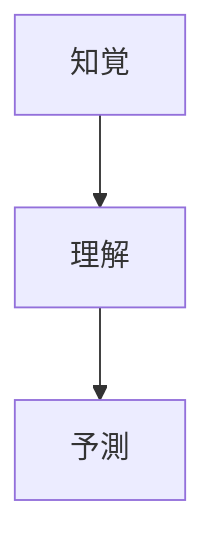

# 状況認識（Situation Awareness）に関する状況認識の理論と実践

## 1. 状況認識の基本概念

### 1.1 定義

状況認識（Situation Awareness）とは、「一定の時間と空間内での環境要素の認知、その意味の理解、そして近い将来の状態の予測」と定義されます（Endsley, 1995）。簡潔に言えば、「周囲で何が起きているかを知り、それが何を意味するかを理解し、次に何が起こるかを予測する能力」です。

日本語では「状況認識」または「シチュエーショナル・アウェアネス」と呼ばれており、「危険な状況でも周囲の状況を認識する様」や「特に危険な状況で周囲の状況を認識するために警戒すること」を指します。

### 1.2 Endsleyの3レベルモデル

Mica R. Endsleyによって体系化された状況認識の3つのレベル。

1. **レベル1: 知覚（Perception）**
   - 環境内の要素や状態を認識する
   - 例：パイロットが計器から高度や速度を読み取る、医師が患者のバイタルサインをモニターする

2. **レベル2: 理解（Comprehension）**
   - 知覚した情報の意味を理解し、状況の全体像を把握する
   - 例：「この高度と速度では着陸が困難である」と理解する、「この症状の組み合わせは特定の疾患を示唆している」と理解する

3. **レベル3: 予測（Projection）**
   - 現在の状況から近い将来に何が起こるかを予測する
   - 例：「このまま進むと10分後に燃料が不足する」と予測する、「この処置を行わないと患者の状態が悪化する」と予測する

### 1.3 状況認識の重要性

状況認識は以下のような場面で特に重要です。

- 高リスク環境（航空、医療、軍事など）での意思決定
- 複雑なシステムの監視と制御
- チームでの協調作業
- 緊急時の対応
- 自動化されたシステムと人間の協調

## 2. 状況認識の理論的側面

### 2.1 認知的基盤

状況認識を支える主要な認知メカニズム。

1. **注意（Attention）と作業記憶（Working Memory）**
   - 複雑な環境で限られた注意をどこに向けるかが状況認識の質を左右する
   - 作業記憶の限界が状況認識を制約する

2. **長期記憶と作業記憶の連携**
   - 作業記憶は長期記憶の活性化された一部として機能する
   - 長期記憶内の情報が状況認識の形成を支援する

3. **メンタルモデル**
   - システムや環境に関する内部モデル
   - 注意の効率的な配分、情報統合、将来予測の基盤になる
   - 状況のプロトタイプや行動スクリプトと関連づけられる

4. **トップダウン・ボトムアッププロセス**
   - 目標に基づいたトップダウン処理と環境からのボトムアップ処理の交互作用
   - 目標はメンタルモデルの選択、注意の方向づけ、情報の解釈に影響する

### 2.2 状況認識の阻害要因

状況認識が低下する主な要因

- 注意の分散・過負荷
- ストレスや疲労
- システム設計の問題
- 不適切な訓練
- チーム内のコミュニケーション不足
- 先入観やバイアス
- 自動化への過度の依存

### 2.3 状況認識と意思決定の関係

- 状況認識は意思決定の前段階として位置づけられる
- 良い状況認識が必ずしも良い意思決定に結びつくわけではないが、その確率を高める
- 状況認識と意思決定は相互に影響し合う循環的なプロセス

## 3. 実践的応用

### 3.1 主要応用分野

状況認識は様々な分野で応用されています。

1. **航空・宇宙**
   - パイロットやエアトラフィックコントローラーの意思決定支援
   - 航空事故防止のための訓練プログラム

2. **医療・ヘルスケア**
   - 手術室での医療チームの協調
   - 患者モニタリングと早期異常検出
   - 救急医療での迅速な状況評価

3. **軍事・防衛**
   - 戦場での状況把握と戦術決定
   - 指揮統制システムの設計
   - 無人システムの遠隔操作

4. **サイバーセキュリティ**
   - ネットワーク脅威の検出と対応
   - セキュリティオペレーションセンター（SOC）での監視
   - インシデント対応における状況評価

5. **災害対応・危機管理**
   - 自然災害発生時の状況評価
   - 救援リソースの効果的な配分
   - 避難計画の立案と実行

6. **プラント運転・工場管理**
   - 制御室オペレーターの監視支援
   - 異常事態の早期発見と対応
   - プロセス安全管理

### 3.2 日本における状況認識の研究と応用

日本国内でも状況認識に関する研究や応用が行われています。

1. **自動車・交通分野**
   - 自動運転技術における状況認識アルゴリズムの開発（トヨタ自動車、日産自動車など）
   - ドライバーの注意状態モニタリング（自動車技術会の研究）
   - 鉄道運転士の状況認識訓練（JR東日本、鉄道総合技術研究所）

2. **原子力・エネルギー分野**
   - 原子力発電所の中央制御室オペレーターの状況認識支援（日本原子力研究開発機構）
   - 電力系統監視システムの高度化（電力中央研究所）

3. **災害対策・防災**
   - 地震・津波警報システムの高度化（気象庁）
   - 防災情報システムの開発（内閣府防災担当）
   - 消防活動における状況認識訓練（消防庁消防大学校）

4. **医療安全**
   - 手術室での状況認識向上のためのチェックリスト導入（日本医療安全調査機構）
   - チーム医療におけるノンテクニカルスキル訓練（日本医療機能評価機構）

### 3.3 セキュリティとインテリジェンス分野での応用

セキュリティやインテリジェンス分野での状況認識の応用は特に重要です。

1. **SLAMテクニック**
   - **S**top：行動する前に立ち止まって考える
   - **L**ook：状況を観察する
   - **A**nalyze/Assess：状況を分析・評価する
   - **M**anage：環境を管理する

2. **オープンソースインテリジェンス（OSINT）の活用**
   - ソーシャルメディア監視
   - ダークウェブ・ディープウェブ分析
   - 位置情報検索（ジオフェンシング）
   - オルタナティブプラットフォーム（チャンボード、代替テクノロジーなど）の監視

3. **主要監視ターゲット**
   - アクティブな脅威（シューター、爆弾脅迫など）
   - 自然災害対応
   - サプライチェーンセキュリティ
   - 地政学的状況

## 4. AIと状況認識

AIと状況認識の関係は、人的ミスを防ぐために特に重要な分野です。AIは以下のように状況認識を支援・強化できます。

### 4.1 AIによる状況認識の強化

1. **データ統合と分析**
   - 多種多様なセンサーデータの統合
   - 大量データからのパターン認識
   - 非構造化データ（テキスト、画像、動画）からの情報抽出

2. **異常検出と予測**
   - 正常パターンからの逸脱の早期検出
   - 予測的分析による将来事象の予測
   - リスク評価の自動化

3. **認知的負荷の軽減**
   - 情報フィルタリングと優先順位付け
   - 意思決定支援システム
   - 情報視覚化の最適化

4. **マルチモーダル状況認識**
   - 視覚、聴覚、テキストなど複数の情報源からの統合的理解
   - コンテキスト理解と適応的な情報提示
   - 人間とAIのインタラクションの最適化

### 4.2 AIを活用した状況認識システムの例

1. **スマートシティと交通管理**
   - 交通フローの監視と最適化
   - 事故や渋滞の早期検出
   - 緊急車両の経路最適化

2. **医療診断支援**
   - 患者データの継続的モニタリング
   - 病状悪化の早期警告システム
   - 診断支援と治療計画の提案

3. **産業プラント監視**
   - 設備異常の予知保全
   - プロセス最適化
   - 緊急時対応計画の自動立案

4. **サイバーセキュリティ**
   - ネットワーク行動分析
   - 脅威インテリジェンスの自動化
   - インシデント対応の意思決定支援

5. **災害対応システム**
   - ソーシャルメディア分析による被災状況の把握
   - リソース配分の最適化
   - 避難経路計画の動的更新

### 4.3 AI活用の課題と限界

1. **説明可能性と透明性**
   - 「ブラックボックス」問題と意思決定の説明
   - 人間とAIの適切な責任分担

2. **バイアスと公平性**
   - 学習データに含まれるバイアスの増幅
   - 多様なユーザーに対する公平性の確保

3. **過信と依存**
   - 自動化バイアス（AIの判断への過度の信頼）
   - スキル低下のリスク
   - フォールバック能力の維持

4. **プライバシーとセキュリティ**
   - 広範なデータ収集に伴うプライバシー懸念
   - AIシステム自体のセキュリティ脆弱性

## 5. 最新の技術トレンドと状況認識

状況認識に影響を与える最新技術トレンド。

### 5.1 エッジコンピューティングと5G

- リアルタイム処理能力の向上
- 低遅延通信による即時的な状況認識
- 分散型インテリジェンスの実現

### 5.2 IoT（モノのインターネット）

- センサーネットワークの拡大
- 環境全体からのデータ収集
- デジタルツインによる状況シミュレーション

### 5.3 XR（拡張現実・VR/AR/MR）

- 状況認識の視覚的強化
- トレーニングシミュレーションの高度化
- 遠隔操作・協働の強化

### 5.4 ウェアラブルテクノロジー

- 身体装着型センサーによる継続的モニタリング
- ハンズフリーの情報アクセス
- 生体情報に基づく認知状態評価

### 5.5 フェデレーテッドラーニングとプライバシー保護技術

- プライバシーを保護しながらの分散学習
- 個人データに依存しない状況認識モデル
- 機密情報を含む環境での安全なAI適用

## 6. 状況認識の測定と評価

状況認識を測定・評価するための主要な手法。

### 6.1 主観的測定法

- SART（Situation Awareness Rating Technique）
- SA-SWORD（Situation Awareness Subjective Workload Dominance）
- 自己評価質問票

### 6.2 客観的測定法

- SAGAT（Situation Awareness Global Assessment Technique）
- SPAM（Situation Present Assessment Method）
- プローブ質問法
- 行動指標分析

### 6.3 プロセス指向測定法

- アイトラッキング
- 言語プロトコル分析
- 行動観察法

## 7. 効果的な状況認識のための実践的ヒント

### 7.1 個人レベルでの状況認識向上

1. **継続的な情報収集**
   - 定期的な状況確認
   - 能動的な情報探索
   - 複数の情報源の活用

2. **メンタルモデルの構築と更新**
   - 専門知識の獲得
   - 経験からの学習
   - 「もし〜ならば」シナリオの検討

3. **認知バイアスへの対策**
   - 確認バイアスの認識
   - 仮説の定期的な見直し
   - 批判的思考の実践

4. **注意管理**
   - 注意の適切な配分
   - マルチタスクの限界認識
   - ワークロード管理

### 7.2 チームレベルでの状況認識向上

1. **共有メンタルモデルの構築**
   - チームブリーフィング
   - 役割と責任の明確化
   - 共通言語と標準手順の確立

2. **効果的なコミュニケーション**
   - クローズドループコミュニケーション
   - 簡潔で明確な情報共有
   - 重要情報の確認と強調

3. **相互監視と支援**
   - チームメンバーの状態モニタリング
   - 負荷の高いメンバーへの支援
   - エラーの相互チェック

4. **定期的な状況更新**
   - 定期的なブリーフィング
   - 状況変化の共有
   - 共有認識の確認

### 7.3 組織レベルでの状況認識支援

1. **効果的なトレーニング**
   - シナリオベースのトレーニング
   - シミュレーション訓練
   - デブリーフィングと振り返り

2. **サポーティブな文化**
   - オープンなコミュニケーション文化
   - エラー報告の奨励
   - 継続的な学習環境

3. **適切なツールと技術**
   - 情報表示の最適化
   - 決定支援システム
   - 認知的負荷を考慮した設計

4. **手順とポリシー**
   - チェックリストとプロトコル
   - 標準操作手順（SOP）
   - 緊急時対応計画

## 8. 学習リソース

### 8.1 基本的な書籍と論文

1. Endsley, M. R. (1995). Toward a theory of situation awareness in dynamic systems. *Human Factors, 37*(1), 32-64.
2. Endsley, M. R. & Garland, D. J. (2000). Situation Awareness Analysis and Measurement. Lawrence Erlbaum Associates.
3. Wickens, C. D. (2008). Situation awareness: Review of Mica Endsley's 1995 articles on situation awareness theory and measurement. *Human Factors, 50*(3), 397-403.
4. Stanton, N. A., Chambers, P. R. G., & Piggott, J. (2001). Situational awareness and safety. *Safety Science, 39*(3), 189-204.

### 8.2 応用分野別リソース

1. **航空**
   - Endsley, M. R. (1999). Situation awareness in aviation systems. *Handbook of Aviation Human Factors*, 257-276.
   - FAA (2016). Pilot's Handbook of Aeronautical Knowledge. Chapter 2: Aeronautical Decision-Making.

2. **医療**
   - Flin, R., O'Connor, P., & Crichton, M. (2008). Safety at the sharp end: A guide to non-technical skills. Ashgate Publishing.
   - Schulz, C. M., Endsley, M. R., Kochs, E. F., Gelb, A. W., & Wagner, K. J. (2013). Situation awareness in anesthesia: Concept and research. *Anesthesiology, 118*(3), 729-742.

3. **サイバーセキュリティ**
   - Barford, P., et al. (2010). Cyber SA: Situational awareness for cyber defense. *Cyber Situational Awareness*, 3-13.
   - Franke, U., & Brynielsson, J. (2014). Cyber situational awareness – A systematic review of the literature. *Computers & Security, 46*, 18-31.

### 8.3 オンラインリソース

1. [SA Technologies](https://satechnologies.com/) - Mica EndsleyのSA関連リソース
2. [Human Factors and Ergonomics Society](https://www.hfes.org/) - 状況認識に関する研究やガイドライン
3. [FAA Human Factors Division](https://www.faa.gov/data_research/human_factors/) - 航空分野の状況認識リソース
4. [Flashpoint: What Is Situational Awareness?](https://flashpoint.io/blog/what-is-situational-awareness/) - セキュリティ・インテリジェンス分野の状況認識ガイド

### 8.4 日本語のリソース

1. 日本人間工学会 [https://www.ergonomics.jp/](https://www.ergonomics.jp/) - 人間工学の視点からの状況認識研究
2. 日本認知科学会 [https://www.jcss.gr.jp/](https://www.jcss.gr.jp/) - 認知科学の視点からの研究
3. 労働安全衛生総合研究所 [https://www.jniosh.johas.go.jp/](https://www.jniosh.johas.go.jp/) - 産業安全に関連する状況認識研究
4. 電子情報通信学会ヒューマンコミュニケーショングループ [https://www.ieice.org/hcg/](https://www.ieice.org/hcg/) - ヒューマンインタフェースに関連する研究

## 9. 状況認識を学ぶためのステップバイステップガイド

### 9.1 初心者レベル

1. **基本概念の理解**
   - Endsleyの3レベルモデルを学ぶ
   - 状況認識の重要性と基本原則を理解する

2. **自己観察と実践**
   - 日常生活での状況認識を意識する
   - 「今、何が起きているか」「それは何を意味するか」「次に何が起こるか」を定期的に自問する

3. **ケーススタディの学習**
   - 事故調査報告書を読む
   - 状況認識の失敗が関与した事例を分析する

### 9.2 中級レベル

1. **理論的基盤の深化**
   - 認知的メカニズムと状況認識の関係を学ぶ
   - チーム状況認識の概念を理解する

2. **分野別の応用を探る**
   - 自分の専門分野における状況認識の役割を調査する
   - 関連する標準やベストプラクティスを学ぶ

3. **評価方法の習得**
   - 状況認識の測定・評価方法を学ぶ
   - 簡単な評価を実施してみる

### 9.3 上級レベル

1. **最新研究と開発の追跡**
   - 学術論文や最新技術を調査する
   - 状況認識に関する会議やワークショップに参加する

2. **システム設計への応用**
   - 状況認識を支援するシステム設計原則を学ぶ
   - 状況認識を向上させる技術やツールを評価する

3. **トレーニングプログラムの開発**
   - 状況認識トレーニングの方法論を学ぶ
   - 特定の状況に合わせたトレーニングプログラムを設計する

## 10. まとめ

状況認識は、複雑な環境下で効果的に機能するために不可欠な能力です。エンズリーの3レベルモデル（知覚、理解、予測）を基礎として、様々な認知メカニズムによって支えられています。

航空、医療、軍事、サイバーセキュリティなど多くの分野で応用されており、AIなどの最新技術によってさらに強化されています。個人、チーム、組織の各レベルで状況認識を向上させるための戦略があり、適切な訓練と支援ツールによって継続的に発展させることができます。

日本国内でも様々な産業分野で状況認識の概念が徐々に浸透しつつありますが、まだ十分に認知されているとは言えません。今後、AIと状況認識を組み合わせたアプローチがさらに発展することで、人的ミスの防止や効果的なシステム設計に大きく貢献することが期待されます。

---

*このガイドは、状況認識の理解と応用のための入門として作成されました。実際の運用や専門的な応用には、各分野の専門家による詳細なガイダンスを参照してください。*
