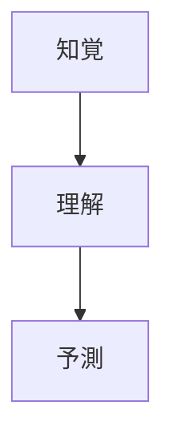

# 状況認識（Situation Awareness）とは

## はじめに
状況認識（Situation Awareness、以下SA）は、個人が環境内の要素や出来事を認識し、その意味を理解し、将来の状態を予測する認知能力です。この能力は、航空、軍事、医療、緊急対応などの高リスクで動的な環境において、正確かつ迅速な意思決定を行うために不可欠です。SAの不足は、人的ミスによる事故の主要な原因とされており（[Wikipedia](https://en.wikipedia.org/wiki/Situation_awareness)）、その理解と管理は安全性の向上に直結します。本レポートでは、SAの定義、理論モデル、重要性、応用、影響要因、測定方法、トレーニング方法について詳細に解説します。

## 状況認識の定義
SAは、Mica Endsleyによって「時間と空間の範囲内で環境の要素を認識し、その意味を理解し、近い将来の状態を予測すること」と定義されています（[Endsley, 1995](https://journals.sagepub.com/doi/10.1518/001872095779049543)）。この定義は、SAを以下の3つの階層的なレベルに分けています。

|レベル|定義|説明|
|---|---|---|
|1| **知覚** |環境内の関連情報を検出し、認識する基本的な段階 監視、手がかりの検出、単純な認識が含まれ、 物体、出来事、人、システム、環境要因の現在の状態（位置、状態、モード、行動）を把握します。|
|2| **理解** |知覚した情報を統合し、その意味を解釈する段階 パターン認識、解釈、評価を通じて、状況の全体像を形成します。|
|3| **予測** |理解した情報に基づいて、環境内の要素の将来の状態を予測する最高レベル これにより、プロアクティブな意思決定と計画が可能になります。|

以下の図は、SAの3つのレベルの進行を示しています。

## 理論モデル
### Endsleyのモデル
Endsleyのモデルは、SAの研究における最も広く受け入れられているフレームワークです。このモデルでは、SAは注意、知覚、記憶などの認知プロセスによって形成され、個人および環境要因に影響を受けるとされています。重要な要素として、以下の点が強調されています。
- **注意と作業記憶**: 情報を取得し解釈する能力を制限する重要な要因
- **メンタルモデル**: 状況を理解するための知識構造
- **目標指向の行動**: SAを維持するための戦略

このモデルは、航空や軍事などの動的システムにおける意思決定の記述的視点に基づいています（[Endsley, 1995](https://journals.sagepub.com/doi/10.1518/001872095779049543)）。

### その他のモデル
近年、Endsleyのモデルに対する批判や代替モデルが提案されています。たとえば、以下のモデルがあります。
- **Situated SA**: 状況が個人の認知だけでなく、環境やコンテキストに依存すると主張
- **Distributed SA**: チームやシステム全体でのSAの共有に焦点を当てる
- **Sensemaking**: 情報を意味づけるプロセスとしてSAを捉える

これらのモデルは特定のコンテキストに焦点を当てていますが、Endsleyのモデルは個人の認知プロセスに重点を置く点で依然として基礎的です（[Endsley, 2015](https://journals.sagepub.com/doi/full/10.1177/1555343415572631)）。

## 重要性と応用
SAは、さまざまな高リスク環境での安全性と効率性を向上させるために重要です。以下に、主要な応用分野とその例を示します。

| **分野** | **応用例** |
|---|---|
| **航空** | パイロットが飛行機の状態、天候、他の航空機の位置を把握し、安全な飛行を確保。 |
| **軍事** | 指揮官が敵の位置、地形、味方の配置を評価し、戦略的な意思決定を行う。 |
| **医療** | 医師が患者の症状、検査結果、治療の進捗を統合し、正確な診断と治療を決定。 |
| **緊急対応** | 消防士や救急隊員が現場の危険、資源、状況を評価し、迅速かつ効果的に対応。 |

これらの分野では、SAが適切な意思決定を可能にし、事故やエラーを減少させます。  
たとえば、緊急対応では、SAが資源の優先順位付けや危険の予測を支援し、命を救うことに貢献します（[NGA911](https://nga911.com/blogs/post/understanding-situational-awareness-what-it-and-why-its-essential-emergency-response)）。

## 状況認識に影響を与える要因
SAは、個人および環境要因によって影響を受けます。

### 個人要因
- **注意**: 関連情報に焦点を当て、不要な情報を除外する能力。注意が散漫だと、重要な手がかりを見逃す可能性があります。
- **作業記憶**: 情報を保持し、処理する能力。作業記憶の容量が限られていると、複雑な状況の理解が困難になります。
- **経験とトレーニング**: 経験豊富な個人は、パターンを迅速に認識し、効果的な意思決定を行います。

### 環境要因
- **作業負荷**: 高い作業負荷は認知資源を圧迫し、SAを低下させます。
- **ストレス**: 心理的ストレスは知覚や理解を損なう可能性があります。
- **システム設計**: インターフェースやツールの設計が使いにくい場合、SAが妨げられます。逆に、適切な設計はSAを支援します（[Human Factors 101](https://humanfactors101.com/topics/situation-awareness/)）。

## 状況認識の測定
SAの測定は、パフォーマンスの評価や改善のための重要なステップです。一般的な測定方法には以下があります。
- **SAGAT（Situation Awareness Global Assessment Technique）**: シミュレーションを一時停止し、操作者に状況に関する質問を行い、知覚、理解、予測のレベルを評価します。この方法は、メモリに依存せず、非侵入的であるとされています（[Endsley, 1995](https://journals.sagepub.com/doi/10.1518/001872095779049499)）。
- **SPAM（Situation Present Assessment Method）**: 現在の状況に関する質問を通じてSAを評価。
- **主観的評価**: 操作者が自身のSAのレベルを自己評価。
- **パフォーマンスベースの測定**: 実際のタスクパフォーマンスを通じてSAを間接的に評価。

これらの方法は、特定のコンテキストや目的に応じて選択されます。

## 状況認識のトレーニング
SAを向上させるためには、以下のようなトレーニング方法が効果的です。
- **シナリオベースのトレーニング**: 現実的なシナリオをシミュレーションし、知覚、理解、予測のスキルを練習
- **フィードバックとデブリーフィング**: トレーニング後にパフォーマンスを振り返り、改善点を特定
- **注意管理の訓練**: 注意を適切に配分する技術を習得
- **メンタルモデルの構築**: 特定の環境に関する知識やパターンを学習

これらの方法は、航空や医療などの分野で広く採用されており、SAの向上に貢献しています。

## 結論
状況認識は、複雑で動的な環境における人間のパフォーマンスの重要な要素です。Endsleyのモデルに基づくSAの理解は、効果的な意思決定、安全性の向上、エラーの削減に不可欠です。航空、軍事、医療、緊急対応などの分野での応用を通じて、SAは命を救い、効率を高める力を持っています。技術の進化や運用環境の変化に伴い、SAの維持と強化は今後も重要な課題であり続けます。